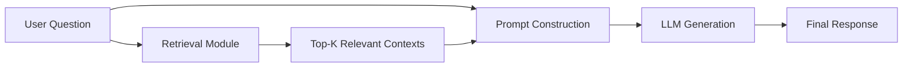
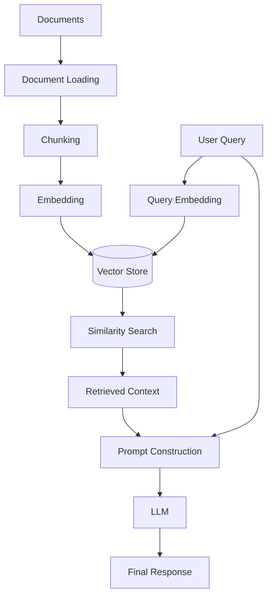
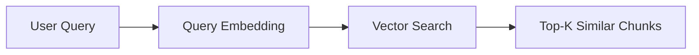
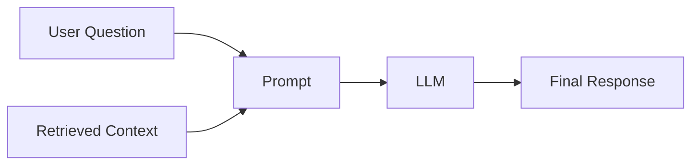
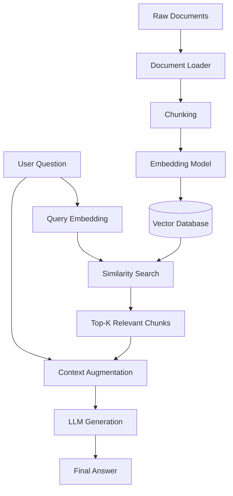
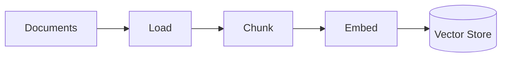
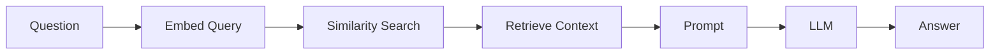

# Phase 1: RAG Fundamentals & Basic Architecture

## 1. What is RAG?

**Retrieval-Augmented Generation (RAG)** is an architecture that enhances **Large Language Model (LLM)** responses by retrieving relevant information from an external knowledge source and providing that information to the model as context before generation.

Instead of relying only on the model's **parametric knowledge**, RAG allows the model to use information from external sources such as:

* PDFs
* Documentation
* Websites
* Databases
* Internal company knowledge
* Knowledge bases
* Application data

### Basic RAG Flow



The core idea is:

> **Retrieve relevant knowledge first, then use the LLM to generate an answer grounded in that knowledge.**

---

# 2. Why RAG?

LLMs already contain a large amount of knowledge, but their internal knowledge has limitations:

* It can become outdated.
* It may not contain private company information.
* It cannot automatically access your application's latest data.
* Its knowledge is difficult to inspect or update directly.

RAG addresses these problems by keeping knowledge **outside the model** and retrieving it when needed.

---

## RAG vs. Fine-Tuning

| Feature                  | **RAG**                                                              | **Fine-Tuning**                                                        |
| ------------------------ | -------------------------------------------------------------------- | ---------------------------------------------------------------------- |
| **Knowledge Updates**    | Update external documents/indexes without retraining the model       | New knowledge generally requires another training/fine-tuning process  |
| **Fresh / Private Data** | Excellent for external and private knowledge                         | Less suitable for frequently changing factual data                     |
| **Source Attribution**   | Can preserve document/page/source metadata                           | Parametric knowledge is generally harder to trace to a source          |
| **Hallucination**        | Can reduce unsupported answers when retrieval and grounding are good | Does not inherently eliminate hallucinations                           |
| **Training Cost**        | No model retraining required for every document update               | Requires additional training compute                                   |
| **Inference Cost**       | Retrieval + generation costs                                         | Primarily generation cost, plus any retrieval if combined with RAG     |
| **Best Used For**        | Factual QA, private documentation, changing knowledge                | Behavior, style, formatting, task adaptation, domain-specific patterns |

### Simple Rule

> **Use RAG when you need the model to know something.**

> **Use fine-tuning when you need the model to behave differently.**

And in real applications, **RAG and fine-tuning can also be combined**.

---

# 3. Core Components of a Baseline RAG Pipeline

A basic RAG system consists of two major phases:



---

## 3.1 Document Loading

The first step is to ingest information from external sources.

Examples:

```text
PDF
HTML
Markdown
TXT
CSV
Database
API
Cloud Storage
```

The document loader converts these sources into a representation that the RAG pipeline can process.

```text
PDF
 ↓
Text + Metadata
```

Useful metadata might include:

```json
{
  "documentId": "doc_123",
  "source": "employee-handbook.pdf",
  "page": 14,
  "department": "HR"
}
```

Metadata becomes especially important later for **filtering, citations, access control, and debugging**.

---

# 3.2 Chunking

Large documents are usually divided into smaller pieces called **chunks**.

For example:

```text
Large Document
      ↓
 ┌─────────────┐
 │ Chunk 1     │
 ├─────────────┤
 │ Chunk 2     │
 ├─────────────┤
 │ Chunk 3     │
 ├─────────────┤
 │ Chunk 4     │
 └─────────────┘
```

A chunk might contain approximately **500 tokens**, with some overlap between neighboring chunks.

Example:

```text
Chunk 1
[--------------------------------]
          ↓ overlap
             [--------------------------------]
             Chunk 2
```

### Why overlap?

Important information can exist near chunk boundaries.

Without overlap:

```text
Chunk 1 → "The refund period is..."
Chunk 2 → "...30 days after purchase."
```

The complete meaning may be split between two chunks.

With overlap, neighboring chunks share some surrounding context.

### Important

There is **no universal optimal chunk size**.

The right size depends on:

* Document structure
* Retrieval strategy
* Embedding model
* Query type
* Context window
* Domain

Chunking is therefore one of the most important parts of RAG quality.

---

# 3.3 Embedding

An **embedding model** converts text into a numerical vector representing its semantic characteristics.

Example:

```text
"How can I reset my password?"
                 ↓
        Embedding Model
                 ↓
[0.021, -0.184, 0.731, ...]
```

Two semantically similar pieces of text should generally produce vectors that are close in the embedding space.

Common embedding models include:

```text
text-embedding-3-small
all-MiniLM-L6-v2
```

The exact model depends on your application, language requirements, quality target, and infrastructure.

---

# 3.4 Vector Storage

The generated embeddings are stored alongside the original content and metadata.

Conceptually:

```text
┌──────────────────────────────────────┐
│ Vector Store                         │
├──────────────────────────────────────┤
│ Vector                               │
│ Chunk Text                           │
│ Document ID                          │
│ Metadata                             │
└──────────────────────────────────────┘
```

Examples of vector databases/vector-capable stores include:

* Pinecone
* Chroma
* Qdrant
* PostgreSQL + pgvector

---

# 3.5 Similarity Search

When the user asks a question, the query is also converted into an embedding.



The system compares the query vector against stored document vectors and retrieves the most similar candidates.

Common similarity/distance functions include:

* Cosine similarity
* Dot product
* Euclidean distance

For example:

```text
User Query
    ↓
Query Vector
    ↓
Vector Database
    ↓
Top-K Relevant Chunks
```

---

# 3.6 Prompt Augmentation

The retrieved documents are then combined with the user's question to construct the LLM input.

Conceptually:

```text
Retrieved Context
        +
User Question
        ↓
Prompt Construction
        ↓
LLM
```

Example:

```text
Context:
The refund policy allows customers to request
a refund within 30 days of purchase.

Question:
What is the refund period?

Instruction:
Answer using the provided context.
```

This process is often called **context augmentation** or **prompt construction**.

> **Prompt augmentation is not the same thing as prompt injection.**

Prompt injection is a security attack in which untrusted content attempts to manipulate the model's instructions.

---

# 3.7 Generation

Finally, the LLM receives the user question together with the retrieved context and generates the response.



The LLM's role is primarily to:

* Understand the question
* Interpret the retrieved evidence
* Synthesize information
* Generate a natural-language response

The retrieval system provides the **external knowledge**, while the LLM provides the **reasoning and language generation**.

---

# 4. Complete Baseline RAG Flow

Putting everything together:



This gives us the fundamental RAG loop:

> **Documents → Chunks → Embeddings → Retrieval → Context → Generation**

---

# 5. RAG Has Two Major Phases

It is useful to separate RAG into **indexing** and **query-time retrieval**.

## Indexing Phase

Usually performed before the user asks a question:



## Query Phase

Performed when the user sends a question:



This distinction becomes extremely important as the system becomes more advanced.

---

# 6. What Can Go Wrong in Basic RAG?

A baseline RAG pipeline is simple, but every stage can introduce problems.

```text
Bad Documents
     ↓
Bad Chunks
     ↓
Bad Embeddings
     ↓
Bad Retrieval
     ↓
Bad Context
     ↓
Bad Answer
```

For example:

### Poor Chunking

Important information gets split incorrectly.

### Poor Embeddings

Semantically relevant content may not be retrieved.

### Poor Retrieval

The correct document exists but isn't included in Top-K results.

### Too Much Context

The model receives many irrelevant chunks.

### Unsupported Generation

The LLM produces claims that are not supported by the retrieved evidence.

This is why RAG is **not simply "put documents into a vector database."**

---

# 7. Baseline RAG Limitations

Basic RAG typically uses a relatively fixed pipeline:

```text
Query
 ↓
Vector Search
 ↓
Top-K
 ↓
LLM
```

This can struggle with:

* Exact keyword matching
* Complex queries
* Multiple related documents
* Multi-hop questions
* Poorly structured documents
* Long documents
* Ambiguous queries
* Permission-sensitive data
* Noisy retrieval results

These limitations motivate the advanced architectures in the later phases of this repository.

---

# 8. Evolution of RAG

The basic pipeline can gradually evolve:

```mermaid
flowchart LR
    A["Basic RAG"] --> B["Vector RAG"]
    B --> C["Hybrid RAG"]
    C --> D["Metadata Filtering"]
    D --> E["Reranking"]
    E --> F["Query Transformation"]
    F --> G["Multi-Hop / GraphRAG"]
    G --> H["Agentic RAG"]
    H --> I["CRAG / Self-RAG"]
    I --> J["Adaptive RAG"]
    J --> K["Production RAG"]
```



Each architecture addresses limitations of the previous one.

---

# 9. Key Mental Model

Think of an LLM as an **open-book test taker**.

```text
                    LLM
                     │
              Reasoning + Language
                     │
                     ▼
              Final Answer
                     ▲
                     │
            Retrieved Evidence
                     ▲
                     │
               RAG System
                     ▲
                     │
              External Knowledge
```

The analogy:

> **The LLM is the test taker.
> The knowledge base is the textbook.
> Retrieval finds the relevant textbook pages.
> The prompt provides those pages to the test taker.
> The LLM uses them to construct the answer.**

---

# 📌 Key Takeaways

1. **RAG connects LLMs to external knowledge.**
2. RAG separates **knowledge storage** from the model's internal knowledge.
3. A baseline RAG pipeline consists of:

   * Document loading
   * Chunking
   * Embedding
   * Vector storage
   * Similarity search
   * Context augmentation
   * Generation
4. **Chunking and retrieval quality strongly influence final answer quality.**
5. RAG can make knowledge easier to update and source, but it **does not automatically eliminate hallucinations**.
6. **RAG and fine-tuning solve different problems** and can be combined.
7. Basic RAG is the foundation for more advanced architectures such as **Hybrid RAG, Reranking, Multi-Hop RAG, GraphRAG, Agentic RAG, CRAG, Self-RAG, Adaptive RAG, and Production RAG**.

> **Core Mental Model:**
>
> **Retrieve the right evidence → provide it as context → generate an answer grounded in that evidence.**
