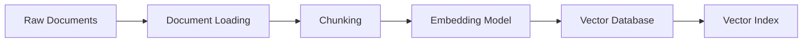
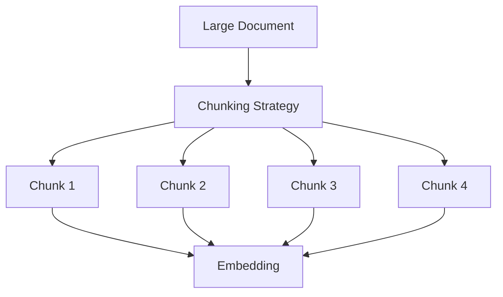
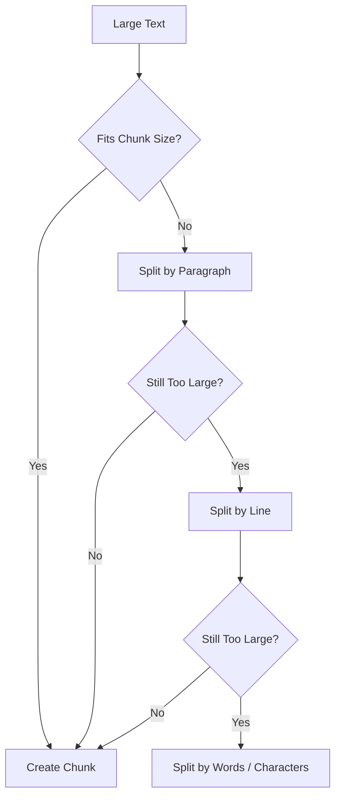
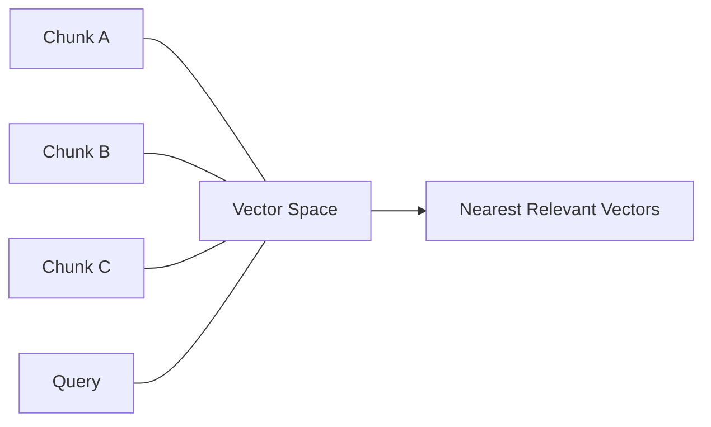
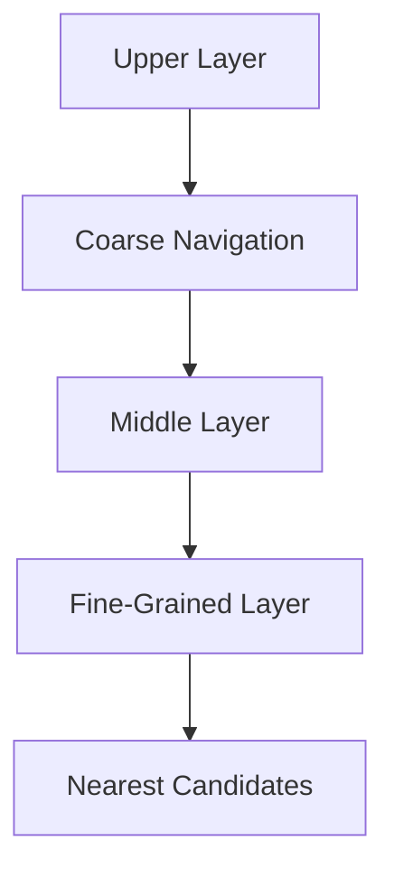
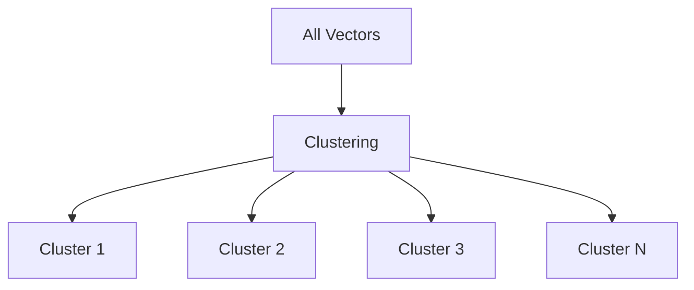
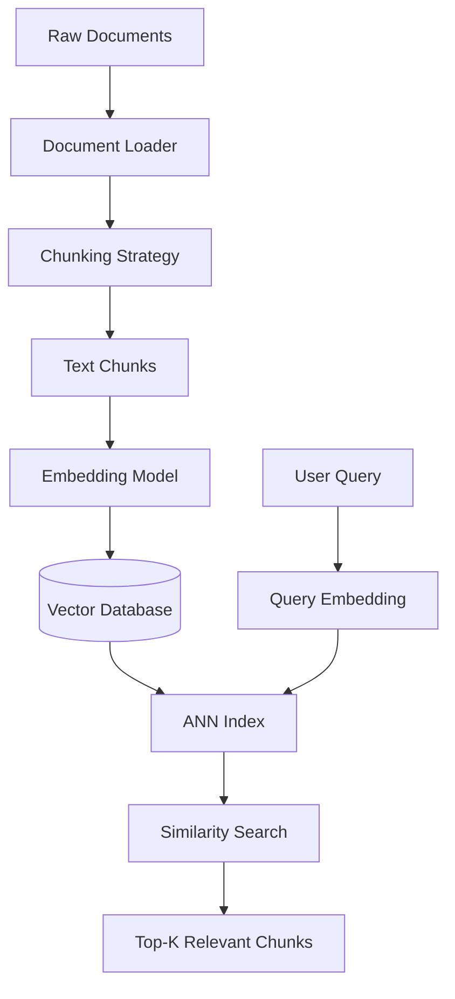
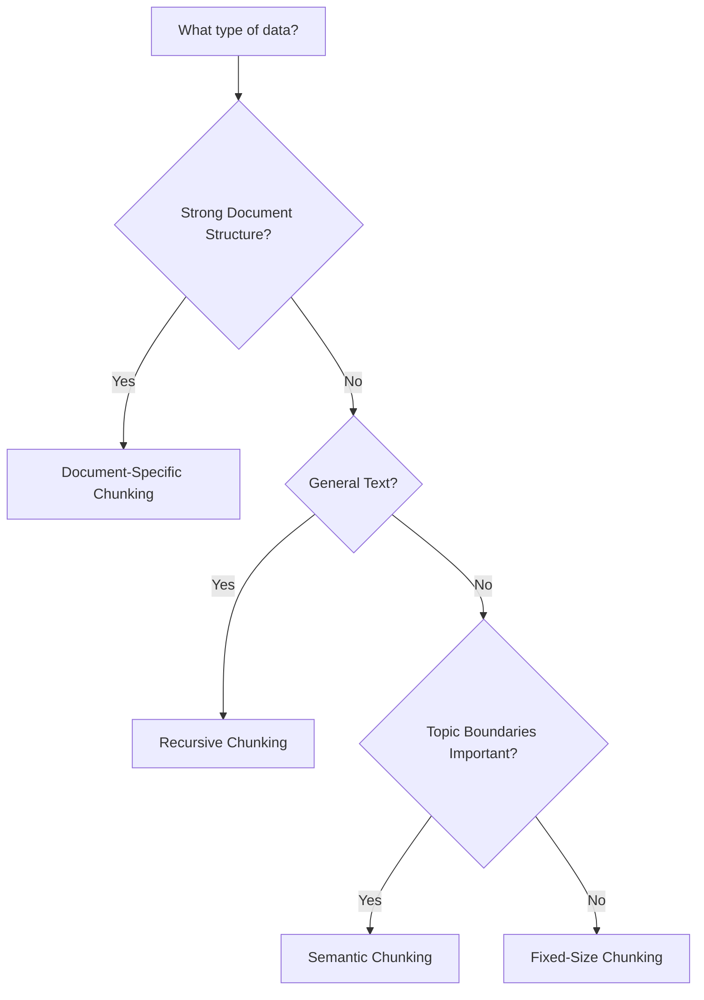

# Phase 2: Indexing, Chunking & Vector Databases

## 📌 Overview

**Phase 2** focuses on the **indexing layer of RAG**—how raw documents are transformed into searchable representations and stored efficiently for retrieval.

The quality of a RAG system depends heavily on what happens **before the user even asks a question**.

A simplified indexing pipeline is:



The main components covered in this phase are:

1. **Chunking**
2. **Text Embeddings**
3. **Vector Space & Similarity**
4. **Vector Databases**
5. **ANN Indexing**

---

# 1. Chunking Strategies

Large documents cannot always be passed directly into an embedding model or LLM. They are therefore divided into smaller units called **chunks**.

Chunking is one of the most important decisions in RAG because it directly affects retrieval quality.



### The Chunk Size Tradeoff

**Chunks that are too small:**

* May lose important context
* Can make retrieved information incomplete
* Increase the number of chunks that need to be retrieved

**Chunks that are too large:**

* Can contain unrelated information
* May reduce retrieval precision
* Increase embedding/context size

Therefore:

> **The goal is not to find the smallest or largest chunk—it is to find a chunk size that preserves useful meaning while remaining retrieval-friendly.**

---

## Common Chunking Methods

### 1. Fixed-Size Chunking

Splits text according to a fixed number of characters or tokens.

Example:

```text id="fixedchunk"
Document
    ↓
500 tokens
    ↓
50-token overlap
    ↓
500 tokens
    ↓
50-token overlap
    ↓
500 tokens
```

Example configuration:

```text
chunk_size = 500 tokens
overlap = 50 tokens
```

### Advantages

* Simple
* Fast
* Predictable
* Easy to implement

### Disadvantages

* Can split sentences or paragraphs
* Doesn't understand document structure
* May separate related information

---

### 2. Recursive Character Chunking

Instead of immediately cutting text at an arbitrary position, recursive chunking tries a hierarchy of separators.

For example:

```text
["\n\n", "\n", " ", ""]
```

Conceptually:



This usually preserves document structure better than blindly cutting at a fixed position.

### Advantages

* Simple
* More structure-aware than fixed-size chunking
* Works well for general documents

### Disadvantages

* Still heuristic
* Does not necessarily understand semantic boundaries

---

### 3. Document-Specific Chunking

Some documents have strong internal structure.

Instead of treating everything as plain text, use the structure of the source.

Examples:

### Markdown

```text
# Introduction
## Installation
## Configuration
# API Reference
## Authentication
```

Chunks can be created around headings and sections.

### Code

Code can be split using programming-language structure:

```text
File
 ├── Class
 │    ├── Method
 │    └── Method
 └── Function
```

AST-based chunking can preserve relationships between functions, classes, and other syntax elements.

### Other examples

* HTML → headings / DOM sections
* PDFs → pages / sections / layout blocks
* Legal documents → clauses / sections
* Scientific papers → abstract / methods / results
* Logs → timestamped events

> **When the source has meaningful structure, preserve that structure during chunking.**

---

### 4. Semantic Chunking

Semantic chunking attempts to identify meaningful topic boundaries rather than relying only on character or token counts.

A simplified process:


For example:

```text
Sentence 1 ─┐
Sentence 2 ─┤ Topic A
Sentence 3 ─┘
             ↓
          Boundary
             ↓
Sentence 4 ─┐
Sentence 5 ─┤ Topic B
Sentence 6 ─┘
```

When the semantic relationship between neighboring sentences changes significantly, a chunk boundary can be introduced.

### Advantages

* Better semantic coherence
* Can preserve topic boundaries

### Disadvantages

* More computationally expensive
* Requires embedding computation during chunking
* More complex to tune

---

# 2. Chunking Strategy Comparison

| Strategy              | Main Idea                        | Best For                         | Complexity  |
| --------------------- | -------------------------------- | -------------------------------- | ----------- |
| **Fixed-size**        | Fixed token/character count      | Simple datasets                  | Low         |
| **Recursive**         | Hierarchical separators          | General documents                | Low–Medium  |
| **Document-specific** | Use source structure             | Markdown, HTML, code, legal docs | Medium      |
| **Semantic**          | Detect semantic topic boundaries | Topic-heavy documents            | Medium–High |

There is no universally best chunking strategy.

> **Evaluate chunking strategies against your actual retrieval workload.**

---

# 3. Text Embeddings & Vector Space

After chunking, each chunk is converted into a numerical representation called an **embedding**.


For example:

```text
"What is vector search?"
          ↓
Embedding Model
          ↓
[0.021, -0.184, 0.731, 0.112, ...]
```

The vector may contain hundreds or thousands of dimensions.

---

## Dense Embeddings

Dense embeddings are **continuous numerical vectors** designed to represent semantic characteristics of text.

For example:

```text
"How do I reset my password?"
```

and

```text
"I forgot my password. How can I change it?"
```

may produce vectors that are relatively close because their meanings are similar—even though they don't use exactly the same words.

This is the fundamental reason dense retrieval can perform **semantic search**.

---

# 4. Embedding Dimensions

Different embedding models produce vectors with different dimensions.

For example, depending on the model and configuration, an embedding might look conceptually like:

```text
Vector
[
  0.12,
 -0.44,
  0.87,
  ...
]
```

The dimensionality is determined by the embedding model/configuration.

> **Do not assume every embedding model has the same number of dimensions.**

When using a vector database, the index configuration must be compatible with the embedding dimensionality being stored.

---

# 5. Vector Space

Imagine every document chunk as a point in a high-dimensional space.



Conceptually:

```text
                 Topic A
              ●  ●  ●
             ●       ●

                         Query ●
                              ↘
                               ● Topic A

        Topic B
      ●  ●  ●
```

Semantically related content tends to occupy nearby regions of the embedding space.

---

# 6. Distance Metrics

Once text has been converted into vectors, the retrieval system needs a way to determine **how similar two vectors are**.

Common metrics include:

1. Cosine similarity
2. Dot product
3. Euclidean distance (L2)

---

## 6.1 Cosine Similarity

Cosine similarity measures the angle/orientation between two vectors.

genui{"learning_viz":{"type_id":"VECTOR_DOT_PRODUCT","locale_override":"en-US"}}

The formula is:

$$
\cos(\theta)=\frac{A\cdot B}{\|A\|\|B\|}
$$

For normalized embeddings, cosine similarity is especially convenient because it focuses on vector direction rather than magnitude.

A value closer to **1** generally indicates greater directional similarity.

---

## 6.2 Dot Product

The dot product is:

$$
A\cdot B
$$

It reflects both:

* Vector orientation
* Vector magnitude

For normalized vectors, dot product and cosine similarity are equivalent in terms of ranking.

---

## 6.3 Euclidean Distance

Euclidean distance measures the straight-line distance between two points:

$$
d(A,B)=\sqrt{\sum_i(A_i-B_i)^2}
$$

For this metric:

> **Smaller distance generally means more similar.**

The appropriate metric depends on the embedding model and how the embeddings are trained/normalized.

---

# 7. Vector Database

A vector database stores embeddings and provides efficient similarity search.

Conceptually, a stored record might contain:

```json id="vecdb1"
{
  "id": "chunk_001",
  "vector": [0.12, -0.44, 0.87],
  "text": "Refunds are available within 30 days.",
  "metadata": {
    "documentId": "policy.pdf",
    "page": 4,
    "department": "support"
  }
}
```

So a vector database is not just a collection of vectors.

It commonly stores:

```text id="vecdb2"
Vector
   +
Original Chunk
   +
Metadata
```

Metadata later enables:

* Filtering
* Source attribution
* Tenant isolation
* Document-level permissions
* Debugging

---

# 8. Approximate Nearest Neighbor Search

Suppose your database contains:

```text
10 vectors
```

You could compare the query against every vector.

But production systems may contain:

```text
1 million
10 million
100 million+
```

vectors.

Searching every vector can become expensive.

This is where **Approximate Nearest Neighbor (ANN)** techniques become useful.

Instead of guaranteeing the exact nearest neighbors through exhaustive comparison, ANN indexes aim to find very good candidates much more efficiently.


There is usually a tradeoff between:

```text
Search Speed
     ↕
Recall / Accuracy
```

---

# 9. HNSW

**HNSW — Hierarchical Navigable Small World** is a graph-based ANN indexing method.

It builds multiple graph layers:



The higher layers help navigate quickly toward promising regions, while lower layers provide more detailed neighborhood connections.

### Important

HNSW is often described informally as providing logarithmic-like search behavior, but its actual performance depends on:

* Graph construction
* Number of vectors
* Dimensionality
* `M`
* `efConstruction`
* `efSearch`
* Hardware
* Dataset characteristics

So avoid treating HNSW search as universally **`O(log N)`**.

---

# 10. IVF — Inverted File Index

**IVF (Inverted File Index)** divides vectors into clusters.

During indexing:



At query time:


Instead of searching every vector, the system searches only selected clusters.

Important IVF parameters include concepts such as:

```text
Number of clusters
Number of clusters probed at query time
```

Searching more clusters can improve recall but generally increases query cost.

---

# 11. HNSW vs IVF

| Feature            | **HNSW**                             | **IVF**                                  |
| ------------------ | ------------------------------------ | ---------------------------------------- |
| Structure          | Graph                                | Clusters                                 |
| Search strategy    | Graph navigation                     | Search selected clusters                 |
| Main strength      | Fast high-recall search              | Efficient large-scale partitioned search |
| Important tuning   | `M`, `efConstruction`, `efSearch`    | Cluster count, probes                    |
| Memory             | Can require substantial graph memory | Depends on implementation/configuration  |
| Exact search       | Approximate                          | Approximate when probing only a subset   |
| Best configuration | Dataset-dependent                    | Dataset-dependent                        |

Some systems also combine IVF with other techniques, such as quantization.

---

# 12. Vector Database Landscape

Popular vector-capable databases and vector stores include:

* **Chroma**
* **Pinecone**
* **Qdrant**
* **Milvus**
* **Weaviate**
* **PostgreSQL + pgvector**

They differ in:

* Deployment model
* Filtering capabilities
* Scaling
* Index types
* Operational complexity
* Ecosystem
* Cost
* Cloud/self-hosted options

The important concept is not memorizing every database.

Understand the abstraction:

```text
Embedding
    ↓
Vector Store
    ↓
ANN Index
    ↓
Similarity Search
    ↓
Top-K Chunks
```

---

# 13. Complete Indexing + Retrieval Pipeline



This gives the core relationship:

> **Chunking determines what gets indexed.
> Embeddings determine how meaning is represented.
> The vector index determines how efficiently relevant vectors can be found.**

---

# 14. Example: Documentation Search

Suppose we have:

```text
company-docs/
├── authentication.md
├── payments.md
├── deployment.md
└── troubleshooting.md
```

During indexing:

```text id="docindex"
Markdown Files
      ↓
Markdown-Aware Chunking
      ↓
Text Chunks
      ↓
Embeddings
      ↓
Vector Database
      ↓
ANN Index
```

User asks:

> "How do I rotate an API key?"

The query is embedded:

```text id="queryembed"
User Question
     ↓
Embedding
     ↓
Query Vector
```

The ANN index finds nearby vectors:

```text id="nearest"
Query Vector
     ↓
Nearest Chunks
     ↓
authentication.md
```

Those chunks can then be passed to the generation layer covered in **Phase 1**.

---

# 15. Indexing vs Retrieval

It is important to distinguish these two operations.

### Indexing

```text id="indexing"
Documents
   ↓
Chunk
   ↓
Embed
   ↓
Store
   ↓
Build Index
```

Usually performed when documents are added or updated.

### Retrieval

```text id="retrieval"
Query
   ↓
Embed
   ↓
Search Index
   ↓
Top-K Results
```

Performed for each user query.

This distinction becomes especially important when optimizing production RAG systems.

---

# 16. Common Failure Modes

### Poor Chunking

Relevant information is split across unrelated chunks.

### Wrong Embedding Model

The embedding model may not represent your domain or language well enough.

### Wrong Distance Metric

The configured similarity metric should be compatible with the embedding model and vector normalization strategy.

### Poor ANN Configuration

Aggressive ANN settings can improve latency while reducing recall.

### Missing Metadata

Without useful metadata, filtering and source attribution become difficult.

### Embedding Dimension Mismatch

The vector index must be configured for the dimensionality of the embeddings being stored.

### Stale Index

When documents change, the corresponding chunks and embeddings need to be updated or re-indexed appropriately.

---

# 17. Practical Chunking Decision Guide

A useful starting point:



Then evaluate the result using an actual retrieval benchmark.

---

# ⚖️ Tradeoffs

| Decision               | Benefit                        | Cost / Risk                      |
| ---------------------- | ------------------------------ | -------------------------------- |
| Smaller chunks         | More precise retrieval         | Less context                     |
| Larger chunks          | More context                   | Lower precision                  |
| Overlap                | Preserves boundary information | More storage/tokens              |
| Semantic chunking      | Better topic coherence         | More computation                 |
| HNSW                   | Fast high-recall retrieval     | Memory/tuning requirements       |
| IVF                    | Efficient partitioned search   | Cluster/probe tuning             |
| More ANN search effort | Better recall                  | Higher latency                   |
| More metadata          | Better filtering/debugging     | More storage/indexing complexity |

---

# 🧠 Key Mental Model

Think of the indexing layer as building a **searchable map of your knowledge**:

```text
Raw Knowledge
     ↓
Meaningful Chunks
     ↓
Numerical Representations
     ↓
Organized Vector Space
     ↓
Efficient Search Index
```

Then at query time:

```text
User Question
     ↓
Query Vector
     ↓
Search Vector Space
     ↓
Nearest Relevant Chunks
```

---

# 📌 Key Takeaway

Phase 2 establishes the foundation underneath vector-based RAG:

> **Good retrieval starts with good indexing.**

The complete mental model is:

```text
Documents
   ↓
Chunking
   ↓
Embeddings
   ↓
Vector Database
   ↓
ANN Index
   ↓
Similarity Search
   ↓
Top-K Context
```

The most important lessons are:

1. **Chunking controls retrieval granularity.**
2. **Embeddings convert semantic meaning into vectors.**
3. **Similarity metrics determine how vectors are compared.**
4. **Vector databases store embeddings, content, and metadata.**
5. **ANN indexes make large-scale vector search practical.**
6. **HNSW and IVF use different indexing strategies and require tuning.**
7. **There is no universally optimal chunk size, embedding model, index, or retrieval configuration.**
8. **Measure retrieval quality on your actual data rather than relying only on theoretical defaults.**

> **Phase 1 taught us what RAG does.
> Phase 2 teaches us how the knowledge becomes searchable.**
