# Phase 3: Hybrid Search, Metadata Filtering & Reranking

## 📌 Overview

**Phase 3** focuses on improving the retrieval quality of baseline Vector RAG.

Pure vector search is excellent at understanding **semantic meaning**, but semantic similarity alone is not always enough. Production systems often need to handle:

* Exact identifiers
* Error codes
* Product SKUs
* Technical terminology
* Dates and ranges
* User/tenant boundaries
* Document types
* High-precision ranking

This phase introduces three important retrieval techniques:

1. **Hybrid Search** — combine dense and sparse retrieval.
2. **Metadata Filtering** — constrain retrieval using structured attributes.
3. **Reranking** — use a stronger relevance model to reorder retrieved candidates.

The resulting architecture is:

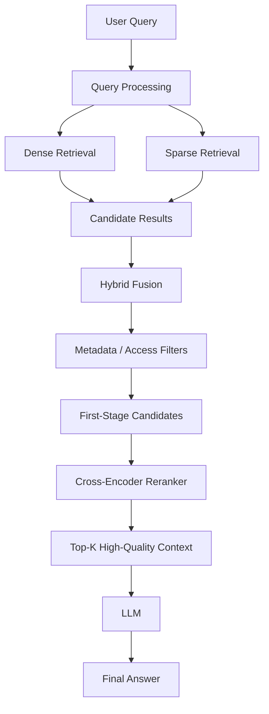

---

# 1. Why Pure Vector Search Can Fail

Dense vector search represents the **semantic meaning** of text.

That is powerful for queries such as:

> "How can I recover my account?"

It can retrieve:

> "Steps for resetting a forgotten password"

even though the words are different.

However, semantic similarity is not always the same as **exact relevance**.

---

## 1.1 Exact Identifiers

Consider:

```text
ERR-9021
```

A user may ask:

> "What does ERR-9021 mean?"

Exact lexical matching is extremely valuable here.

A semantically similar document containing:

```text
ERR-9012
```

is not necessarily useful—even though the two strings look semantically related to an embedding model.

---

## 1.2 Part Numbers and SKUs

Example:

```text
SKU: RTX-4090-24G
Product ID: PRD-AX92
Serial: SN-88421
```

These identifiers require precise matching.

---

## 1.3 Acronyms and Domain Terminology

Consider:

```text
RAG
HNSW
JWT
OAuth
PCI-DSS
ERR-9021
```

Exact lexical signals can be extremely important.

---

## 1.4 Structured Constraints

A query such as:

> "Show documents created after January 2025."

contains a structured constraint:

```text
created_at > 2025-01-01
```

Semantic similarity alone should not be responsible for enforcing that constraint.

This is where **metadata filtering** becomes important.

---

# 2. Dense vs Sparse Retrieval

Hybrid search combines two different retrieval signals.

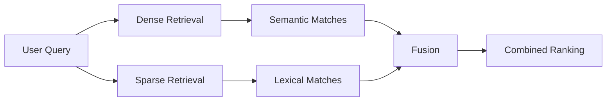

---

## 2.1 Dense Retrieval

Dense retrieval converts queries and documents into embeddings.

```text id="denseflow"
Query
  ↓
Embedding
  ↓
Vector Search
  ↓
Semantic Matches
```

It is good at:

* Synonyms
* Paraphrases
* Concepts
* Intent
* Semantic relationships

Example:

```text
Query:
"How do I change my password?"

Retrieved:
"Instructions for resetting forgotten credentials"
```

The wording is different, but the meaning is similar.

---

# 3. Sparse Retrieval

Sparse retrieval represents text using lexical signals.

Common approaches include:

* TF-IDF
* BM25

A sparse representation has many zero values, with only terms that occur or contribute strongly receiving non-zero weights.

```text id="sparseflow"
Query
  ↓
Token / Term Analysis
  ↓
Sparse Index
  ↓
Lexical Matches
```

Sparse retrieval is particularly useful for:

* Exact terms
* Error codes
* Product identifiers
* Names
* Acronyms
* Technical terminology

---

# 4. BM25

BM25 is one of the most widely used lexical retrieval algorithms.

A simplified form is:

$$
Score(D,Q)=
\sum_{q_i \in Q}
IDF(q_i)
\cdot
\frac{f(q_i,D)(k_1+1)}
{f(q_i,D)+k_1\left(1-b+b\frac{|D|}{avgdl}\right)}
$$

Where:

| Variable     | Meaning                                     |   |                 |
| ------------ | ------------------------------------------- | - | --------------- |
| \(D\)        | Document                                    |   |                 |
| \(Q\)        | Query                                       |   |                 |
| \(q_i\)      | Query term                                  |   |                 |
| \(f(q_i,D)\) | Frequency of term \(q_i\) in document \(D\) |   |                 |
| \(IDF(q_i)\) | Inverse document frequency                  |   |                 |
| (            | D                                           | ) | Document length |
| \(avgdl\)    | Average document length                     |   |                 |
| \(k_1\)      | Term-frequency saturation parameter         |   |                 |
| \(b\)        | Document-length normalization parameter     |   |                 |

BM25 rewards useful term matches while accounting for term frequency and document length.

---

# 5. Hybrid Search

Hybrid Search combines:

> **Dense semantic retrieval + Sparse lexical retrieval**

Example:

```text id="hybridexample"
Query:
"What does ERR-9021 mean?"

Dense Search
    ↓
Documents about server error handling
    ↓
Semantic candidates

Sparse Search
    ↓
Documents containing "ERR-9021"
    ↓
Exact candidates

        ↓

      Fusion

        ↓

Better Candidate Set
```

This gives the system both:

**Semantic understanding**

and

**Exact lexical matching.**

---

# 6. Reciprocal Rank Fusion (RRF)

Dense and sparse systems may produce rankings that cannot be directly compared because their raw scores can have different scales.

RRF solves this by combining **rank positions** rather than directly combining raw scores.

$$
RRF\_Score(d)=
\sum_{m\in M}
\frac{1}{k+r_m(d)}
$$

Where:

* \(d\) = document
* \(M\) = retrieval methods
* \(r_m(d)\) = rank of document \(d\) from method \(m\)
* \(k\) = ranking constant
* \(k=60\) is a common default, but it is configurable

---

## RRF Example

Suppose:

```text
Dense Ranking:

1. Document A
2. Document B
3. Document C


Sparse Ranking:

1. Document C
2. Document A
3. Document D
```

Document A appears highly in **both** rankings.

RRF therefore gives it a strong combined ranking.

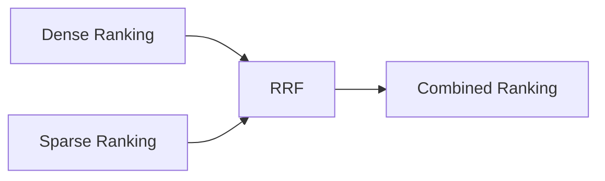

The important idea:

> **RRF combines rankings, not raw similarity scores.**

---

# 7. Hybrid Search Architecture

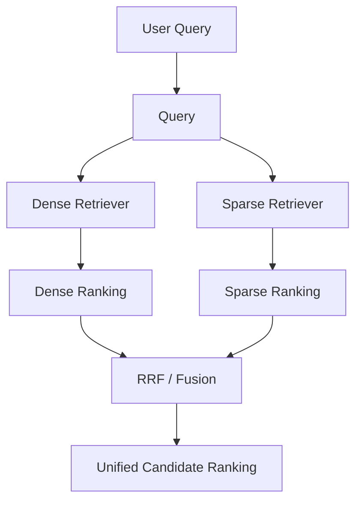

Hybrid retrieval can then be followed by metadata filtering and reranking.

---

# 8. Metadata Filtering

**Metadata filtering** restricts retrieval using structured attributes associated with each document or chunk.

Example metadata:

```json id="metadata1"
{
  "documentId": "doc_123",
  "tenantId": "tenant_001",
  "department": "engineering",
  "fileType": "pdf",
  "createdAt": "2025-03-12",
  "accessLevel": "internal"
}
```

A query can then apply constraints such as:

```text id="metadata2"
department = "engineering"
fileType = "pdf"
createdAt >= "2025-01-01"
```

---

# 9. Why Metadata Filtering Matters

Imagine a company has:

```text
100,000 documents
```

The user asks:

> "Show me engineering documents created after 2025."

Instead of searching every document and hoping semantic similarity finds the correct subset, the system can constrain retrieval.

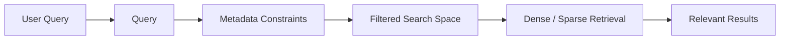

---

# 10. Common Metadata Filters

Typical production metadata includes:

```text
tenantId
userId
department
documentType
fileType
createdAt
updatedAt
language
category
accessLevel
projectId
```

Examples:

### Time

```text
createdAt >= 2025-01-01
```

### File Type

```text
fileType = "pdf"
```

### Department

```text
department = "engineering"
```

### Tenant

```text
tenantId = "tenant_123"
```

### Combined

```text
tenantId = "tenant_123"
AND department = "engineering"
AND createdAt >= 2025-01-01
```

---

# 11. Metadata Filtering ≠ Authorization

This distinction is critical in production RAG.

A retrieval filter is **not a replacement for authorization**.

For example:

```text
tenantId = "tenant_123"
```

can help restrict retrieval, but the application should independently verify that the authenticated user is actually allowed to access `tenant_123`.

The safe mental model is:

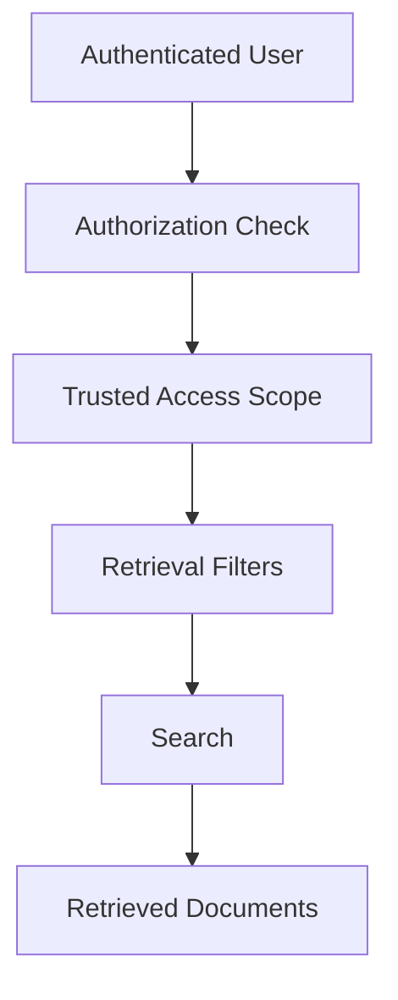

> **Authorization determines what the user is allowed to access. Metadata filtering helps enforce that scope during retrieval.**

Do not blindly trust a `tenantId` supplied by the client.

---

# 12. Pre-Filtering vs Post-Filtering

Metadata constraints can be applied at different points depending on the database and retrieval implementation.

## Pre-Filtering

Apply metadata constraints before or as part of the search.

```text id="prefilter"
Metadata Filter
      ↓
Restricted Search Space
      ↓
Vector Search
      ↓
Results
```

This is often preferable because irrelevant documents never become retrieval candidates.

---

## Post-Filtering

Retrieve candidates first and then apply metadata filtering.

```text id="postfilter"
Vector Search
      ↓
Top 50 Candidates
      ↓
Metadata Filter
      ↓
Final Results
```

This can cause a problem if many top candidates are filtered out.

For example:

```text id="postproblem"
Top 10 retrieved
      ↓
8 filtered out
      ↓
Only 2 usable results
```

The exact behavior and best approach depend on the vector database and index implementation.

---

# 13. Reranking

Even after hybrid retrieval, the candidate set may contain irrelevant or weakly relevant results.

**Reranking** adds a second-stage relevance model that examines the query and candidate documents together.

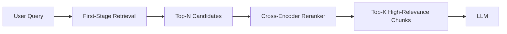

The key pattern is:

```text
Fast Retrieval
     ↓
High Recall
     ↓
Reranking
     ↓
High Precision
```

---

# 14. Bi-Encoder vs Cross-Encoder

## Bi-Encoder

The query and document are embedded independently.

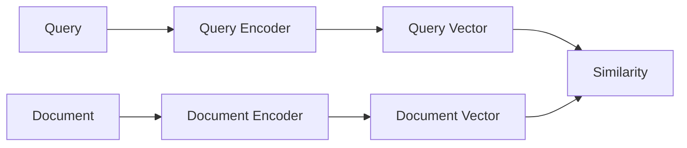

This allows document embeddings to be computed ahead of time.

### Advantage

Very fast retrieval over large collections.

### Limitation

The query and document are not jointly processed during encoding.

---

# 15. Cross-Encoder

A cross-encoder receives the query and document together.

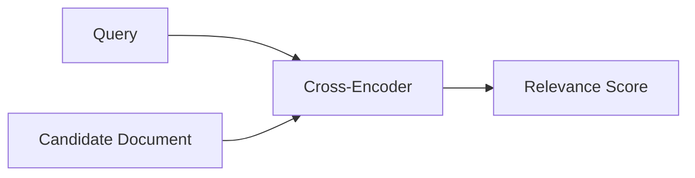

The model can examine interactions between query terms and document content more directly.

### Advantage

Usually stronger relevance discrimination.

### Limitation

More computationally expensive because each query-document pair must be evaluated.

Therefore, cross-encoders are usually applied **after first-stage retrieval**, not against the entire database.

---

# 16. Complete Hybrid + Filtering + Reranking Pipeline

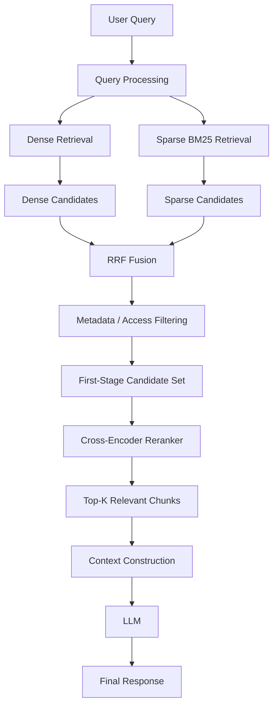

This is one of the most useful production retrieval patterns.

---

# 17. Example: Technical Support RAG

Suppose a support system contains:

```text
10 million documents
```

A user asks:

> "How do I fix ERR-9021 in the payment service?"

### Step 1 — Dense Retrieval

Find documents semantically related to:

```text
payment service
error
troubleshooting
```

### Step 2 — Sparse Retrieval

Find documents containing:

```text
ERR-9021
```

### Step 3 — Hybrid Fusion

Combine both ranking lists using RRF.

### Step 4 — Metadata Filtering

Apply:

```text
product = "payment-service"
language = "en"
```

### Step 5 — Reranking

A cross-encoder evaluates the remaining candidates using:

```text
Query + Candidate Document
```

### Step 6 — Context

Only the strongest chunks are passed to the LLM.

```text id="supportflow"
User Query
    ↓
Dense + BM25
    ↓
RRF
    ↓
Metadata Filtering
    ↓
Top-N Candidates
    ↓
Cross-Encoder
    ↓
Top-K Context
    ↓
LLM
```

---

# 18. Why Use All Three?

Each technique solves a different problem.

| Technique              | Main Problem It Solves                |
| ---------------------- | ------------------------------------- |
| **Dense Retrieval**    | Semantic matching                     |
| **Sparse Retrieval**   | Exact lexical matching                |
| **Metadata Filtering** | Structured constraints / access scope |
| **RRF**                | Combining different rankings          |
| **Reranking**          | Improving final relevance ordering    |

Together:

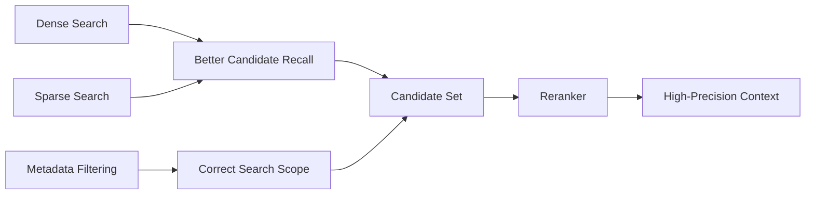

---

# 19. Candidate Retrieval vs Final Retrieval

A very important production concept is that **retrieval happens in stages**.

For example:

```text id="stages"
10,000,000 documents
        ↓
Dense + Sparse Retrieval
        ↓
100 candidates
        ↓
Reranker
        ↓
10 candidates
        ↓
Context selection
        ↓
5 chunks
        ↓
LLM
```

The numbers above are only illustrative.

There is **no universal rule** that says:

```text
Top-100 → Top-10 → Top-5
```

The optimal candidate counts depend on:

* Corpus size
* Retrieval quality
* Reranker cost
* Query complexity
* Context window
* Latency requirements

---

# 20. Dense vs Sparse vs Hybrid

| Feature                   | Dense | Sparse | Hybrid                   |
| ------------------------- | ----- | ------ | ------------------------ |
| Semantic similarity       | ⭐⭐⭐   | ⭐      | ⭐⭐⭐                      |
| Exact matching            | ⭐     | ⭐⭐⭐    | ⭐⭐⭐                      |
| Synonyms                  | ⭐⭐⭐   | ⭐      | ⭐⭐⭐                      |
| Error codes               | ⭐     | ⭐⭐⭐    | ⭐⭐⭐                      |
| Acronyms                  | ⭐⭐    | ⭐⭐⭐    | ⭐⭐⭐                      |
| Intent matching           | ⭐⭐⭐   | ⭐      | ⭐⭐⭐                      |
| Implementation complexity | Low   | Low    | Medium                   |
| Retrieval robustness      | Good  | Good   | Better in many workloads |

---

# 21. Reranking: Before vs After

### Without Reranking

```text
Query
 ↓
Retriever
 ↓
Top-K
 ↓
LLM
```

### With Reranking

```text
Query
 ↓
First-Stage Retriever
 ↓
Top-N Candidates
 ↓
Cross-Encoder
 ↓
Top-K
 ↓
LLM
```

The reranker is not meant to search the entire database.

> **First-stage retrieval finds candidates efficiently; reranking decides which candidates deserve the strongest relevance scores.**

---

# 22. Common Failure Modes

### Hybrid Search

* Dense and sparse rankings may have different quality.
* Poor fusion can introduce noisy results.
* RRF improves rank combination but does not guarantee relevance.

### Metadata Filtering

* Incorrect metadata can remove relevant documents.
* Overly restrictive filters can produce zero results.
* Filtering must not be confused with authorization.

### Reranking

* Cross-encoder inference adds latency and cost.
* The reranker cannot recover a document that first-stage retrieval never retrieved.
* Sending too many candidates to the reranker can become expensive.

### Overall Pipeline

```text id="failure"
Bad First-Stage Retrieval
        ↓
Missing Relevant Document
        ↓
Reranker Cannot Recover It
        ↓
Poor Final Context
```

This is why **recall at the first stage** is so important.

---

# ⚖️ Tradeoffs

| Technique          | Strength                   | Tradeoff                        |
| ------------------ | -------------------------- | ------------------------------- |
| Dense Retrieval    | Semantic understanding     | Can miss exact lexical matches  |
| Sparse Retrieval   | Exact term matching        | Limited semantic understanding  |
| Hybrid Search      | Combines both signals      | More infrastructure             |
| Metadata Filtering | Precise search constraints | Requires reliable metadata      |
| RRF                | Simple rank fusion         | Doesn't use raw score magnitude |
| Cross-Encoder      | Strong relevance scoring   | Higher latency/cost             |

---

# 🧠 Key Mental Model

Think of Phase 3 as a **retrieval funnel**:

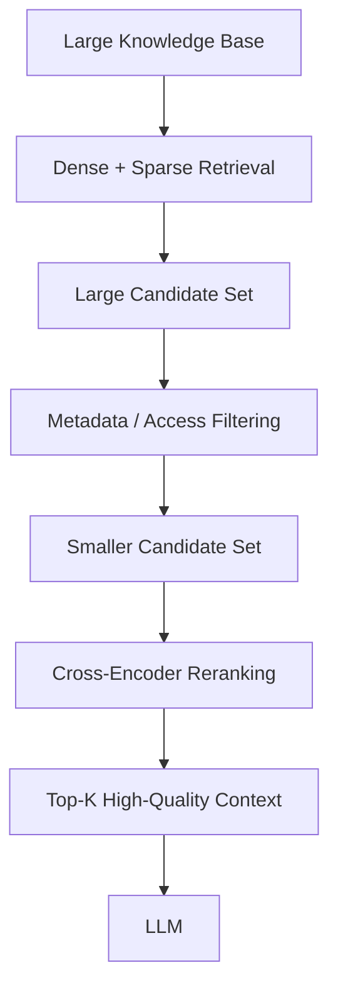

Each stage has a different responsibility:

> **Dense + Sparse → Find broadly**

> **Metadata → Restrict correctly**

> **Reranker → Rank precisely**

> **LLM → Generate using the selected evidence**

---

# 📌 Key Takeaways

1. **Pure vector search is not always sufficient**, especially for exact identifiers, codes, acronyms, and structured constraints.
2. **Dense retrieval** provides semantic matching.
3. **Sparse retrieval/BM25** provides strong lexical matching.
4. **Hybrid Search** combines dense and sparse retrieval.
5. **RRF combines ranking positions**, making it useful when dense and sparse scores are not directly comparable.
6. **Metadata filtering** restricts retrieval using structured attributes.
7. **Metadata filtering is not authorization**—access control must be enforced independently.
8. **Reranking adds a second-stage relevance model** after first-stage retrieval.
9. **Bi-encoders optimize large-scale retrieval; cross-encoders optimize candidate relevance.**
10. **A reranker cannot recover documents that first-stage retrieval failed to retrieve.**

> **Phase 1:** Understand RAG
> **Phase 2:** Build the searchable knowledge layer
> **Phase 3:** Improve retrieval quality and precision
>
> **Dense + Sparse → Fusion → Filtering → Reranking → High-Quality Context → LLM**
