# Phase 4: Query Transformation & Advanced Chunking

## 📌 Overview

**Phase 4** focuses on improving RAG when the original user query is not ideal for retrieval.

Users often ask questions that are:

* Too short
* Ambiguous
* Conversational
* Multi-part
* Missing important terminology
* Structurally different from the documents being searched

Instead of sending the raw query directly to the retriever, **Query Transformation** modifies or expands the query to improve retrieval quality.

This phase introduces:

1. **Multi-Query Retrieval**
2. **Sub-Query Decomposition**
3. **HyDE**
4. **Parent-Document Retrieval**
5. **Hierarchical Retrieval**

The overall idea is:

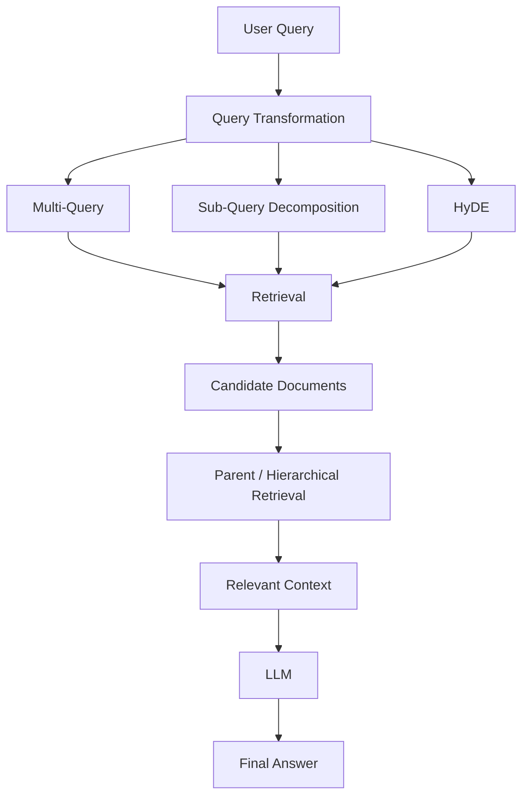

---

# 1. Why Query Transformation?

A user's query is not necessarily the best representation for a retrieval system.

Consider:

> "What about its pricing?"

This query is difficult to retrieve against a knowledge base because:

* "its" has no explicit referent.
* The product name is missing.
* The query contains very little information.

A conversational system might transform it into:

> "What is the pricing model of Product X?"

Now the retrieval system has a much better search query.

---

# 2. Query Transformation

**Query Transformation** is the process of modifying the original question before retrieval.

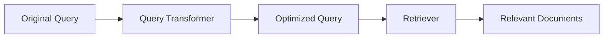

The transformation can involve:

* Rewriting
* Expansion
* Decomposition
* Hypothetical document generation
* Query clarification
* Conversational context resolution

The goal is not to change the user's intent.

> **Transform the query for better retrieval while preserving its meaning.**

---

# 3. Multi-Query Retrieval

**Multi-Query Retrieval** asks an LLM to generate multiple alternative versions of the same question.

Instead of:

```text
User Query
    ↓
One Retrieval
```

we do:

```text
User Query
    ↓
Generate N Queries
    ↓
Parallel Retrieval
    ↓
Merge + Deduplicate
    ↓
Optional Reranking
```

---

## Example

Original:

> "How can I improve application performance?"

Generated queries might include:

```text
1. What techniques improve application performance?
2. How can backend latency be reduced?
3. What are common application performance optimization techniques?
4. How can database queries be optimized for better performance?
```

Each query may retrieve a different set of documents.

---

# 4. Multi-Query Architecture

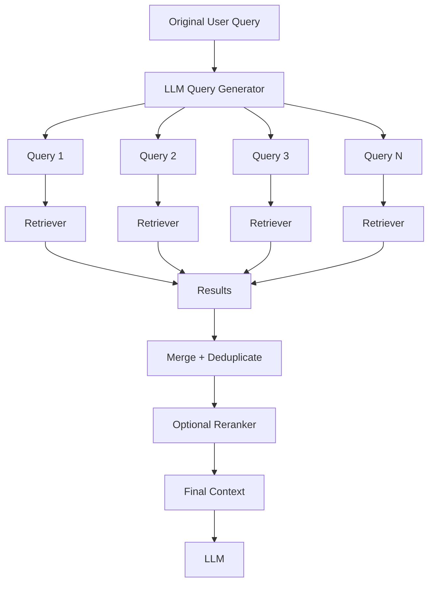

---

# 5. Why Multi-Query Improves Recall

Different queries may retrieve different relevant documents.

For example:

```text
Query 1 → A, B, C
Query 2 → B, D, E
Query 3 → C, E, F
```

After merging:

```text
A, B, C, D, E, F
```

The system has a larger candidate set from which to select useful evidence.

Therefore:

> **Multi-Query is primarily a recall-oriented technique.**

It does not automatically mean every generated query is useful.

---

# 6. Query Diversity Matters

Generating five queries that are almost identical provides little benefit.

Bad:

```text
How do I optimize React performance?
How can I optimize React performance?
How can React performance be optimized?
What are React performance optimizations?
```

Better:

```text
React rendering performance optimization
React component re-render reduction
React bundle size optimization
React state management performance
React application profiling techniques
```

The generated queries should provide **meaningfully different retrieval perspectives** while preserving the original intent.

---

# 7. Multi-Query vs Query Expansion

These concepts are related but not identical.

### Query Expansion

Adds terms or related concepts to the original query.

```text
"car insurance"
        ↓
"car insurance automobile vehicle coverage policy"
```

### Multi-Query

Creates multiple alternative queries.

```text
"car insurance"
        ↓
"What does car insurance cover?"
"How does automobile insurance work?"
"What types of vehicle insurance exist?"
```

A practical system can combine both approaches.

---

# 8. Sub-Query Decomposition

Some questions contain multiple independent questions.

Example:

> "Compare React Native and Flutter in terms of performance, development speed, and community support."

Instead of retrieving against the entire question, the system can decompose it:

```text
Sub-query 1:
React Native performance

Sub-query 2:
Flutter performance

Sub-query 3:
React Native development speed

Sub-query 4:
Flutter development speed

Sub-query 5:
React Native community support

Sub-query 6:
Flutter community support
```

---

# 9. Sub-Query Architecture

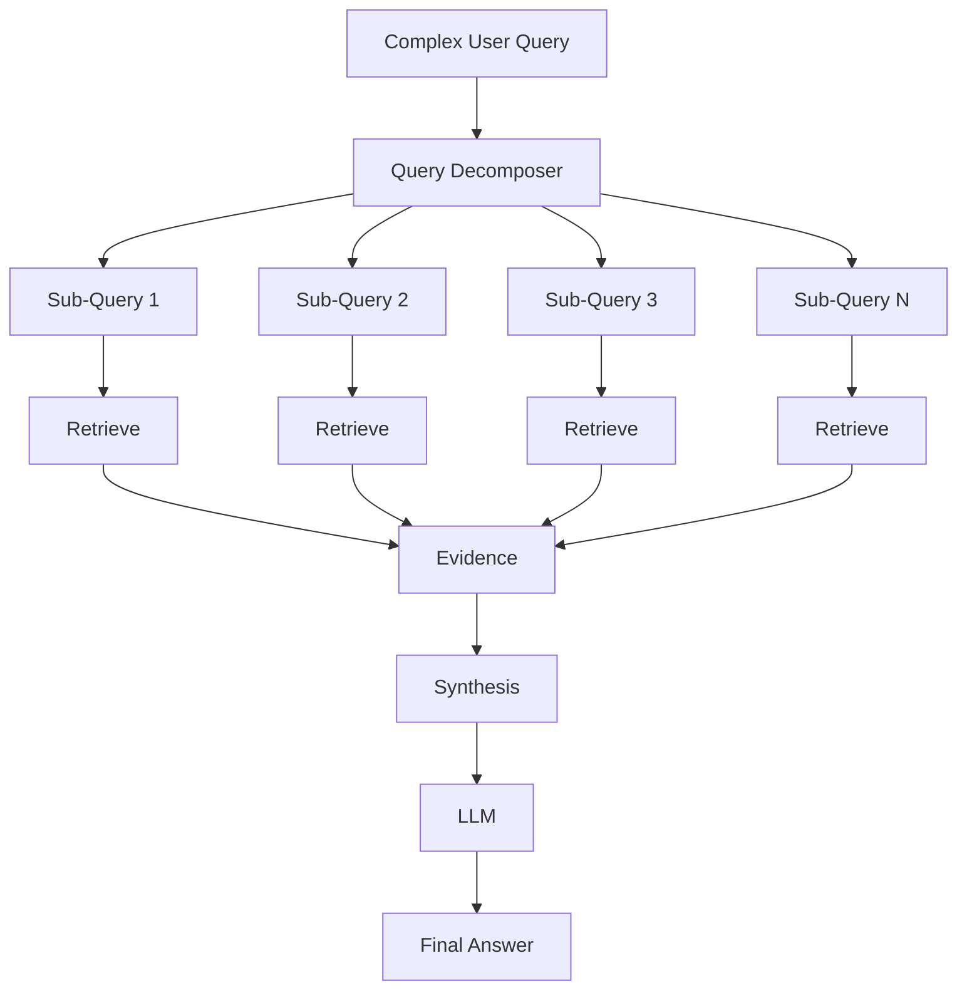

---

# 10. Multi-Query vs Sub-Query Decomposition

These techniques solve different problems.

| Technique                   | Purpose                                                               |
| --------------------------- | --------------------------------------------------------------------- |
| **Multi-Query**             | Multiple perspectives of the same information need                    |
| **Sub-Query Decomposition** | Break a complex question into separate information needs              |
| **Multi-Hop**               | Sequential retrieval where later retrieval depends on earlier results |

Example:

### Multi-Query

```text
"What is Kubernetes?"
        ↓
Multiple ways of asking the same thing
```

### Decomposition

```text
"Compare Kubernetes and Docker in terms of
architecture, networking, and deployment."

        ↓
Architecture
Networking
Deployment
```

### Multi-Hop

```text
Find Company A
      ↓
Find Company A's acquisition
      ↓
Find the acquired company's CEO
```

---

# 11. HyDE — Hypothetical Document Embeddings

**HyDE** stands for **Hypothetical Document Embeddings**.

The core idea is different from normal query rewriting.

Instead of embedding the user's question directly, an LLM generates a **hypothetical document/answer** that could answer the question.

That hypothetical text is then embedded and used for retrieval.

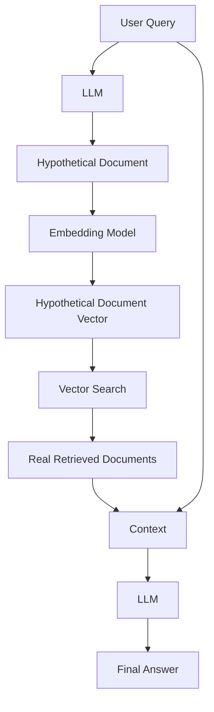

---

# 12. How HyDE Works

Suppose the user asks:

> "How does database indexing improve query performance?"

### Step 1 — Generate Hypothetical Document

The LLM might produce something conceptually like:

```text
Database indexes improve query performance by allowing the
database engine to locate relevant rows without scanning the
entire table...
```

This is **not retrieved evidence**.

It is only a hypothetical representation of what a useful document might look like.

---

### Step 2 — Embed the Hypothetical Document

```text
Hypothetical Document
        ↓
Embedding Model
        ↓
Vector
```

---

### Step 3 — Search the Vector Store

```text
Hypothetical Vector
        ↓
Vector Database
        ↓
Real Documents
```

---

### Step 4 — Generate the Final Answer

The actual retrieved documents become the evidence for the final response.

```text
User Query
+
Real Retrieved Evidence
        ↓
LLM
        ↓
Final Answer
```

> **The hypothetical document helps retrieval; it should not be treated as authoritative evidence.**

---

# 13. Why HyDE Can Help

There can be a mismatch between:

```text
Short User Query
```

and

```text
Long Informative Documents
```

For example:

```text
Query:
"database indexing"

Document:
"Database indexes use auxiliary data structures to reduce
the amount of data that must be scanned during query execution..."
```

The hypothetical document can move the retrieval representation closer to the **document side** of the embedding space.

This is the motivation behind HyDE.

---

# 14. HyDE vs Query Rewriting

| Technique       | Transformation                            |
| --------------- | ----------------------------------------- |
| Query Rewriting | Query → Better Query                      |
| Multi-Query     | Query → Multiple Queries                  |
| Decomposition   | Query → Multiple Sub-Queries              |
| HyDE            | Query → Hypothetical Document → Embedding |

HyDE is therefore more than simply rewriting the wording of the query.

---

# 15. Combining Multi-Query + HyDE + Reranking

These techniques can be composed.

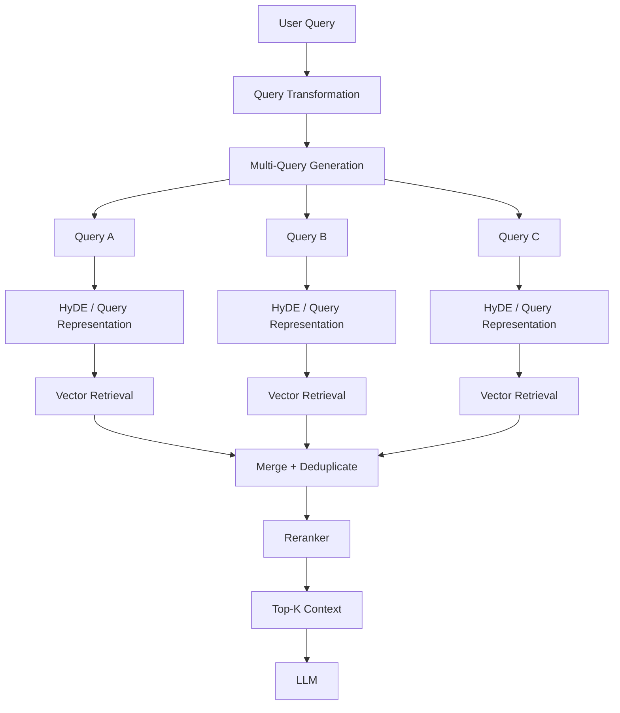

This can improve recall and precision, but every additional stage introduces **latency and cost**.

---

# 16. Parent-Document Retrieval

Query transformation changes **how we search**.

Parent-Document Retrieval changes **what context we return**.

The problem:

```text
Small chunks
    ↓
Excellent retrieval precision
    ↓
Insufficient context for the LLM
```

A small chunk might contain the exact answer but lack the surrounding explanation.

Parent-Document Retrieval solves this by separating:

> **retrieval granularity** from **generation context granularity**.

---

# 17. Parent-Child Chunking

Suppose a document is divided into:

```text
Parent Document
      │
      ├── Child Chunk 1
      ├── Child Chunk 2
      ├── Child Chunk 3
      └── Child Chunk 4
```

The smaller child chunks are embedded and indexed.

Each child maintains a reference to its parent.

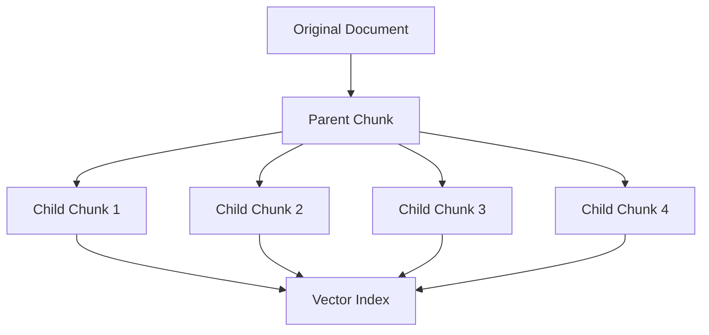

---

# 18. Parent-Document Retrieval Flow

Suppose:

```text
Child Chunk 3
```

matches the user's query.

Instead of passing only Child Chunk 3 to the LLM:

```text
Child 3
   ↓
Parent Lookup
   ↓
Parent Chunk
   ↓
LLM Context
```

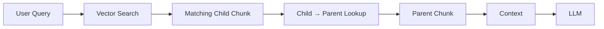

---

# 19. Example

Imagine a technical manual.

### Parent

```text
Authentication Configuration
```

### Children

```text
Child 1:
JWT configuration

Child 2:
Token expiration

Child 3:
Refresh token configuration

Child 4:
Authentication errors
```

The query:

> "How long should refresh tokens remain valid?"

might retrieve **Child 3**.

Instead of returning only a tiny fragment, the system can provide the parent section containing the broader authentication configuration.

This gives the LLM more useful context.

---

# 20. Child vs Parent

| Component             | Purpose                               |
| --------------------- | ------------------------------------- |
| **Child Chunk**       | Precise retrieval                     |
| **Parent Chunk**      | Richer context                        |
| **Vector Index**      | Stores/searches child representations |
| **Parent Store**      | Stores larger context                 |
| **Child → Parent ID** | Connects retrieval to context         |

The central idea is:

> **Search small, understand large.**

---

# 21. Parent-Document Architecture

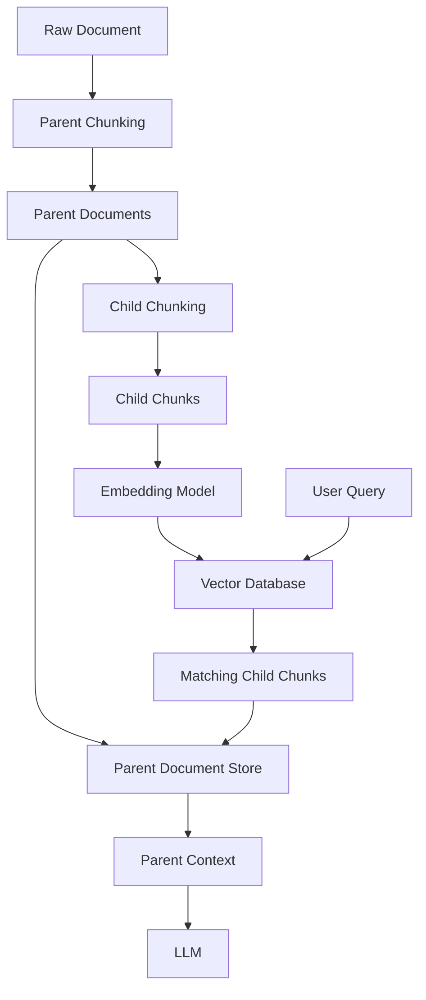

---

# 22. Parent Deduplication

Multiple child chunks can belong to the same parent.

For example:

```text
Child 1 → Parent A
Child 2 → Parent A
Child 3 → Parent B
```

If Child 1 and Child 2 are both retrieved, the system should usually avoid passing Parent A twice.

```text
Retrieved Children:
Child 1
Child 2
Child 3

        ↓

Unique Parents:
Parent A
Parent B
```

This is an important implementation detail.

---

# 23. Hierarchical Retrieval

Parent-Document Retrieval generally provides a relatively simple parent-child relationship.

**Hierarchical Retrieval** goes further by creating multiple levels of representation.

For example:

```text
Document
   ↓
Chapter
   ↓
Section
   ↓
Subsection
   ↓
Text Chunk
```

Each level can provide a different granularity of understanding.

---

# 24. Hierarchical Summarization

A hierarchical system can create summaries at different levels.

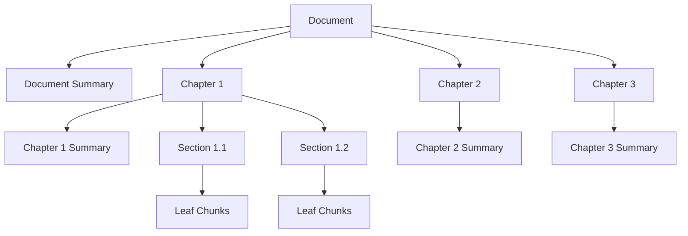

The higher-level summaries help the retrieval system navigate the document.

The lower-level chunks provide detailed evidence.

---

# 25. Coarse-to-Fine Retrieval

The basic idea is:

```text
Document
   ↓
High-Level Summary
   ↓
Relevant Chapter
   ↓
Relevant Section
   ↓
Detailed Chunk
```

Instead of searching every tiny chunk equally, the system can first identify promising regions and then retrieve finer-grained content.

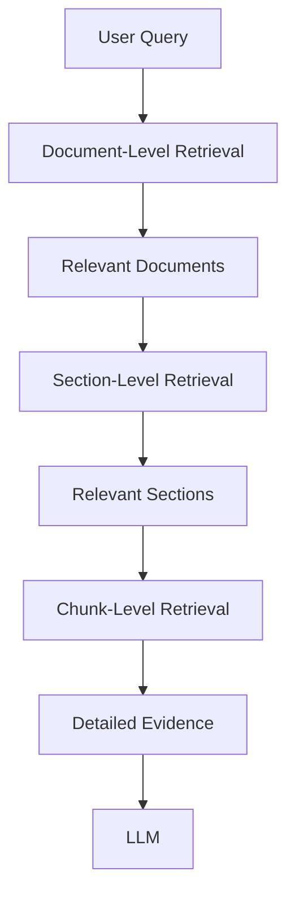

---

# 26. Why Hierarchical Retrieval?

Large documents often contain thousands of chunks.

For example:

```text
100 Documents
      ↓
5,000 Sections
      ↓
500,000 Chunks
```

A hierarchical representation can help organize the search space around meaningful document structure.

It is particularly useful for:

* Books
* Technical manuals
* Research papers
* Legal documents
* Large reports
* Enterprise documentation

---

# 27. Parent-Document vs Hierarchical Retrieval

These approaches are related but solve different problems.

| Feature    | Parent-Document             | Hierarchical Retrieval       |
| ---------- | --------------------------- | ---------------------------- |
| Main idea  | Small child → larger parent | Navigate multiple levels     |
| Structure  | Usually shallow             | Multi-level                  |
| Retrieval  | Search child                | Search/navigate hierarchy    |
| Context    | Parent context              | Context at appropriate level |
| Complexity | Lower                       | Higher                       |
| Best for   | Better chunk context        | Large structured documents   |

### Parent-Document

```text
Child
  ↓
Parent
  ↓
LLM
```

### Hierarchical

```text
Document
   ↓
Chapter
   ↓
Section
   ↓
Chunk
   ↓
LLM
```

---

# 28. Important Difference: Phase 2 vs Phase 4

Phase 2 introduced basic chunking.

```text
Document
   ↓
Chunks
   ↓
Embeddings
   ↓
Vector DB
```

Phase 4 introduces **retrieval-aware document organization**.

```text
Document
   ↓
Parent / Hierarchy
   ↓
Child / Leaf Chunks
   ↓
Embeddings
   ↓
Retrieval
   ↓
Context Expansion
```

The goal is no longer just:

> "How should I split this document?"

It becomes:

> **"How should I organize document representations so retrieval can find precise evidence while still providing enough context?"**

---

# 29. Complete Phase 4 Architecture

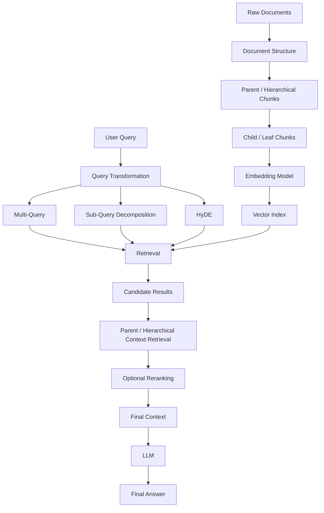

---

# 30. How the Techniques Fit Together

These techniques operate at different layers.

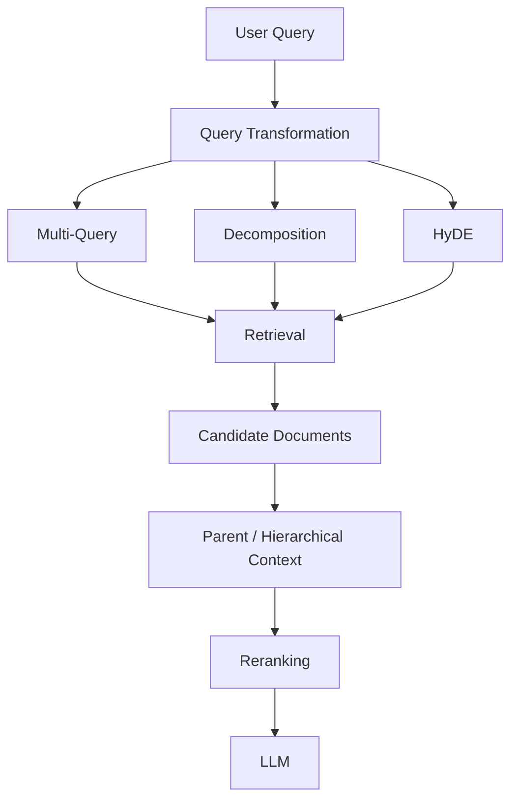

Think of them as:

| Layer                | Techniques                                  |
| -------------------- | ------------------------------------------- |
| **Query Layer**      | Rewriting, Multi-Query, Decomposition, HyDE |
| **Retrieval Layer**  | Dense, Sparse, Hybrid                       |
| **Context Layer**    | Parent-Document, Hierarchical               |
| **Ranking Layer**    | Reranking                                   |
| **Generation Layer** | LLM                                         |

---

# ⚖️ Tradeoffs

| Technique              | Main Benefit                                       | Main Cost / Risk                       |
| ---------------------- | -------------------------------------------------- | -------------------------------------- |
| Multi-Query            | Higher recall                                      | More retrieval calls                   |
| Query Decomposition    | Handles complex questions                          | More orchestration                     |
| HyDE                   | Better query-document representation in some cases | Extra LLM + embedding cost             |
| Parent-Document        | Better context                                     | Larger context and storage             |
| Hierarchical Retrieval | Structured navigation                              | More indexing and retrieval complexity |

---

# 🚨 Common Failure Modes

### Multi-Query

* Generated queries are too similar.
* Generated queries drift from the original intent.
* Too many queries increase latency.

### Decomposition

* Complex questions are split incorrectly.
* Dependencies between sub-questions are ignored.
* Synthesis becomes difficult.

### HyDE

* Hypothetical document contains incorrect information.
* The generated text biases retrieval toward the wrong concept.
* Extra generation increases latency.

Remember:

> **HyDE's hypothetical document is a retrieval aid, not ground truth.**

### Parent-Document

* Parent chunks become too large.
* Duplicate parents consume context.
* Child-parent mappings become inconsistent.

### Hierarchical Retrieval

* Relevant information may exist outside the initially selected branch.
* Incorrect high-level summaries can route retrieval incorrectly.
* More hierarchy levels increase system complexity.

---

# 🧠 Key Mental Model

Phase 4 can be remembered as:

```text
Query Transformation
        ↓
Ask the retriever better questions

Parent Retrieval
        ↓
Find precisely, return enough context

Hierarchical Retrieval
        ↓
Navigate from broad → specific
```

Or:

> **Transform the question → retrieve broadly → locate the right context → generate the answer.**

---

# 📌 Key Takeaways

1. **Query transformation improves the representation of the user's information need before retrieval.**
2. **Multi-Query generates multiple perspectives to improve recall.**
3. **Sub-Query Decomposition breaks complex questions into separate retrieval tasks.**
4. **HyDE generates a hypothetical document and embeds it for retrieval.**
5. **HyDE's hypothetical output is not evidence for the final answer.**
6. **Parent-Document Retrieval separates retrieval granularity from generation context.**
7. **Child chunks provide precise matching while parent chunks provide richer context.**
8. **Hierarchical Retrieval organizes documents across multiple levels of granularity.**
9. **Parent-Document is generally a shallow child→parent context expansion pattern; Hierarchical Retrieval provides multi-level navigation.**
10. **These techniques can be combined with Hybrid Search and Reranking.**
11. **Every additional transformation or retrieval stage increases latency, cost, and potential failure points.**
12. **There is no universally best query transformation or chunking strategy—evaluate them on your actual dataset.**

> **Phase 3:** Improve retrieval quality
> **Phase 4:** Improve the query and context used for retrieval
>
> **Transform → Retrieve → Expand/Navigate Context → Rerank → Generate**
