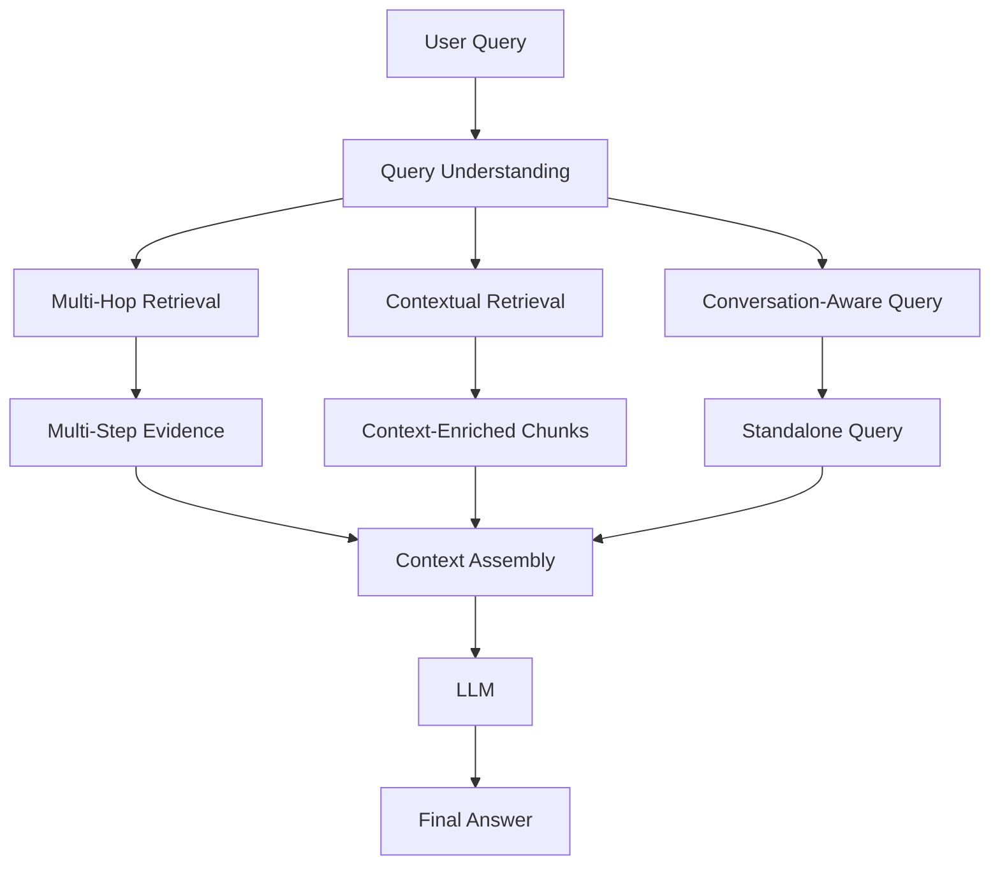
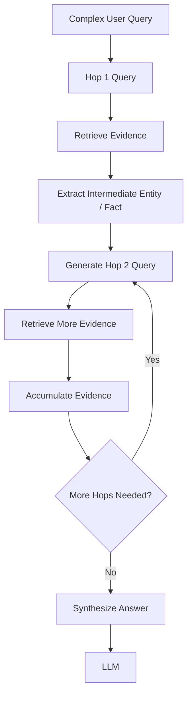
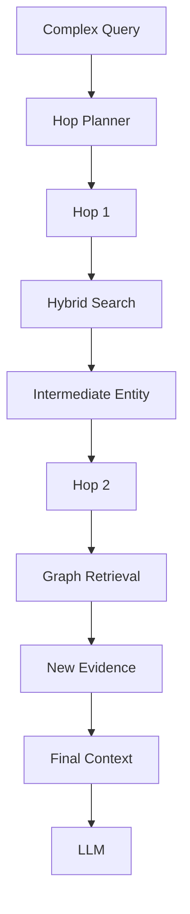
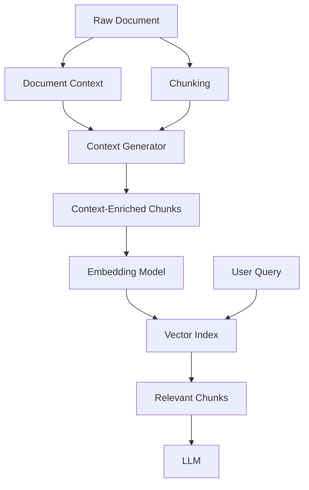
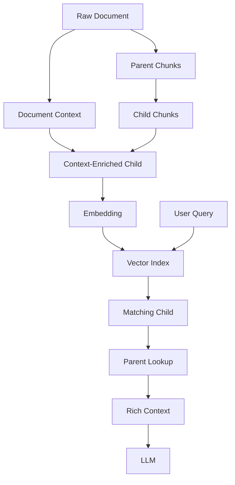
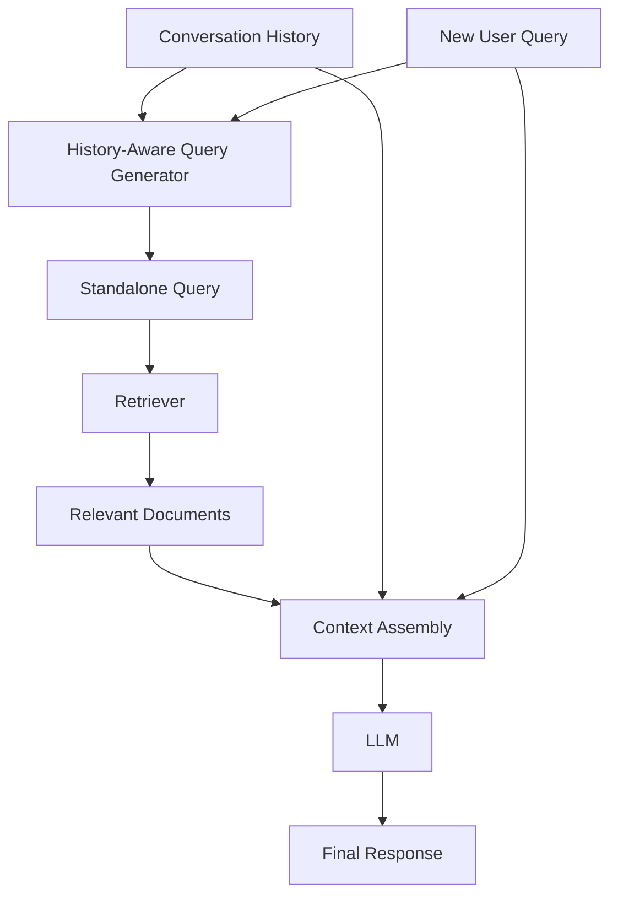
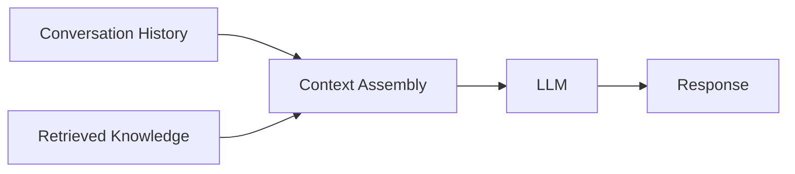
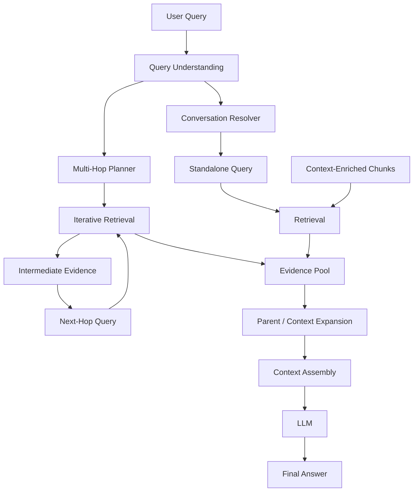
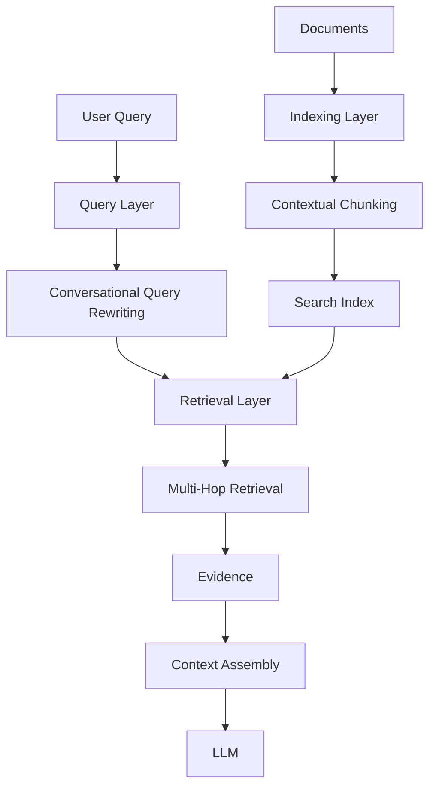
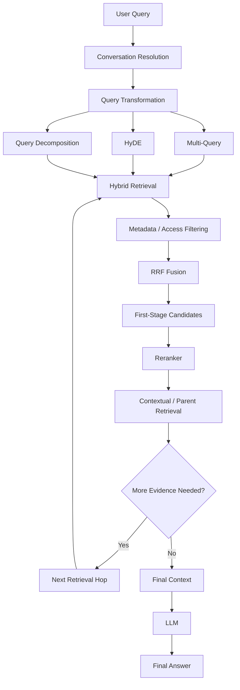

# Phase 5: Advanced Contextual & Multi-Hop RAG

## 📌 Overview

**Phase 5** focuses on RAG systems where simple one-shot retrieval is not enough.

Real-world questions often require the system to:

* Connect information from multiple documents
* Preserve context that was lost during chunking
* Understand references from previous conversation turns
* Perform sequential retrieval
* Build a richer context before generation

This phase introduces three important patterns:

1. **Multi-Hop RAG** — retrieve information iteratively across multiple steps.
2. **Contextual RAG** — preserve document-level context inside individual chunks.
3. **Conversational RAG** — make follow-up questions retrieval-ready using conversation history.

The overall architecture is:



---

# 1. Multi-Hop RAG

## 📌 What is Multi-Hop RAG?

Some questions cannot be answered from a single retrieval operation.

The system first needs to discover one piece of information, then use that information to perform another retrieval.

This is called **Multi-Hop RAG**.

> **Multi-Hop RAG performs sequential retrieval where later retrieval steps depend on information discovered earlier.**

---

## Example

Consider:

> **"What was the revenue of the company that acquired Startup X in 2022?"**

The knowledge base might contain:

```text
Document A:
Company Y acquired Startup X in 2022.

Document B:
Company Y reported $5 billion in revenue.
```

No single document necessarily contains the complete answer.

The system must connect them.

---

# 2. Multi-Hop Retrieval Process

```text id="multihopbasic"
User Question
     ↓
Hop 1
"Who acquired Startup X in 2022?"
     ↓
Company Y
     ↓
Hop 2
"What was Company Y's revenue?"
     ↓
$5 Billion
     ↓
Final Synthesis
```



---

# 3. Step-by-Step Example

### Original Question

> "What was the revenue of the company that acquired Startup X in 2022?"

### Hop 1

Search:

```text id="hop1"
Who acquired Startup X in 2022?
```

Retrieved evidence:

```text id="hop1result"
Startup X was acquired by Company Y in 2022.
```

The system extracts:

```text id="entity"
Acquirer = Company Y
```

---

### Hop 2

The system generates a new query:

```text id="hop2"
What was Company Y's revenue?
```

Retrieved evidence:

```text id="hop2result"
Company Y reported $5 billion in revenue.
```

---

### Final Synthesis

The system combines:

```text id="evidence"
Startup X
      ↓
Acquired by Company Y
      ↓
Company Y revenue = $5 billion
```

and generates the final response.

---

# 4. Multi-Hop Architecture


The key characteristic is:

> **Hop N depends on information discovered during Hop N-1.**

---

# 5. Multi-Hop vs Multi-Query

These concepts are easy to confuse.

### Multi-Query

Queries are usually generated as **alternative perspectives** of the same information need.

```text id="multiquery"
Question
   ├── Query A
   ├── Query B
   ├── Query C
   └── Query D

All can be retrieved independently.
```

### Multi-Hop

Retrieval is **sequential and dependent**.

```text id="multihop"
Question
   ↓
Hop 1
   ↓
Fact discovered
   ↓
Hop 2
   ↓
New fact discovered
   ↓
Hop 3
```

| Feature          | Multi-Query                           | Multi-Hop                |
| ---------------- | ------------------------------------- | ------------------------ |
| Retrieval        | Parallel/independent                  | Sequential/dependent     |
| Main goal        | Improve recall                        | Connect related evidence |
| Query dependency | Low                                   | High                     |
| Typical use      | Different perspectives                | Multi-step questions     |
| Example          | Several ways to ask the same question | Find A → use A to find B |

---

# 6. Multi-Hop Can Use Different Retrievers

Multi-Hop does **not** require a particular retrieval technology.

Each hop can use:

* Dense Vector Search
* BM25
* Hybrid Search
* Metadata Filtering
* Reranking
* Graph Retrieval
* SQL/API tools

For example:



This makes Multi-Hop an **orchestration pattern**, rather than a specific database or search algorithm.

---

# 7. Controlling Multi-Hop Loops

An unrestricted Multi-Hop system can repeatedly retrieve information.

Therefore production systems should define limits such as:

```text id="limits"
Maximum hops
Maximum retrieval calls
Maximum execution time
Maximum token budget
Maximum tool calls
```

For example:

```text id="examplelimits"
max_hops = 4
max_retrieval_calls = 10
```

These numbers are illustrative and should be tuned for the application.

---

# 8. Multi-Hop Failure Propagation

Multi-Hop retrieval has an important weakness.

If an early hop retrieves incorrect information:

```text id="errorprop"
Incorrect Hop 1
      ↓
Wrong Entity
      ↓
Wrong Hop 2 Query
      ↓
Wrong Evidence
      ↓
Incorrect Final Answer
```

Therefore intermediate evidence should be validated where possible.

Reranking, metadata filtering, source validation, and confidence checks can help.

---

# 9. Contextual RAG

## 📌 The Chunk Context Problem

Traditional chunking can produce isolated pieces of text.

Imagine the original document says:

```text id="contextdoc"
ACME Corporation reported strong financial results in 2025.

The company's Q3 revenue grew 15%.

The company also expanded into three new markets.
```

After chunking, you might get:

```text id="badchunk"
"The company's Q3 revenue grew 15%."
```

The chunk contains useful information, but:

> **Which company?**

The relationship was lost during chunking.

---

# 10. Contextual Retrieval

**Contextual Retrieval** enriches a chunk with additional context from its source document before embedding/indexing it.

Conceptually:

```text id="contextual"
Original Chunk:
"The company's Q3 revenue grew 15%."

        ↓

Document Context:
"ACME Corporation's financial results in 2025..."

        ↓

Context-Enriched Chunk:
"In ACME Corporation's 2025 financial results,
the company's Q3 revenue grew 15%."
```

The enriched representation is then embedded and indexed.

---

# 11. Contextual Retrieval Architecture



The contextual information can be generated during the **indexing phase**, so retrieval benefits from it later.

---

# 12. Contextual Chunk Example

### Original Document

```text id="originalcontext"
Document:
"Tesla's 2025 annual report discusses vehicle deliveries,
energy storage, and financial performance.

The company delivered 1.6 million vehicles."
```

A naive chunk could be:

```text id="naivechunk"
"The company delivered 1.6 million vehicles."
```

A contextual representation could be:

```text id="enrichedchunk"
"According to Tesla's 2025 annual report,
the company delivered 1.6 million vehicles."
```

The second representation contains more retrieval-friendly context.

---

# 13. Contextual RAG vs Parent-Document RAG

These techniques solve related but different problems.

### Parent-Document RAG

Retrieves a small child chunk and then returns a larger parent context.

```text id="parentmental"
Child Chunk
    ↓
Parent Lookup
    ↓
Larger Context
```

### Contextual RAG

Adds contextual information to the chunk itself during indexing.

```text id="contextmental"
Document Context + Chunk
        ↓
Context-Enriched Representation
        ↓
Embedding
```

Comparison:

| Feature      | Parent-Document             | Contextual RAG                   |
| ------------ | --------------------------- | -------------------------------- |
| Main goal    | Return more context         | Preserve context during indexing |
| Modification | Chunk hierarchy             | Chunk representation             |
| Retrieval    | Child → parent              | Search enriched chunk            |
| Storage      | Parent + child relationship | Enriched chunk representation    |
| Can combine? | Yes                         | Yes                              |

They can work together.

---

# 14. Contextual RAG + Parent-Document

A stronger architecture can use both.



This combines:

* Better retrieval representation
* Better generation context

---

# 15. Conversational RAG

## 📌 The Follow-Up Query Problem

Traditional RAG assumes every query is self-contained.

But conversational systems often receive:

```text
User:
"What is React Native?"

Assistant:
"React Native is a framework..."

User:
"What are its main advantages?"
```

The second query:

```text
"What are its main advantages?"
```

is incomplete by itself.

A vector database may not know what **"its"** refers to.

---

# 16. History-Aware Query Transformation

Conversational RAG uses conversation history to create a standalone query.

```text id="conversation"
Chat History
+
New User Question
        ↓
Query Rewriter
        ↓
Standalone Query
        ↓
Retriever
```

For example:

```text id="standalone"
Original:
"What are its main advantages?"

Transformed:
"What are the main advantages of React Native?"
```

The retriever receives the standalone version.

---

# 17. Conversational RAG Architecture



Notice that **conversation history and retrieved knowledge serve different purposes**.

* Conversation history resolves references and maintains dialogue.
* Retrieved documents provide external knowledge.

---

# 18. Example Conversation

### Turn 1

```text id="turn1"
User:
"What is PostgreSQL?"
```

The system retrieves PostgreSQL documentation.

---

### Turn 2

```text id="turn2"
User:
"What are its advantages?"
```

The system uses the previous conversation to determine:

```text id="resolved"
"its" → PostgreSQL
```

Then generates:

```text id="resolvedquery"
"What are the advantages of PostgreSQL?"
```

That query goes to retrieval.

---

### Turn 3

```text id="turn3"
User:
"What about its indexing system?"
```

The query can become:

```text id="resolvedquery2"
"How does PostgreSQL's indexing system work?"
```

The retrieval system can now search effectively.

---

# 19. Conversational RAG Does Not Always Need Rewriting

Query rewriting is useful when:

* The query contains pronouns.
* The query depends heavily on previous turns.
* Important entities are omitted.
* The user's current question is incomplete.

But rewriting every query can introduce:

* Additional latency
* Additional LLM cost
* Incorrect interpretation
* Query drift

For example:

```text id="selfcontained"
"What is the maximum size of a PostgreSQL index?"
```

is already self-contained.

A rewriting step may not provide meaningful benefit.

Therefore, a production system can decide whether rewriting is necessary.

---

# 20. Conversation History vs Knowledge Retrieval

These should not be treated as the same thing.



### Conversation History

Answers:

> "What were we talking about?"

### Retrieved Knowledge

Answers:

> "What does the knowledge base say?"

A strong Conversational RAG system uses both appropriately.

---

# 21. Query Drift

Conversation history can become very long.

For example:

```text id="drift"
Turn 1 → Product A
Turn 2 → Product B
Turn 3 → Pricing
Turn 4 → Security
Turn 5 → Deployment
Turn 6 → "What about it?"
```

The system must determine which previous context **"it"** refers to.

Using the entire conversation blindly can introduce ambiguity.

Possible solutions include:

* History condensation
* Recent-turn weighting
* Entity tracking
* Conversation summaries
* Explicit query rewriting
* Topic/session boundaries

---

# 22. Complete Phase 5 Architecture



---

# 23. How the Three Techniques Differ

| Technique              | Main Problem                                | Core Idea                          |
| ---------------------- | ------------------------------------------- | ---------------------------------- |
| **Multi-Hop RAG**      | Information is distributed across documents | Retrieve sequentially              |
| **Contextual RAG**     | Chunk loses document context                | Enrich chunks during indexing      |
| **Conversational RAG** | Follow-up queries are incomplete            | Rewrite using conversation history |

---

# 24. Where Each Technique Operates



This is important because these techniques are **not mutually exclusive**.

---

# 25. Combining Phase 3 + Phase 4 + Phase 5

A production RAG pipeline can combine many of the techniques learned so far.



This illustrates an important lesson:

> **RAG architectures are composable.**

You don't necessarily choose only one technique.

---

# ⚖️ Tradeoffs

| Technique          | Strength                        | Tradeoff                             |
| ------------------ | ------------------------------- | ------------------------------------ |
| Multi-Hop          | Connects distributed evidence   | More latency and failure propagation |
| Contextual RAG     | Preserves lost document context | Additional indexing/generation cost  |
| Conversational RAG | Handles follow-up questions     | Query rewriting can introduce drift  |
| Parent-Document    | Provides richer context         | Larger context and storage           |
| Combined Pipeline  | Strong retrieval capabilities   | Greater system complexity            |

---

# 🚨 Common Failure Modes

## Multi-Hop

```text
Wrong early retrieval
      ↓
Wrong intermediate entity
      ↓
Wrong next query
      ↓
Wrong final answer
```

Use validation, source quality checks, and hop limits.

---

## Contextual RAG

Poor contextualization can introduce incorrect assumptions.

For example:

```text
Original:
"The company grew 15%."

Bad generated context:
"ACME Corporation's revenue grew 15%."
```

If the original document did not actually establish that relationship, the added context can make retrieval worse.

Therefore:

> **Generated context should faithfully describe the source document rather than inventing information.**

---

## Conversational RAG

A query rewriter can misunderstand:

```text
User:
"What about the second one?"
```

If the conversation contains multiple possible references, the rewritten query may be wrong.

When ambiguity cannot be resolved reliably, the system may need to ask a clarification question rather than silently guessing.

---

# 🧠 Key Mental Model

Remember Phase 5 with three questions:

### Multi-Hop RAG

> **"Do I need to retrieve again using what I just discovered?"**

```text
Retrieve → Discover → Retrieve Again → Synthesize
```

### Contextual RAG

> **"Did chunking remove important information?"**

```text
Document Context + Chunk → Better Retrieval Representation
```

### Conversational RAG

> **"Does this query depend on our previous conversation?"**

```text
History + New Query → Standalone Query → Retrieval
```

---

# 📌 Key Takeaways

1. **Multi-Hop RAG handles questions whose evidence is distributed across multiple retrieval steps.**
2. **Each hop can use different retrieval technologies such as vector, BM25, hybrid, graph, SQL, or APIs.**
3. **Multi-Hop differs from Multi-Query because later hops depend on information discovered in earlier hops.**
4. **Multi-Hop systems should enforce limits on hops, retrieval calls, tokens, and execution time.**
5. **Contextual RAG addresses the loss of document-level context caused by chunking.**
6. **Context can be added to chunks during indexing before embedding and retrieval.**
7. **Generated context must faithfully reflect the source document.**
8. **Parent-Document Retrieval and Contextual RAG can be combined.**
9. **Conversational RAG makes follow-up questions retrieval-ready using conversation history.**
10. **Conversation history is not the same as retrieved knowledge.**
11. **Query rewriting is useful for ambiguous or incomplete follow-ups, but unnecessary rewriting can add cost and query drift.**
12. **These techniques are composable and can be combined with Hybrid Search, Metadata Filtering, Reranking, Multi-Query, HyDE, and Parent-Document Retrieval.**

> **Phase 3:** Improve retrieval quality
> **Phase 4:** Transform queries and improve context granularity
> **Phase 5:** Connect evidence, preserve context, and understand conversation
>
> **Transform → Retrieve → Iterate → Expand Context → Generate**
