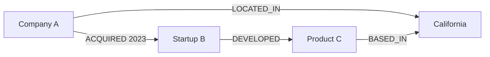
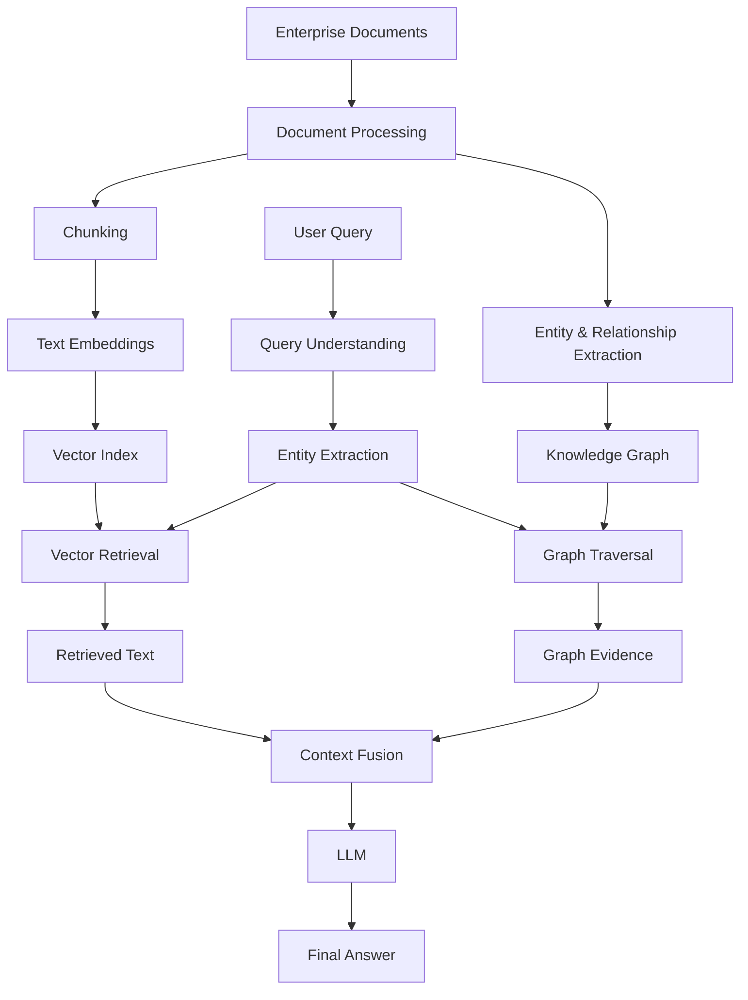
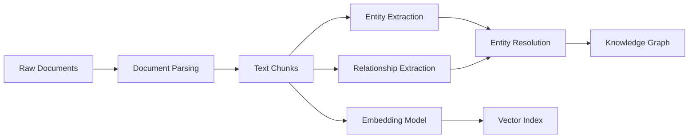
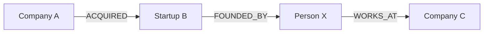
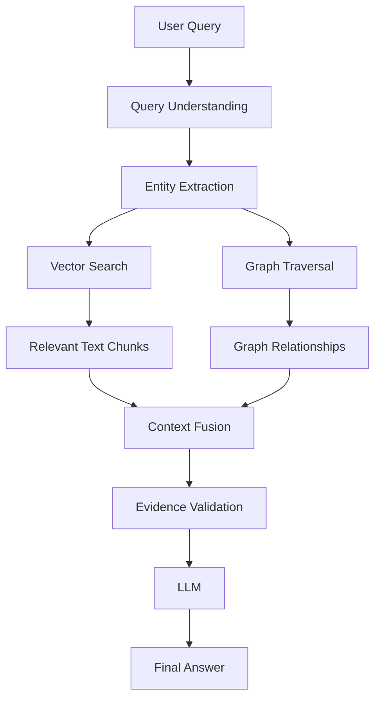
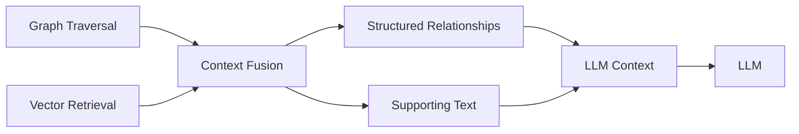
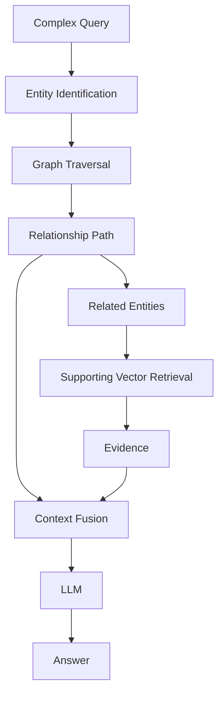
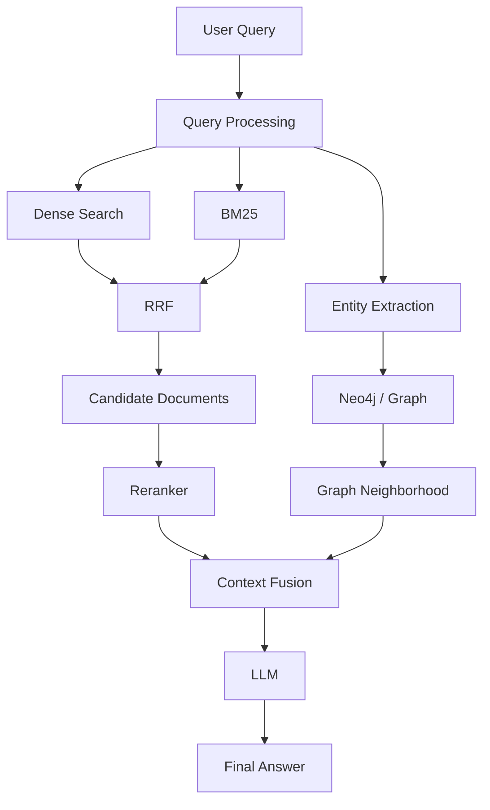
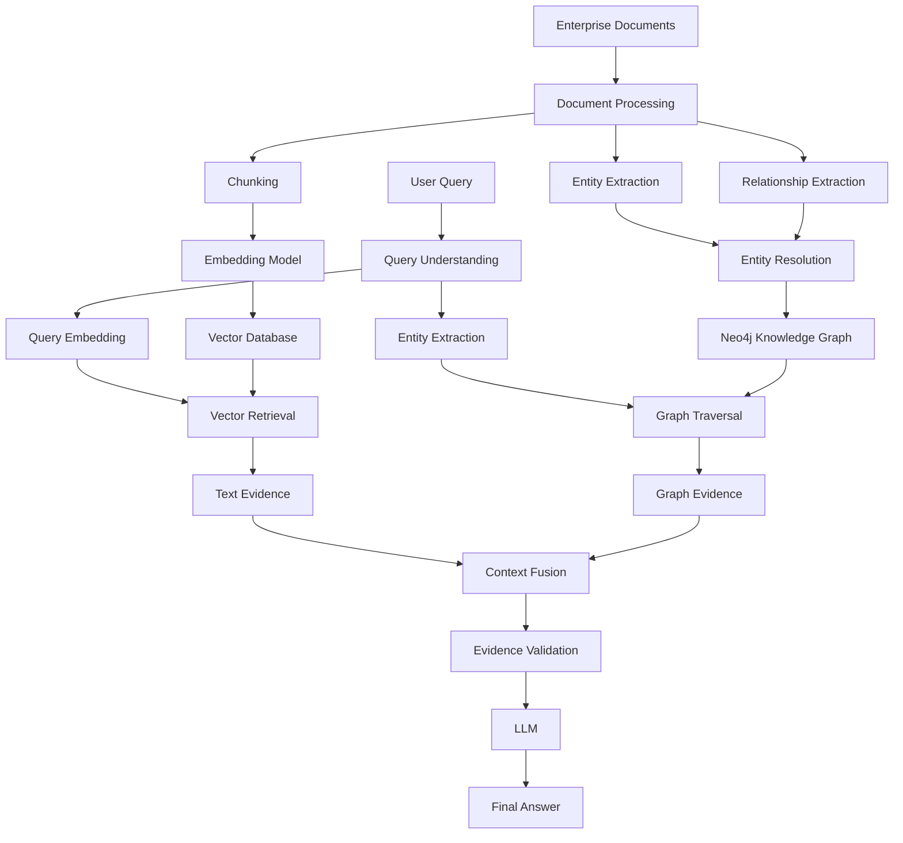
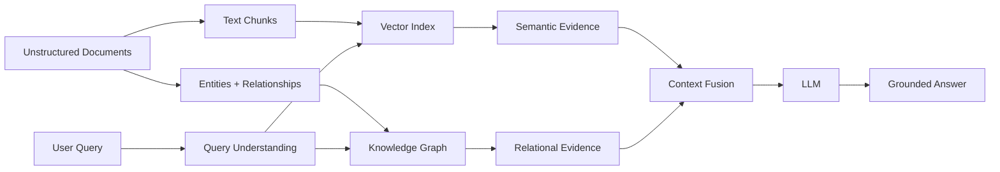

# Phase 6: Knowledge Graphs & GraphRAG (Neo4j / Cypher)

## 📌 Overview

Traditional RAG primarily retrieves **text chunks** based on semantic or lexical similarity.

That works well when the answer exists inside a single relevant passage.

However, many enterprise questions require understanding **relationships between entities**:

> "Which products were developed by startups acquired by Company A?"

The answer may require connecting:

```text
Company A
    ↓ ACQUIRED
Startup B
    ↓ DEVELOPED
Product C
```

This is where **Knowledge Graphs** and **GraphRAG** become valuable.

> **GraphRAG combines graph-based relationships with unstructured evidence retrieval to answer relationship-heavy and multi-hop questions.**

A typical GraphRAG system may combine:

* Knowledge Graph
* Vector Search
* Entity Resolution
* Graph Traversal
* Text Chunks
* LLM-based reasoning

---

# 1. What is a Knowledge Graph?

A **Knowledge Graph (KG)** represents knowledge as entities and relationships.

Instead of storing information only as text:

```text
Company A acquired Startup B in 2023.
Startup B developed Product C.
Product C is based in California.
```

we represent it structurally:



The graph explicitly represents **who is connected to whom and how**.

---

# 2. Graph Components

A knowledge graph generally contains:

### Nodes

Represent entities.

```text
Company
Startup
Person
Product
Location
Patent
```

### Relationships

Represent connections.

```text
ACQUIRED
FOUNDED
DEVELOPED
LOCATED_IN
WORKS_FOR
OWNS
INVESTED_IN
```

### Properties

Store additional information.

```text
year
name
industry
date
revenue
source
confidence
```

For example:

```text id="graphdata"
Company A
    │
    └── ACQUIRED
          ├── year: 2023
          └── source: document_42
                    ↓
               Startup B
```

---

# 3. Why Graphs Are Useful for RAG

Vector search answers:

> **"Which text is semantically similar to my query?"**

Graph retrieval can answer:

> **"How are these entities connected?"**

For example:

```text id="vectorgraph"
Vector Search:
"Documents about Company A and acquisitions"

Graph Search:
Company A
   ↓ ACQUIRED
Startup B
   ↓ DEVELOPED
Product C
```

The graph makes the relationship explicit.

---

# 4. GraphRAG Architecture



GraphRAG therefore maintains two complementary representations:

```text
Unstructured Knowledge → Text Chunks + Embeddings

Structured Knowledge → Entities + Relationships
```

---

# 5. Building the Knowledge Graph

The graph usually starts with unstructured documents.

Example:

```text id="source"
"Company A acquired Startup B in 2023.
Startup B developed an AI engine called Product C."
```

An extraction system identifies:

### Entities

```text
Company A
Startup B
Product C
```

### Relationships

```text
Company A ──ACQUIRED──> Startup B
Startup B ──DEVELOPED──> Product C
```

### Properties

```text
ACQUIRED.year = 2023
```

---

# 6. Knowledge Graph Construction Pipeline



The important point is that **graph construction and vector indexing can coexist**.

The same source documents can contribute to both representations.

---

# 7. Entity Extraction

The system identifies important entities from text.

Example:

```text id="entityextract"
"OpenAI released GPT-4 in March 2023."
```

Possible entities:

```text
Organization:
OpenAI

Model:
GPT-4

Date:
March 2023
```

These entities can become graph nodes.

---

# 8. Relationship Extraction

The system also identifies how entities are related.

From:

```text id="relationtext"
"OpenAI released GPT-4 in March 2023."
```

we might extract:

```text id="relation"
(OpenAI)
     │
     └── RELEASED {date: 2023-03}
              ↓
           (GPT-4)
```

The graph therefore captures information that can be traversed directly.

---

# 9. Entity Resolution

Entity extraction alone is not enough.

Different documents might refer to the same entity differently:

```text id="entityvariants"
"Microsoft"
"Microsoft Corp."
"Microsoft Corporation"
```

Without entity resolution, the graph could incorrectly contain:

```text
Microsoft
Microsoft Corp.
Microsoft Corporation
```

as three separate nodes.

Entity resolution attempts to determine that they represent the same real-world entity.

This is especially important for enterprise GraphRAG.

---

# 10. Neo4j

Neo4j is a popular graph database for building and querying knowledge graphs.

It stores information using graph-native concepts:

```text
Nodes
Relationships
Properties
```

For example:

```text
(:Company)
(:Startup)
(:Product)
```

with relationships such as:

```text
[:ACQUIRED]
[:DEVELOPED]
[:LOCATED_IN]
```

---

# 11. Cypher

**Cypher** is Neo4j's declarative graph query language.

A basic query:

```cypher id="cypherbasic"
MATCH (c:Company {name: "Company A"})
      -[:ACQUIRED]->
      (s:Startup)
      -[:DEVELOPED]->
      (p:Product)

RETURN c.name, s.name, p.name;
```

This means:

```text
Find Company A
       ↓
Follow ACQUIRED
       ↓
Find Startup
       ↓
Follow DEVELOPED
       ↓
Find Product
```

---

# 12. Understanding the Cypher Pattern

The query:

```cypher id="cypherparts"
MATCH (c:Company {name: "Company A"})
      -[:ACQUIRED]->
      (s:Startup)
      -[:DEVELOPED]->
      (p:Product)
RETURN c.name, s.name, p.name;
```

can be broken down into:

### Node

```cypher
(c:Company)
```

`c` is a variable representing a node with the `Company` label.

### Property Filter

```cypher
{name: "Company A"}
```

restricts the node to the specified company.

### Relationship

```cypher
-[:ACQUIRED]->
```

follows an `ACQUIRED` relationship.

### Second Hop

```cypher
-[:DEVELOPED]->
```

follows another relationship.

### Return

```cypher
RETURN c.name, s.name, p.name
```

returns the selected properties.

---

# 13. Multi-Hop Graph Traversal

Graph traversal becomes especially powerful when relationships span multiple hops.

For example:



A query can traverse:

```text
Company A
   ↓
Startup B
   ↓
Person X
   ↓
Company C
```

This is a structured form of multi-hop reasoning.

---

# 14. GraphRAG vs Traditional Vector RAG

| Feature                    | Vector RAG      | GraphRAG     |
| -------------------------- | --------------- | ------------ |
| Primary representation     | Text embeddings | Graph + text |
| Finds semantic similarity  | Excellent       | Yes          |
| Explicit relationships     | Limited         | Strong       |
| Entity traversal           | Limited         | Strong       |
| Multi-hop relationships    | Difficult       | Natural      |
| Exact relationship queries | Weak            | Strong       |
| Unstructured evidence      | Strong          | Strong       |
| Infrastructure             | Simpler         | More complex |

The goal is not necessarily to replace vector search.

> **GraphRAG often complements vector retrieval rather than replacing it.**

---

# 15. Vector + Graph Hybrid Search

A powerful architecture combines both.

The query:

> "Which products were developed by startups acquired by Company A?"

can be processed in multiple ways.

### Step 1 — Entity Extraction

Identify:

```text
Company A
```

### Step 2 — Vector Retrieval

Retrieve relevant source documents.

```text
Documents mentioning:
Company A
acquisitions
startups
products
```

### Step 3 — Graph Traversal

Traverse:

```text
Company A
   ↓ ACQUIRED
Startup
   ↓ DEVELOPED
Product
```

### Step 4 — Context Fusion

Combine:

```text
Graph relationships
+
Source document chunks
```

### Step 5 — Generation

Pass the combined evidence to the LLM.

---

# 16. Vector + Graph Architecture



---

# 17. Graph Retrieval

Suppose the query is:

> "Who founded the startup acquired by Company A?"

The graph might contain:

```text id="foundergraph"
Company A
    │
    │ ACQUIRED
    ▼
Startup B
    │
    │ FOUNDED_BY
    ▼
Person X
```

Graph retrieval directly traverses this relationship.

A Cypher query could be:

```cypher id="founderquery"
MATCH (c:Company {name: "Company A"})
      -[:ACQUIRED]->
      (s:Startup)
      -[:FOUNDED_BY]->
      (p:Person)

RETURN s.name, p.name;
```

---

# 18. Vector Retrieval

Vector search can retrieve supporting source text such as:

```text id="supportingtext"
"Company A acquired Startup B in 2023.
Startup B was founded by Person X..."
```

This provides provenance and textual evidence.

Therefore:

```text id="graphvector"
Graph:
Company A → ACQUIRED → Startup B → FOUNDED_BY → Person X

Text:
"Company A acquired Startup B..."
```

Together they are stronger than either representation alone.

---

# 19. Context Fusion

GraphRAG needs to turn structured and unstructured retrieval results into usable LLM context.



A context package might conceptually contain:

```json id="contextjson"
{
  "relationships": [
    {
      "source": "Company A",
      "relation": "ACQUIRED",
      "target": "Startup B",
      "year": 2023
    }
  ],
  "evidence": [
    {
      "text": "Company A acquired Startup B in 2023.",
      "source": "document_42"
    }
  ]
}
```

The exact format depends on the application.

---

# 20. Provenance

A production Knowledge Graph should ideally maintain links back to source evidence.

For example:

```text id="provenance"
Company A
    │
    │ ACQUIRED
    │ year: 2023
    │ source: document_42
    ▼
Startup B
```

This allows the system to answer:

> "Where did this relationship come from?"

Provenance is particularly important when graph facts are extracted from potentially noisy documents.

---

# 21. GraphRAG + Multi-Hop RAG

GraphRAG and Multi-Hop RAG can work together.

Instead of manually generating every next query:

```text id="manualhops"
Hop 1 → retrieve
Hop 2 → retrieve
Hop 3 → retrieve
```

the graph can provide explicit paths:

```text id="graphhops"
Entity A
   ↓
Relationship
   ↓
Entity B
   ↓
Relationship
   ↓
Entity C
```

The LLM can then reason over the retrieved graph evidence and supporting documents.



---

# 22. GraphRAG + Hybrid Search

Graph retrieval can also be combined with the techniques from earlier phases.

```text
Dense Retrieval
       +
BM25
       +
Metadata Filtering
       +
Reranking
       +
Graph Traversal
```

For example:



This is closer to a production-grade **hybrid GraphRAG architecture**.

---

# 23. When Should You Use GraphRAG?

GraphRAG is especially useful when relationships are central to the question.

### Good Use Cases

* Enterprise knowledge bases
* Organization structures
* Financial relationships
* Supply chains
* Research literature
* Drug/medical knowledge networks
* Customer/account relationships
* Product dependencies
* Corporate acquisitions
* Legal relationships
* Security incident relationships

Example:

> "Which companies are connected to Product X through two or three ownership relationships?"

This is naturally graph-oriented.

---

# 24. When Vector RAG May Be Enough

Not every application needs a knowledge graph.

For:

> "What is the refund policy?"

ordinary vector or hybrid retrieval may be sufficient.

Building a graph introduces:

* Entity extraction
* Relationship extraction
* Entity resolution
* Graph storage
* Graph maintenance
* More complex retrieval logic

Therefore:

> **Use GraphRAG when relationships provide meaningful retrieval or reasoning value.**

---

# 25. Knowledge Graph Construction Challenges

GraphRAG introduces additional engineering problems.

### Entity Resolution

```text
"Apple"
"Apple Inc."
"Apple Computer"
```

May refer to different things depending on context.

### Relationship Accuracy

An extraction model might incorrectly infer:

```text
A → ACQUIRED → B
```

when the document actually says:

```text
A considered acquiring B.
```

### Graph Staleness

Real-world relationships change.

### Duplicate Nodes

Poor entity resolution can fragment the graph.

### Incorrect Relationships

Bad extraction can propagate incorrect information throughout graph traversal.

---

# 26. GraphRAG Failure Propagation

A graph introduces another form of retrieval error.

```text id="graphfailure"
Incorrect Entity Resolution
          ↓
Wrong Graph Node
          ↓
Wrong Relationship
          ↓
Wrong Traversal
          ↓
Incorrect Context
          ↓
Incorrect Answer
```

Therefore, GraphRAG should maintain provenance and validate important relationships.

---

# 27. GraphRAG vs Multi-Hop RAG

These concepts overlap but are not identical.

### Multi-Hop RAG

Focuses on:

> **Sequential retrieval steps.**

```text
Retrieve A
   ↓
Discover B
   ↓
Retrieve B
   ↓
Discover C
```

### GraphRAG

Focuses on:

> **Explicit relationships represented as a graph.**

```text
A ──RELATION──> B ──RELATION──> C
```

A GraphRAG system can support multi-hop reasoning, but Multi-Hop RAG does not require a knowledge graph.

---

# 28. GraphRAG vs Vector RAG Mental Model

### Vector RAG

```text
Query
  ↓
Semantic Similarity
  ↓
Relevant Chunks
  ↓
LLM
```

### GraphRAG

```text
Query
  ↓
Entity Identification
  ↓
Relationship Traversal
  ↓
Graph Evidence
  +
Text Evidence
  ↓
LLM
```

The fundamental difference is:

> **Vector retrieval focuses primarily on similarity; graph retrieval focuses primarily on relationships and structure.**

---

# 29. Complete Phase 6 Architecture



---

# 30. Production GraphRAG Retrieval Flow

A practical request might follow:

```text id="productionflow"
1. Authenticate user
        ↓
2. Understand query
        ↓
3. Extract entities
        ↓
4. Apply access scope
        ↓
5. Run vector / hybrid retrieval
        ↓
6. Traverse relevant graph relationships
        ↓
7. Collect supporting evidence
        ↓
8. Rerank / validate
        ↓
9. Assemble context
        ↓
10. Generate answer
```

Security remains important:

> **Graph relationships and graph nodes must respect the same authorization and tenant-isolation rules as vector documents.**

Do not assume that because a graph node is available, every user is allowed to see it.

---

# 31. Cypher: More Useful Examples

### Find all startups acquired by Company A

```cypher id="cypher1"
MATCH (c:Company {name: "Company A"})
      -[:ACQUIRED]->
      (s:Startup)

RETURN s.name;
```

### Find acquisition year

```cypher id="cypher2"
MATCH (c:Company {name: "Company A"})
      -[r:ACQUIRED]->
      (s:Startup)

RETURN s.name, r.year;
```

### Find products developed by acquired startups

```cypher id="cypher3"
MATCH (c:Company {name: "Company A"})
      -[:ACQUIRED]->
      (s:Startup)
      -[:DEVELOPED]->
      (p:Product)

RETURN s.name, p.name;
```

### Find a path between entities

Cypher can also be used for variable-length traversals when the application needs to explore paths rather than one fixed relationship sequence.

```cypher id="cypherpath"
MATCH path =
  (a:Company {name: "Company A"})
  -[*1..3]-
  (b:Company {name: "Company B"})

RETURN path;
```

The exact traversal constraints should be carefully designed in production to avoid unnecessarily large graph expansions.

---

# 32. Phase 6 — The Big Picture

GraphRAG adds a new dimension to the RAG architecture.

Earlier phases primarily focused on:

```text
Text
 ↓
Chunks
 ↓
Embeddings
 ↓
Retrieval
```

GraphRAG adds:

```text
Text
 ↓
Entities + Relationships
 ↓
Knowledge Graph
 ↓
Graph Traversal
```

The two can then meet:



---

# ⚖️ Tradeoffs

| Approach        | Strength                                  | Tradeoff                              |
| --------------- | ----------------------------------------- | ------------------------------------- |
| Vector RAG      | Simple semantic retrieval                 | Weak explicit relationship reasoning  |
| Knowledge Graph | Explicit structured relationships         | Expensive to construct and maintain   |
| GraphRAG        | Combines relationships + textual evidence | Higher architecture complexity        |
| Vector + Graph  | Flexible retrieval                        | More infrastructure and orchestration |

---

# 🧠 Key Mental Model

Remember GraphRAG as:

> **Vector Search finds relevant information.**
> **Graph Search finds relevant relationships.**
> **Together they provide richer evidence.**

The core pipeline is:

```text id="mentalmodel"
Documents
    ↓
Chunks ────────────────→ Vector Index
    ↓
Entities + Relationships → Knowledge Graph

                    ↓

               User Query
                    ↓
          Entity Identification
              ↙         ↘
     Vector Retrieval   Graph Traversal
              ↘         ↙
              Evidence Fusion
                    ↓
                   LLM
                    ↓
              Grounded Answer
```

---

# 📌 Key Takeaways

1. **A Knowledge Graph represents entities, relationships, and properties explicitly.**
2. **GraphRAG combines graph-based retrieval with unstructured text retrieval.**
3. **Neo4j provides a graph database for storing and traversing knowledge graphs.**
4. **Cypher is used to express graph patterns and traversal queries.**
5. **Entity extraction identifies nodes; relationship extraction identifies edges.**
6. **Entity resolution is critical for preventing duplicate or fragmented entities.**
7. **Vector search finds semantically relevant text, while graph traversal finds structurally related entities.**
8. **GraphRAG is especially useful for relationship-heavy and multi-hop questions.**
9. **GraphRAG does not necessarily replace Vector RAG—it often complements it.**
10. **Graph evidence should ideally maintain provenance back to source documents.**
11. **GraphRAG can be combined with Hybrid Search, Metadata Filtering, Reranking, Multi-Hop, and Agentic RAG.**
12. **Graph construction introduces additional failure modes such as incorrect entity resolution and relationship extraction.**
13. **Authorization and tenant isolation must apply to graph data just as they do to vector documents.**
14. **Not every RAG application needs a knowledge graph; use GraphRAG when explicit relationships provide real value.**

> **Phase 5:** Connect evidence across multiple retrieval steps and preserve conversational/document context
> **Phase 6:** Represent knowledge as entities and relationships and retrieve through graph structure
>
> **Documents → Entities + Relationships → Knowledge Graph + Vector Index → Graph/Vector Retrieval → Context Fusion → LLM**
