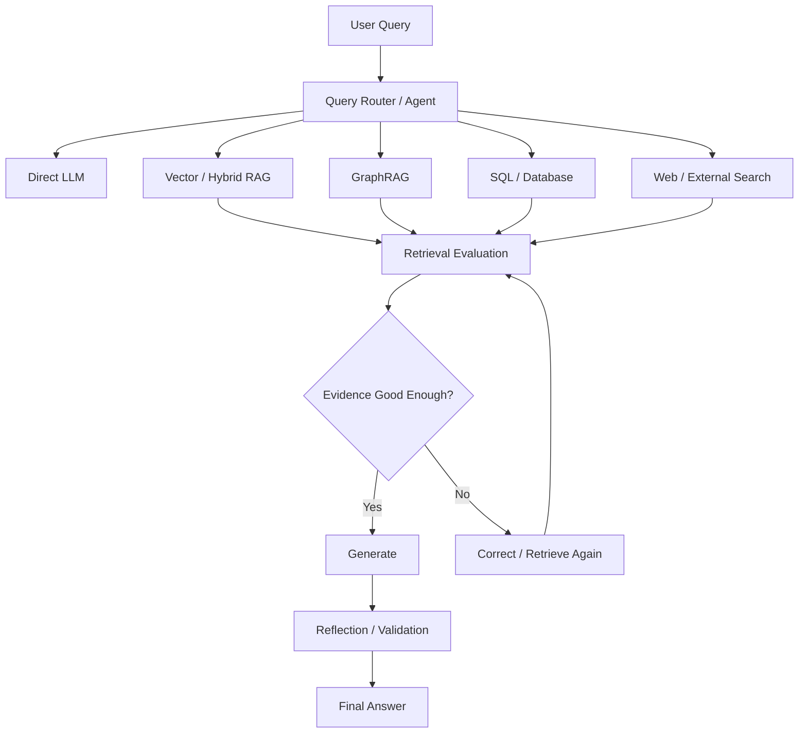
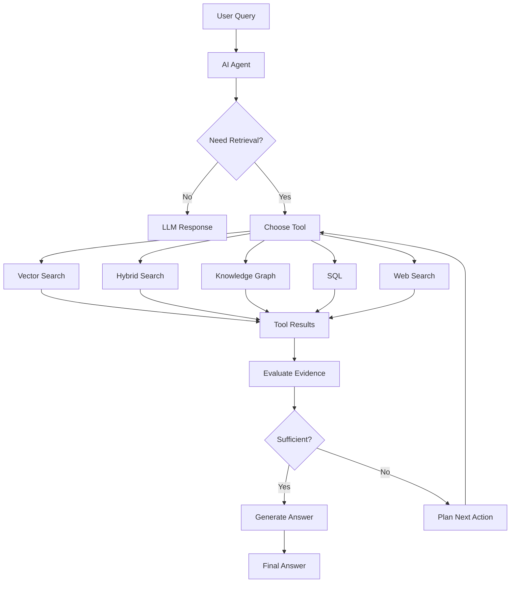
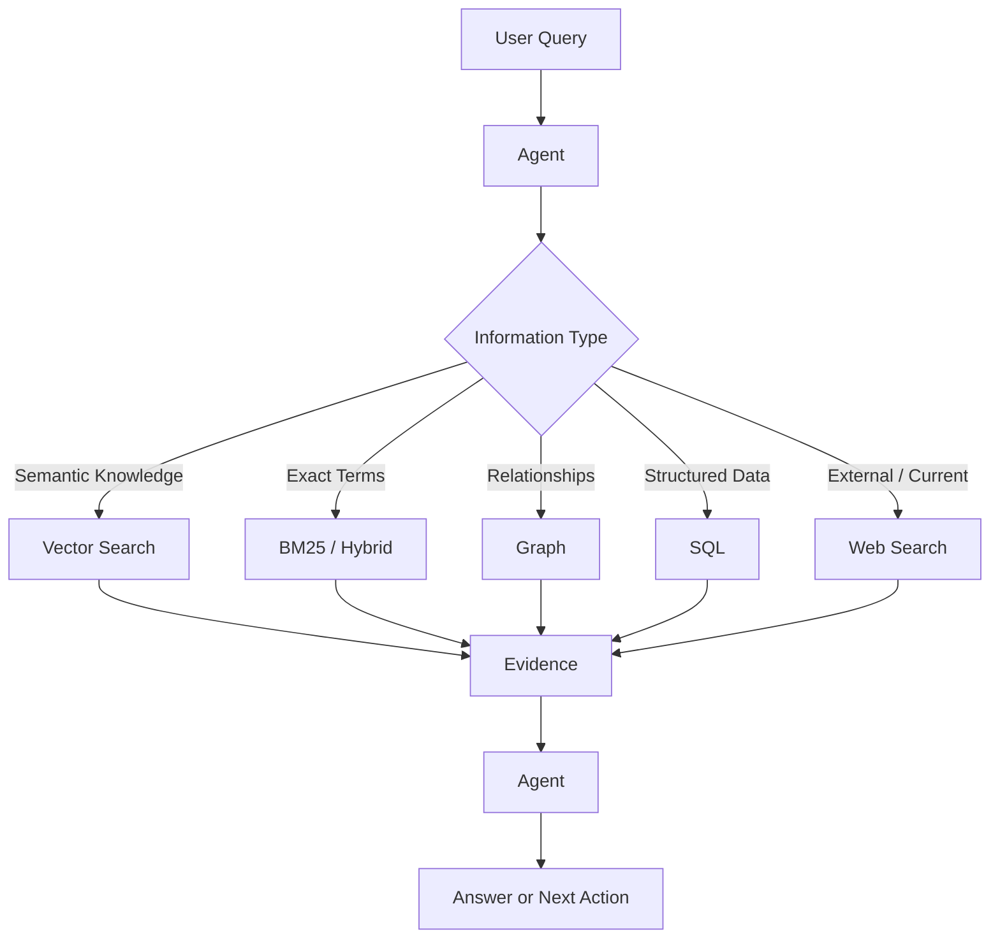
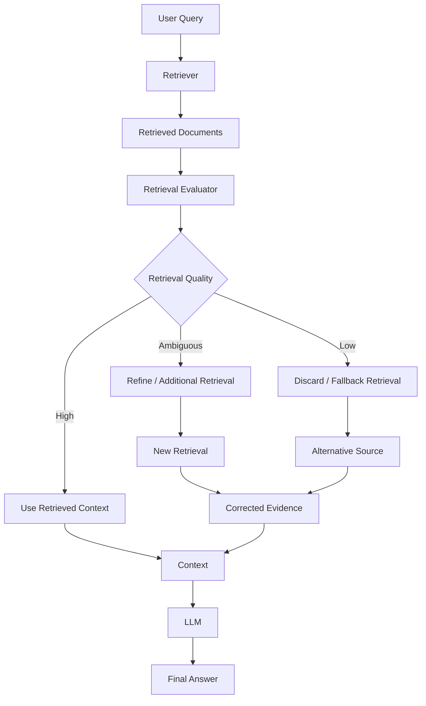
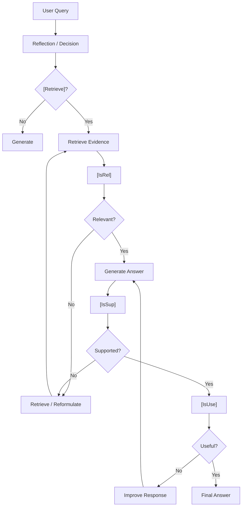
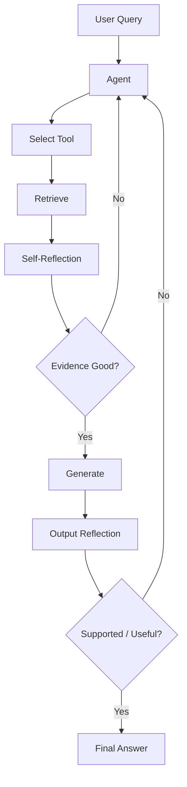
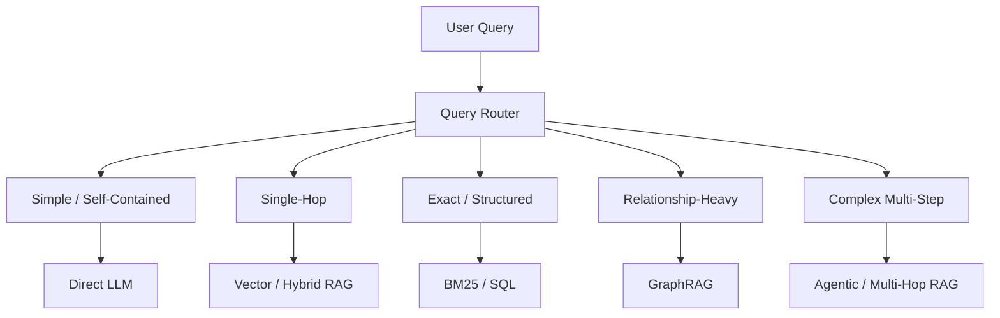
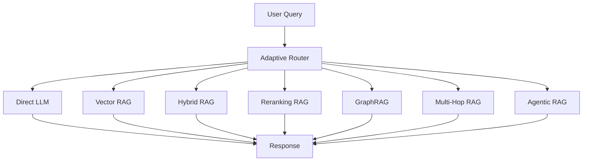
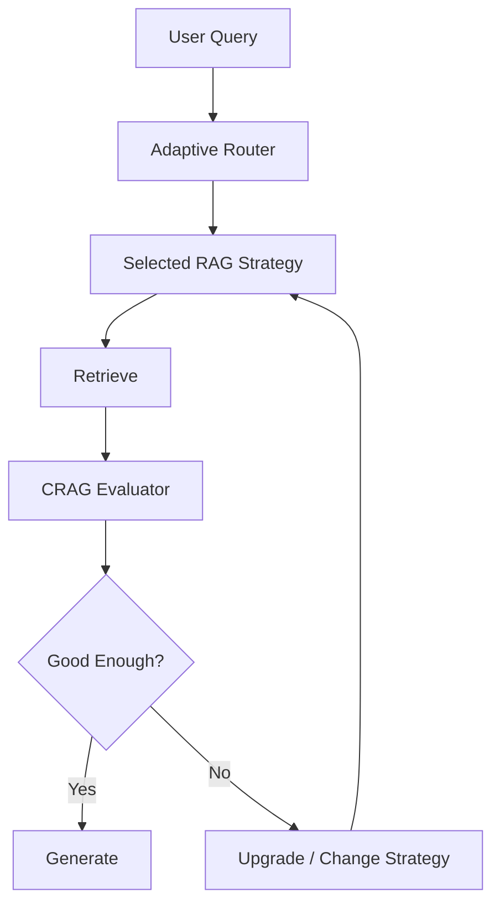
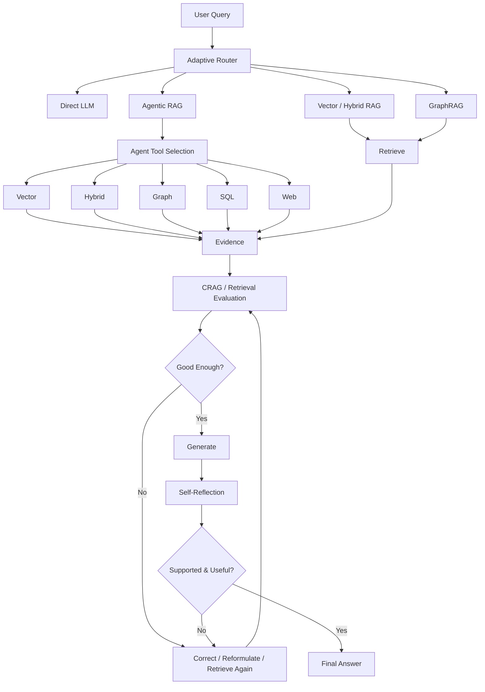

# Phase 7: Agentic, Self-Reflective & Dynamic RAG

## 📌 Overview

**Phase 7** moves from fixed RAG pipelines toward **dynamic retrieval systems**.

Traditional RAG often follows a predetermined pipeline:

```text
Query
  ↓
Retrieve
  ↓
Generate
```

But real-world queries vary significantly.

A simple question may need no retrieval at all, while a complex enterprise question may require:

* Multiple retrieval steps
* Different data sources
* Query reformulation
* Graph traversal
* SQL queries
* Retrieval evaluation
* Additional evidence
* Final-answer verification

Phase 7 introduces four important architectures:

1. **Agentic RAG** — an agent dynamically controls retrieval and tools.
2. **Corrective RAG (CRAG)** — evaluates retrieval quality and performs correction.
3. **Self-RAG** — uses reflection to decide when to retrieve and evaluate evidence/output.
4. **Adaptive RAG** — routes queries to different RAG strategies based on their characteristics.

The overall idea is:



---

# 1. Agentic RAG

## 📌 What is Agentic RAG?

**Agentic RAG** gives an AI agent control over the retrieval process instead of forcing every query through the same fixed pipeline.

The agent can decide:

* **Whether** retrieval is necessary
* **Which** tool to use
* **What** query to send
* **How many** times to retrieve
* **Whether** more evidence is required
* **When** to stop

Possible tools include:

```text
Vector Database
BM25 / Search Engine
Hybrid Search
SQL Database
Knowledge Graph
Web Search
Internal APIs
```

---

# 2. Traditional RAG vs Agentic RAG

### Traditional RAG

```text id="traditionalrag"
User Query
    ↓
Retriever
    ↓
Top-K Documents
    ↓
LLM
    ↓
Answer
```

The retrieval path is mostly predetermined.

### Agentic RAG

```text id="agenticrag"
User Query
    ↓
Agent
    ↓
Decide what to do
    ↓
Tool / Retriever
    ↓
Evaluate result
    ↓
Decide next action
    ↓
More tools if necessary
    ↓
Final Answer
```

The retrieval path is dynamic.

---

# 3. Agentic RAG Architecture



---

# 4. Example: Agentic RAG

User asks:

> "Which customers purchased Product X last year and what was their total spending?"

The agent might reason about the required data sources:

```text id="agentexample"
Customer information → SQL
Product information → Vector Search
Purchase records → SQL
```

Possible execution:

```text id="agentsteps"
Step 1:
Search product documentation.

Step 2:
Identify Product X.

Step 3:
Query SQL for customers who purchased Product X.

Step 4:
Calculate total spending.

Step 5:
Verify results.

Step 6:
Generate answer.
```

The important point is that the agent is **orchestrating multiple information sources**.

---

# 5. Agentic RAG Is More Than Multi-Hop

Multi-Hop RAG primarily describes:

> **Sequential retrieval where later steps depend on earlier results.**

Agentic RAG is broader.

An agent can decide:

```text id="agentvs"
Should I retrieve?
Which tool?
Should I use SQL?
Should I use the graph?
Should I search again?
Should I stop?
```

Therefore:

```text id="relationship"
Multi-Hop RAG
     ↓
Sequential retrieval pattern

Agentic RAG
     ↓
Dynamic decision + tool orchestration
```

An Agentic RAG system can **perform Multi-Hop retrieval**, but Multi-Hop RAG does not necessarily require an agent.

---

# 6. Agentic RAG Tool Selection

A production agent may expose tools such as:

```text id="tools"
search_vector(query)
search_hybrid(query)
query_graph(cypher)
query_database(sql)
search_web(query)
```

The agent chooses among them based on the query.

Example:



---

# 7. Agentic RAG Stopping Conditions

A major problem with agentic systems is uncontrolled loops.

For example:

```text id="loop"
Retrieve
  ↓
Search Again
  ↓
Search Again
  ↓
Search Again
  ↓
...
```

Production systems should enforce limits such as:

```text id="agentlimits"
Maximum tool calls
Maximum retrieval iterations
Maximum execution time
Maximum token budget
Maximum hops
Maximum cost
```

The exact limits should depend on the application.

---

# 8. Corrective RAG (CRAG)

## 📌 What is CRAG?

**Corrective RAG** introduces an evaluation step after retrieval.

Instead of blindly trusting the retrieved documents:

```text id="normalrag"
Query
 ↓
Retrieve
 ↓
Generate
```

CRAG asks:

> **"Are these retrieval results good enough to answer the question?"**

```text id="cragbasic"
Query
 ↓
Retrieve
 ↓
Evaluate Retrieval
 ↓
Correct if necessary
 ↓
Generate
```

---

# 9. CRAG Architecture



---

# 10. CRAG Decision Flow

The evaluator can conceptually classify retrieval into:

### Correct / High Quality

```text id="cragcorrect"
Retrieved documents are relevant
        ↓
Use the evidence
        ↓
Generate
```

### Ambiguous

```text id="cragambiguous"
Evidence may be incomplete
        ↓
Refine query / retrieve additional evidence
        ↓
Evaluate again
```

### Incorrect / Low Quality

```text id="cragincorrect"
Retrieved documents are not useful
        ↓
Discard or reduce reliance
        ↓
Try another retrieval source
```

---

# 11. Fallback Retrieval

A common CRAG implementation uses another search source as a fallback.

For example:

```text id="fallback"
Internal Vector Search
        ↓
Poor Retrieval
        ↓
Fallback Search
        ↓
External Web Search
```

However, **web search is not required**.

The fallback could also be:

* BM25
* Hybrid Search
* Another internal index
* Knowledge Graph
* SQL database
* Enterprise search API
* Another document collection

Therefore:

> **CRAG is about retrieval correction, not specifically web search.**

---

# 12. CRAG vs Reranking

These are often confused.

### Reranking

Asks:

> **"Which retrieved documents are most relevant?"**

```text id="rerank"
100 candidates
     ↓
Reranker
     ↓
Top 10
```

### CRAG

Asks:

> **"Are the retrieved results good enough at all?"**

```text id="crag"
Retrieved Results
      ↓
Quality Evaluation
      ↓
Good → Continue
Bad → Correct / Retrieve Again
```

They can be combined:

```text id="rerankcrag"
Retrieve
  ↓
Rerank
  ↓
Evaluate Retrieval
  ↓
Correct if necessary
  ↓
Generate
```

---

# 13. Self-RAG

## 📌 What is Self-RAG?

**Self-RAG (Self-Reflective RAG)** introduces explicit reflection into the retrieval and generation process.

The system can evaluate:

* Whether retrieval is necessary
* Whether retrieved evidence is relevant
* Whether the generated answer is supported
* Whether the answer is useful

The original Self-RAG research uses **reflection tokens** and a model trained to use them.

Common conceptual reflection signals include:

```text id="reflectiontokens"
[Retrieve]
[IsRel]
[IsSup]
[IsUse]
```

---

# 14. Self-RAG Reflection Tokens

## `[Retrieve]`

Determines whether retrieval should be performed.

Conceptually:

```text id="retrieve"
[Retrieve] → Yes
[Retrieve] → No
[Retrieve] → Continue
```

---

## `[IsRel]`

Evaluates retrieved evidence.

Question:

> **"Is this passage relevant to the user's question?"**

```text id="isrel"
Query
 +
Retrieved Passage
       ↓
[IsRel]
       ↓
Relevant / Not Relevant
```

---

## `[IsSup]`

Evaluates whether generated claims are supported by retrieved evidence.

Question:

> **"Does the evidence support this claim?"**

```text id="issup"
Generated Claim
      +
Retrieved Evidence
      ↓
[IsSup]
      ↓
Supported / Unsupported
```

This is useful for grounding evaluation, but it should **not be treated as a perfect hallucination detector**.

---

## `[IsUse]`

Evaluates the usefulness of the response.

Question:

> **"Does this answer actually help the user?"**

This can consider factors such as:

* Relevance
* Completeness
* Directness
* Usefulness

---

# 15. Self-RAG Architecture



---

# 16. Self-RAG vs CRAG

Both systems evaluate retrieval, but their focus differs.

| Feature               | CRAG                | Self-RAG                       |
| --------------------- | ------------------- | ------------------------------ |
| Retrieval evaluation  | Yes                 | Yes                            |
| Retrieval correction  | Strong focus        | Yes                            |
| Generation reflection | Not central         | Strong focus                   |
| Evidence relevance    | Yes                 | Yes                            |
| Output support        | Possible            | Core concept                   |
| Explicit reflection   | Not required        | Central                        |
| Original mechanism    | Retrieval evaluator | Trained reflection-token model |

Mental model:

> **CRAG:** "Are my retrieved documents good enough?"

> **Self-RAG:** "Should I retrieve, is the evidence relevant, is my answer supported, and is it useful?"

---

# 17. Self-RAG vs Agentic RAG

These architectures can also overlap.

### Agentic RAG

Focuses on:

> **Decision-making and tool orchestration.**

```text id="agenticfocus"
What should I do next?
```

### Self-RAG

Focuses on:

> **Retrieval and generation reflection.**

```text id="selfragfocus"
Is my evidence good?
Is my answer supported?
```

A system can use both:



---

# 18. Adaptive RAG

## 📌 What is Adaptive RAG?

**Adaptive RAG** dynamically chooses the appropriate retrieval strategy for each query.

Instead of using the same expensive pipeline for every question:

```text id="fixedrag"
Every Query
    ↓
Agentic + Graph + Hybrid + Reranking
```

Adaptive RAG asks:

> **"What is the simplest retrieval strategy that can reliably answer this query?"**

---

# 19. Adaptive Routing

A lightweight router/classifier can inspect the query.



The categories above are examples, not rigid universal rules.

---

# 20. Simple Query

Example:

> "What is JavaScript?"

If the application's requirements allow the model to answer from its existing knowledge:

```text id="simple"
Query
 ↓
Router
 ↓
Direct LLM
 ↓
Answer
```

No retrieval may be necessary.

---

# 21. Single-Hop Query

Example:

> "What is our company's vacation policy?"

The router might choose:

```text id="singlehop"
Query
 ↓
Router
 ↓
Vector / Hybrid RAG
 ↓
Relevant Documents
 ↓
LLM
```

---

# 22. Relationship-Heavy Query

Example:

> "Which startups were acquired by Company A and later developed Product X?"

The router could choose:

```text id="relationship"
Query
 ↓
Router
 ↓
GraphRAG
 ↓
Graph Traversal
 ↓
Supporting Documents
 ↓
LLM
```

---

# 23. Complex Multi-Step Query

Example:

> "Find the company that acquired Startup X, determine its 2024 revenue, compare it with the acquirer's 2023 revenue, and explain the change."

This may require:

```text id="complex"
Query
 ↓
Router
 ↓
Agentic / Multi-Hop RAG
 ↓
Multiple retrieval steps
 ↓
Evidence validation
 ↓
Synthesis
```

---

# 24. Query Complexity ≠ Retrieval Necessity

A very important distinction:

A query can be complex but still answerable from the current conversation.

A simple query can require retrieval because it asks for private enterprise data.

Therefore the router should consider more than just:

```text
"How complicated is the question?"
```

Useful signals can include:

```text id="routersignals"
Query complexity
Intent
Required data source
Need for private knowledge
Need for current information
Relationship requirements
Retrieval confidence
Conversation context
```

---

# 25. Adaptive RAG as an Orchestration Layer

Adaptive RAG does not replace the retrieval techniques from previous phases.

It **routes between them**.



---

# 26. Adaptive RAG + CRAG

The router can select a retrieval strategy and CRAG can then evaluate the result.



For example:

```text id="upgrade"
Simple Vector RAG
      ↓
Poor Retrieval
      ↓
Hybrid Search
      ↓
Still insufficient
      ↓
GraphRAG / Agentic RAG
```

This is one way to build a dynamic retrieval system.

---

# 27. Adaptive RAG + Agentic RAG

These concepts are related but have different responsibilities.

### Adaptive RAG

> **Choose the appropriate strategy.**

### Agentic RAG

> **Dynamically execute and control a retrieval workflow.**

```text id="adaptiveagent"
Adaptive Router
      ↓
Agentic RAG
      ↓
Tool selection
      ↓
Retrieval
      ↓
Evaluation
      ↓
More tools if needed
```

Adaptive RAG can therefore route complex queries into an Agentic RAG workflow.

---

# 28. Complete Phase 7 Architecture



---

# 29. How Phase 7 Techniques Fit Together

These four techniques operate at different levels.

| Technique        | Primary Responsibility                    |
| ---------------- | ----------------------------------------- |
| **Agentic RAG**  | Dynamic reasoning + tool orchestration    |
| **CRAG**         | Retrieval quality evaluation + correction |
| **Self-RAG**     | Retrieval and generation reflection       |
| **Adaptive RAG** | Strategy selection / routing              |

They are **complementary**, not mutually exclusive.

---

# 30. Example Production Flow

Consider:

> "Which product developed by a startup acquired by Company A had the highest revenue in 2025?"

A sophisticated system could perform:

```text id="prodexample"
1. Adaptive Router
        ↓
2. Detect complex relationship query
        ↓
3. Route to Agentic / GraphRAG
        ↓
4. Graph traversal
        ↓
5. Identify candidate products
        ↓
6. SQL / document retrieval for revenue
        ↓
7. Reranking
        ↓
8. CRAG evaluates evidence
        ↓
9. Additional retrieval if needed
        ↓
10. Generate answer
        ↓
11. Self-check support
        ↓
12. Final response
```

This illustrates how the techniques learned throughout the repository can form one system.

---

# 31. Phase 7 Architecture Evolution

The RAG architecture has now evolved considerably.

### Basic RAG

```text id="evolution1"
Retrieve → Generate
```

### Hybrid RAG

```text id="evolution2"
Dense + Sparse → Generate
```

### Advanced RAG

```text id="evolution3"
Transform → Retrieve → Rerank → Generate
```

### GraphRAG

```text id="evolution4"
Vector + Graph → Generate
```

### Agentic RAG

```text id="evolution5"
Agent → Tools → Retrieve → Evaluate → Iterate
```

### Dynamic RAG

```text id="evolution6"
Query
  ↓
Route
  ↓
Choose Strategy
  ↓
Retrieve
  ↓
Evaluate
  ↓
Reflect
  ↓
Generate
```

---

# ⚖️ Tradeoffs

| Architecture    | Strength                                 | Cost / Risk                               |
| --------------- | ---------------------------------------- | ----------------------------------------- |
| Agentic RAG     | Flexible tool orchestration              | High latency, cost, complexity            |
| CRAG            | Prevents blindly trusting poor retrieval | Requires reliable evaluation              |
| Self-RAG        | Adds retrieval/output reflection         | Reflection adds cost and can be imperfect |
| Adaptive RAG    | Uses simpler strategy when possible      | Router can misclassify                    |
| Combined System | Highly flexible                          | Significant engineering complexity        |

---

# 🚨 Common Failure Modes

## Agentic RAG

* Tool-selection errors
* Infinite or excessive loops
* Unnecessary tool calls
* High latency
* High token cost
* Incorrect intermediate reasoning

Use strict execution limits and enforce authorization inside every tool.

---

## CRAG

* Evaluator incorrectly accepts poor evidence.
* Evaluator incorrectly rejects useful evidence.
* Thresholds are poorly calibrated.
* Fallback search introduces lower-quality sources.

A retrieval evaluator is not automatically a source-of-truth detector.

---

## Self-RAG

* Incorrect self-evaluation
* Reflection loops
* Over-retrieval
* Under-retrieval
* Higher inference cost
* Unsupported claims incorrectly judged as supported

Reflection is useful, but it is **not a perfect hallucination detector**.

---

## Adaptive RAG

* Router chooses the wrong strategy.
* Complex query gets under-routed to a weak pipeline.
* Simple query gets over-routed to an expensive pipeline.
* Router itself becomes a latency bottleneck.

Therefore routing decisions should be evaluated just like retrieval quality.

---

# 32. Evaluation for Dynamic RAG

Traditional RAG evaluation asks:

```text
"Did retrieval find the right documents?"
```

Dynamic RAG needs additional metrics.

### Routing

```text
Routing Accuracy
Correct Strategy Selection
Over-routing Rate
Under-routing Rate
```

### Agent

```text
Tool Selection Accuracy
Task Completion Rate
Average Tool Calls
Loop Rate
```

### Retrieval

```text
Recall@K
Precision@K
MRR
NDCG
```

### Generation

```text
Groundedness
Answer Relevance
Correctness
```

### Operations

```text
Latency
Token Usage
Cost
Failure Rate
```

---

# 🧠 Key Mental Model

Remember Phase 7 using four questions:

### Agentic RAG

> **"What should I do next?"**

```text
Plan → Tool → Observe → Decide → Repeat
```

### CRAG

> **"Are my retrieved results good enough?"**

```text
Retrieve → Evaluate → Correct → Retrieve Again
```

### Self-RAG

> **"Should I retrieve, is the evidence relevant, and is my answer supported and useful?"**

```text
Decide → Retrieve → Reflect → Generate → Reflect
```

### Adaptive RAG

> **"Which RAG strategy should I use for this query?"**

```text
Query → Route → Appropriate Strategy
```

---

# 📌 Key Takeaways

1. **Agentic RAG gives an agent dynamic control over retrieval and tool usage.**
2. **Agentic RAG can choose between vector search, hybrid search, graphs, SQL, APIs, web search, and other tools.**
3. **Multi-Hop can exist inside Agentic RAG, but Agentic RAG is broader than Multi-Hop retrieval.**
4. **CRAG evaluates retrieval quality before generation and can trigger correction or alternative retrieval.**
5. **CRAG is not synonymous with web search—the fallback can be any appropriate retrieval source.**
6. **Reranking chooses the best candidates; CRAG evaluates whether the candidate set is good enough.**
7. **Self-RAG introduces reflection into retrieval and generation.**
8. **The original Self-RAG approach uses trained reflection-token behavior; a prompt-based implementation is better described as Self-RAG-inspired.**
9. **`[Retrieve]`, `[IsRel]`, `[IsSup]`, and `[IsUse]` represent important reflection concepts.**
10. **Self-reflection is useful but is not a perfect hallucination or truth detector.**
11. **Adaptive RAG routes different queries to different retrieval strategies.**
12. **Query complexity alone should not determine whether retrieval is necessary.**
13. **Adaptive RAG, CRAG, Self-RAG, and Agentic RAG can be combined.**
14. **Dynamic RAG systems require evaluation of routing, retrieval, tool usage, answer quality, latency, and cost.**
15. **Production agentic systems need strict limits on hops, tool calls, tokens, time, and cost.**
16. **Authorization must be enforced by the underlying tools and data sources, not delegated solely to the agent.**

> **Phase 5:** Connect evidence and preserve context
> **Phase 6:** Introduce structured relationships with Knowledge Graphs
> **Phase 7:** Make RAG dynamic, evaluative, reflective, and tool-aware
>
> **Route → Plan → Retrieve → Evaluate → Correct → Reflect → Generate**
