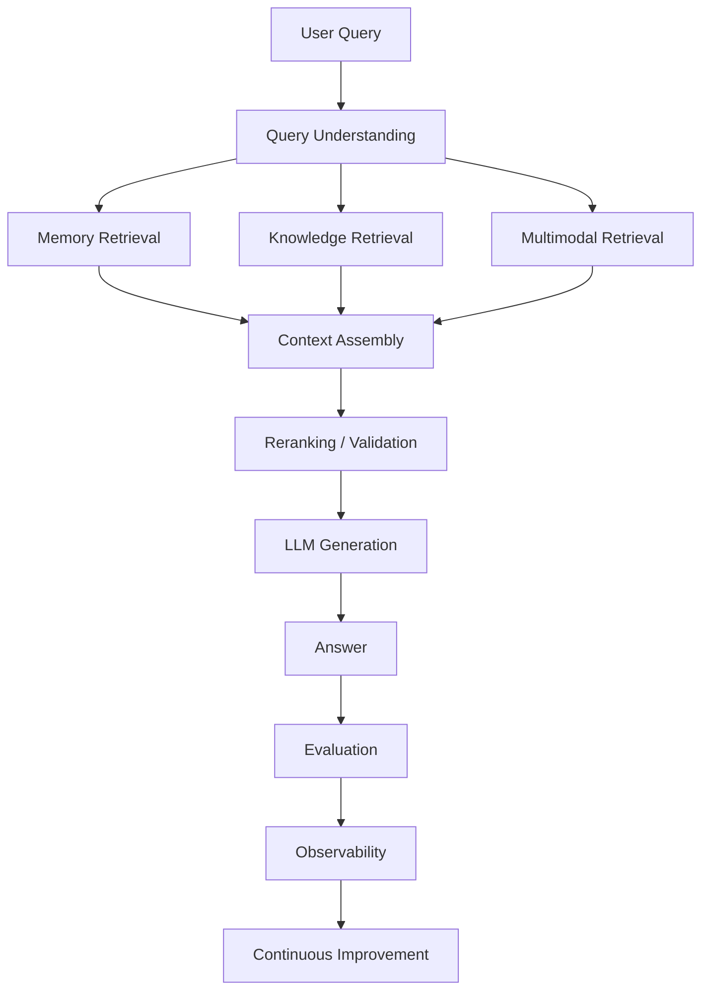
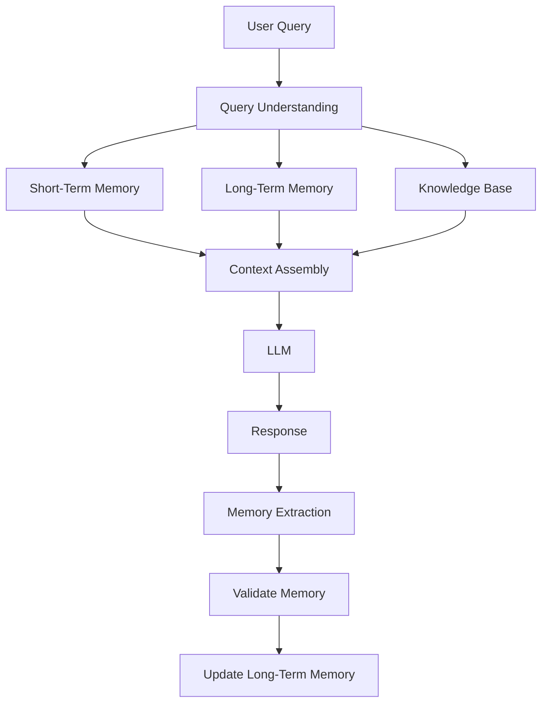
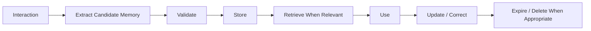
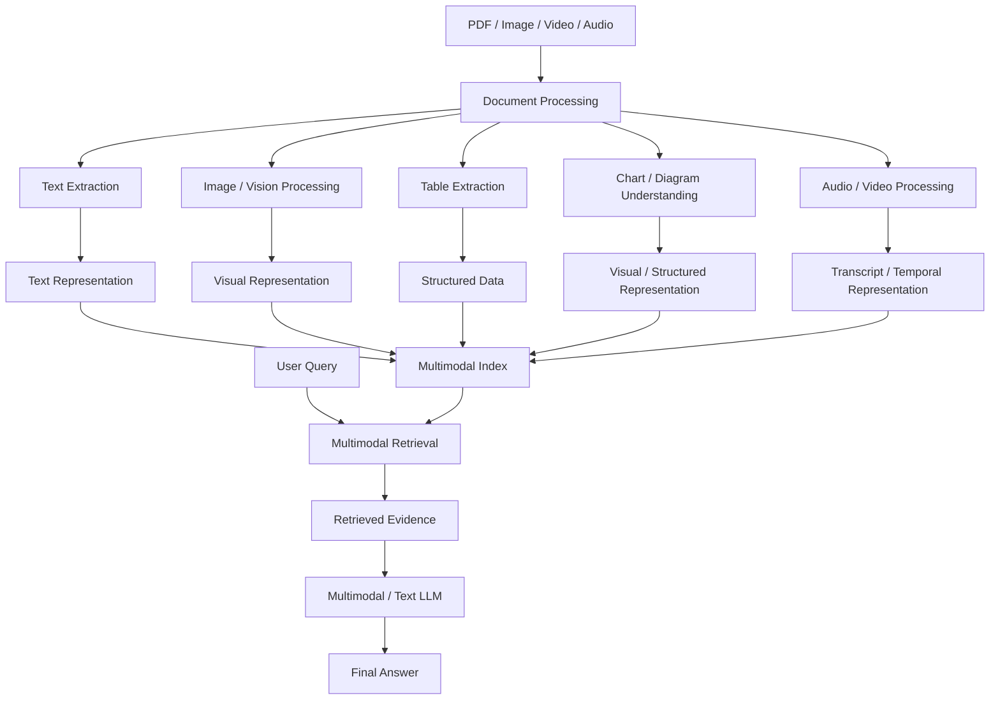
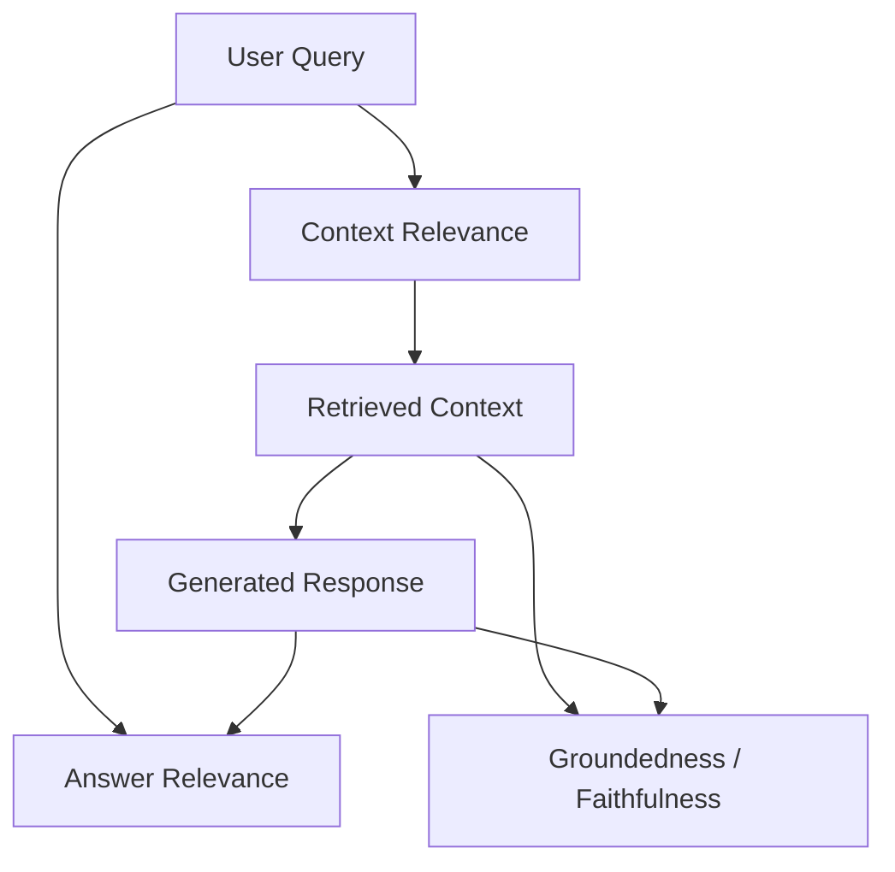
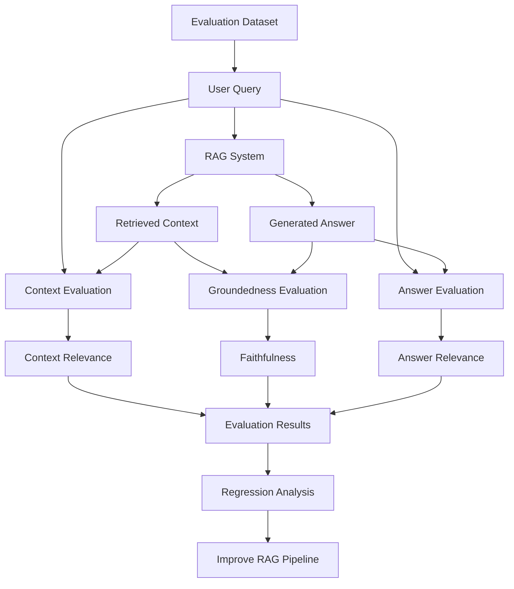
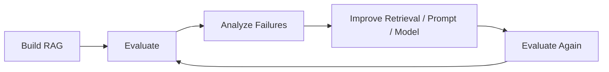
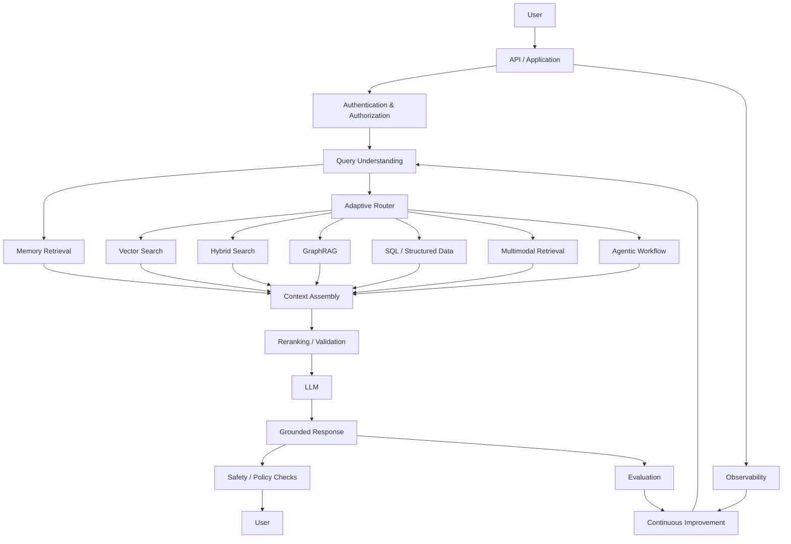
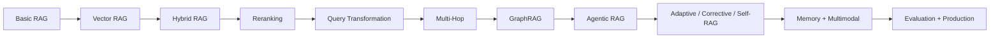

# Phase 8: Production RAG, Memory, Multimodal & Evaluation

## 📌 Overview

**Phase 8** brings the RAG journey from individual retrieval techniques toward **production-ready systems**.

By this stage, RAG is no longer just:

```text
Query → Retrieve → Generate
```

A production RAG system may need to handle:

* Persistent user memory
* Conversation context
* Images and scanned documents
* Tables and charts
* Retrieval evaluation
* Answer evaluation
* Security and authorization
* Observability
* Cost and latency
* Continuous quality improvement

The overall production mental model becomes:



---

# 1. Memory-Augmented RAG

## 📌 Why Memory?

Normal RAG retrieves knowledge from external documents.

But conversational applications also need to remember information about the **interaction itself**.

For example:

> User: "I prefer concise explanations."

Later:

> User: "Explain GraphRAG."

A memory-enabled system can use the stored preference to produce a more concise response.

This introduces an important distinction:

```text
Knowledge
   ↓
What the system knows from documents

Memory
   ↓
What the system has learned or retained about interactions
```

Memory should therefore not simply be treated as another collection of documents.

---

# 2. Short-Term vs Long-Term Memory

A practical memory architecture can separate different types of state.

### Short-Term / Working Memory

Contains information relevant to the current interaction.

Examples:

```text
Current conversation
Recent messages
Current task
Intermediate reasoning state
Recently retrieved context
```

This memory is usually temporary.

---

### Long-Term Memory

Contains information intended to persist across sessions.

Examples:

```text
User preferences
Previously confirmed facts
Important interaction history
Persistent application state
```

Long-term memory should be stored deliberately rather than automatically treating every conversation detail as permanent truth.

---

# 3. Memory-Augmented RAG Architecture



---

# 4. Memory Is Not Just a Vector Database

A common misconception is:

> "Memory = embeddings stored in a vector database."

Vector search can be useful for semantic memory retrieval, but production memory can use several storage models.

| Memory Type            | Possible Storage          |
| ---------------------- | ------------------------- |
| Semantic memory        | Vector DB                 |
| User profile           | Relational / document DB  |
| Session state          | Key-value / cache         |
| Conversation history   | Document / relational DB  |
| Relationships          | Graph DB                  |
| Structured preferences | Relational DB / key-value |

The storage mechanism should match the type of memory.

---

# 5. Memory Lifecycle

A useful mental model is:



The important word is **candidate**.

A model should not blindly convert every statement into permanent memory.

---

# 6. Memory Types

A useful conceptual classification is:

### Working Memory

What is happening **right now**.

```text
Current task
Current conversation
Current retrieved evidence
```

### Episodic Memory

What **happened**.

```text
Previous interaction
Past task
Previous decision
```

### Semantic Memory

What the system has learned as a relatively stable fact.

```text
User prefers TypeScript.
Project uses PostgreSQL.
```

### Structured State

Explicit application data.

```text
subscription_plan
language
theme
project_id
permissions
```

These categories may overlap in implementation, but separating them conceptually makes memory systems easier to design.

---

# 7. Memory Retrieval

Memory should generally be retrieved based on relevance.

```text id="memoryretrieval"
User Query
    ↓
Memory Retrieval
    ↓
Relevant Memories
    ↓
Current Knowledge Retrieval
    ↓
Context Assembly
    ↓
LLM
```

Avoid dumping the entire memory store into the prompt.

Otherwise:

```text
Too Much Memory
      ↓
Context Overload
      ↓
Higher Cost
      ↓
Lower Signal-to-Noise
```

---

# 8. Memory Safety & Correctness

Memory creates new failure modes.

For example:

```text
Old Memory:
"User uses React."

Current reality:
"User migrated the project to Vue."
```

If the old memory is treated as permanent truth, the system may produce incorrect responses.

Production memory therefore needs:

* Conflict resolution
* Update mechanisms
* Expiration
* User controls
* Tenant isolation
* Access control
* Provenance where appropriate

Memory should be treated as **state with lifecycle**, not immutable truth.

---

# 9. Multimodal RAG

## 📌 What is Multimodal RAG?

Traditional RAG mainly operates on text.

Real-world documents can contain:

```text
Text
Images
Scanned pages
Tables
Charts
Diagrams
Screenshots
Forms
Audio
Video
```

**Multimodal RAG** allows these different modalities to participate in retrieval and generation.

---

# 10. Example: Financial Report

Suppose a financial PDF contains:

* Written revenue discussion
* A revenue table
* A line chart
* A company logo
* Scanned footnotes

A text-only extraction pipeline may lose important information.

A multimodal pipeline can process the page visually and/or extract structured information from it.



---

# 11. Multimodal Retrieval Strategies

There is no single implementation.

### 1. Multimodal Embeddings

Images and text can be represented in a shared or compatible embedding space.

```text
Image → Embedding
Text  → Embedding
          ↓
      Similarity Search
```

This can be useful when the query and content need cross-modal semantic matching.

---

### 2. Visual-to-Text Representation

A vision model can describe an image or page:

```text
PDF Page
   ↓
Vision Model
   ↓
Description / Summary
   ↓
Text Embedding
   ↓
Vector Search
```

This is often easier to implement, but the generated description is a **representation of the visual content**, not the visual content itself.

---

### 3. Native Visual Retrieval

Some systems preserve the actual page/image and retrieve it directly.

```text
Query
 ↓
Visual Retrieval
 ↓
Original Page / Image
 ↓
Vision-capable Model
```

This can preserve visual details that a text summary might omit.

---

### 4. Structured Extraction

For tables, forms, and other structured content, extraction into structured representations can be useful.

For example:

```text
Financial Table
      ↓
Table Extraction
      ↓
JSON / SQL-like representation
      ↓
Structured Retrieval
```

This is particularly useful when users ask exact numerical questions.

---

# 12. Tables & Charts Need Special Handling

Consider:

> "What was the revenue in Q3?"

If the information exists only inside a chart or table, blindly converting the page into a text summary may introduce errors.

A stronger pipeline can preserve:

```text
Original visual
+
Structured extraction
+
Source page reference
```

Then the final answer can be grounded against the original evidence.

---

# 13. Multimodal RAG Security

Images and documents should not automatically be considered trusted instructions.

For example, an uploaded screenshot could contain text such as:

```text
Ignore all previous instructions...
```

That content should be treated as **untrusted document content**, not as system instructions.

The same principle applies to:

* PDFs
* Screenshots
* OCR output
* Web pages
* Images
* Retrieved documents

Multimodal RAG therefore inherits the prompt-injection and data-security concerns of normal RAG, while adding additional input modalities.

---

# 14. RAG Evaluation

A production RAG system needs more than:

> "The answer looks good."

We need to evaluate different parts of the pipeline independently.

A useful conceptual framework is the **RAG Triad**:



The three core dimensions are:

1. **Context Relevance**
2. **Groundedness / Faithfulness**
3. **Answer Relevance**

---

# 15. Context Relevance

### Question

> **Did retrieval find useful information for the query?**

Example:

```text
Query:
"What is our refund policy?"

Retrieved:
1. Refund policy → Relevant
2. Shipping policy → Mostly irrelevant
3. Company history → Irrelevant
```

Poor context relevance means the generator is being given the wrong evidence.

This is fundamentally a **retrieval problem**.

Useful retrieval metrics include:

```text
Recall@K
Precision@K
MRR
NDCG
```

---

# 16. Groundedness / Faithfulness

### Question

> **Are the claims in the generated answer supported by the retrieved evidence?**

Example:

```text
Retrieved Context:
"Refunds are available within 30 days."

Generated:
"Customers can request a refund within 30 days."
```

Supported.

But:

```text
Generated:
"Customers can request a refund within 30 days
and receive a full refund with no conditions."
```

If the second part is not supported by the retrieved evidence, the answer is not fully grounded.

---

# 17. Groundedness Does Not Mean Truth

This distinction is extremely important.

Suppose the retrieved document contains:

```text
"Company X was founded in 2020."
```

The model answers:

> "Company X was founded in 2020."

The answer is **grounded in the retrieved context**.

But if the document itself is wrong, the answer can still be factually wrong.

Therefore:

```text
Groundedness
    ≠
Truthfulness of the source
```

Groundedness asks whether the answer is supported by the evidence provided to the model.

Source quality and factual correctness are separate evaluation concerns.

---

# 18. Answer Relevance

### Question

> **Does the generated answer actually answer the user's question?**

Example:

```text
Question:
"What is the refund period?"

Good:
"Customers can request refunds within 30 days."

Poor:
"Our company has a customer-friendly refund policy..."
```

The second response may discuss the topic but fail to directly answer the question.

---

# 19. The RAG Evaluation Pipeline



---

# 20. Evaluation Dataset

A serious RAG application should maintain an evaluation dataset.

Example:

```json
{
  "question": "What is the refund period?",
  "expected_answer": "30 days",
  "relevant_documents": [
    "refund-policy.pdf"
  ]
}
```

A dataset can contain:

```text
Questions
Expected answers
Relevant documents
Expected citations
Difficulty
Query category
```

This allows you to compare changes to the RAG pipeline.

---

# 21. Evaluation Frameworks

Several frameworks can help automate RAG evaluation.

### Ragas

Useful for evaluating RAG pipelines and metrics such as:

* Context relevance
* Faithfulness
* Answer relevance
* Retrieval quality

### TruLens

Provides evaluation and observability concepts around RAG applications, including the RAG triad.

### DeepEval

Provides LLM evaluation tooling and custom evaluation criteria for RAG and other LLM applications.

The frameworks are tools—not substitutes for a carefully designed evaluation dataset and application-specific correctness checks.

---

# 22. Evaluation Beyond the RAG Triad

The RAG Triad is useful, but production evaluation should be broader.

```text id="broadeval"
Retrieval
 ├── Recall@K
 ├── Precision@K
 ├── MRR
 └── NDCG

Generation
 ├── Groundedness
 ├── Answer Relevance
 └── Correctness

System
 ├── Latency
 ├── Cost
 ├── Failure Rate
 └── Token Usage

Security
 ├── Authorization
 ├── Prompt Injection Resistance
 └── Tenant Isolation
```

---

# 23. Evaluation as a Continuous Loop

Evaluation should not happen only once before deployment.



Every change can potentially affect:

```text
Retrieval quality
Answer quality
Latency
Cost
Security
```

Therefore evaluation should become part of the development lifecycle.

---

# 24. Production RAG Architecture

Putting the concepts from the entire repository together:



---

# 25. Production Concerns

A RAG system that works in a notebook is not automatically production-ready.

Important concerns include:

### Security

```text
Authentication
Authorization
Tenant isolation
PII protection
Prompt-injection defense
Document access control
```

### Reliability

```text
Timeouts
Retries
Fallbacks
Circuit breakers
Graceful degradation
```

### Performance

```text
Caching
Batching
Efficient retrieval
Parallel retrieval
Connection pooling
```

### Cost

```text
Embedding cost
LLM tokens
Reranking cost
Agent/tool calls
Storage
External search
```

### Observability

```text
Latency
Token usage
Retrieval results
Tool calls
Errors
Model responses
Evaluation scores
```

---

# 26. RAG Observability

You should be able to inspect a request such as:

```text
Request
  ↓
Query Rewrite
  ↓
Retriever
  ↓
Retrieved Documents
  ↓
Reranker
  ↓
Context
  ↓
LLM
  ↓
Answer
```

For agentic systems:

```text
Request
  ↓
Agent
  ↓
Tool 1
  ↓
Observation
  ↓
Tool 2
  ↓
Observation
  ↓
Final Answer
```

Without this trace, debugging poor answers becomes extremely difficult.

---

# 27. Cost-Aware RAG

Not every query needs the most expensive architecture.

A production system might use:

```text
Simple query
    ↓
Direct LLM

Normal knowledge query
    ↓
Vector / Hybrid RAG

Difficult query
    ↓
Reranking / Multi-Hop

Relationship-heavy query
    ↓
GraphRAG

Very complex task
    ↓
Agentic RAG
```

This connects directly with **Adaptive RAG from Phase 7**.

The goal is not:

> "Use the most advanced RAG possible."

The goal is:

> **"Use enough retrieval complexity to reliably solve the query."**

---

# 28. How Phase 8 Connects Everything

The repository has now evolved through multiple layers.



Each phase solves a different class of problem.

---

# ⚖️ Production RAG Tradeoffs

| Capability        | Benefit                             | Main Cost / Risk                     |
| ----------------- | ----------------------------------- | ------------------------------------ |
| Memory            | Personalized, stateful interactions | Stale/conflicting memory             |
| Multimodal RAG    | Handles richer documents            | More preprocessing and complexity    |
| Evaluation        | Detects quality problems            | Evaluation itself costs time/compute |
| Adaptive routing  | Efficient strategy selection        | Router mistakes                      |
| Agentic workflows | Flexible problem solving            | Latency, cost, loops                 |
| GraphRAG          | Strong relationship reasoning       | Graph construction complexity        |
| Reranking         | Better precision                    | Additional inference cost            |
| Hybrid Search     | Better lexical + semantic coverage  | More infrastructure                  |

---

# 🚨 Common Production Failure Modes

### Retrieval Failure

```text
Correct answer exists
        ↓
Retriever misses it
        ↓
LLM cannot access it
```

### Context Failure

```text
Relevant documents retrieved
        ↓
Too much irrelevant context
        ↓
Important evidence gets diluted
```

### Generation Failure

```text
Correct context
        ↓
LLM makes unsupported claim
```

### Memory Failure

```text
Outdated memory
        ↓
Incorrect personalization
```

### Multimodal Failure

```text
Table / chart
        ↓
Incorrect extraction
        ↓
Incorrect answer
```

### Evaluation Failure

```text
High evaluation score
        ↓
But evaluation dataset does not represent
real user queries
```

This is why evaluation datasets must continuously evolve with real failure cases.

---

# 🧠 Final Mental Model

At the end of the RAG learning journey, think of a production system as several independent layers:

```text
                ┌──────────────────────┐
                │       User Query     │
                └──────────┬───────────┘
                           ↓
                ┌──────────────────────┐
                │ Query Understanding  │
                └──────────┬───────────┘
                           ↓
                ┌──────────────────────┐
                │ Memory + Routing     │
                └──────────┬───────────┘
                           ↓
          ┌────────────────┴────────────────┐
          ↓                ↓                ↓
      Vector/Hybrid      Graph          Multimodal
          ↓                ↓                ↓
          └────────────────┬────────────────┘
                           ↓
                ┌──────────────────────┐
                │ Rerank / Validate    │
                └──────────┬───────────┘
                           ↓
                ┌──────────────────────┐
                │       Generate       │
                └──────────┬───────────┘
                           ↓
                ┌──────────────────────┐
                │ Guard / Evaluate     │
                └──────────┬───────────┘
                           ↓
                ┌──────────────────────┐
                │      Observe         │
                └──────────┬───────────┘
                           ↓
                ┌──────────────────────┐
                │    Improve / Iterate │
                └──────────────────────┘
```

The key idea is:

> **Production RAG is not one retrieval algorithm. It is an engineered system that combines retrieval, memory, multimodal processing, reasoning, evaluation, security, and observability.**

---

# 📌 Key Takeaways

1. **Memory-Augmented RAG adds persistent state to otherwise stateless RAG systems.**
2. **Short-term conversation context and long-term memory should be treated separately.**
3. **Memory is not synonymous with vector search; different memory types may require different storage systems.**
4. **Memory needs validation, update, expiration, access control, and conflict handling.**
5. **Multimodal RAG extends retrieval beyond text to images, tables, charts, scanned documents, audio, and video.**
6. **Visual-to-text conversion is useful, but a generated description is only a representation of the original visual.**
7. **Tables and charts may benefit from structured extraction and source validation.**
8. **Retrieved multimodal content must be treated as untrusted data, just like retrieved text.**
9. **Context Relevance asks whether retrieval found useful evidence.**
10. **Groundedness / Faithfulness asks whether generated claims are supported by retrieved evidence.**
11. **Answer Relevance asks whether the response actually answers the user's question.**
12. **Groundedness does not guarantee that the underlying source is factually true.**
13. **Ragas, TruLens, and DeepEval can help automate RAG evaluation, but evaluation datasets remain critical.**
14. **Production evaluation should cover retrieval, generation, routing, latency, cost, reliability, and security.**
15. **Observability is essential for debugging retrieval and generation failures.**
16. **Adaptive routing helps avoid using expensive RAG workflows for simple queries.**
17. **Production RAG should be continuously evaluated and improved rather than evaluated only once.**

> **Phase 7:** Make RAG dynamic, corrective, reflective, and agentic
> **Phase 8:** Make RAG stateful, multimodal, measurable, observable, and production-ready
>
> **Retrieve → Remember → Route → Rank → Validate → Generate → Evaluate → Observe → Improve**
