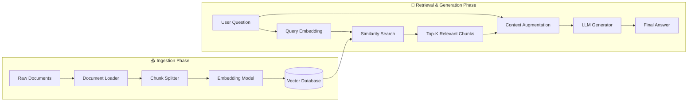
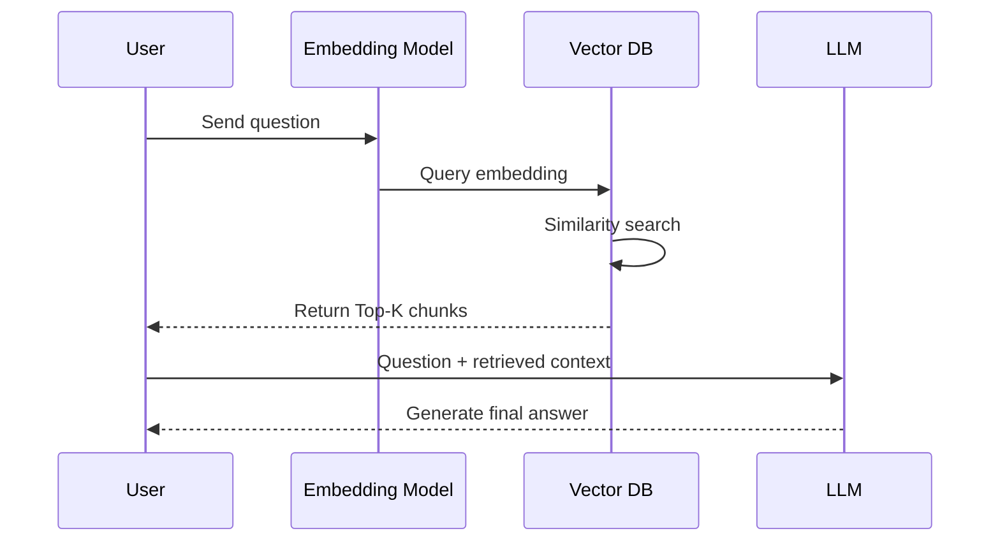
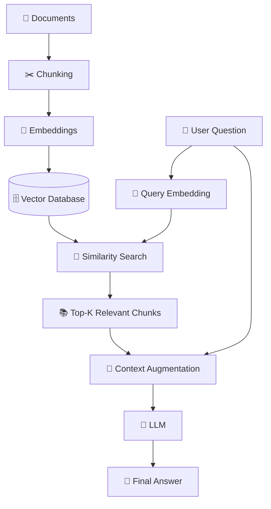

# 01 — Basic RAG (Naive RAG)

## 📌 Overview

**Basic RAG**, also known as **Naive RAG**, is the foundational pattern for Retrieval-Augmented Generation.

It connects a document ingestion pipeline to a vector store, converts the user's question into an embedding, retrieves the **Top-K most relevant chunks**, and provides those chunks to an LLM as context for generating the final answer.

---

## 🏗️ Architecture & Data Flow

Basic RAG consists of two main phases:

1. **Ingestion Phase** — prepares and indexes documents.
2. **Retrieval & Generation Phase** — retrieves relevant information and generates an answer.



### 🔄 Request Flow



---

## 🔑 Key Concepts

### 1. 📄 Document Loading

Extracting content from different data sources such as:

* PDF
* TXT
* Markdown
* HTML
* DOCX
* Web pages

```text
Raw Documents
      ↓
Document Loader
      ↓
Clean Text + Metadata
```

---

### 2. ✂️ Chunking

Large documents are split into smaller pieces called **chunks** so they can be embedded and retrieved efficiently.

Example:

```text
Large Document
      ↓
┌──────────────┐
│   Chunk 1    │
├──────────────┤
│   Chunk 2    │
├──────────────┤
│   Chunk 3    │
├──────────────┤
│      ...     │
└──────────────┘
```

Common parameters:

* Chunk size: `500 tokens`
* Chunk overlap: `50 tokens`

The optimal values depend on the document type and retrieval task.

---

### 3. 🧠 Embeddings

An **embedding model** converts text into a numerical vector representing its semantic meaning.

```text
"How does authentication work?"
                ↓
         Embedding Model
                ↓
    [0.021, -0.184, 0.723, ...]
```

Document chunks and user queries are embedded into the same vector space so their semantic similarity can be measured.

---

### 4. 🔎 Similarity Retrieval

When the user asks a question:

```text
User Question
      ↓
Query Embedding
      ↓
Vector Similarity Search
      ↓
Top-K Relevant Chunks
```

Common similarity measures include:

* **Cosine similarity**
* **Dot product**
* **Euclidean distance**

The retriever returns the most relevant chunks based on the selected similarity method.

---

### 5. 🧩 Context Augmentation

The retrieved chunks are added to the LLM input together with the user's question.

```text
System Instructions
        +
Retrieved Context
        +
User Question
        ↓
       LLM
        ↓
   Final Answer
```

This is called **context augmentation** or **prompt construction**.

> ⚠️ **Prompt injection** is a different concept. It refers to a security attack where untrusted input attempts to manipulate the model's instructions.

---

### 6. 🤖 Generation

The LLM uses the retrieved context to generate the final response.

The fundamental RAG principle is:

> **Retrieve relevant information first, then generate an answer using that information as context.**

---

## ⚖️ When to Use & Tradeoffs

### ✅ When to Use

Basic RAG works well when:

* Building a quick RAG prototype
* Working with small-to-medium document collections
* Documents are relatively homogeneous
* Questions can be answered from individual chunks
* You want a simple and understandable RAG architecture

### ⚠️ Tradeoffs & Limitations

Basic RAG can struggle with:

* Poor chunking
* Irrelevant retrieval results
* Missing exact keyword matches
* Ambiguous queries
* Questions requiring multiple documents
* Long-range relationships
* Context overload
* Outdated information
* Hallucinations when retrieval quality is poor

These limitations motivate more advanced approaches such as:

```text
Basic RAG
   ↓
Hybrid RAG
   ↓
Reranking
   ↓
Multi-Query RAG
   ↓
Multi-Hop RAG
   ↓
GraphRAG
   ↓
Agentic RAG
```

---

## 🔬 Basic RAG in One Diagram



### 🧠 Core Formula

At a high level:

```text
Documents
   ↓
Chunking
   ↓
Embeddings
   ↓
Vector Database

User Query
   ↓
Query Embedding
   ↓
Similarity Search
   ↓
Top-K Chunks
   ↓
Context + Query
   ↓
LLM
   ↓
Answer
```

**In short:**

> **Basic RAG = Retrieve relevant external context + Augment the prompt + Generate with an LLM.**
