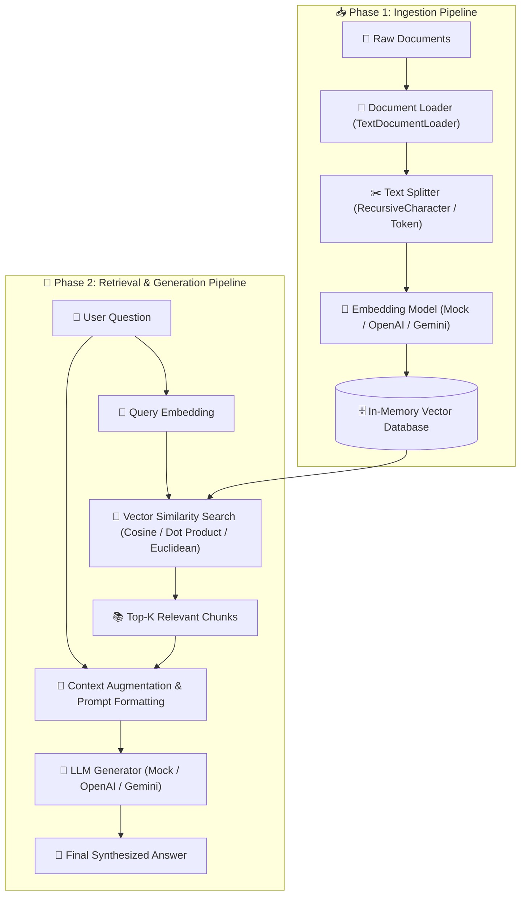

# 📘 Basic RAG (Naive RAG) — Complete Step-by-Step Implementation Guide

Welcome to the comprehensive implementation guide for **Basic RAG (Naive RAG)**.

This guide is designed as an end-to-end tutorial to help you understand, build, and master a production-grade Retrieval-Augmented Generation (RAG) engine from first principles using **TypeScript**.

All source code and tests discussed in this guide are located in [01-basic-rag/code](file:///home/aminul/development/rag-lab/01-basic-rag/code).

---

## 🏗️ Architecture & Data Flow

Basic RAG connects an external knowledge base to a Large Language Model (LLM) through two primary execution phases:



---

## 📚 Chapters Index

| Chapter | Title | Focus & Core Code Modules |
| :--- | :--- | :--- |
| **[Chapter 1](./01-domain-models-and-config.md)** | **Domain Models & System Config** | [schemas.ts](file:///home/aminul/development/rag-lab/01-basic-rag/code/src/schemas.ts), [config.ts](file:///home/aminul/development/rag-lab/01-basic-rag/code/src/config.ts), [index.ts](file:///home/aminul/development/rag-lab/01-basic-rag/code/src/index.ts), [package.json](file:///home/aminul/development/rag-lab/01-basic-rag/code/package.json), [tsconfig.json](file:///home/aminul/development/rag-lab/01-basic-rag/code/tsconfig.json), [jest.config.js](file:///home/aminul/development/rag-lab/01-basic-rag/code/jest.config.js), [.env.example](file:///home/aminul/development/rag-lab/01-basic-rag/code/.env.example) |
| **[Chapter 2](./02-document-loaders.md)** | **Document Loading Architecture** | [loaders/base.ts](file:///home/aminul/development/rag-lab/01-basic-rag/code/src/loaders/base.ts), [loaders/text.ts](file:///home/aminul/development/rag-lab/01-basic-rag/code/src/loaders/text.ts), [tests/loaders.test.ts](file:///home/aminul/development/rag-lab/01-basic-rag/code/tests/loaders.test.ts) |
| **[Chapter 3](./03-text-splitters.md)** | **Chunking Strategies** | [splitters/base.ts](file:///home/aminul/development/rag-lab/01-basic-rag/code/src/splitters/base.ts), [splitters/character.ts](file:///home/aminul/development/rag-lab/01-basic-rag/code/src/splitters/character.ts), [splitters/token.ts](file:///home/aminul/development/rag-lab/01-basic-rag/code/src/splitters/token.ts), [tests/splitters.test.ts](file:///home/aminul/development/rag-lab/01-basic-rag/code/tests/splitters.test.ts) |
| **[Chapter 4](./04-embedding-models.md)** | **Vector Embedding Models** | [embeddings/base.ts](file:///home/aminul/development/rag-lab/01-basic-rag/code/src/embeddings/base.ts), [embeddings/mock.ts](file:///home/aminul/development/rag-lab/01-basic-rag/code/src/embeddings/mock.ts), [embeddings/openai.ts](file:///home/aminul/development/rag-lab/01-basic-rag/code/src/embeddings/openai.ts), [embeddings/gemini.ts](file:///home/aminul/development/rag-lab/01-basic-rag/code/src/embeddings/gemini.ts), [tests/embeddings.test.ts](file:///home/aminul/development/rag-lab/01-basic-rag/code/tests/embeddings.test.ts) |
| **[Chapter 5](./05-vector-store.md)** | **In-Memory Vector Database** | [vectordb/base.ts](file:///home/aminul/development/rag-lab/01-basic-rag/code/src/vectordb/base.ts), [vectordb/inMemory.ts](file:///home/aminul/development/rag-lab/01-basic-rag/code/src/vectordb/inMemory.ts), [tests/vectordb.test.ts](file:///home/aminul/development/rag-lab/01-basic-rag/code/tests/vectordb.test.ts) |
| **[Chapter 6](./06-llm-generators.md)** | **LLM Response Synthesis** | [llm/base.ts](file:///home/aminul/development/rag-lab/01-basic-rag/code/src/llm/base.ts), [llm/mock.ts](file:///home/aminul/development/rag-lab/01-basic-rag/code/src/llm/mock.ts), [llm/openai.ts](file:///home/aminul/development/rag-lab/01-basic-rag/code/src/llm/openai.ts), [llm/gemini.ts](file:///home/aminul/development/rag-lab/01-basic-rag/code/src/llm/gemini.ts) |
| **[Chapter 7](./07-rag-pipeline.md)** | **RAG Pipeline Orchestration** | [pipeline/ingestion.ts](file:///home/aminul/development/rag-lab/01-basic-rag/code/src/pipeline/ingestion.ts), [pipeline/retrieval.ts](file:///home/aminul/development/rag-lab/01-basic-rag/code/src/pipeline/retrieval.ts), [pipeline/generation.ts](file:///home/aminul/development/rag-lab/01-basic-rag/code/src/pipeline/generation.ts), [pipeline/basicRag.ts](file:///home/aminul/development/rag-lab/01-basic-rag/code/src/pipeline/basicRag.ts) |
| **[Chapter 8](./08-cli-and-testing.md)** | **Interactive CLI & Testing** | [cli.ts](file:///home/aminul/development/rag-lab/01-basic-rag/code/src/cli.ts), [tests/pipeline.test.ts](file:///home/aminul/development/rag-lab/01-basic-rag/code/tests/pipeline.test.ts) |

---

## 🚀 Quick Start & How to Use This Guide

1. Navigate to the code workspace:
   ```bash
   cd 01-basic-rag/code
   ```
2. Install dependencies:
   ```bash
   npm install
   ```
3. Run the interactive CLI with zero setup (uses built-in deterministic mock models):
   ```bash
   npm run start -- ask -q "What is vector embedding?"
   ```
4. Run the Jest test suite:
   ```bash
   npm test
   ```
5. Read through the chapters sequentially to understand the design rationale, mathematical formulations, and step-by-step TypeScript implementation of every component.
