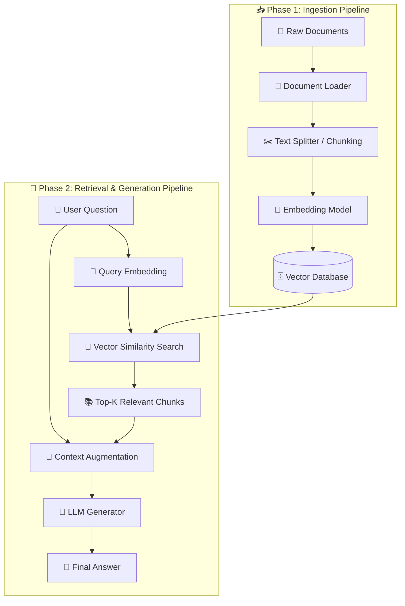

# 📘 Basic RAG (Naive RAG) — Complete Step-by-Step Implementation Guide

Welcome to the comprehensive implementation guide for **Basic RAG (Naive RAG)**.

This guide is designed as an end-to-end tutorial to help you understand, build, and master a production-grade Retrieval-Augmented Generation (RAG) engine from first principles using **TypeScript**.

---

## 🏗️ Architecture & Data Flow

Basic RAG connects an external knowledge base to a Large Language Model (LLM) through two primary execution phases:

---

## 📚 Chapters Index

| Chapter | Title | Focus & Core Code Modules |
| :--- | :--- | :--- |
| **[Chapter 1](./01-domain-models-and-config.md)** | **Domain Models & System Config** | `schemas.ts`, `config.ts` — Type definitions for Documents, Chunks, Vectors, and Environment Configuration. |
| **[Chapter 2](./02-document-loaders.md)** | **Document Loading Architecture** | `loaders/base.ts`, `loaders/text.ts` — Reading text, markdown, and directory contents. |
| **[Chapter 3](./03-text-splitters.md)** | **Chunking Strategies** | `splitters/base.ts`, `splitters/character.ts`, `splitters/token.ts` — Recursive character & token-aware chunking with overlap. |
| **[Chapter 4](./04-embedding-models.md)** | **Vector Embedding Models** | `embeddings/base.ts`, `embeddings/mock.ts`, `embeddings/openai.ts`, `embeddings/gemini.ts` — Transforming text into vector representations. |
| **[Chapter 5](./05-vector-store.md)** | **In-Memory Vector Database** | `vectordb/base.ts`, `vectordb/inMemory.ts` — Similarity Search (Cosine, Dot Product, Euclidean Distance). |
| **[Chapter 6](./06-llm-generators.md)** | **LLM Response Synthesis** | `llm/base.ts`, `llm/mock.ts`, `llm/openai.ts`, `llm/gemini.ts` — Context prompt augmentation and LLM generation. |
| **[Chapter 7](./07-rag-pipeline.md)** | **RAG Pipeline Orchestration** | `pipeline/ingestion.ts`, `pipeline/retrieval.ts`, `pipeline/generation.ts`, `pipeline/basicRag.ts` — Complete facade pipeline. |
| **[Chapter 8](./08-cli-and-testing.md)** | **Interactive CLI & Testing** | `cli.ts`, `tests/*` — Command-line interface and Jest unit test suite. |

---

## 🚀 How to Use This Guide

1. Read through the chapters sequentially to understand the role of each architectural layer.
2. Every chapter contains complete, runnable TypeScript code along with step-by-step line explanations and mathematical/architectural concepts.
3. Follow along in your own editor to build your custom RAG engine.
