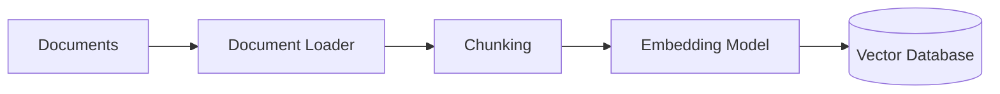
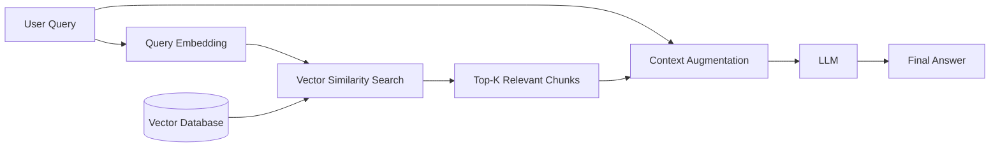
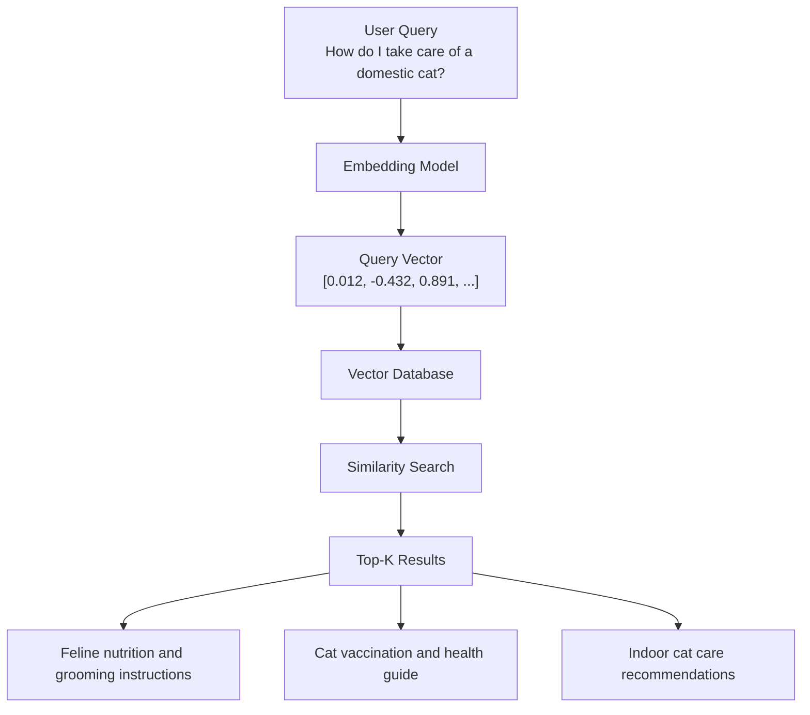
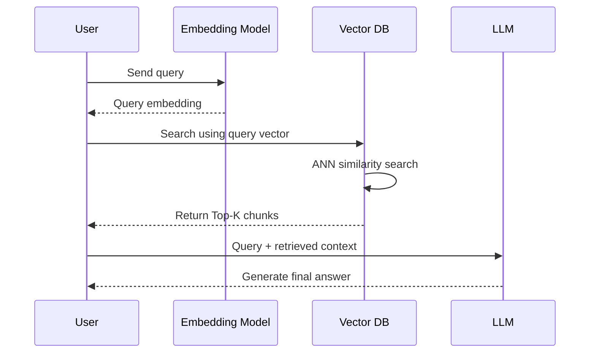
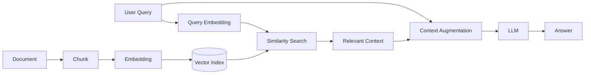

# 02 — Vector RAG

## 📌 Overview

**Vector RAG** uses dense vector embeddings to capture the semantic meaning of text.

Instead of relying on exact keyword matches, both queries and documents are converted into numerical vectors and placed in a shared high-dimensional vector space. Texts with similar meanings tend to have vectors that are close to one another.

For example:

> Query: *"How do I take care of a domestic cat?"*

A vector retriever can identify a document such as:

> *"Feline nutrition and grooming instructions..."*

even though the query and document don't use exactly the same words.

---

## 🏗️ How Vector Retrieval Works

The core Vector RAG pipeline consists of three major components:

### 1. Embedding Models

An **embedding model** converts text into a dense numerical vector.

For example:

```text
"How do I take care of a domestic cat?"

        ↓

Embedding Model

        ↓

[0.012, -0.432, 0.891, ..., 0.104]
```

The vector represents semantic information about the input text.

Common embedding models include:

* OpenAI embedding models
* `all-MiniLM-L6-v2`
* BGE embedding models
* E5 embedding models

The vector dimensionality depends on the specific embedding model.

---

### 2. Similarity / Distance Metrics

Once queries and documents are represented as vectors, a vector database compares them using a similarity or distance metric.

#### Cosine Similarity

Measures the angle between two vectors:

$$
\cos(\theta) = \frac{A \cdot B}{\|A\|\|B\|}
$$

A value closer to `1` generally means the vectors point in similar directions.

#### Dot Product

Measures the interaction between two vectors:

$$
A \cdot B
$$

Depending on the embedding model and whether vectors are normalized, dot product can behave similarly to cosine similarity.

#### Euclidean Distance (L2)

Measures the straight-line distance between two vectors:

$$
d(A,B)=\sqrt{\sum_i(A_i-B_i)^2}
$$

For distance-based metrics, a **smaller distance** generally means greater similarity.

---

### 3. ANN — Approximate Nearest Neighbor

Searching every vector in a large database can become expensive.

**Approximate Nearest Neighbor (ANN)** indexes make vector search much faster by avoiding an exhaustive comparison with every stored vector.

Popular ANN approaches include:

* **HNSW** — Hierarchical Navigable Small World
* **IVF** — Inverted File Index
* **PQ** — Product Quantization
* **ScaNN** — Scalable Nearest Neighbors

HNSW is particularly common in modern vector databases.

> ⚠️ ANN search does not universally guarantee `O(log N)` complexity. Actual performance depends on the index, configuration, dimensionality, hardware, and dataset. The important idea is that ANN provides much faster approximate search than brute-force comparison for large collections.

---

## 🏗️ Vector RAG Architecture

### Indexing Phase

Documents are converted into embeddings and stored in a vector database.



---

### Retrieval & Generation Phase

When the user asks a question, the query is also converted into an embedding.



---

## 🔎 Example: Semantic Retrieval



The important point is that retrieval is based on **vector similarity**, not simply exact word overlap.

---

## 🔄 Complete Vector RAG Flow



---

## 🧠 Key Concepts

### Dense Embeddings

Represent text as dense numerical vectors that capture semantic information.

```text
Text
 ↓
Embedding Model
 ↓
Dense Vector
```

---

### Semantic Similarity

Two pieces of text can be considered similar even when they use different words.

```text
"How can I look after my cat?"

            ≈

"What are the best ways to care for a domestic feline?"
```

Keyword matching may struggle because the words differ.

Vector retrieval can identify their semantic relationship.

---

### Top-K Retrieval

Instead of returning every matching document, the vector database usually returns the **K most relevant chunks**.

For example:

```text
Query
 ↓
Vector Search
 ↓
Top 5 chunks
 ↓
Context
 ↓
LLM
```

The value of `K` is a retrieval parameter that should be tuned based on the application.

---

### Vector Database

A vector database stores embeddings and provides efficient similarity search.

Examples include:

* Pinecone
* Qdrant
* Weaviate
* Milvus
* Chroma
* pgvector/PostgreSQL
* Elasticsearch/OpenSearch

A typical stored record may look conceptually like:

```json
{
  "id": "chunk_001",
  "text": "Cats need balanced nutrition...",
  "embedding": [0.012, -0.432, 0.891],
  "metadata": {
    "source": "cat-care-guide.pdf",
    "page": 12
  }
}
```

---

## ⚖️ Tradeoffs

### ✅ Advantages

* Understands semantic similarity
* Handles synonyms and paraphrasing
* Better than exact keyword matching for natural-language questions
* Can retrieve conceptually related information
* Useful for unstructured text
* Can work across languages when the embedding model supports them

### ❌ Limitations

* Can struggle with rare domain-specific terminology
* May perform poorly on exact numbers or identifiers
* Can miss alphanumeric product codes and part numbers
* Short acronyms may be difficult depending on the embedding model
* Embedding quality strongly affects retrieval quality
* Similar-looking concepts can sometimes produce false-positive matches
* Requires an embedding model and vector index
* Retrieval quality depends heavily on chunking strategy

---

## 🆚 Vector Search vs Keyword Search

| Feature                  | Vector Search           | Keyword Search         |
| ------------------------ | ----------------------- | ---------------------- |
| Semantic understanding   | ✅ Strong                | ❌ Limited              |
| Synonyms                 | ✅                       | ⚠️ Depends on analyzer |
| Paraphrasing             | ✅                       | ❌ Usually weak         |
| Exact IDs                | ⚠️ Can struggle         | ✅ Strong               |
| Product codes            | ⚠️                      | ✅                      |
| Rare terminology         | ⚠️                      | ✅ Often better         |
| Natural-language queries | ✅                       | ⚠️                     |
| Semantic similarity      | ✅                       | ❌                      |
| Best for                 | Meaning-based retrieval | Exact lexical matching |

This limitation is one of the main reasons **Hybrid RAG** exists: combining dense vector retrieval with keyword/sparse retrieval.

---

## 🎯 When to Use Vector RAG

Vector RAG is particularly useful when users ask questions using natural language and the relevant documents may use different terminology.

Good use cases include:

* 📚 Knowledge bases
* 📄 Document Q&A
* 💬 Customer support
* 🧑‍💻 Documentation search
* 🏢 Internal company knowledge
* 🎓 Educational content
* 🔎 Semantic search
* 📖 Research assistants

---

## 🧩 Core Mental Model



The entire architecture can be remembered as:

> **Text → Embeddings → Vector Search → Relevant Context → LLM → Answer**

---

## 📌 Key Takeaway

**Vector RAG = semantic retrieval using dense embeddings.**

The most important concepts to understand are:

1. **Embeddings** — converting text into vectors
2. **Vector similarity** — measuring how related vectors are
3. **Vector databases** — storing and searching embeddings
4. **ANN indexes** — making large-scale vector search efficient
5. **Top-K retrieval** — selecting the most relevant chunks
6. **Context augmentation** — giving retrieved information to the LLM
7. **Embedding quality + chunking** — major factors affecting retrieval quality

Once these concepts are clear, you have the foundation for understanding more advanced architectures such as **Hybrid RAG, Reranking, Multi-Query RAG, HyDE, GraphRAG, and Agentic RAG**.

