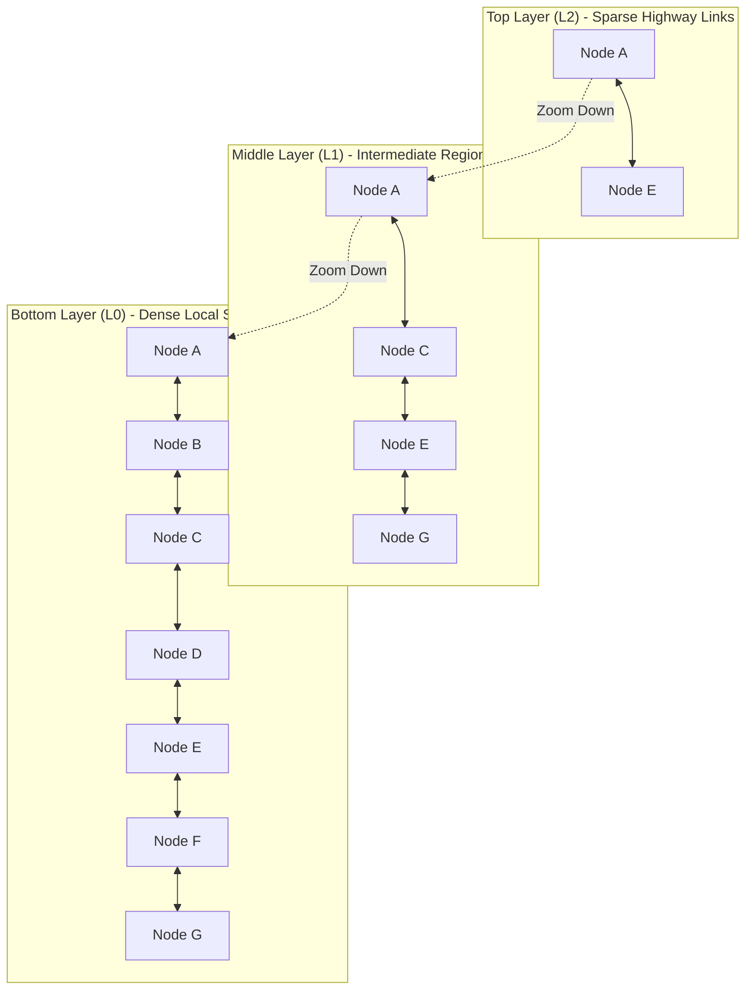

# Chapter 3 — Hierarchical Navigable Small World (HNSW) Graph Indexing Algorithm

**HNSW (Hierarchical Navigable Small World)** is a state-of-the-art Approximate Nearest Neighbor (ANN) vector indexing algorithm that structures vectors into a multi-layer graph hierarchy inspired by skip-lists.

HNSW provides sub-linear $O(\log N)$ search latency while maintaining high search recall.

Source code locations:
- [`src/indexes/hnsw.ts`](../code/src/indexes/hnsw.ts)
- [`tests/hnsw.test.ts`](../code/tests/hnsw.test.ts)

---

## 1. HNSW Graph Architecture & Theory



1. **Multi-layer Graph Hierarchy**: Upper layers contain long-range "highway" connections between distant vectors for coarse navigation. Lower layers contain dense local connections between nearby vectors.
2. **Exponential Level Distribution**: When a new vector node is inserted, its maximum level $l$ is assigned randomly via an exponential decay probability distribution:
   $$
   l = \lfloor -\ln(\text{random}() \in (0, 1]) \cdot m_L \rfloor \quad \text{where } m_L = \frac{1}{\ln(M)}
   $$
3. **Greedy Layer Traversal**: Search begins at the top layer entry point `entryPointId`, greedily transitioning to neighboring nodes with smaller metric distance to query $Q$, then dropping down to the next lower layer until reaching layer 0.

---

## 2. Key Hyperparameters

| Parameter | Default | Description |
| :--- | :--- | :--- |
| **`M`** | `16` | Maximum allowed bidirectional connections per node on layers $l > 0$. |
| **`M0`** | `32` ($2M$) | Maximum allowed connections per node on layer 0. |
| **`efConstruction`** | `64` | Size of dynamic candidate priority queue during index construction. |
| **`efSearch`** | `32` | Size of dynamic candidate priority queue during query search. |

---

## 3. Algorithm Step-by-Step

### Node Insertion Algorithm
1. Assign random level $l$ to new record $R$.
2. Starting from global `entryPointId` at `maxLevel`, greedily traverse down to level $l + 1$.
3. For levels $\min(l, \text{maxLevel})$ down to 0:
   - Perform dynamic candidate search using `searchLayer()` with beam width `efConstruction`.
   - Select top $M$ closest neighbors and establish bidirectional edges.
   - If any neighbor exceeds degree $M$ (or $M_0$ at layer 0), prune edges using distance sorting.
4. If assigned level $l > \text{maxLevel}$, update global `entryPointId` and `maxLevel`.

### Query Search Algorithm
1. Zoom down greedily from `maxLevel` to layer 1 using single nearest neighbor steps.
2. At layer 0, initialize dynamic candidate priority queue with layer 1 entrance node.
3. Explore layer 0 graph using dynamic beam width $\max(\text{efSearch}, K)$.
4. Sort candidates by normalized similarity score and return top $K$.

---

## 4. TypeScript HNSW Implementation

Excerpt from [`src/indexes/hnsw.ts`](../code/src/indexes/hnsw.ts):

```typescript
import { IndexSearchResult, VectorIndex } from './base';
import { HNSWConfig, SimilarityMetric, VectorRecord } from '../schemas';
import { VectorMath } from '../math/vectorMath';

interface HNSWNode {
  id: string;
  record: VectorRecord;
  level: number;
  neighbors: Map<number, string[]>;
}

export class HNSWIndex implements VectorIndex {
  private M: number;
  private M0: number;
  private efConstruction: number;
  private efSearch: number;
  private ml: number;

  private nodes: Map<string, HNSWNode> = new Map();
  private entryPointId: string | null = null;
  private maxLevel: number = -1;

  constructor(config: HNSWConfig = {}) {
    this.M = config.M ?? 16;
    this.M0 = this.M * 2;
    this.efConstruction = config.efConstruction ?? 64;
    this.efSearch = config.efSearch ?? 32;
    this.ml = 1 / Math.log(this.M);
  }

  public async insert(record: VectorRecord): Promise<void> {
    const level = this.getRandomLevel();
    const newNode: HNSWNode = {
      id: record.id,
      record,
      level,
      neighbors: new Map(),
    };

    for (let l = 0; l <= level; l++) {
      newNode.neighbors.set(l, []);
    }

    if (!this.entryPointId || this.nodes.size === 0) {
      this.nodes.set(record.id, newNode);
      this.entryPointId = record.id;
      this.maxLevel = level;
      return;
    }

    let currObjId = this.entryPointId;
    let currDist = VectorMath.computeDistance(record.vector, this.nodes.get(currObjId)!.record.vector, 'cosine');

    // Zoom down top levels
    for (let l = this.maxLevel; l > level; l--) {
      let changed = true;
      while (changed) {
        changed = false;
        const neighbors = this.nodes.get(currObjId)?.neighbors.get(l) ?? [];
        for (const nId of neighbors) {
          const nNode = this.nodes.get(nId);
          if (!nNode) continue;
          const dist = VectorMath.computeDistance(record.vector, nNode.record.vector, 'cosine');
          if (dist < currDist) {
            currDist = dist;
            currObjId = nId;
            changed = true;
          }
        }
      }
    }

    // Connect node on levels level down to 0
    for (let l = Math.min(level, this.maxLevel); l >= 0; l--) {
      const candidates = this.searchLayer(record.vector, [currObjId], this.efConstruction, l);
      const mMax = l === 0 ? this.M0 : this.M;
      const neighborsToConnect = candidates.slice(0, mMax);

      for (const candidate of neighborsToConnect) {
        newNode.neighbors.get(l)!.push(candidate.id);
        const neighborNode = this.nodes.get(candidate.id);
        if (neighborNode) {
          const nList = neighborNode.neighbors.get(l) ?? [];
          nList.push(newNode.id);
          neighborNode.neighbors.set(l, nList);

          if (nList.length > mMax) {
            this.pruneNeighbors(neighborNode, l, mMax);
          }
        }
      }

      if (candidates.length > 0) {
        currObjId = candidates[0].id;
      }
    }

    this.nodes.set(record.id, newNode);

    if (level > this.maxLevel) {
      this.maxLevel = level;
      this.entryPointId = record.id;
    }
  }

  private getRandomLevel(): number {
    const r = Math.random();
    return Math.floor(-Math.log(r === 0 ? 1e-9 : r) * this.ml);
  }
}
```

---

## 5. Unit Test Coverage

Verified in [`tests/hnsw.test.ts`](../code/tests/hnsw.test.ts):

```typescript
describe('HNSW ANN Index Suite', () => {
  it('should insert records and retrieve nearest vector correctly', async () => {
    const index = new HNSWIndex({ M: 8, efConstruction: 32, efSearch: 16 });
    await index.insertBatch([rec1, rec2, rec3]);

    const results = await index.search([1, 0, 0], 2, 'cosine');
    expect(results[0].record.id).toBe('rec1');
  });
});
```
