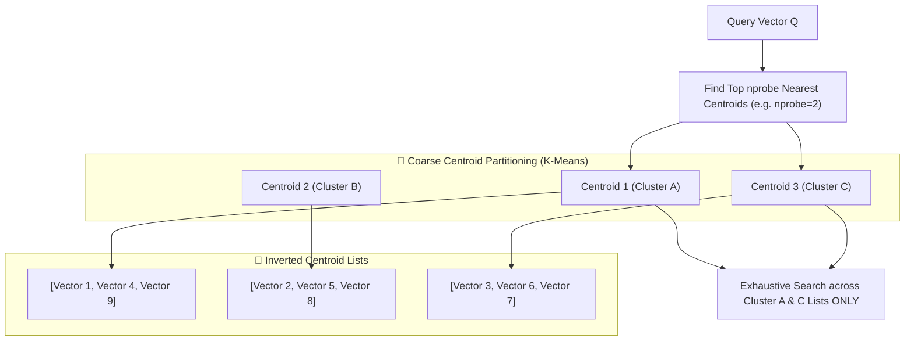

# Chapter 4 — Inverted File (IVF) Cluster Indexing Algorithm

The **Inverted File (IVF)** index is an Approximate Nearest Neighbor (ANN) vector index that partitions high-dimensional vector space into coarse clusters (Voronoi cells) using K-means clustering.

During search queries, IVF restricts distance evaluations to vectors residing in the top $nprobe$ nearest centroid clusters, significantly accelerating search.

Source code locations:
- [`src/indexes/ivf.ts`](../code/src/indexes/ivf.ts)

---

## 1. IVF Architecture & Voronoi Partitions



---

## 2. Key Hyperparameters

| Parameter | Default | Description |
| :--- | :--- | :--- |
| **`numLists`** | `8` | Number of coarse centroids / clusters ($K$). |
| **`nprobe`** | `3` | Number of nearest centroid lists to probe during vector search. |
| **`kmeansIterations`** | `10` | Maximum iterations for K-means centroid optimization. |

---

## 3. Algorithm Step-by-Step

### Index Training & Vector Assignment
1. Accumulate incoming vector records until reaching threshold sample size ($2 \cdot \text{numLists}$).
2. Initialize $K$ centroids using random sample vectors.
3. Run iterative K-means clustering:
   - Assign each vector to its closest centroid using cosine distance.
   - Recompute centroid coordinates as the average of assigned vectors:
     $$
     C_k = \text{l2Normalize}\left(\frac{1}{|S_k|} \sum_{v \in S_k} v\right)
     $$
4. Reassign vectors to their inverted centroid lists.

### Query Search
1. Calculate distance between query vector $Q$ and all $K$ centroids.
2. Sort centroids and select top $nprobe$ nearest centroids.
3. Concatenate vector candidate lists attached to the probed centroids.
4. Calculate distances for candidates, sort by score, and return top $K$.

---

## 4. TypeScript IVF Implementation

Excerpt from [`src/indexes/ivf.ts`](../code/src/indexes/ivf.ts):

```typescript
import { IndexSearchResult, VectorIndex } from './base';
import { IVFConfig, SimilarityMetric, VectorRecord } from '../schemas';
import { VectorMath } from '../math/vectorMath';

interface Centroid {
  id: number;
  vector: number[];
  list: VectorRecord[];
}

export class IVFIndex implements VectorIndex {
  private numLists: number;
  private nprobe: number;
  private kmeansIterations: number;
  private centroids: Centroid[] = [];
  private isTrained: boolean = false;
  private unassignedRecords: VectorRecord[] = [];

  constructor(config: IVFConfig = {}) {
    this.numLists = config.numLists ?? 8;
    this.nprobe = config.nprobe ?? 3;
    this.kmeansIterations = config.kmeansIterations ?? 10;
  }

  public async search(
    queryVector: number[],
    topK: number,
    metric: SimilarityMetric = 'cosine',
    filterFn?: (record: VectorRecord) => boolean
  ): Promise<IndexSearchResult[]> {
    const candidateRecords: VectorRecord[] = [];

    if (!this.isTrained) {
      candidateRecords.push(...this.unassignedRecords);
    } else {
      // Find top nprobe nearest centroids
      const centroidDists = this.centroids.map((c) => ({
        centroid: c,
        dist: VectorMath.computeDistance(queryVector, c.vector, metric),
      }));

      centroidDists.sort((a, b) => a.dist - b.dist);
      const probed = centroidDists.slice(0, Math.min(this.nprobe, this.centroids.length));

      for (const item of probed) {
        candidateRecords.push(...item.centroid.list);
      }
      candidateRecords.push(...this.unassignedRecords);
    }

    const results: IndexSearchResult[] = [];

    for (const record of candidateRecords) {
      if (filterFn && !filterFn(record)) continue;

      const rawDist = VectorMath.computeDistance(queryVector, record.vector, metric);
      let score = VectorMath.distanceToScore(rawDist, metric);

      results.push({ record, distance: rawDist, score });
    }

    results.sort((a, b) => b.score - a.score);
    return results.slice(0, topK);
  }
}
```
