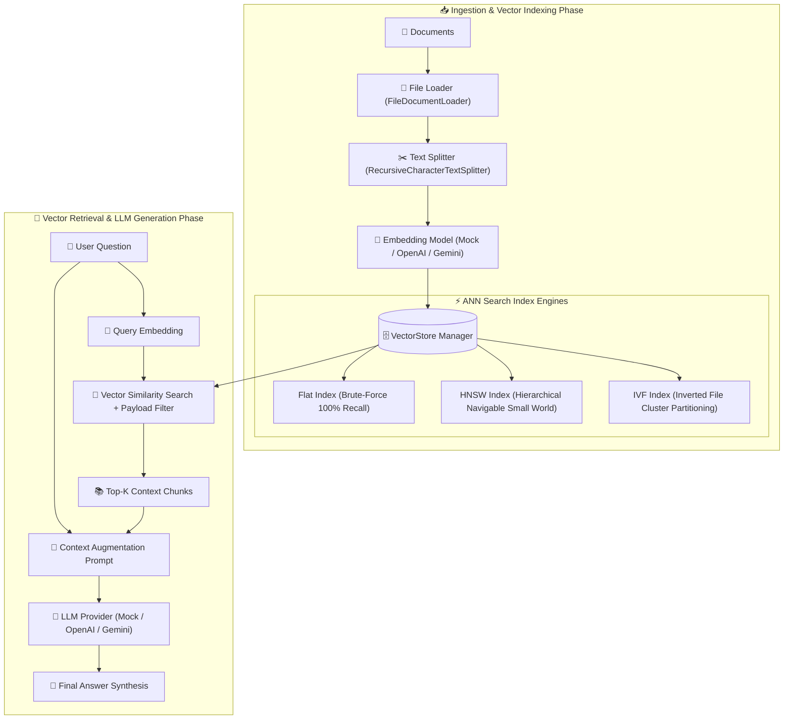

# 📘 02 — Vector RAG Implementation Guide

Welcome to the comprehensive, step-by-step implementation guide for **Vector RAG (Retrieval-Augmented Generation)**.

This guide provides an end-to-end tutorial covering the mathematical foundations, vector space similarity metrics, ANN (Approximate Nearest Neighbor) graph & cluster indexing algorithms (Flat, HNSW, IVF), metadata payload filtering, dense embedding models, context-augmented LLM synthesis, and performance benchmarking.

All corresponding source code and unit tests are located in [02-vector-rag/code](../code).

---

## 🏗️ Architecture & Component Flow



---

## 📚 Chapters Index

| Chapter | Title | Focus Topics & Core Code Modules |
| :--- | :--- | :--- |
| **[Chapter 0](./00-introduction-and-vector-space-math.md)** | **Vector Space Math & Similarity Metrics** | Cosine similarity, Dot product, Euclidean ($L2$), Manhattan ($L1$), L2 normalization, score mapping — [`vectorMath.ts`](../code/src/math/vectorMath.ts) |
| **[Chapter 1](./01-domain-schemas-and-project-setup.md)** | **Domain Schemas & System Infrastructure** | TypeScript setup, `Document`, `Chunk`, `VectorRecord`, `IndexConfig`, `MetadataFilter` — [`schemas.ts`](../code/src/schemas.ts) |
| **[Chapter 2](./02-flat-exact-search-index.md)** | **Flat Exact Search Vector Index** | Brute-force exhaustive search baseline, exact ground truth (100% recall) — [`indexes/flat.ts`](../code/src/indexes/flat.ts) |
| **[Chapter 3](./03-hnsw-graph-indexing-algorithm.md)** | **HNSW Graph Indexing Algorithm** | Hierarchical Navigable Small World, multi-layer skip-lists, node entry points, $M$, $efConstruction$, $efSearch$ — [`indexes/hnsw.ts`](../code/src/indexes/hnsw.ts) |
| **[Chapter 4](./04-ivf-inverted-file-index.md)** | **IVF Inverted File Index** | Inverted file partitioning, Voronoi cells, K-means centroid training, $nprobe$ search — [`indexes/ivf.ts`](../code/src/indexes/ivf.ts) |
| **[Chapter 5](./05-metadata-filtering-and-vector-store.md)** | **Metadata Payload Filtering & Vector DB** | MongoDB-style query filters (`$eq`, `$gte`, `$in`, `$and`, `$or`), store persistence — [`vectordb/filter.ts`](../code/src/vectordb/filter.ts), [`vectorStore.ts`](../code/src/vectordb/vectorStore.ts) |
| **[Chapter 6](./06-embedding-models.md)** | **Dense Embedding Models** | `EmbeddingModel` contract, Mock 128-d semantic hash projection model, OpenAI, Gemini — [`embeddings/`](../code/src/embeddings/) |
| **[Chapter 7](./07-loaders-and-splitters.md)** | **Document Loaders & Text Splitters** | Document ingestion, file loader, recursive character splitter with overlap — [`loaders/text.ts`](../code/src/loaders/text.ts), [`splitters/character.ts`](../code/src/splitters/character.ts) |
| **[Chapter 8](./08-llm-generators.md)** | **Context Augmentation & LLM Generation** | Prompt formatting, token metrics, Mock LLM, OpenAI `gpt-4o-mini`, Gemini `gemini-1.5-flash` — [`llm/`](../code/src/llm/) |
| **[Chapter 9](./09-vector-rag-pipeline-and-benchmarking.md)** | **RAG Pipeline & ANN Benchmarking** | End-to-end `VectorRAGPipeline` facade, Recall@K vs query latency benchmarking — [`pipeline/vectorRag.ts`](../code/src/pipeline/vectorRag.ts), [`benchmark.ts`](../code/src/pipeline/benchmark.ts) |
| **[Chapter 10](./10-cli-application-and-testing-suite.md)** | **Interactive CLI & Unit Testing Suite** | Commander CLI tool (`ingest`, `ask`, `benchmark`), Jest test suites — [`cli.ts`](../code/src/cli.ts), [`tests/`](../code/tests/) |

---

## 🚀 Quick Execution Guide

1. Change directory to project code:
   ```bash
   cd 02-vector-rag/code
   ```
2. Build TypeScript package:
   ```bash
   npm run build
   ```
3. Run Jest test suite:
   ```bash
   npm test
   ```
4. Run CLI query:
   ```bash
   npx ts-node src/cli.ts ask --question "How do I take care of a domestic cat?" --top-k 3
   ```
5. Run ANN benchmark:
   ```bash
   npx ts-node src/cli.ts benchmark --size 150
   ```
