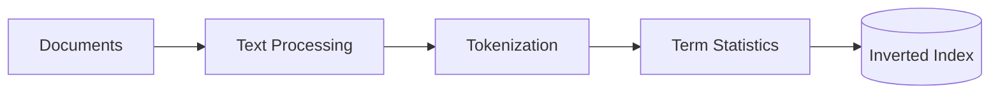
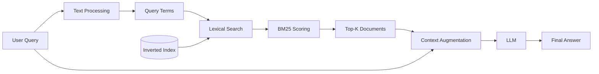
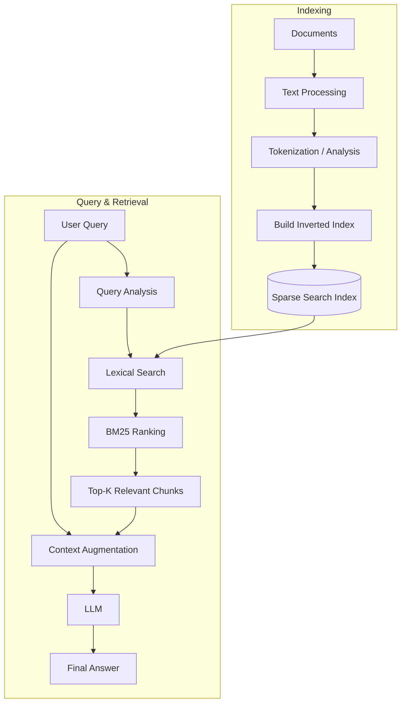
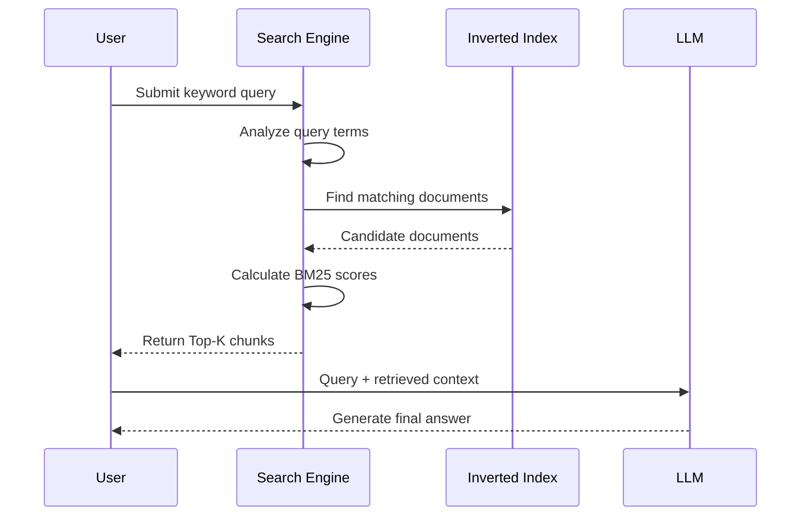
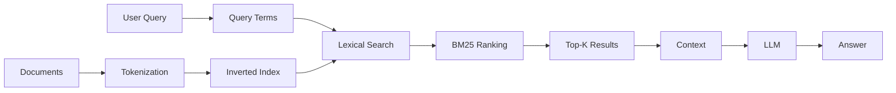

# 03 — Keyword / Sparse RAG

## 📌 Overview

**Keyword RAG**, also called **Sparse RAG**, uses lexical search techniques to retrieve documents based on the actual words and terms appearing in the query and documents.

Instead of representing text as dense semantic embeddings, sparse retrieval represents documents using **sparse term-based representations** where most dimensions are zero and only terms present in the vocabulary contribute to the representation.

Common sparse retrieval approaches include:

* **BM25** — one of the most widely used lexical retrieval algorithms
* **TF-IDF** — classic term-frequency / inverse-document-frequency approach
* Inverted indexes — efficient data structures used by search engines to locate documents containing specific terms

Unlike Vector RAG, sparse retrieval is particularly strong when the user needs to find an **exact word, identifier, code, phrase, or technical term**.

---

## 🏗️ How Keyword / Sparse Retrieval Works

The basic process can be divided into two phases:

### 1. Indexing Phase

Documents are processed and added to a lexical search index.



The index keeps track of which documents contain which terms.

For example:

```text
"ERR_CONNECTION_TIMED_OUT"

        ↓

Token / Term

        ↓

Inverted Index

ERR_CONNECTION_TIMED_OUT
        │
        ├── Document 12
        ├── Document 47
        └── Document 83
```

---

### 2. Retrieval Phase

When the user submits a query, the search engine finds documents containing relevant terms and ranks them using a scoring algorithm such as BM25.



---

# 📊 BM25 Scoring

**BM25 (Best Matching 25)** is one of the most commonly used ranking algorithms for keyword-based retrieval.

A simplified form of the BM25 scoring function is:

$$
Score(D,Q)=
\sum_{i=1}^{n}
IDF(q_i)
\cdot
\frac{
f(q_i,D)(k_1+1)
}{
f(q_i,D)+
k_1
\left(
1-b+b\frac{|D|}{avgdl}
\right)
}
$$

Where:

* $q_i$ = a query term
* $f(q_i,D)$ = frequency of query term $q_i$ in document $D$
* $IDF(q_i)$ = inverse document frequency of the query term
* $|D|$ = length of document $D$
* $avgdl$ = average document length across the collection
* $k_1$ = controls term-frequency saturation
* $b$ = controls document-length normalization

The exact BM25 implementation can vary slightly between search engines.

### 💡 Intuition

BM25 rewards documents that:

1. Contain the user's query terms
2. Contain important/rare query terms
3. Contain terms multiple times, but with diminishing returns
4. Are not excessively long compared with other documents

---

## 🔍 Why IDF Matters

**Inverse Document Frequency (IDF)** helps distinguish common terms from informative terms.

A term appearing in almost every document provides little information.

A rare term appearing in only a few documents is much more useful for retrieval.

Conceptually:

```text
Common term
     ↓
Low IDF
     ↓
Less discriminative

Rare term
     ↓
High IDF
     ↓
More discriminative
```

Modern search engines may also apply **stop-word removal, stemming, lemmatization, token normalization, or analyzers**, depending on the search system.

So it is more accurate to say that BM25 **down-weights terms that occur across many documents**, rather than simply "penalizing stop words."

---

# 🧩 Sparse vs Dense Representation

A useful way to understand Sparse RAG is to compare it with Vector RAG.

### Sparse Representation

Imagine a vocabulary:

```text
["cat", "dog", "car", "database", "react", "python"]
```

A document containing:

```text
"cat database"
```

could conceptually be represented as:

```text
[1, 0, 0, 1, 0, 0]
```

Most dimensions are zero — hence **sparse**.

### Dense Representation

A dense embedding might look like:

```text
[0.021, -0.482, 0.731, 0.118, ...]
```

Most dimensions contain non-zero values.

The key difference is:

```text
Sparse Retrieval
    ↓
Exact / lexical relationships

Dense Retrieval
    ↓
Semantic relationships
```

---

# 🔄 Complete Keyword RAG Architecture



---

# 🔁 Retrieval Sequence



---

# 🎯 Ideal Use Cases

Keyword / Sparse RAG is particularly useful when **exact lexical matching matters**.

### 💻 1. Technical Logs & Error Codes

Excellent for queries containing exact error codes:

```text
0x80004005
ERR_CONNECTION_TIMED_OUT
NullPointerException
ECONNREFUSED
HTTP 429
```

A semantic vector search may understand the general concept of a network timeout, but keyword search can directly target the exact error identifier.

---

### ⚖️ 2. Legal & Statutory Documents

Useful for retrieving:

* Section numbers
* Case numbers
* Legal citations
* Statute names
* Article numbers
* Exact legal terminology

Example:

```text
"Section 420 IPC"
```

Exact lexical matching can be extremely valuable here.

---

### 📦 3. Product SKUs

For queries such as:

```text
TX-9021-B
```

or:

```text
A-17X-450
```

keyword retrieval is often preferable because the identifier itself is the important signal.

---

### 🧑‍💻 4. Source Code Search

Sparse retrieval can be useful for finding exact:

```text
function names
class names
API endpoints
error messages
package names
configuration keys
```

For example:

```text
"createPaymentIntent"
```

is an exact identifier that should generally be searched lexically.

---

### 📚 5. Documentation Search

Users frequently search documentation using exact terms:

```text
useEffect
useMemo
WebSocket
OAuth2
JWT
POST /api/users
```

Keyword retrieval can quickly identify documents containing those terms.

---

# ⚖️ Tradeoffs

## ✅ Advantages

* Excellent for exact terminology
* Strong for IDs and identifiers
* Effective for error codes
* Good for product SKUs and part numbers
* Fast and mature search technology
* Easy to explain and debug
* Does not require an embedding model
* Works well with structured and technical text

## ❌ Limitations

* Limited semantic understanding
* Synonyms may not match unless explicitly handled
* Paraphrased queries can perform poorly
* Different wording can result in missed documents
* Requires good tokenization and text analysis
* Exact lexical matching can miss conceptually relevant documents

---

# 🆚 Keyword / Sparse RAG vs Vector RAG

| Feature                    | Keyword / Sparse RAG   | Vector RAG               |
| -------------------------- | ---------------------- | ------------------------ |
| Exact keyword matching     | ✅ Excellent            | ⚠️                       |
| Error codes                | ✅ Excellent            | ⚠️                       |
| Product SKUs               | ✅ Excellent            | ⚠️                       |
| IDs / identifiers          | ✅ Excellent            | ⚠️                       |
| Semantic understanding     | ❌ Limited              | ✅ Strong                 |
| Synonyms                   | ⚠️ Limited             | ✅                        |
| Paraphrasing               | ⚠️ Limited             | ✅                        |
| Natural-language questions | ⚠️                     | ✅                        |
| Technical terminology      | ✅ Often strong         | ⚠️ Depends on embeddings |
| Explainability             | ✅ High                 | ⚠️ Lower                 |
| Embedding model required   | ❌                      | ✅                        |
| Best for                   | Exact lexical matching | Meaning-based retrieval  |

---

# 🧠 Key Mental Model

Remember Keyword RAG as:



The core idea is:

> **Terms → Inverted Index → Lexical Matching → BM25 Ranking → Context → LLM**

---

# 🚀 Why Sparse RAG Still Matters

Dense Vector RAG is powerful, but it does not replace lexical search.

Consider:

```text
User Query:

"Why am I getting ERR_CONNECTION_TIMED_OUT?"
```

A dense retriever may find documents about:

```text
network connectivity problems
connection failures
server timeouts
```

A sparse retriever can directly prioritize documents containing:

```text
ERR_CONNECTION_TIMED_OUT
```

This makes **Sparse RAG particularly valuable for exact-match retrieval**.

And this limitation leads directly to the next important architecture:

> **Hybrid RAG = Dense Vector Retrieval + Sparse Keyword Retrieval**

---

## 📌 Key Takeaway

**Keyword / Sparse RAG = lexical retrieval using exact or term-based matching.**

The most important concepts to understand are:

1. **Tokenization & text analysis**
2. **Sparse representations**
3. **Inverted indexes**
4. **TF-IDF**
5. **BM25**
6. **Term frequency**
7. **Inverse document frequency**
8. **Document-length normalization**
9. **Top-K lexical retrieval**
10. **Exact-match retrieval**

If **Vector RAG** answers:

> *"What content has a similar meaning?"*

then **Keyword / Sparse RAG** answers:

> *"What content contains the terms I'm looking for?"*

This distinction is fundamental to understanding **Hybrid RAG**.
