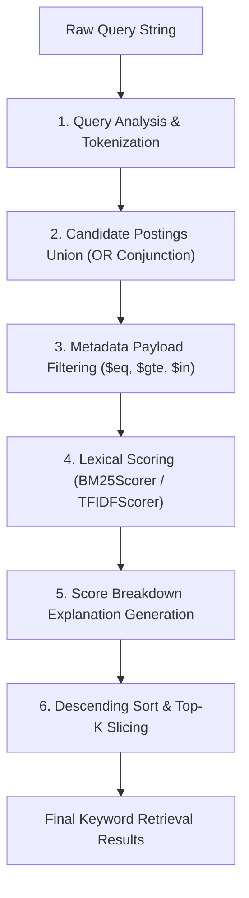

# 🔎 Chapter 5 — Lexical Search Engine & Query Execution

Welcome to Chapter 5 of the **Keyword RAG Implementation Guide**. In this chapter, we assemble the components from Chapters 2–4 into a high-performance **Keyword Search Engine** capable of multi-term retrieval, metadata filtering, scoring, top-K ranking, and score breakdown generation.

---

## 1. Query Execution Workflow

Located in [`03-keyword-rag/code/src/search/engine.ts`](../code/src/search/engine.ts):



---

## 2. Five Steps of Lexical Search (`search`)

```typescript
public search(searchQuery: SearchQuery): KeywordRetrievalResult[] {
  // 1. Analyze query string into normalized tokens
  const analyzer = this.getAnalyzer(searchQuery.analyzerType || 'standard');
  const queryTokens = analyzer.analyze(searchQuery.query);
  const queryTerms = queryTokens.map((t) => t.term);

  // 2. Union candidate documents matching at least one query term
  const candidateDocIds = new Set<string>();
  for (const term of queryTerms) {
    for (const posting of this.index.getPostings(term)) {
      candidateDocIds.add(posting.docId);
    }
  }

  // 3. Metadata Filtering
  const validCandidateIds = Array.from(candidateDocIds).filter((docId) => {
    const chunk = this.index.getChunk(docId);
    return chunk && (!searchQuery.filter || this.evaluateMetadataFilter(chunk.metadata, searchQuery.filter));
  });

  // 4. Scoring candidates using BM25 & TF-IDF
  const bm25Scorer = new BM25Scorer(searchQuery.bm25Params);
  const tfidfScorer = new TFIDFScorer(searchQuery.tfidfParams);
  const results: KeywordRetrievalResult[] = [];

  for (const docId of validCandidateIds) {
    const chunk = this.index.getChunk(docId)!;
    const bm25Res = bm25Scorer.scoreDocument(queryTerms, docId, this.index);
    const tfidfRes = tfidfScorer.scoreDocument(queryTerms, docId, this.index);
    const finalScore = searchQuery.algorithm === 'tfidf' ? tfidfRes.totalScore : bm25Res.totalScore;

    results.push({
      chunk,
      score: finalScore,
      bm25Score: bm25Res.totalScore,
      tfidfScore: tfidfRes.totalScore,
      matchedTerms: bm25Res.details.filter((d) => d.rawTf > 0).map((d) => d.term),
      explanation: searchQuery.explain ? { ... } : undefined,
    });
  }

  // 5. Descending score sort & top-K slicing
  return results.sort((a, b) => b.score - a.score).slice(0, searchQuery.topK ?? 5);
}
```

---

## 3. Metadata Payload Filtering

`evaluateMetadataFilter` supports expression evaluation:
- Operators: `$eq`, `$ne`, `$gt`, `$gte`, `$lt`, `$lte`, `$in`, `$nin`.
- Logical Junctions: `$and`, `$or`.

This allows applications to restrict lexical search by category, tenant ID, or creation date before ranking.

In Chapter 6, we look at **Document Loaders & Text Splitters**.
