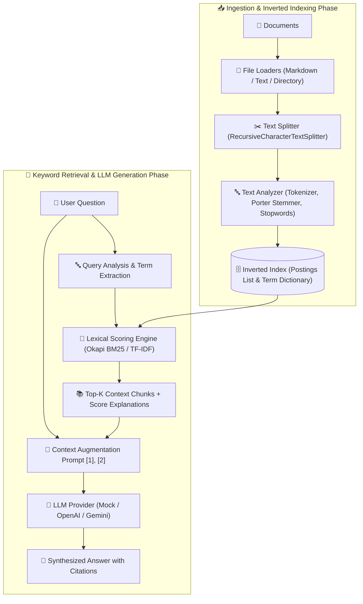

# 📘 03 — Keyword RAG Implementation Guide

Welcome to the comprehensive, step-by-step implementation guide for **Keyword RAG (Sparse / Lexical Retrieval-Augmented Generation)**.

This guide provides an end-to-end tutorial covering the mathematical foundations of lexical search (TF-IDF, Okapi BM25, probabilistic IDF), text analysis pipelines (tokenization, stemming, stopword removal), inverted index data structures, posting lists, scoring algorithms, context-augmented LLM generation, pipeline orchestration, and CLI benchmarking.

All corresponding source code and unit tests are located in [03-keyword-rag/code](../code).

---

## 🏗️ Architecture & Component Flow



---

## 📚 Chapters Index

| Chapter | Title | Focus Topics & Core Code Modules |
| :--- | :--- | :--- |
| **[Chapter 0](./00-mathematical-foundations-of-lexical-search.md)** | **Mathematical Foundations of Lexical Search** | $TF$, $IDF$, Okapi BM25 formula, length normalization ($b$), saturation ($k_1$), document length vs average length |
| **[Chapter 1](./01-domain-schemas-and-project-setup.md)** | **Domain Schemas & System Infrastructure** | TypeScript setup, `Document`, `Chunk`, `Posting`, `InvertedIndexStats`, `SearchQuery`, `KeywordRetrievalResult` — [`schemas.ts`](../code/src/schemas.ts) |
| **[Chapter 2](./02-text-analysis-pipeline.md)** | **Text Analysis Pipeline** | Tokenization (`RegexTokenizer`), Stemming (`PorterStemmer`), Stopwords filter, Analyzers (`Standard`, `Technical`, `Simple`) — [`analysis/`](../code/src/analysis/) |
| **[Chapter 3](./03-inverted-index-architecture.md)** | **Inverted Index Architecture** | Postings list structure, term dictionary maps, document length tracking, serialization, stats — [`index/inverted_index.ts`](../code/src/index/inverted_index.ts) |
| **[Chapter 4](./04-scoring-algorithms-tfidf-and-bm25.md)** | **Scoring Algorithms (TF-IDF & Okapi BM25)** | Probabilistic $IDF$, Term Frequency weighting, $BM25$ parameter tuning ($k_1=1.2, b=0.75$), score breakdown — [`scoring/`](../code/src/scoring/) |
| **[Chapter 5](./05-lexical-search-engine-and-query-execution.md)** | **Lexical Search Engine & Query Execution** | Multi-term retrieval, OR/AND conjunction logic, score accumulation, Top-K ranking, explanation generation — [`search/engine.ts`](../code/src/search/engine.ts) |
| **[Chapter 6](./06-document-loaders-and-text-splitters.md)** | **Document Loaders & Text Splitters** | Document ingestion (`TextFileLoader`, `MarkdownLoader`, `DirectoryLoader`), chunking with overlap — [`loaders/`](../code/src/loaders/), [`splitters/`](../code/src/splitters/) |
| **[Chapter 7](./07-context-augmented-llm-response-generation.md)** | **Context Augmentation & LLM Generation** | Citation prompt formatting `[1], [2]`, `LLMProvider` contract, Mock LLM, OpenAI `gpt-4o-mini`, Gemini `gemini-1.5-flash` — [`llm/`](../code/src/llm/) |
| **[Chapter 8](./08-end-to-end-keyword-rag-pipeline.md)** | **Keyword RAG Pipeline Orchestration** | End-to-end `KeywordRAGPipeline` facade, latency tracking, retrieval & generation integration — [`pipeline/rag_pipeline.ts`](../code/src/pipeline/rag_pipeline.ts) |
| **[Chapter 9](./09-interactive-cli-and-testing-suite.md)** | **Interactive CLI & Testing Suite** | Commander CLI tool (`search`, `query`, `stats`), Jest test suites — [`cli.ts`](../code/src/cli.ts), [`tests/`](../code/tests/) |

---

## 🚀 Quick Execution Guide

1. Navigate to project code directory:
   ```bash
   cd 03-keyword-rag/code
   ```
2. Build TypeScript package:
   ```bash
   npm run build
   ```
3. Run Jest unit test suite:
   ```bash
   npm test
   ```
4. Run Lexical BM25 Search CLI:
   ```bash
   npx ts-node src/cli.ts search "bm25 scoring algorithm" --explain
   ```
5. Run End-to-End Keyword RAG Question Answering:
   ```bash
   npx ts-node src/cli.ts query "What are the key parameters in BM25?"
   ```
6. Inspect Inverted Index Statistics:
   ```bash
   npx ts-node src/cli.ts stats
   ```
