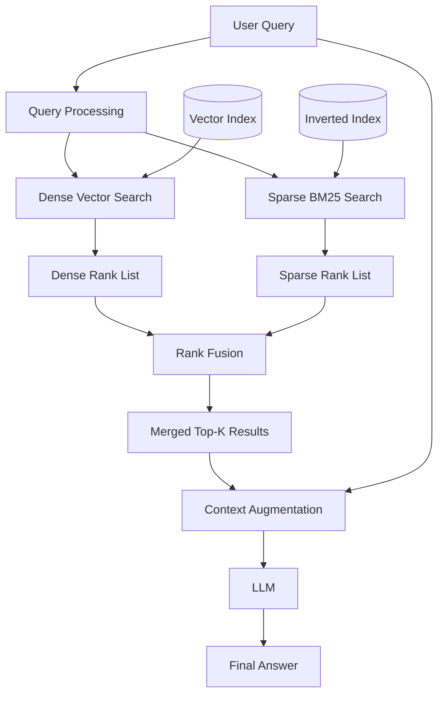
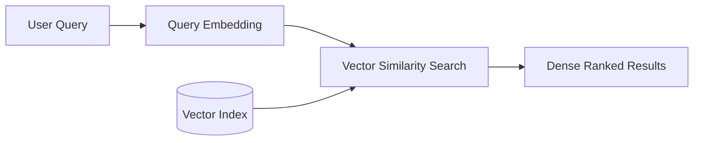
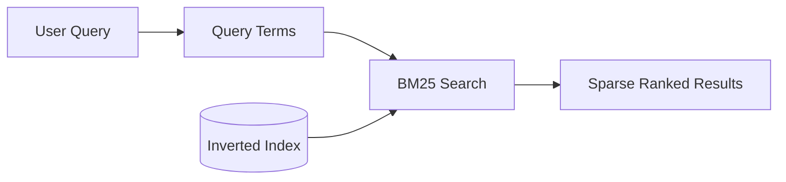
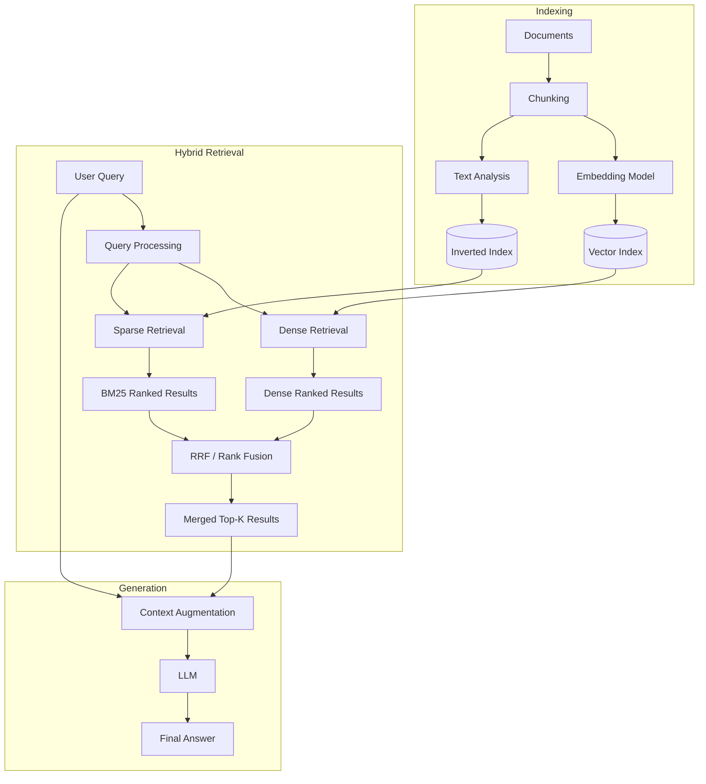
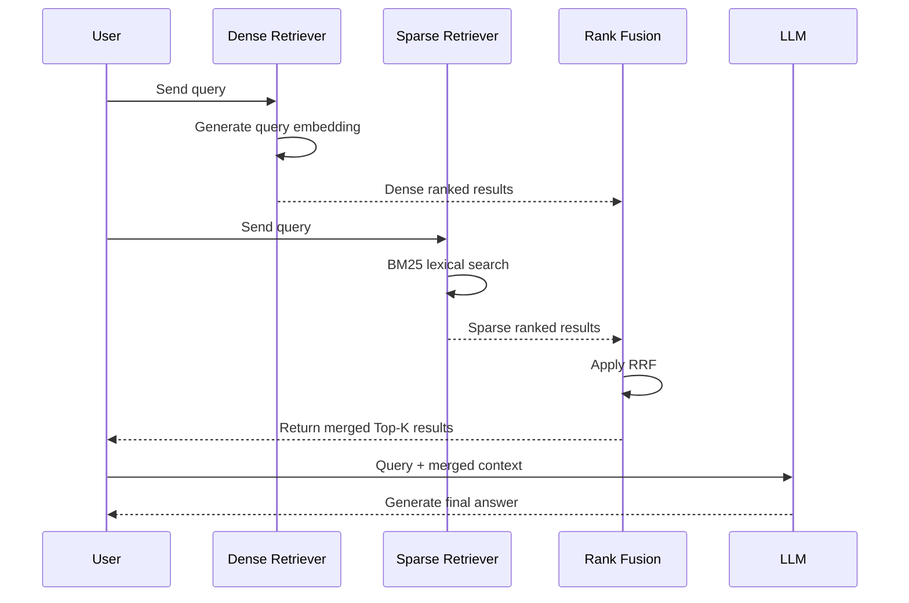
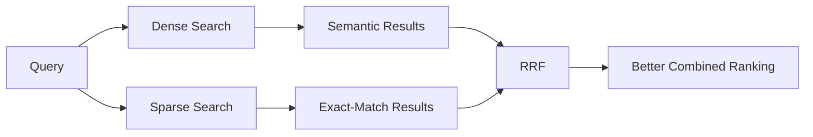
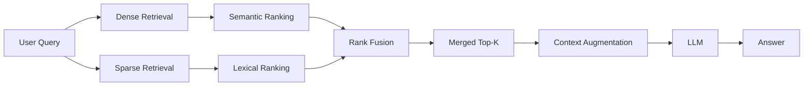

# 04 — Hybrid RAG

## 📌 Overview

**Hybrid RAG** combines two complementary retrieval strategies:

* **Dense Vector Search** → captures semantic meaning and conceptual similarity
* **Sparse Keyword Search** → captures exact terms, identifiers, and lexical matches

Instead of depending entirely on one retrieval method, Hybrid RAG retrieves candidates from both systems and combines their results into a unified ranking.

This helps compensate for the weaknesses of each approach.

```text
Dense Retrieval
    ↓
Semantic understanding

Sparse Retrieval
    ↓
Exact lexical matching

        ↓

   Hybrid Retrieval
        ↓
 Better candidate coverage
```

---

# 🏗️ Architecture

The basic Hybrid RAG pipeline looks like this:



The two retrieval systems operate independently and their results are combined before the final context is sent to the LLM.

---

# 🔎 Two Retrieval Paths

## 1. Dense Vector Search

The query is converted into an embedding and searched against a vector index.



Dense retrieval is particularly good at finding content with **similar meaning**, even when the wording differs.

Example:

```text
Query:
"How can I look after my cat?"

Retrieved:
"Guidelines for domestic feline care"
```

The words are different, but the semantic meaning is similar.

---

## 2. Sparse BM25 Search

The same query is processed lexically and searched against an inverted index.



Sparse retrieval is particularly good for:

* Error codes
* Product IDs
* SKUs
* API names
* Exact terminology
* Technical identifiers

Example:

```text
Query:
"ERR_CONNECTION_TIMED_OUT"

        ↓

BM25

        ↓

Documents containing:
"ERR_CONNECTION_TIMED_OUT"
```

---

# 🔀 Reciprocal Rank Fusion (RRF)

Once both retrieval systems produce ranked lists, Hybrid RAG needs a way to combine them.

One popular technique is **Reciprocal Rank Fusion (RRF)**.

The basic equation is:

$$
RRFScore(d)
=
\sum_{m \in \{Dense,Sparse\}}
\frac{1}{k + Rank_m(d)}
$$

Where:

* $d$ = document
* $m$ = retrieval method
* $Rank_m(d)$ = rank of document $d$ in retrieval method $m$
* $k$ = smoothing constant
* `Dense` = vector retrieval
* `Sparse` = BM25 retrieval

A commonly used value is:

```text
k = 60
```

The exact value is configurable and depends on the retrieval system.

---

# 🧮 RRF Example

Suppose we have two retrieval systems.

### Dense Results

```text
Rank 1 → Document A
Rank 2 → Document B
Rank 3 → Document C
Rank 4 → Document D
```

### Sparse Results

```text
Rank 1 → Document C
Rank 2 → Document A
Rank 3 → Document E
Rank 4 → Document B
```

Document **A** appears near the top in both systems.

With:

```text
k = 60
```

Document A receives:

$$
\frac{1}{60+1}
+
\frac{1}{60+2}
$$

Document C receives:

$$
\frac{1}{60+3}
+
\frac{1}{60+1}
$$

Documents that consistently rank well across multiple retrieval systems receive stronger combined rankings.

---

# 💡 Why RRF Is Useful

Dense and sparse retrieval produce scores that are usually **not directly comparable**.

For example:

```text
Dense similarity:
0.87

BM25 score:
14.62
```

These numbers have different meanings and scales.

Simply adding them together would generally be inappropriate.

RRF avoids this problem by using **rank positions instead of raw scores**.

```text
Dense scores ──X──→ Direct addition
BM25 scores  ──X──→ Direct addition

Dense ranks ───┐
               ├──→ RRF → Unified ranking
Sparse ranks ──┘
```

This makes RRF a simple and robust rank-fusion strategy.

---

# 🏗️ Complete Hybrid RAG Pipeline



---

# 🔄 Retrieval Sequence



---

# 🎯 Why Hybrid RAG Works

Consider the query:

```text
"How do I fix ERR_CONNECTION_TIMED_OUT in my React app?"
```

The query contains both:

### Semantic information

```text
"How do I fix..."
"React app"
"connection timeout"
```

Dense retrieval can find conceptually related troubleshooting documents.

### Exact lexical information

```text
ERR_CONNECTION_TIMED_OUT
```

Sparse retrieval can directly prioritize documents containing the exact error code.

Hybrid retrieval combines both signals:



---

# 📊 Dense vs Sparse vs Hybrid

| Feature                    | Dense RAG | Sparse RAG | Hybrid RAG |
| -------------------------- | --------: | ---------: | ---------: |
| Semantic similarity        |         ✅ |          ❌ |          ✅ |
| Exact keywords             |        ⚠️ |          ✅ |          ✅ |
| Synonyms                   |         ✅ |         ⚠️ |          ✅ |
| Paraphrasing               |         ✅ |         ⚠️ |          ✅ |
| Error codes                |        ⚠️ |          ✅ |          ✅ |
| Product SKUs               |        ⚠️ |          ✅ |          ✅ |
| Technical terminology      |        ⚠️ |          ✅ |          ✅ |
| Natural-language questions |         ✅ |         ⚠️ |          ✅ |
| Retrieval coverage         |      Good |       Good | **Better** |
| Complexity                 |       Low |        Low |     Medium |
| Embeddings required        |         ✅ |          ❌ |          ✅ |
| Lexical index required     |         ❌ |          ✅ |          ✅ |

---

# ⚖️ Tradeoffs

## ✅ Advantages

* Combines semantic and lexical retrieval
* Better retrieval coverage than relying on one method alone
* Handles synonyms and paraphrasing
* Handles exact identifiers and technical terms
* Reduces blind spots of pure vector retrieval
* Works well for technical and enterprise knowledge bases
* RRF can combine rankings without requiring score normalization

## ❌ Limitations

* More infrastructure than a single retrieval system
* Requires both dense and sparse indexes
* More computation during retrieval
* Requires maintaining two retrieval pipelines
* Fusion parameters may require tuning
* Still depends heavily on chunking and indexing quality
* Retrieving more candidates can increase downstream context size

---

# 🧩 Common Hybrid Retrieval Strategies

RRF is not the only possible fusion strategy.

### 1. Reciprocal Rank Fusion

```text
Dense Rank List
       +
Sparse Rank List
       ↓
      RRF
       ↓
Merged Ranking
```

Simple and widely applicable.

---

### 2. Weighted Score Fusion

If scores have been appropriately normalized or calibrated, systems can combine them using weights.

Conceptually:

$$
HybridScore(d)
=
\alpha \cdot DenseScore(d)
+
(1-\alpha)\cdot SparseScore(d)
$$

Where:

```text
α = weight assigned to dense retrieval
1-α = weight assigned to sparse retrieval
```

For example:

```text
α = 0.7

70% Dense
30% Sparse
```

However, score calibration matters because dense and sparse scores may exist on very different scales.

---

### 3. Other Fusion Approaches

Production systems may also use:

* Weighted rank fusion
* Score normalization
* Learned fusion
* Cross-encoder reranking after hybrid retrieval

The important architectural idea remains the same:

> **Retrieve from multiple signals → combine/rerank → construct context → generate**

---

# 🚀 When to Use Hybrid RAG

Hybrid RAG is particularly useful when your application needs both **semantic understanding and exact matching**.

Good use cases include:

### 🧑‍💻 Developer Documentation

```text
"How does useMemo work?"

+
exact API terms
```

### 🏢 Enterprise Knowledge Bases

Employees may ask natural-language questions while also mentioning:

```text
employee IDs
policy numbers
department names
product names
```

### 🛠️ Technical Support

```text
"Why is ERR_CONNECTION_TIMED_OUT happening?"
```

### 📦 E-Commerce

Queries may contain:

```text
"comfortable running shoes"

+
SKU / model number
```

### ⚖️ Legal Search

Users may search by:

```text
concept
+
case number
+
section number
+
specific legal terminology
```

---

# 🧠 Key Mental Model

Remember Hybrid RAG as:



The core idea is:

> **Dense + Sparse → Fusion → Better Retrieval → Context → LLM**

---

# 📌 Key Takeaway

**Hybrid RAG = Dense Semantic Retrieval + Sparse Lexical Retrieval + Result Fusion.**

The most important concepts to understand are:

1. **Dense retrieval**
2. **Sparse/BM25 retrieval**
3. **Parallel retrieval**
4. **Rank lists**
5. **Reciprocal Rank Fusion (RRF)**
6. **Score vs rank fusion**
7. **Candidate merging**
8. **Top-K selection**
9. **Context augmentation**
10. **Retrieval coverage**

The progression so far is:

```text
01 Basic RAG
      ↓
02 Vector RAG
      ↓
03 Keyword / Sparse RAG
      ↓
04 Hybrid RAG
```

And the central lesson is:

> **Vector retrieval is good at meaning. Sparse retrieval is good at exact terms. Hybrid RAG combines both signals to improve retrieval coverage.**

This is an important foundation for the next labs, especially **Metadata Filtering** and **Reranking**.
