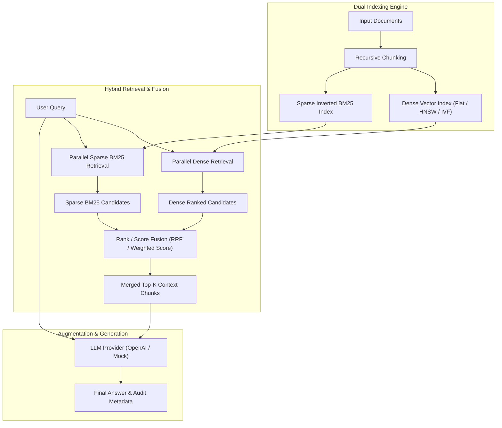

# 04 — Hybrid RAG Production Engine (TypeScript)

A production-grade implementation of **Hybrid Retrieval-Augmented Generation (Hybrid RAG)** in TypeScript.

It combines **Dense Vector Search** (semantic understanding using embeddings & vector store indexes) and **Sparse Lexical Search** (exact identifier and keyword matching using BM25 & inverted indexes) with **Reciprocal Rank Fusion (RRF)** and **Weighted Score Fusion**.

---

## 📌 Architecture Overview



---

## 🚀 Features

1. **Dual Indexing Subsystem**:
   - **Dense Vector Search**: Flat brute-force, HNSW graph ANN, and IVF cluster ANN indexes supporting Cosine, Dot Product, and Euclidean distance metrics.
   - **Sparse Lexical Search**: Technical tokenization preserving error codes (`ERR_CONNECTION_TIMED_OUT`, `0x80004005`), API names (`createPaymentIntent`), SKUs (`TX-9021-B`), lowercasing, stop-word removal, and BM25 parameter tuning ($k_1=1.5, b=0.75$).

2. **Rank & Score Fusion Algorithms**:
   - **Reciprocal Rank Fusion (RRF)**: $RRFScore(d) = \sum \frac{1}{k + Rank_m(d)}$ with configurable $k=60$.
   - **Weighted Score Fusion**: $HybridScore(d) = \alpha \cdot NormalizedDense + (1-\alpha) \cdot NormalizedSparse$.
   - **Score Normalizers**: MinMax, Z-Score with Sigmoid scaling, and Softmax probability distributions.
   - **Weighted RRF**: Custom weighting on reciprocal rank contributions.

3. **Analytics & Comparative Benchmarking**:
   - Kendall's Tau & Spearman Rank Correlation metrics.
   - Jaccard similarity and candidate overlap percentage.
   - Automated comparative performance runner (Dense vs Sparse vs Hybrid).

4. **CLI & Offline Support**:
   - Interactive command-line interface powered by Commander.
   - Built-in Mock Embeddings and Mock LLM for instant, fast, zero-dependency offline testing.

---

## 🛠️ Installation & Setup

```bash
cd 04-hybrid-rag/code

# Install dependencies
npm install

# Build TypeScript output
npm run build
```

---

## 💻 CLI Commands

### 1. Index Documents
```bash
npx ts-node src/cli.ts index sample_data/technical_docs.md
```

### 2. Search Hybrid Candidates
```bash
npx ts-node src/cli.ts search "ERR_CONNECTION_TIMED_OUT in React" --top-k 5
```

### 3. Mathematical Fusion Explanation
```bash
npx ts-node src/cli.ts explain "How to fix network connection timeout?"
```

### 4. Complete RAG Answer Generation
```bash
npx ts-node src/cli.ts ask "What causes ERR_CONNECTION_TIMED_OUT?"
```

### 5. Run Performance Benchmark
```bash
npx ts-node src/cli.ts benchmark sample_data/technical_docs.md
```

---

## 🧪 Running Unit & Integration Tests

```bash
# Run full Jest test suite
npm test

# Run tests with code coverage report
npm run test:coverage
```

---

## 📖 Programmatic API Usage Example

```typescript
import { HybridRAGPipeline, FileLoader } from '@rag-lab/hybrid-rag';

async function main() {
  const pipeline = new HybridRAGPipeline();

  // 1. Index documents
  const doc = FileLoader.loadFile('sample_data/technical_docs.md');
  await pipeline.indexDocuments([doc]);

  // 2. Perform Hybrid Search with RRF Fusion
  const hybridResults = await pipeline.search('ERR_CONNECTION_TIMED_OUT', {
    topK: 3,
    fusionStrategy: 'rrf',
    rrfK: 60
  });

  console.log(hybridResults);

  // 3. Generate Answer
  const response = await pipeline.answer('How to resolve ERR_CONNECTION_TIMED_OUT?');
  console.log(response.answer);
}

main();
```
