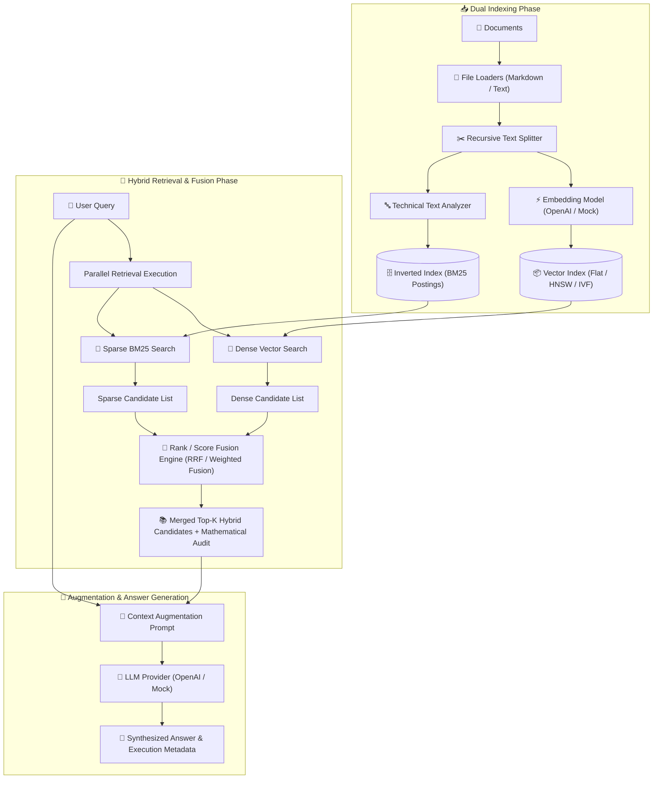

# 📘 04 — Hybrid RAG Implementation Guide

Welcome to the comprehensive, step-by-step implementation guide for **Hybrid RAG (Dense Vector Search + Sparse BM25 Search + Reciprocal Rank Fusion)**.

This guide provides an end-to-end tutorial covering why Hybrid RAG is required, how it bridges the gaps of both Vector RAG and Keyword RAG, the mathematical foundations of **Reciprocal Rank Fusion (RRF)** and **Weighted Score Fusion**, score normalization techniques (MinMax, Z-Score, Softmax), dual-indexing pipelines, LLM context synthesis, comparative benchmarking, and CLI execution.

All corresponding production-grade source code and unit tests are located in [04-hybrid-rag/code](../code).

---

## 🏗️ Architecture & Component Flow



---

## 📚 Chapters Index

| Chapter | Title | Focus Topics & Core Code Modules |
| :--- | :--- | :--- |
| **[Chapter 0](./00-introduction-and-hybrid-rag-math.md)** | **Introduction & Mathematical Foundations of Hybrid RAG** | Why Hybrid RAG is needed, Vector RAG vs Keyword RAG trade-offs, raw score incomparability, Reciprocal Rank Fusion ($RRF$), MinMax/Z-Score/Softmax normalizers, Weighted Score Fusion — [`schemas.ts`](../code/src/schemas.ts) |
| **[Chapter 1](./01-domain-schemas-and-project-setup.md)** | **Domain Schemas & Project Setup** | TypeScript infrastructure, `Document`, `Chunk`, `DenseRetrievalResult`, `SparseRetrievalResult`, `HybridRetrievalResult`, `FusionExplanation`, `HybridConfig` — [`schemas.ts`](../code/src/schemas.ts) |
| **[Chapter 2](./02-dense-vector-search-subsystem.md)** | **Dense Vector Search Subsystem** | Vector distance metrics (Cosine, Dot Product, Euclidean), `FlatVectorIndex`, `HNSWVectorIndex`, `IVFVectorIndex`, `VectorStore`, Mock & OpenAI embedding models — [`dense/`](../code/src/dense/), [`embeddings/`](../code/src/embeddings/) |
| **[Chapter 3](./03-sparse-bm25-subsystem.md)** | **Sparse BM25 Search Subsystem** | `TechnicalTextAnalyzer` preserving exact error codes & SKUs, `InvertedIndex`, postings lists, `BM25Engine` ($k_1=1.5, b=0.75$) — [`sparse/`](../code/src/sparse/) |
| **[Chapter 4](./04-rank-and-score-fusion-engine.md)** | **Rank & Score Fusion Subsystem** | `ScoreNormalizer` (MinMax, ZScore+Sigmoid, Softmax), `ReciprocalRankFusion` ($k=60$), `WeightedScoreFusion`, `WeightedRRF`, `FusionExplainer` — [`fusion/`](../code/src/fusion/) |
| **[Chapter 5](./05-document-loaders-and-text-splitters.md)** | **Document Loaders & Text Splitters** | `FileLoader` (Text & Markdown files/directories), `RecursiveTextSplitter` preserving character offsets and token counts — [`loaders/`](../code/src/loaders/), [`splitters/`](../code/src/splitters/) |
| **[Chapter 6](./06-llm-generators-and-context-augmentation.md)** | **LLM Generators & Context Augmentation** | `LLMProvider` contract, `MockLLMProvider`, `OpenAILLMProvider` integration with system/user prompt formatting — [`llm/`](../code/src/llm/) |
| **[Chapter 7](./07-end-to-end-hybrid-rag-pipeline.md)** | **End-to-End Hybrid RAG Pipeline** | `HybridRAGPipeline` orchestrator, dual indexing, parallel query execution, latency and metadata tracking — [`pipeline/hybrid-pipeline.ts`](../code/src/pipeline/hybrid-pipeline.ts) |
| **[Chapter 8](./08-comparative-benchmarking-and-rank-correlation.md)** | **Comparative Benchmarking & Rank Correlation** | `RankCorrelationAnalyzer` (Kendall's Tau, Spearman's Rho, Jaccard index), `HybridBenchmarkRunner` for evaluating Dense vs Sparse vs Hybrid RAG — [`analysis/`](../code/src/analysis/) |
| **[Chapter 9](./09-interactive-cli-and-testing-suite.md)** | **Interactive CLI & Testing Suite** | Commander CLI (`index`, `search`, `explain`, `ask`, `benchmark`), Jest test suites — [`cli.ts`](../code/src/cli.ts), [`tests/`](../code/tests/) |

---

## 🚀 Quick Execution Guide

1. Navigate to code directory:
   ```bash
   cd 04-hybrid-rag/code
   ```
2. Build TypeScript package:
   ```bash
   npm run build
   ```
3. Run Jest test suite:
   ```bash
   npm test
   ```
4. Perform Hybrid Search CLI:
   ```bash
   npx ts-node src/cli.ts search "ERR_CONNECTION_TIMED_OUT in React" --top-k 5
   ```
5. View Mathematical Fusion Audit:
   ```bash
   npx ts-node src/cli.ts explain "How to fix connection timeout?"
   ```
6. Generate Answer via RAG Pipeline:
   ```bash
   npx ts-node src/cli.ts ask "What causes ERR_CONNECTION_TIMED_OUT?"
   ```
7. Run Comparative Benchmark:
   ```bash
   npx ts-node src/cli.ts benchmark sample_data/technical_docs.md
   ```
