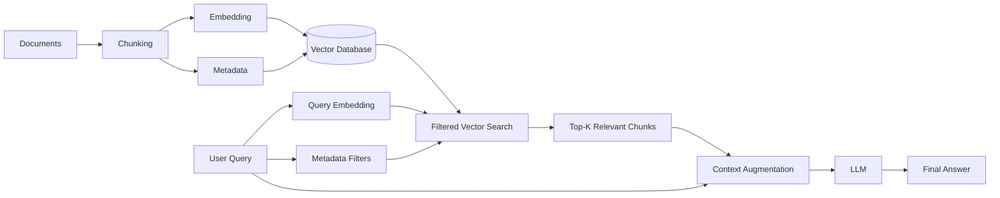
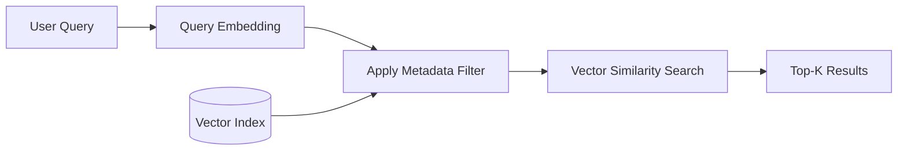
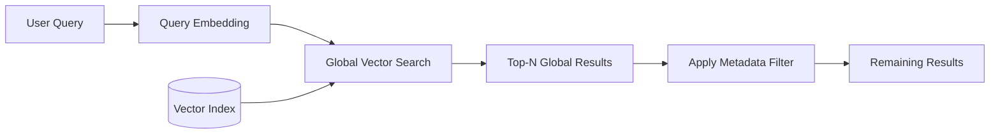
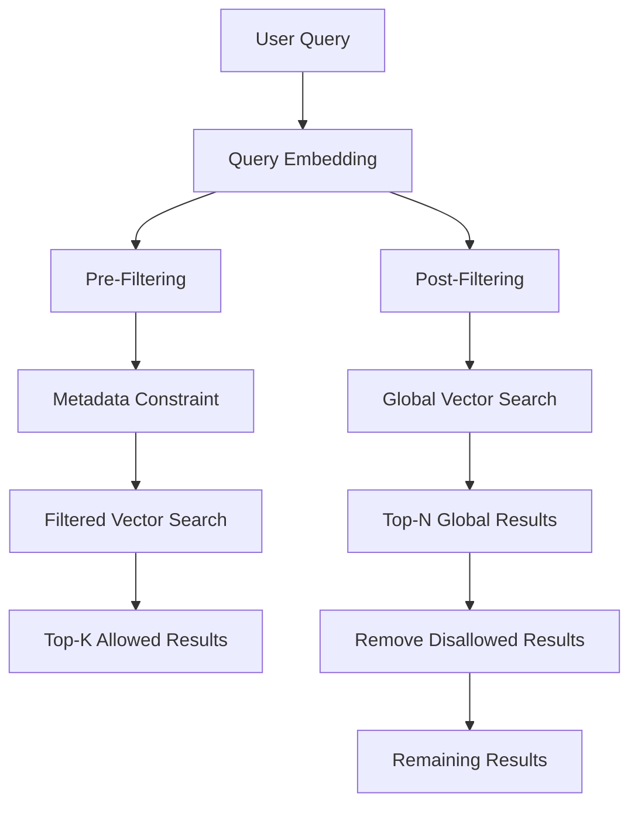
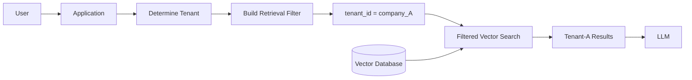
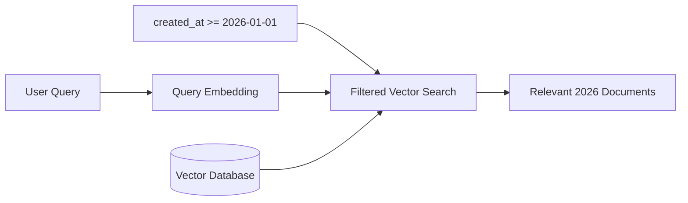
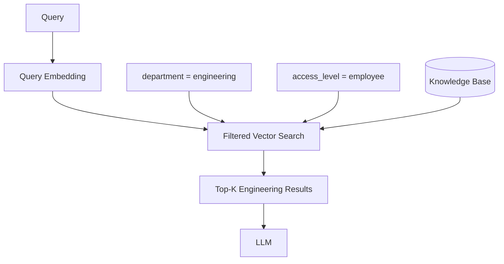
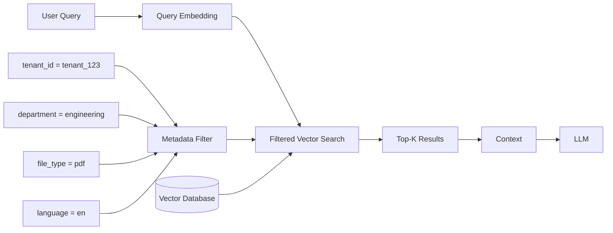
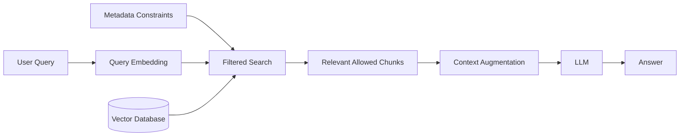

# 05 — Metadata-Filtered RAG

## 📌 Overview

**Metadata-Filtered RAG** combines semantic retrieval with structured metadata constraints.

Instead of searching the entire vector index, the retriever first restricts the searchable documents using metadata such as:

* `user_id`
* `tenant_id`
* `department`
* `created_at`
* `file_type`
* `document_type`
* `language`
* `access_level`
* `project_id`
* `source`

For example:

```text
User Query:
"What is our refund policy?"

Metadata Filter:
tenant_id = "tenant_123"
file_type = "pdf"
department = "finance"
```

The vector search then operates within the allowed/desired subset.

---

# 🏗️ Basic Architecture



The key difference from basic Vector RAG is the additional **metadata filtering step**.

---

# 🗂️ What Is Metadata?

Metadata is structured information associated with a document or chunk.

For example:

```json
{
  "text": "Employees are eligible for 20 days of annual leave...",
  "embedding": [0.021, -0.442, 0.731],
  "metadata": {
    "tenant_id": "tenant_123",
    "department": "hr",
    "file_type": "pdf",
    "language": "en",
    "created_at": "2026-08-15",
    "access_level": "employee"
  }
}
```

The vector represents the **semantic content**.

The metadata describes the **structured properties and provenance** of that content.

```text
Vector
  ↓
"What does this content mean?"

Metadata
  ↓
"What is this content, where did it come from,
and which subset should be searched?"
```

---

# 🔎 Why Metadata Filtering Matters

Without metadata filtering, a vector search may retrieve semantically relevant content from the wrong source, tenant, department, or time period.

Consider a multi-tenant application:

```text
Tenant A
 ├── Company policies
 ├── Customer documents
 └── Internal reports

Tenant B
 ├── Company policies
 ├── Customer documents
 └── Internal reports
```

A query such as:

```text
"What is our company's refund policy?"
```

could semantically match documents belonging to both tenants.

The retrieval system should therefore constrain the search:

```text
tenant_id = "tenant_A"
```

before selecting the most relevant chunks.

---

# 1️⃣ Pre-Filtering

**Pre-filtering** applies metadata constraints during the vector search itself.

Conceptually:



For example:

```sql
SELECT *
FROM embeddings
WHERE tenant_id = 'tenant_123'
  AND file_type = 'pdf'
ORDER BY vector <=> query_embedding
LIMIT 5;
```

The exact syntax depends on the vector database.

### Why Pre-Filtering Is Usually Preferred

The search is constrained to the relevant subset rather than retrieving globally and filtering afterward.

This can provide:

* Better result correctness
* Better tenant isolation
* More predictable retrieval
* Lower unnecessary candidate processing
* Better behavior when the filtered subset is small

However, implementation details vary by vector database and index type. Not every system applies filters in exactly the same way.

---

# 2️⃣ Post-Filtering

With **post-filtering**, the system first retrieves globally similar documents and then removes documents that don't satisfy the metadata constraints.



For example:

```text
Global Top 5:

1. Tenant B document
2. Tenant C document
3. Tenant B document
4. Tenant A document
5. Tenant C document

Filter:
tenant_id = Tenant A

Result:

4. Tenant A document
```

You may end up with only one result—or even zero results—even though relevant documents exist inside Tenant A.

---

# ⚠️ Pre-Filtering vs Post-Filtering



| Feature                                  | Pre-Filtering               | Post-Filtering                |
| ---------------------------------------- | --------------------------- | ----------------------------- |
| Filter timing                            | Before/during retrieval     | After retrieval               |
| Search scope                             | Restricted subset           | Global index first            |
| Result quality under restrictive filters | Usually better              | Can degrade                   |
| Zero-result risk                         | Lower                       | Higher                        |
| Candidate waste                          | Lower                       | Higher                        |
| Multi-tenant isolation                   | Stronger retrieval boundary | Riskier if poorly implemented |
| Implementation                           | Depends on database         | Generally simple              |
| Production preference                    | Usually preferred           | Useful in some scenarios      |

---

# 🔐 Multi-Tenant RAG

Metadata filtering becomes especially important in **multi-tenant RAG systems**.

Suppose:

```text
tenant_id = company_A
```

A user's query should only retrieve documents belonging to the appropriate tenant.



### Important Security Principle

Metadata filtering should **not be treated as the only authorization mechanism**.

A production application should establish the user's permissions independently and then construct retrieval filters from trusted authorization context.

For example:

```text
Authenticated User
        ↓
Authorization Layer
        ↓
Allowed tenant / projects / documents
        ↓
Retrieval Filter
        ↓
Vector Search
```

Never blindly trust a `tenant_id` or `user_id` supplied directly by the client.

---

# 🧩 Common Metadata Filters

Metadata filters can support many types of constraints.

### Equality

```text
file_type = "pdf"
```

### Multiple Conditions

```text
tenant_id = "tenant_123"
AND department = "engineering"
```

### Numeric Conditions

```text
price >= 1000
```

### Date Filtering

```text
created_at >= "2026-01-01"
```

### Set Membership

```text
department IN ["engineering", "product"]
```

### Boolean Conditions

```text
is_public = true
```

The exact filter syntax varies by vector database.

---

# 📅 Example: Time-Based Retrieval

Suppose a user asks:

```text
"What changed in our API documentation this year?"
```

You may combine semantic search with a date constraint:

```text
created_at >= 2026-01-01
```

Conceptually:



This prevents older documents from competing with the intended time range.

---

# 📄 Example: File-Type Filtering

Suppose the knowledge base contains:

```text
PDF
DOCX
TXT
Markdown
Web Pages
```

The user asks:

```text
"Find the official PDF policy."
```

A filter such as:

```text
file_type = "pdf"
```

can restrict retrieval to PDF documents.

---

# 🏢 Example: Department Filtering

A company may have:

```text
HR
Finance
Engineering
Sales
Legal
```

A query from an engineering workspace might use:

```text
department = "engineering"
```

The retrieval pipeline becomes:



---

# 🔀 Combining Multiple Filters

Metadata filtering becomes especially powerful when multiple constraints are combined.

Example:

```text
tenant_id = "tenant_123"
AND department = "engineering"
AND file_type = "pdf"
AND language = "en"
```

Conceptually:



---

# 🆚 Vector RAG vs Metadata-Filtered RAG

| Feature                | Vector RAG   | Metadata-Filtered RAG |
| ---------------------- | ------------ | --------------------- |
| Semantic retrieval     | ✅            | ✅                     |
| Metadata constraints   | ❌ / Optional | ✅                     |
| Tenant isolation       | ⚠️           | ✅                     |
| Date filtering         | ⚠️           | ✅                     |
| File-type filtering    | ⚠️           | ✅                     |
| Department filtering   | ⚠️           | ✅                     |
| Access-aware retrieval | ⚠️           | ✅                     |
| Search scope control   | Limited      | Strong                |
| Complexity             | Low          | Medium                |

Metadata filtering does **not replace vector retrieval**.

It adds another retrieval constraint:

> **Semantic similarity + structured filtering**

---

# ⚖️ Tradeoffs

## ✅ Advantages

* Restricts retrieval to relevant subsets
* Improves retrieval precision
* Useful for multi-tenant applications
* Supports access-aware retrieval
* Enables date and category filtering
* Reduces irrelevant candidates
* Works well with vector and hybrid retrieval
* Makes large knowledge bases easier to navigate

## ❌ Limitations

* Requires well-designed metadata
* Metadata must be correctly maintained
* Poor metadata can produce poor retrieval
* Complex filters can increase query complexity
* Filter/index behavior varies between vector databases
* Highly restrictive filters can produce too few results
* Metadata filtering alone is not a complete authorization system

---

# 🧠 Key Mental Model

Remember Metadata-Filtered RAG as:



The core idea is:

> **Filter the search space → perform retrieval → generate from the allowed relevant context**

Or more simply:

```text
Query
  +
Metadata Filters
  ↓
Filtered Retrieval
  ↓
Relevant Context
  ↓
LLM
  ↓
Answer
```

---

# 📌 Key Takeaway

**Metadata-Filtered RAG = Semantic Retrieval + Structured Constraints.**

The most important concepts to understand are:

1. **Metadata**
2. **Metadata filters**
3. **Pre-filtering**
4. **Post-filtering**
5. **Tenant isolation**
6. **Access-aware retrieval**
7. **Date/category filtering**
8. **Multiple filter conditions**
9. **Filtered vector search**
10. **Authorization vs retrieval filtering**

The progression so far is:

```text
01 Basic RAG
      ↓
02 Vector RAG
      ↓
03 Keyword / Sparse RAG
      ↓
04 Hybrid RAG
      ↓
05 Metadata-Filtered RAG
```

The key lesson is:

> **Vector similarity tells you what is relevant; metadata filters tell you what is eligible to be searched.**

Metadata filtering becomes even more powerful when combined with **Hybrid RAG** and **Reranking**, which are common patterns in production retrieval systems.
