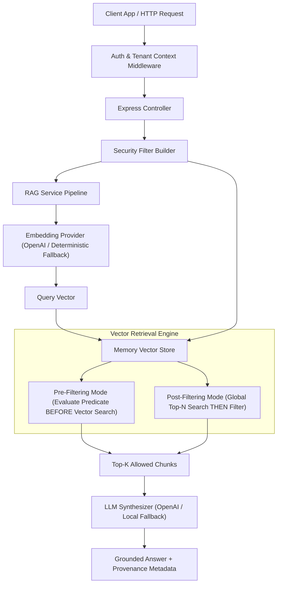

# 05 — Metadata-Filtered RAG Engine (Express Backend)

Production-grade **Metadata-Filtered RAG Engine** implemented in **TypeScript** with an **Express HTTP Backend API**, supporting **Pre-Filtering**, **Post-Filtering**, **Multi-Tenant Authorization Security**, **Filter Evaluation Benchmarks**, **CLI Tools**, and comprehensive **Jest Tests**.

---

## 📌 Architecture Overview



---

## 🚀 Key Features

1. **Pre-Filtering & Post-Filtering Engines**:
   - **Pre-Filtering**: Evaluates metadata filter predicates *before/during* vector similarity calculation. Prevents candidate starvation and guarantees top-K retrieval within valid metadata boundaries.
   - **Post-Filtering**: Performs global top-N vector search, then filters non-matching candidates. Demonstrates candidate waste and zero-result starvation when restrictive metadata filters are used.
2. **Rich Metadata Expression Evaluator**:
   - Supports `$eq`, `$ne`, `$gt`, `$gte`, `$lt`, `$lte`, `$in`, `$nin`, `$contains`.
   - Supports complex logical compositions (`$and`, `$or`, `$not`).
   - Supports numbers, string booleans, ISO date ranges (`created_at`), and array metadata tags.
3. **Multi-Tenant Isolation & Access Control**:
   - `SecurityFilterBuilder` automatically injects mandatory `tenant_id` and `access_level` constraints derived from authenticated user context, sanitizing any client attempt to bypass authorization boundaries.
4. **Express REST API Backend**:
   - Clean architecture (Middlewares, Controllers, Services, Repositories/Stores, DTOs with Zod validation).
   - Endpoints for Document Ingestion, Metadata-Filtered Search, RAG Querying, Pre vs Post Filtering Benchmark, and System Health.
5. **Zero-Dependency Fallbacks**:
   - Runs out-of-the-box using deterministic local mock embeddings and LLM answer synthesizer when no `OPENAI_API_KEY` is provided, while seamlessly using real OpenAI models when configured.
6. **CLI & Benchmark Tools**:
   - Interactive CLI commands to seed sample enterprise documents, run filtered searches, execute RAG, and benchmark pre-filtering vs post-filtering performance.

---

## ⚙️ Installation & Quick Start

```bash
# Navigate to code directory
cd 05-metadata-filtering/code

# Install dependencies
npm install

# Copy environment configuration
cp .env.example .env

# Run unit & integration tests
npm test

# Build TypeScript to dist
npm run build
```

---

## 🏃 Running the Server & CLI

### Express API Backend

```bash
# Start server in development mode
npm run dev

# Or start compiled production server
npm start
```

Server starts on `http://localhost:3000`.

### Command Line Interface (CLI)

```bash
# Seed enterprise sample dataset
npx ts-node src/cli.ts seed

# Run metadata-filtered vector search (Pre-Filtering)
npx ts-node src/cli.ts search -q "refund policy" --tenant tenant_101 --department finance --mode pre-filter

# Run full Metadata-Filtered RAG query
npx ts-node src/cli.ts query -q "What is our refund policy?" --tenant tenant_101

# Run Pre-Filtering vs Post-Filtering Benchmark Report
npx ts-node src/cli.ts benchmark -q "refund policy" --tenant tenant_101
```

---

## 📡 REST API Reference

### 1. Ingest Document
`POST /api/v1/documents/ingest`

```json
{
  "content": "Tenant 101 Official Finance Policy: Refund requests for software subscriptions are processed within 14 business days.",
  "metadata": {
    "tenant_id": "tenant_101",
    "department": "finance",
    "file_type": "pdf",
    "document_type": "policy",
    "created_at": "2026-03-15",
    "access_level": 2
  }
}
```

### 2. Metadata-Filtered Search
`POST /api/v1/search`

Headers:
- `x-tenant-id`: `tenant_101`
- `x-department`: `finance`

```json
{
  "query": "refund policy",
  "mode": "pre-filter",
  "topK": 5,
  "filter": {
    "file_type": "pdf",
    "created_at": { "$gte": "2026-01-01" }
  }
}
```

### 3. Metadata-Filtered RAG Query
`POST /api/v1/rag/query`

Headers:
- `x-tenant-id`: `tenant_101`
- `x-department`: `finance`

```json
{
  "question": "What is our refund policy?",
  "mode": "pre-filter",
  "topK": 3
}
```

### 4. Run Filter Comparison Benchmark
`POST /api/v1/benchmark/filter-comparison`

```json
{
  "query": "refund policy",
  "filter": {
    "tenant_id": "tenant_101"
  },
  "postFilterCandidateLimits": [2, 5, 10, 20]
}
```

### 5. Health Check & Index Stats
`GET /api/v1/health`

---

## 🧪 Testing

```bash
npm test
```

Tests cover:
- Filter evaluation logic (`$eq`, `$ne`, `$gt`, `$gte`, `$in`, `$contains`, `$and`, `$or`, `$not`).
- Pre-filtering vs Post-filtering vector store retrieval behavior and candidate starvation tests.
- Security filter injection and tenant isolation guards.
- End-to-end Express API route integration testing via `supertest`.
