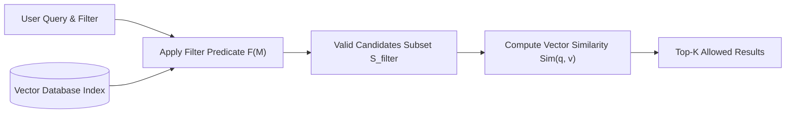
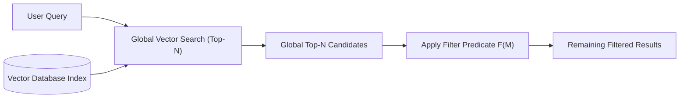

# 🧠 Chapter 0 — Introduction & Mathematical Foundations of Metadata-Filtered RAG

Welcome to Chapter 0 of the **Metadata-Filtered RAG Implementation Guide**. In this chapter, we explore why metadata filtering is indispensable in enterprise RAG applications, the mathematical difference between vector similarity search and metadata filtering, the mechanics of **Pre-Filtering** versus **Post-Filtering**, and the core principles of multi-tenant security.

All corresponding production-grade TypeScript code is located in [`05-metadata-filtering/code`](../code).

---

## 1. What is Metadata-Filtered RAG?

Standard Vector RAG operates exclusively on semantic similarity: given a query vector $\vec{q}$, it finds document chunk vectors $\vec{v}_i$ that maximize a similarity metric such as Cosine Similarity:

$$\text{Sim}(\vec{q}, \vec{v}_i) = \frac{\vec{q} \cdot \vec{v}_i}{\|\vec{q}\| \|\vec{v}_i\|}$$

While semantic search is excellent at understanding conceptual intent (e.g., matching "refund request" with "reimbursement policy"), it lacks structured awareness. A purely vector-based search cannot distinguish whether a document chunk belongs to **Tenant A** vs **Tenant B**, whether it was published in **2024** vs **2026**, or whether the user has **Manager** vs **Employee** access permissions.

**Metadata-Filtered RAG** combines **semantic vector retrieval** with **structured metadata constraints**:

$$\text{Eligible Results} = \arg\max_{i \in S_{\text{filter}}} \text{Sim}(\vec{q}, \vec{v}_i)$$

where $S_{\text{filter}}$ is the subset of all documents satisfying a boolean filter predicate $\mathcal{F}(M_i) = \text{True}$.

---

## 2. Key Metadata Attributes in Enterprise Applications

| Metadata Attribute | Example Value | Use Case |
| :--- | :--- | :--- |
| `tenant_id` | `"tenant_101"` | Strict multi-tenant data isolation |
| `department` | `"finance"`, `"engineering"` | Workspace or department scoping |
| `created_at` | `"2026-03-15"` | Time-based range queries |
| `file_type` | `"pdf"`, `"md"`, `"txt"` | Document format filtering |
| `access_level` | `1` (Public), `2` (Employee), `3` (Manager), `4` (Exec) | Role-based document access control |
| `is_public` | `true`, `false` | Public domain override |
| `language` | `"en"`, `"es"`, `"fr"` | Localization filtering |

---

## 3. Pre-Filtering vs Post-Filtering Mechanics

### 3.1 Pre-Filtering (Filtered Vector Search)

In **Pre-Filtering**, the metadata constraint predicate $\mathcal{F}(M_i)$ is evaluated **before or during** vector similarity search. Only candidate items that satisfy $\mathcal{F}(M_i) = \text{True}$ are evaluated for vector similarity and ranked.



#### Advantages of Pre-Filtering:
1. **Zero Candidate Starvation**: Guarantees that all $K$ returned results satisfy the metadata constraint (provided at least $K$ matching documents exist in the dataset).
2. **Strict Multi-Tenant Isolation**: Completely prevents documents from unauthorized tenants from being considered during top-$K$ selection.
3. **No Candidate Waste**: Similarity metrics are calculated only for eligible records.

---

### 3.2 Post-Filtering (Global Vector Search + Filter)

In **Post-Filtering**, global vector similarity search is executed across the *entire unpartitioned index* first to yield a global candidate list of size $N$ ($\text{postFilterCandidateLimit}$). The metadata filter predicate is then applied to filter out non-matching candidates.



#### The Major Risk: Candidate Starvation & Zero Results
Suppose an index contains 10,000 documents across 100 tenants. If a user queries for Tenant A's refund policy, and a global Top 10 vector search yields documents where 9 belong to Tenant B and 1 belongs to Tenant C, post-filtering will discard all 10 candidates! The user receives **0 results** even though Tenant A has relevant documents in the database.

#### Candidate Waste Ratio
$$\text{Candidate Waste Ratio} = \frac{N - K_{\text{valid}}}{N}$$

where $N$ is the number of global vectors evaluated and $K_{\text{valid}}$ is the number of candidates that survived the post-filter.

---

## 4. Multi-Tenant Security Principle

> **Crucial Security Principle**: Metadata filtering alone is NOT an authorization system.

Never trust client-supplied `tenant_id` or `user_id` values directly. An enterprise application must establish user identity and permissions at the **Authentication Layer** and inject trusted security guards programmatically:

```text
Authenticated User Context (JWT / Session)
        ↓
Security Filter Builder (Inject tenant_id, access_level)
        ↓
Authorized Metadata Filter
        ↓
Vector Database Pre-Filtering Search
```

In Chapter 1, we begin building the domain schemas and project infrastructure to implement this system.
