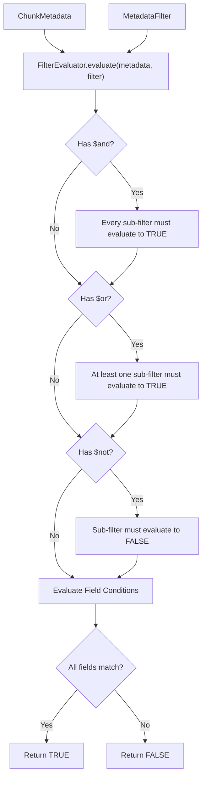

# 🔬 Chapter 2 — Metadata Filter Evaluator Subsystem

Welcome to Chapter 2 of the **Metadata-Filtered RAG Implementation Guide**. In this chapter, we detail the implementation of `FilterEvaluator`, the core engine responsible for evaluating structured document metadata against arbitrary boolean filter expressions.

Source code module: [`05-metadata-filtering/code/src/filters/evaluator.ts`](../code/src/filters/evaluator.ts).

---

## 1. Filter Evaluator Architecture

The `FilterEvaluator` evaluates a `ChunkMetadata` object against a `MetadataFilter` using a recursive Abstract Syntax Tree (AST) traversal.



---

## 2. Source Code Implementation: `FilterEvaluator`

File: [`05-metadata-filtering/code/src/filters/evaluator.ts`](../code/src/filters/evaluator.ts)

```typescript
import { ChunkMetadata } from '../types/document.types';
import { ConditionFilter, FilterValue, MetadataFilter } from '../types/filter.types';

export class FilterEvaluator {
  /**
   * Main entry point: checks if metadata matches the filter.
   */
  public static evaluate(metadata: ChunkMetadata, filter?: MetadataFilter): boolean {
    if (!filter || Object.keys(filter).length === 0) {
      return true;
    }

    // Process logical $and
    if (filter.$and && Array.isArray(filter.$and)) {
      const andMatch = filter.$and.every((subFilter) =>
        this.evaluate(metadata, subFilter)
      );
      if (!andMatch) return false;
    }

    // Process logical $or
    if (filter.$or && Array.isArray(filter.$or)) {
      const orMatch = filter.$or.some((subFilter) =>
        this.evaluate(metadata, subFilter)
      );
      if (!orMatch) return false;
    }

    // Process logical $not
    if (filter.$not && typeof filter.$not === 'object') {
      const notMatch = !this.evaluate(metadata, filter.$not);
      if (!notMatch) return false;
    }

    // Process field-level conditions
    for (const [key, filterExpr] of Object.entries(filter)) {
      if (key === '$and' || key === '$or' || key === '$not') {
        continue;
      }

      if (filterExpr === undefined) {
        continue;
      }

      const fieldValue = metadata[key];

      if (!this.evaluateField(fieldValue, filterExpr as FilterValue | ConditionFilter)) {
        return false;
      }
    }

    return true;
  }

  /**
   * Evaluates a single metadata field against a value or conditional filter object.
   */
  private static evaluateField(
    fieldValue: unknown,
    filterExpr: FilterValue | ConditionFilter
  ): boolean {
    // Implicit $eq or direct primitive / array matching
    if (
      typeof filterExpr !== 'object' ||
      filterExpr === null ||
      Array.isArray(filterExpr)
    ) {
      return this.compareEq(fieldValue, filterExpr);
    }

    const condition = filterExpr as ConditionFilter;
    let isMatch = true;

    for (const [operator, operand] of Object.entries(condition)) {
      if (operand === undefined) continue;

      switch (operator) {
        case '$eq':
          isMatch = this.compareEq(fieldValue, operand);
          break;
        case '$ne':
          isMatch = !this.compareEq(fieldValue, operand);
          break;
        case '$gt':
          isMatch = this.compareRange(fieldValue, operand, (a, b) => a > b);
          break;
        case '$gte':
          isMatch = this.compareRange(fieldValue, operand, (a, b) => a >= b);
          break;
        case '$lt':
          isMatch = this.compareRange(fieldValue, operand, (a, b) => a < b);
          break;
        case '$lte':
          isMatch = this.compareRange(fieldValue, operand, (a, b) => a <= b);
          break;
        case '$in':
          isMatch = this.compareIn(fieldValue, operand);
          break;
        case '$nin':
          isMatch = !this.compareIn(fieldValue, operand);
          break;
        case '$contains':
          isMatch = this.compareContains(fieldValue, operand);
          break;
        default:
          throw new Error(`Unsupported filter operator: ${operator}`);
      }

      if (!isMatch) return false;
    }

    return true;
  }

  private static compareEq(fieldValue: unknown, operand: unknown): boolean {
    if (fieldValue === operand) return true;
    if (Array.isArray(fieldValue)) return fieldValue.includes(operand);
    return false;
  }

  private static compareRange(
    fieldValue: unknown,
    operand: unknown,
    comparator: (a: number, b: number) => boolean
  ): boolean {
    if (fieldValue === undefined || fieldValue === null) return false;

    if (typeof fieldValue === 'number' && typeof operand === 'number') {
      return comparator(fieldValue, operand);
    }

    if (typeof fieldValue === 'string' && typeof operand === 'string') {
      const dateA = Date.parse(fieldValue);
      const dateB = Date.parse(operand);
      if (!isNaN(dateA) && !isNaN(dateB)) {
        return comparator(dateA, dateB);
      }
      return comparator(fieldValue.localeCompare(operand), 0);
    }

    return false;
  }

  private static compareIn(fieldValue: unknown, operand: unknown): boolean {
    if (!Array.isArray(operand)) return false;
    if (fieldValue === undefined || fieldValue === null) return false;
    if (Array.isArray(fieldValue)) {
      return fieldValue.some((val) => operand.includes(val as never));
    }
    return operand.includes(fieldValue as never);
  }

  private static compareContains(fieldValue: unknown, operand: unknown): boolean {
    if (fieldValue === undefined || fieldValue === null) return false;
    if (Array.isArray(fieldValue)) return fieldValue.includes(operand);
    if (typeof fieldValue === 'string' && typeof operand === 'string') {
      return fieldValue.toLowerCase().includes(operand.toLowerCase());
    }
    return false;
  }
}
```

---

## 3. Supported Filter Examples

### Equality & Multiple Fields
```json
{
  "tenant_id": "tenant_101",
  "department": "finance",
  "file_type": "pdf"
}
```

### Date & Access Level Range
```json
{
  "created_at": { "$gte": "2026-01-01", "$lte": "2026-12-31" },
  "access_level": { "$lte": 3 }
}
```

### Set Membership & Logical Disjunction
```json
{
  "$or": [
    { "is_public": true },
    { "department": { "$in": ["engineering", "product"] } }
  ]
}
```
