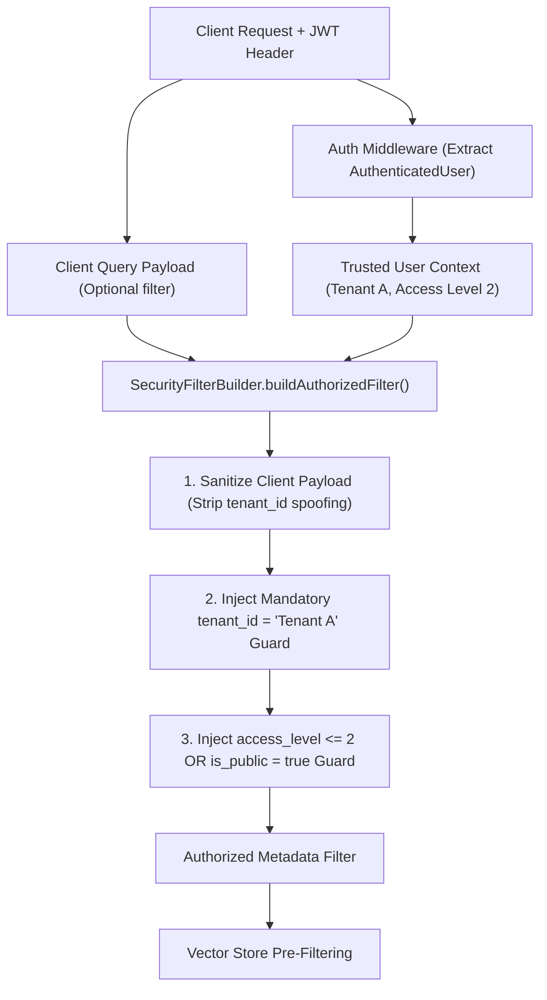

# 🔐 Chapter 4 — Multi-Tenant Security & Authorization Guards

Welcome to Chapter 4 of the **Metadata-Filtered RAG Implementation Guide**. In this chapter, we focus on multi-tenant security architecture, authorization policy enforcement, and how to construct secure retrieval filters using `SecurityFilterBuilder`.

Source code module: [`05-metadata-filtering/code/src/filters/securityFilter.ts`](../code/src/filters/securityFilter.ts).

---

## 1. Multi-Tenant Authorization Security Model

In an enterprise application serving multiple customers (tenants), retrieving data from Tenant B when answering a query for Tenant A is a critical security breach.



---

## 2. Source Code Implementation: `SecurityFilterBuilder`

File: [`05-metadata-filtering/code/src/filters/securityFilter.ts`](../code/src/filters/securityFilter.ts)

```typescript
import { AuthenticatedUser } from '../types/api.types';
import { MetadataFilter } from '../types/filter.types';

export class SecurityFilterBuilder {
  /**
   * Constructs an authorized MetadataFilter by combining tenant isolation and
   * permission constraints with any optional client-supplied query filter.
   */
  public static buildAuthorizedFilter(
    user: AuthenticatedUser,
    clientFilter?: MetadataFilter
  ): MetadataFilter {
    const securityConstraints: MetadataFilter[] = [];

    // 1. Mandatory Tenant Isolation Guard
    securityConstraints.push({
      tenant_id: user.tenant_id,
    });

    // 2. Access Level & Public Access Guard:
    // Content is accessible if (access_level <= user.access_level) OR (is_public == true)
    securityConstraints.push({
      $or: [
        { is_public: true },
        { access_level: { $lte: user.access_level } },
      ],
    });

    // 3. Department Boundary Guard (if user belongs to specific department(s))
    if (user.departments && user.departments.length > 0) {
      securityConstraints.push({
        $or: [
          { is_public: true },
          { department: { $in: user.departments } },
          { department: { $eq: undefined } }, // General company documents
        ],
      });
    }

    // Combine security constraints with client-supplied filter
    if (clientFilter && Object.keys(clientFilter).length > 0) {
      // Sanitize client filter: strip any attempt to override tenant_id directly
      const sanitizedClientFilter = this.sanitizeClientFilter(clientFilter);
      securityConstraints.push(sanitizedClientFilter);
    }

    return {
      $and: securityConstraints,
    };
  }

  /**
   * Removes client attempts to spoof tenant_id or bypass authorization boundaries.
   */
  private static sanitizeClientFilter(filter: MetadataFilter): MetadataFilter {
    const copy = JSON.parse(JSON.stringify(filter)) as MetadataFilter;

    // Delete direct tenant_id key from client filter to prevent tenant escalation
    if ('tenant_id' in copy) {
      delete copy.tenant_id;
    }

    return copy;
  }
}
```

---

## 3. Defense Against Tenant Spoofing & Prompt Injection

Consider a malicious API payload where a client attempts to override the `tenant_id` filter in the request body:

```json
{
  "query": "refund policy",
  "filter": {
    "tenant_id": "tenant_B_COMPETITOR",
    "department": "finance"
  }
}
```

When passed through `SecurityFilterBuilder.buildAuthorizedFilter(authenticatedUser, clientFilter)`:
1. `sanitizeClientFilter()` detects and removes `"tenant_id": "tenant_B_COMPETITOR"`.
2. Mandatory constraint `tenant_id = authenticatedUser.tenant_id` (`tenant_101`) is injected.
3. The resulting filter is:
   ```json
   {
     "$and": [
       { "tenant_id": "tenant_101" },
       { "$or": [{ "is_public": true }, { "access_level": { "$lte": 3 } }] },
       { "department": "finance" }
     ]
   }
   ```
4. The system safely prevents cross-tenant data leakage.
