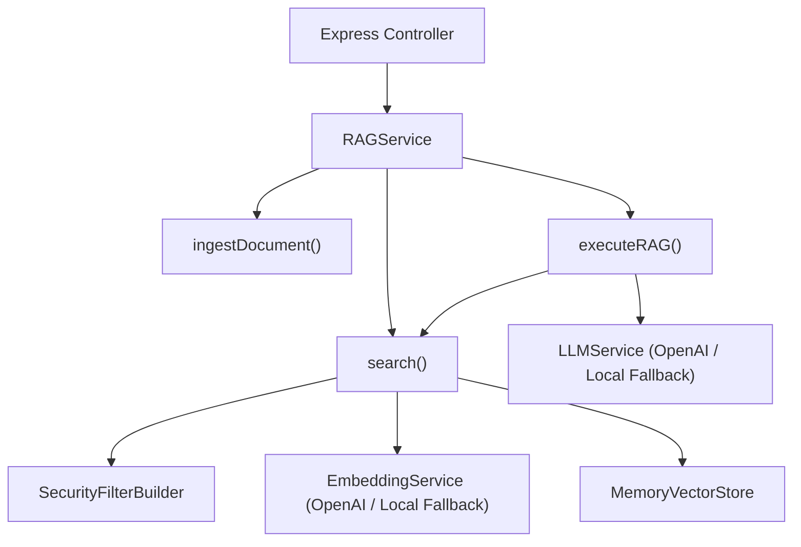

# ⚡ Chapter 6 — Controllers, Services & REST API Layer

Welcome to Chapter 6 of the **Metadata-Filtered RAG Implementation Guide**. In this chapter, we detail the business services layer (`RAGService`, `EmbeddingService`, `LLMService`), Express Controllers, and complete REST API specifications.

Source code modules:
- [`05-metadata-filtering/code/src/services/embeddingService.ts`](../code/src/services/embeddingService.ts)
- [`05-metadata-filtering/code/src/services/llmService.ts`](../code/src/services/llmService.ts)
- [`05-metadata-filtering/code/src/services/ragService.ts`](../code/src/services/ragService.ts)
- [`05-metadata-filtering/code/src/controllers/`](../code/src/controllers/)
- [`05-metadata-filtering/code/src/routes/`](../code/src/routes/)

---

## 1. Services Layer Overview



---

## 2. Source Code Implementation: `RAGService`

File: [`05-metadata-filtering/code/src/services/ragService.ts`](../code/src/services/ragService.ts)

```typescript
import { Chunk, VectorRecord } from '../types/document.types';
import { MetadataFilter, RetrievalResult, SearchMode } from '../types/filter.types';
import { AuthenticatedUser, IngestDocumentDTO, RAGQueryDTO, RAGResponseDTO, SearchQueryDTO } from '../types/api.types';
import { MemoryVectorStore } from '../vectordb/memoryVectorStore';
import { EmbeddingService } from './embeddingService';
import { LLMService } from './llmService';
import { SecurityFilterBuilder } from '../filters/securityFilter';

export class RAGService {
  private vectorStore: MemoryVectorStore;
  private embeddingService: EmbeddingService;
  private llmService: LLMService;

  constructor(
    vectorStore?: MemoryVectorStore,
    embeddingService?: EmbeddingService,
    llmService?: LLMService
  ) {
    this.vectorStore = vectorStore || new MemoryVectorStore();
    this.embeddingService = embeddingService || new EmbeddingService();
    this.llmService = llmService || new LLMService();
  }

  public async ingestDocument(dto: IngestDocumentDTO): Promise<{
    documentId: string;
    chunksCreated: number;
  }> {
    const documentId = dto.id || `doc_${Date.now()}_${Math.random().toString(36).substring(2, 7)}`;
    const chunkSize = dto.chunkSize || 500;
    const chunkOverlap = dto.chunkOverlap || 50;

    const rawChunksText = this.chunkText(dto.content, chunkSize, chunkOverlap);
    const records: VectorRecord[] = [];

    for (let i = 0; i < rawChunksText.length; i++) {
      const chunkText = rawChunksText[i];
      const chunkId = `${documentId}_chunk_${i}`;

      const chunkMetadata: Chunk['metadata'] = {
        ...dto.metadata,
        document_id: documentId,
        chunk_index: i,
        total_chunks: rawChunksText.length,
      };

      const chunk: Chunk = {
        id: chunkId,
        content: chunkText,
        metadata: chunkMetadata,
      };

      const vector = await this.embeddingService.getEmbedding(chunkText);

      records.push({
        id: chunkId,
        vector,
        chunk,
        metadata: chunkMetadata,
      });
    }

    this.vectorStore.addRecords(records);

    return {
      documentId,
      chunksCreated: records.length,
    };
  }

  public async search(
    queryDto: SearchQueryDTO,
    user?: AuthenticatedUser
  ): Promise<{
    results: RetrievalResult[];
    appliedFilter: MetadataFilter;
    candidatesEvaluated: number;
    searchMode: SearchMode;
    latencyMs: number;
  }> {
    const startTime = Date.now();

    let finalFilter: MetadataFilter = queryDto.filter || {};
    if (user && !queryDto.bypassAuthGuard) {
      finalFilter = SecurityFilterBuilder.buildAuthorizedFilter(user, queryDto.filter);
    }

    const queryVector = await this.embeddingService.getEmbedding(queryDto.query);

    const searchOutput = this.vectorStore.search(queryVector, finalFilter, {
      topK: queryDto.topK || 5,
      mode: queryDto.mode || 'pre-filter',
      postFilterCandidateLimit: queryDto.postFilterCandidateLimit || 10,
    });

    const latencyMs = Date.now() - startTime;

    return {
      results: searchOutput.results,
      appliedFilter: finalFilter,
      candidatesEvaluated: searchOutput.candidatesEvaluated,
      searchMode: searchOutput.mode,
      latencyMs,
    };
  }

  public async executeRAG(
    ragDto: RAGQueryDTO,
    user: AuthenticatedUser
  ): Promise<RAGResponseDTO> {
    const startTime = Date.now();

    const searchResponse = await this.search(
      {
        query: ragDto.question,
        filter: ragDto.filter,
        topK: ragDto.topK || 5,
        mode: ragDto.mode || 'pre-filter',
        postFilterCandidateLimit: ragDto.postFilterCandidateLimit || 10,
      },
      user
    );

    const retrievalLatencyMs = searchResponse.latencyMs;
    const retrievedChunks = searchResponse.results.map((r) => r.chunk);

    const genStartTime = Date.now();
    const llmResult = await this.llmService.generateAnswer(
      ragDto.question,
      retrievedChunks,
      ragDto.systemPrompt
    );
    const generationLatencyMs = Date.now() - genStartTime;

    const totalLatencyMs = Date.now() - startTime;

    return {
      question: ragDto.question,
      answer: llmResult.answer,
      retrievedChunks: searchResponse.results.map((r) => ({
        id: r.chunk.id,
        content: r.chunk.content,
        metadata: r.chunk.metadata,
        score: r.score,
      })),
      metadata: {
        searchMode: searchResponse.searchMode,
        appliedFilter: searchResponse.appliedFilter,
        candidatesEvaluated: searchResponse.candidatesEvaluated,
        chunksRetrievedCount: searchResponse.results.length,
        retrievalLatencyMs,
        generationLatencyMs,
        totalLatencyMs,
        provider: llmResult.provider,
      },
    };
  }

  private chunkText(text: string, chunkSize: number, overlap: number): string[] {
    if (text.length <= chunkSize) return [text];
    const chunks: string[] = [];
    let start = 0;
    while (start < text.length) {
      let end = start + chunkSize;
      if (end >= text.length) {
        chunks.push(text.substring(start).trim());
        break;
      }
      const lastSpace = text.lastIndexOf(' ', end);
      if (lastSpace > start) end = lastSpace;
      chunks.push(text.substring(start, end).trim());
      start = end - overlap;
    }
    return chunks;
  }
}
```

---

## 3. REST API Endpoint Specifications

### 1. Ingest Document Endpoint
- **URL**: `POST /api/v1/documents/ingest`
- **Body**:
  ```json
  {
    "content": "Tenant 101 Official Finance Policy: Refund requests are processed within 14 business days.",
    "metadata": {
      "tenant_id": "tenant_101",
      "department": "finance",
      "file_type": "pdf",
      "access_level": 2
    }
  }
  ```

### 2. RAG Query Endpoint
- **URL**: `POST /api/v1/rag/query`
- **Headers**:
  - `x-tenant-id`: `tenant_101`
  - `x-department`: `finance`
- **Body**:
  ```json
  {
    "question": "What is our refund policy?",
    "mode": "pre-filter",
    "topK": 3
  }
  ```
