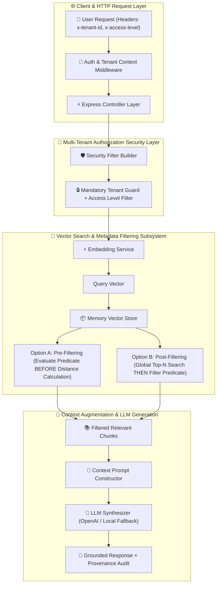

# 📘 05 — Metadata-Filtered RAG Implementation Guide

Welcome to the comprehensive, step-by-step implementation guide for **Metadata-Filtered RAG (Semantic Vector Retrieval + Structured Metadata Constraints)**.

This guide provides an end-to-end tutorial covering why Metadata-Filtered RAG is required, the fundamental differences and mathematical trade-offs between **Pre-Filtering** and **Post-Filtering**, multi-tenant authorization security guards, Express REST API backend architecture, comparative benchmarking, and CLI execution.

All corresponding production-grade source code, sample enterprise data, and unit/integration tests are located in [`05-metadata-filtering/code`](../code).

---

## 🏗️ Architecture & Component Flow



---

## 📚 Chapters Index

| Chapter | Title | Focus Topics & Core Code Modules |
| :--- | :--- | :--- |
| **[Chapter 0](./00-introduction-and-metadata-filtering-theory.md)** | **Introduction & Mathematical Foundations of Metadata-Filtered RAG** | Vector similarity vs structured metadata constraints, Pre-filtering vs Post-filtering theory, candidate waste, candidate starvation, tenant isolation principles — [`README.md`](../README.md) |
| **[Chapter 1](./01-domain-schemas-and-project-setup.md)** | **Domain Schemas & Project Setup** | TypeScript setup, `Document`, `Chunk`, `DocumentMetadata`, `ChunkMetadata`, `MetadataFilter`, `ComparisonOperator`, `ConditionFilter`, `RetrievalResult`, API DTOs — [`types/`](../code/src/types/), [`package.json`](../code/package.json) |
| **[Chapter 2](./02-metadata-filter-evaluator-subsystem.md)** | **Metadata Filter Evaluator Subsystem** | Recursive AST predicate evaluator, `$eq`, `$ne`, `$gt`, `$gte`, `$lt`, `$lte`, `$in`, `$nin`, `$contains`, date string and numeric range comparisons, `$and`, `$or`, `$not` logical evaluation — [`filters/evaluator.ts`](../code/src/filters/evaluator.ts) |
| **[Chapter 3](./03-pre-filtering-and-post-filtering-vector-store.md)** | **Pre-Filtering & Post-Filtering Vector Store** | Cosine similarity, Euclidean distance, Dot product metrics, `MemoryVectorStore`, `searchPreFiltered`, `searchPostFiltered`, candidate evaluation tracking — [`vectordb/`](../code/src/vectordb/) |
| **[Chapter 4](./04-multi-tenant-security-and-authorization-guards.md)** | **Multi-Tenant Security & Authorization Guards** | Authenticated user session (`AuthenticatedUser`), `SecurityFilterBuilder` constructing mandatory tenant guards, access level rules, public document access, department boundaries, sanitizing client filters against tenant spoofing — [`filters/securityFilter.ts`](../code/src/filters/securityFilter.ts) |
| **[Chapter 5](./05-express-backend-architecture-and-middlewares.md)** | **Express Backend Architecture & Middlewares** | Enterprise Express server setup (`app.ts`, `server.ts`), `authMiddleware`, `errorMiddleware`, `validateBody` middleware using Zod — [`middlewares/`](../code/src/middlewares/), [`app.ts`](../code/src/app.ts) |
| **[Chapter 6](./06-express-controllers-services-and-rest-api.md)** | **Controllers, Services & REST API Layer** | `RAGService`, `EmbeddingService` (OpenAI / Local fallback), `LLMService`, Express Controllers, REST API routes (`/api/v1/documents`, `/api/v1/search`, `/api/v1/rag`, `/api/v1/health`) — [`services/`](../code/src/services/), [`controllers/`](../code/src/controllers/), [`routes/`](../code/src/routes/) |
| **[Chapter 7](./07-comparative-benchmarking-pre-vs-post-filtering.md)** | **Comparative Benchmarking: Pre-Filtering vs Post-Filtering** | `BenchmarkService`, empirical measurement of pre-filtering vs post-filtering precision/recall @ K across varying candidate limits, zero-result starvation detection, candidate waste ratio analysis — [`services/benchmarkService.ts`](../code/src/services/benchmarkService.ts) |
| **[Chapter 8](./08-interactive-cli-sample-data-and-testing-suite.md)** | **Interactive CLI, Sample Data & Testing Suite** | Commander CLI (`seed`, `search`, `query`, `benchmark`), enterprise sample dataset (`enterprise_documents.json`), Jest test suites — [`cli.ts`](../code/src/cli.ts), [`sample_data/`](../code/sample_data/), [`tests/`](../code/tests/) |

---

## 🚀 Quick Execution Guide

1. Navigate to code directory:
   ```bash
   cd 05-metadata-filtering/code
   ```
2. Build TypeScript package:
   ```bash
   npm run build
   ```
3. Run Jest test suite:
   ```bash
   npm test
   ```
4. Start Express REST API server:
   ```bash
   npm start
   ```
5. Execute CLI Benchmark:
   ```bash
   npx ts-node src/cli.ts benchmark -q "refund policy" --tenant tenant_101
   ```
