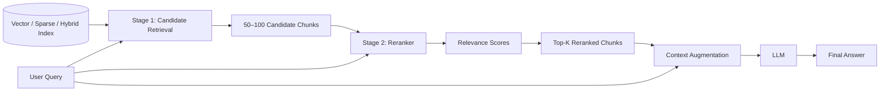
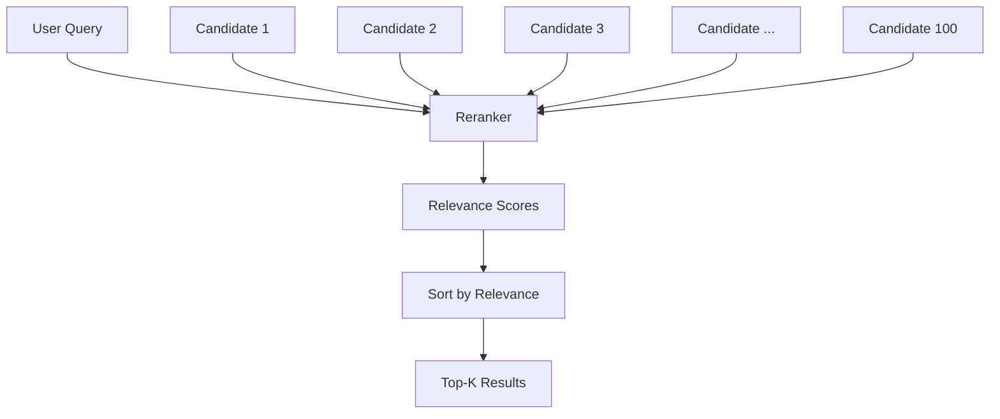
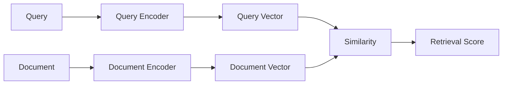
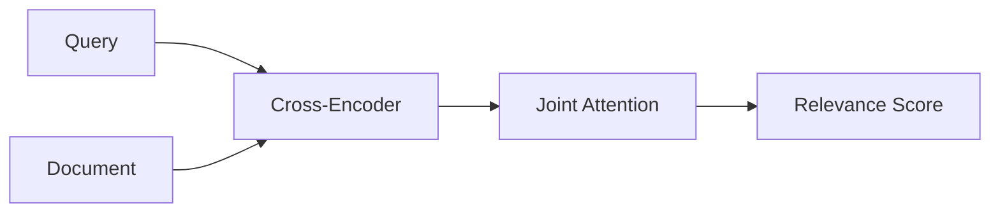
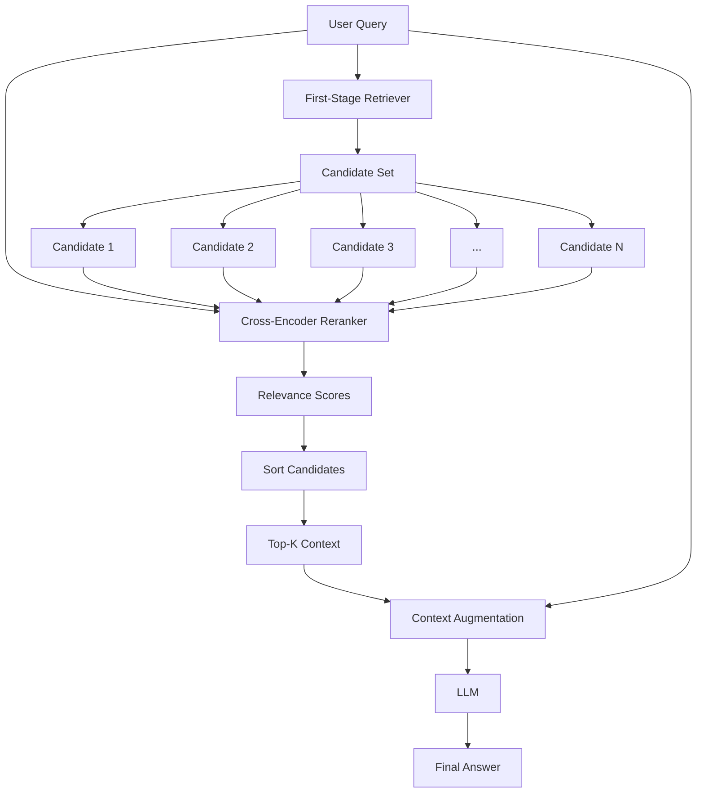
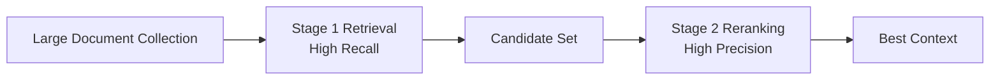
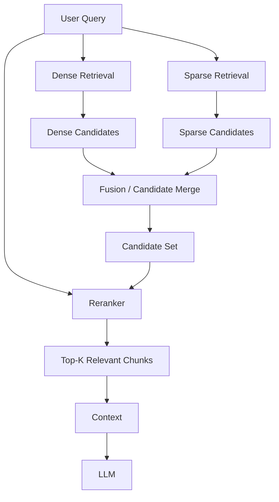
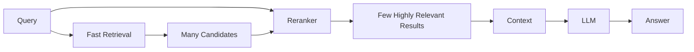

# 06 — Reranking RAG

## 📌 Overview

**Reranking RAG** uses a **two-stage retrieval pipeline** to improve the relevance of the context given to the LLM.

Instead of directly sending the first retrieved results to the LLM:

1. **Stage 1 — Candidate Retrieval:** A fast retriever retrieves a larger candidate set.
2. **Stage 2 — Reranking:** A more accurate reranker evaluates the query against each candidate and produces a new relevance ranking.
3. **Final Context:** Only the highest-ranked chunks are passed to the LLM.

A typical flow might look like:

```text
User Query
    ↓
Fast Retrieval
    ↓
50–100 Candidates
    ↓
Reranker
    ↓
Top 5–10 Chunks
    ↓
LLM
```

The exact candidate and final-context sizes depend on the application.

---

# 🏗️ Two-Stage Retrieval Architecture



The key idea is:

> **Retrieve broadly first, then rank precisely.**

---

# 1️⃣ Stage 1 — Candidate Retrieval

The first stage prioritizes **speed and recall**.

The retriever searches a large collection and returns a candidate set.

Possible retrieval methods include:

* Dense vector search
* Sparse BM25 search
* Hybrid search
* Metadata-filtered search

For example:

```text id="x0k8sa"
10,000,000 documents
        ↓
Fast retrieval
        ↓
100 candidates
```

The goal is not necessarily to identify the perfect result immediately.

Instead, the goal is:

> **Make sure the relevant documents are included in the candidate set.**

This is why Stage 1 is often optimized for **high recall**.

---

# 2️⃣ Stage 2 — Reranking

The reranker receives the original query together with each candidate document.

It then evaluates how relevant each candidate is to the query.



Unlike a simple vector similarity lookup, a cross-encoder can examine the **query and document together**.

---

# 🧠 Bi-Encoder vs Cross-Encoder

## Bi-Encoder

A bi-encoder independently encodes the query and document.



Because document embeddings can be generated ahead of time and indexed, this approach is efficient for large-scale retrieval.

---

## Cross-Encoder

A cross-encoder receives the query and document together.



Conceptually:

```text id="6rj2e7"
(Query + Document)
        ↓
Cross-Encoder
        ↓
Joint Attention
        ↓
Relevance Score
```

The model can directly compare the relationship between specific parts of the query and document.

This generally provides a stronger relevance signal than comparing independently generated embeddings, but it is more computationally expensive.

---

# 🔬 Why Cross-Encoders Can Be More Accurate

Consider:

```text id="v7udm2"
Query:
"How can I reset my account password?"
```

Two candidates:

```text id="l5z7qk"
Document A:
"To reset your password, open Settings → Security → Reset Password."

Document B:
"Users can change their account email address from Settings."
```

Both documents may be semantically related to account management.

A reranker can examine the query and each document jointly and determine that:

```text id="3n9qg4"
Document A → Highly Relevant
Document B → Less Relevant
```

This helps remove candidates that are broadly related but not actually useful for answering the question.

---

# 🔄 Complete Reranking Pipeline



---

# 📊 Example

Suppose Stage 1 retrieves 10 candidates.

```text id="r8qf0t"
Stage 1:

Document A → 0.82
Document B → 0.81
Document C → 0.79
Document D → 0.78
Document E → 0.76
...
```

These scores might be vector similarity scores.

The reranker evaluates the same candidates:

```text id="q4m4cc"
Stage 2:

Document D → 0.97
Document A → 0.94
Document F → 0.91
Document B → 0.72
Document C → 0.61
...
```

The final context could therefore become:

```text id="h1h6z8"
Document D
Document A
Document F
```

### Important

The Stage 1 score and Stage 2 score are produced by **different retrieval/scoring mechanisms** and should not be assumed to be directly comparable.

The reranker creates a **new ranking**.

---

# 🎯 Recall vs Precision

One of the most important concepts in reranking is the relationship between **recall** and **precision**.

### Stage 1

Focus:

> **High Recall**

Try to include the relevant document somewhere in the candidate set.

```text
1,000,000 documents
        ↓
    Retrieval
        ↓
   100 candidates
```

### Stage 2

Focus:

> **High Precision**

Identify the most relevant candidates.

```text
100 candidates
        ↓
    Reranker
        ↓
   Top 5 chunks
```

Together:



This is one of the main reasons reranking improves many RAG systems.

---

# 🔢 Candidate Size

There is no universal rule that Stage 1 must retrieve exactly 50–100 chunks.

Examples might be:

```text id="jz6y8r"
Stage 1 → 20 candidates
Stage 2 → Top 5
```

or:

```text id="0u0h0e"
Stage 1 → 100 candidates
Stage 2 → Top 10
```

or:

```text id="t5i8t0"
Stage 1 → 200 candidates
Stage 2 → Top 20
```

The optimal values depend on:

* Dataset size
* Retriever recall
* Reranker latency
* Reranker cost
* Query complexity
* Desired answer quality
* Available compute

---

# ⚡ Why Not Rerank the Entire Database?

Cross-encoders are more expensive because every query-document pair must be evaluated.

Imagine:

```text id="6r2y6a"
1,000,000 documents
```

Running a cross-encoder against all one million documents would be expensive and slow.

Instead:

```text id="j9a5yw"
1,000,000 documents
        ↓
Fast retrieval
        ↓
100 candidates
        ↓
Cross-Encoder
        ↓
Top 5
```

This gives you a practical balance between:

* Retrieval coverage
* Accuracy
* Latency
* Cost

---

# 🏢 Reranking with Hybrid RAG

Reranking becomes especially powerful after **Hybrid Retrieval**.



For example:

```text id="f0m4b8"
Query
 ↓
Dense Search → 50 candidates
Sparse Search → 50 candidates
 ↓
Merge / RRF
 ↓
100 candidates
 ↓
Reranker
 ↓
Top 5
 ↓
LLM
```

This is a common production retrieval pattern.

---

# 🆚 Retrieval vs Reranking

| Feature                    | First-Stage Retrieval  | Reranking                |
| -------------------------- | ---------------------- | ------------------------ |
| Primary goal               | Candidate recall       | Relevance precision      |
| Search space               | Very large             | Candidate set            |
| Speed                      | Very fast              | Slower                   |
| Candidates                 | Many                   | Fewer                    |
| Typical method             | Vector / BM25 / Hybrid | Cross-encoder / reranker |
| Computation                | Lower                  | Higher                   |
| Accuracy                   | Good                   | Usually higher relevance |
| Index required             | Usually                | Not necessarily          |
| Query-document interaction | Limited                | Strong                   |

---

# ⚖️ Tradeoffs

## ✅ Advantages

* Improves retrieval relevance
* Removes weak candidates
* Helps distinguish closely related documents
* Works with dense, sparse, or hybrid retrieval
* Can significantly improve context quality
* Allows Stage 1 to prioritize recall
* Particularly useful for complex knowledge bases

## ❌ Limitations

* Adds latency
* Adds inference cost
* Requires an additional model/service
* Reranking many candidates can become expensive
* Candidate-set quality still matters
* If the correct document is missing from Stage 1, the reranker cannot recover it

This last point is critical:

> **A reranker can reorder candidates, but it generally cannot rerank a document that was never retrieved.**

---

# 🧠 Key Mental Model

Remember Reranking RAG as:



The simplest way to remember it:

> **Retrieve broadly → Rerank precisely → Generate from the best context**

---

# 📌 Key Takeaway

**Reranking RAG = First-Stage Retrieval + Second-Stage Relevance Ranking.**

The most important concepts to understand are:

1. **Two-stage retrieval**
2. **Candidate retrieval**
3. **Bi-encoder retrieval**
4. **Cross-encoder reranking**
5. **Query-document interaction**
6. **Recall vs precision**
7. **Candidate-set size**
8. **Relevance scoring**
9. **Reranking latency and cost**
10. **Reranking after Hybrid Retrieval**

The progression so far is:

```text
01 Basic RAG
      ↓
02 Vector RAG
      ↓
03 Keyword / Sparse RAG
      ↓
04 Hybrid RAG
      ↓
05 Metadata-Filtered RAG
      ↓
06 Reranking RAG
```

And the core lesson is:

> **First-stage retrieval finds a broad set of potentially relevant documents; reranking identifies which of those documents are actually the most relevant to the query.**

This pattern is foundational for understanding more advanced retrieval architectures such as **Multi-Query RAG, HyDE, Parent-Document RAG, and Multi-Hop RAG**.
