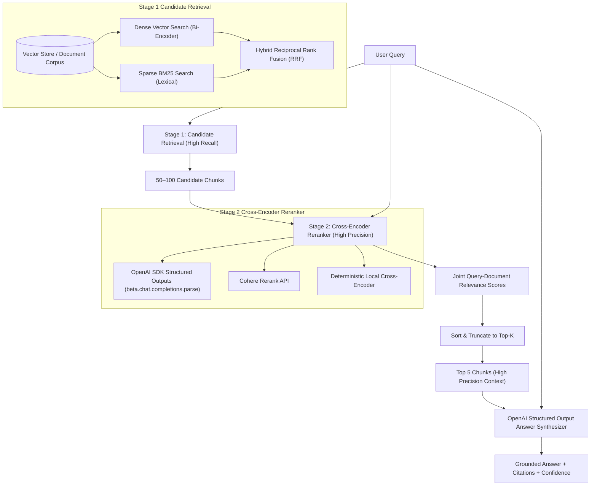

# 06 — Reranking RAG Engine (Express Backend & OpenAI Structured Outputs)

Production-grade **Two-Stage Reranking RAG Engine** implemented in **TypeScript** with an **Express HTTP Backend API**, supporting **Bi-Encoder Stage 1 Candidate Retrieval** (Vector, BM25, Hybrid RRF), **Stage 2 Cross-Encoder Reranking**, **OpenAI SDK TypeScript with Structured Outputs** (`beta.chat.completions.parse` with Zod validation), **Cohere Rerank API Integration**, **Quantitative Evaluation Benchmarks**, **CLI Tools**, and comprehensive **Jest Tests**.

---

## 📌 Two-Stage Architecture Overview



---

## 🚀 Key Senior AI Backend Features

1. **Two-Stage Retrieval Pipeline**:
   - **Stage 1 (Candidate Retrieval — High Recall)**: Fast bi-encoder vector search, Okapi BM25 sparse keyword search, or hybrid search using Reciprocal Rank Fusion (RRF). Retrieves candidate pool $N$ (e.g. 20..100).
   - **Stage 2 (Cross-Encoder Reranking — High Precision)**: Evaluates joint Query-Document attention. Re-evaluates and ranks candidates to extract top $K$ context chunks (e.g. 3..5).
2. **OpenAI SDK TypeScript with Structured Outputs**:
   - Uses `openai.beta.chat.completions.parse` with `zodResponseFormat` for type-safe, validated JSON responses.
   - Applied in both Stage 2 Rerank scoring (`RerankBatchResponseSchema`) and RAG answer synthesis (`RAGAnswerSchema`).
3. **Multi-Model Reranker Provider Strategy**:
   - `openai-structured`: OpenAI GPT-4o-mini structured Cross-Encoder evaluation.
   - `cohere`: Cohere Rerank v3.5 API integration.
   - `local`: Deterministic local cross-encoder algorithm calculating exact phrase proximity, term coverage, title boost, and intent verb-noun coupling.
4. **Express REST API Backend**:
   - Clean layer architecture (Controllers, Services, InMemoryVectorStore, Middlewares, Zod schemas).
   - Endpoints for Ingestion, Two-Stage Search, Candidate Reranking, Grounded RAG Querying, and Benchmark Evaluation.
5. **Quantitative Reranking Evaluation Suite**:
   - Benchmarks rank movement, top-#1 rank swap rate, latency overhead, and candidate size sweeps ($N \in \{5, 10, 20, 50\}$).
6. **Zero-Dependency Fallbacks**:
   - Runs out-of-the-box using deterministic local mock embeddings, local cross-encoder, and local answer synthesizer when no API key is set, while seamlessly using real OpenAI/Cohere models when configured in `.env`.

---

## ⚙️ Installation & Setup

```bash
# Navigate to code directory
cd 06-reranking/code

# Install dependencies
npm install

# Copy environment template
cp .env.example .env

# Run unit & integration tests
npm test

# Build TypeScript
npm run build
```

---

## 🏃 Running the Server & CLI

### Express API Server

```bash
# Start development server
npm run dev

# Or run compiled production server
npm start
```

Server runs at `http://localhost:3000`.

### CLI Interface

```bash
# Seed sample dataset
npx ts-node src/cli.ts seed

# Run Two-Stage Search (Candidate N=20, Final Top K=5)
npx ts-node src/cli.ts search -q "how to reset account password" --candidate-top-n 20 --final-top-k 5

# Run Structured RAG Query
npx ts-node src/cli.ts query -q "What is our subscription refund policy?"

# Run Quantitative Reranking Benchmark Suite
npx ts-node src/cli.ts benchmark
```

---

## 📡 REST API Reference

### 1. Ingest Document
`POST /api/v1/documents/ingest`

```json
{
  "content": "To reset your account password, open Settings -> Security -> Reset Password link.",
  "metadata": {
    "title": "Account Password Reset Procedure",
    "category": "authentication"
  }
}
```

### 2. Two-Stage Retrieval Search
`POST /api/v1/search`

```json
{
  "query": "How to reset account password?",
  "stage1CandidateTopN": 20,
  "stage2FinalTopK": 5,
  "retrievalMode": "hybrid",
  "rerankerProvider": "local"
}
```

### 3. Direct Document Candidate Rerank
`POST /api/v1/rerank`

```json
{
  "query": "refund policy",
  "documents": [
    { "id": "1", "content": "Subscription billing refunds are issued within 14 days." },
    { "id": "2", "content": "Users can change profile email address in settings." }
  ],
  "topK": 1
}
```

### 4. Two-Stage Reranking RAG Query
`POST /api/v1/rag/query`

```json
{
  "question": "What is our subscription refund policy?",
  "stage1CandidateTopN": 20,
  "stage2FinalTopK": 5
}
```

### 5. Quantitative Benchmark Evaluation
`POST /api/v1/benchmark/evaluate`

```json
{
  "queries": ["password reset", "refund policy"],
  "candidateSizes": [5, 10, 20, 50],
  "topK": 5
}
```

### 6. System Health Check
`GET /api/v1/health`

---

## 🧪 Testing

```bash
# Run all tests
npm test

# Run tests with coverage
npm run test:coverage
```

Tests validate:
- BM25 tokenization & IDF scoring
- Local & OpenAI Cross-Encoder reranking logic
- Two-Stage candidate retrieval & rank movement metrics
- Quantitative benchmarking suite & candidate pool size sweep
- Full Express REST API integration tests via `supertest`
