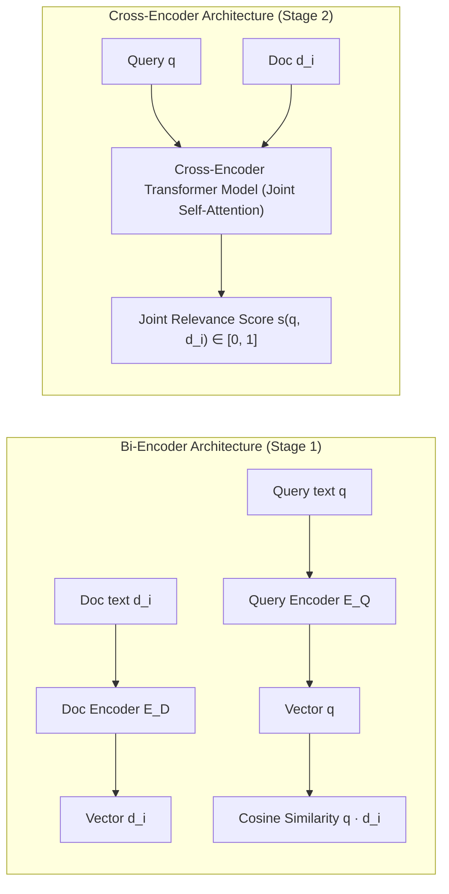

# 🧠 Chapter 0 — Introduction & Mathematical Foundations of Reranking RAG

Welcome to Chapter 0 of the **Reranking RAG Implementation Guide**. In this chapter, we explore why reranking is critical for production RAG systems, the fundamental mathematical and architectural differences between **Bi-Encoders** and **Cross-Encoders**, the trade-off between **Recall** and **Precision**, and how to select candidate pool sizes ($N$).

All corresponding production-grade TypeScript code is located in [`06-reranking/code`](../code).

---

## 1. Why Reranking RAG?

Standard single-stage retrieval directly passes the top-$K$ vector search results to an LLM context window:

$$\text{User Query} \xrightarrow{\text{Bi-Encoder Vector Search}} \text{Top-K Chunks} \xrightarrow{\text{LLM Context}} \text{Answer}$$

While bi-encoder vector search is extremely fast ($O(\log M)$ using HNSW or vector indexes over millions of documents), independent encoding limits its ability to evaluate fine-grained relevance:

1. **Independent Embedding Representation**: Bi-encoders independently map the query $\vec{q} = E_Q(q)$ and document $\vec{d}_i = E_D(d_i)$ into a shared vector space. The model cannot perform cross-term token interaction during embedding generation.
2. **Superficial Similarity Matches**: Documents containing shared high-frequency terms or general domain concepts can yield high vector similarity scores despite failing to satisfy the specific action or intent of the query.
3. **Context Window Contamination**: Sending weakly relevant chunks to the LLM increases token costs and causes the LLM to hallucinate or misinterpret facts.

**Two-Stage Reranking RAG** resolves this by decoupling candidate retrieval from final context selection:

$$\text{Retrieve Broadly (Stage 1)} \longrightarrow \text{Rerank Precisely (Stage 2)} \longrightarrow \text{Grounded LLM Generation}$$

---

## 2. Bi-Encoder vs Cross-Encoder Mathematical Comparison



### 2.1 Bi-Encoder (Stage 1)

* **Computation**:
  $$\text{Score}_{\text{Bi}}(q, d_i) = \cos(E_Q(q), E_D(d_i)) = \frac{E_Q(q) \cdot E_D(d_i)}{\|E_Q(q)\| \|E_D(d_i)\|}$$
* **Speed**: $\approx 1-5 \text{ ms}$ per query across millions of pre-indexed vectors.
* **Limitation**: No cross-attention between tokens of query $q$ and tokens of document $d_i$.

### 2.2 Cross-Encoder (Stage 2)

* **Computation**:
  Passes the concatenated input sequence $([\text{CLS}], q, [\text{SEP}], d_i, [\text{SEP}])$ into a transformer encoder. All layers perform **Joint Self-Attention** between every query token and every document token:
  $$\text{Score}_{\text{Cross}}(q, d_i) = \sigma(W \cdot \text{Transformer}([q; d_i]))$$
* **Precision**: Extremely high. Captures exact term proximity, verb-noun action alignment, and context fit.
* **Speed**: $\approx 50-200 \text{ ms}$ per batch of 20-50 candidates. (Prohibitively slow to run against an entire database of 1,000,000 documents).

---

## 3. Recall vs Precision Dynamics

| Pipeline Stage | Primary Objective | Metric | Target Set Size | Typical Method |
| :--- | :--- | :--- | :--- | :--- |
| **Stage 1: Candidate Retrieval** | **High Recall** (Ensure the true relevant documents are included in the candidate set) | $\text{Recall}@N$ | $N = 20 - 100$ | Vector Search, BM25, Hybrid RRF |
| **Stage 2: Reranking** | **High Precision** (Sort candidates so the absolute best chunks occupy ranks 1..K) | $\text{Precision}@K$, $\text{MRR}$, $\text{NDCG}$ | $K = 3 - 10$ | Cross-Encoder, OpenAI Structured Outputs, Cohere Rerank |

---

## 4. Candidate Pool Size ($N$) Trade-Offs

Selecting the optimal Stage 1 candidate pool size $N$ requires balancing **retrieval coverage** against **reranking latency and cost**:

```text
N = 5   --> Low Latency, Risk of missing true relevant document (Recall Bottleneck)
N = 20  --> Ideal Production Balance (High Recall + Sub-50ms Reranking)
N = 100 --> Maximum Recall, Higher Reranking Latency & API Cost
```

> **Fundamental Axiom of Reranking**: A reranker can reorder candidates in the candidate set, but it CANNOT rank a document that was never retrieved in Stage 1. Stage 1 must be tuned for high recall!

In Chapter 1, we will set up the project structure and define the TypeScript domain schemas for this two-stage architecture.
