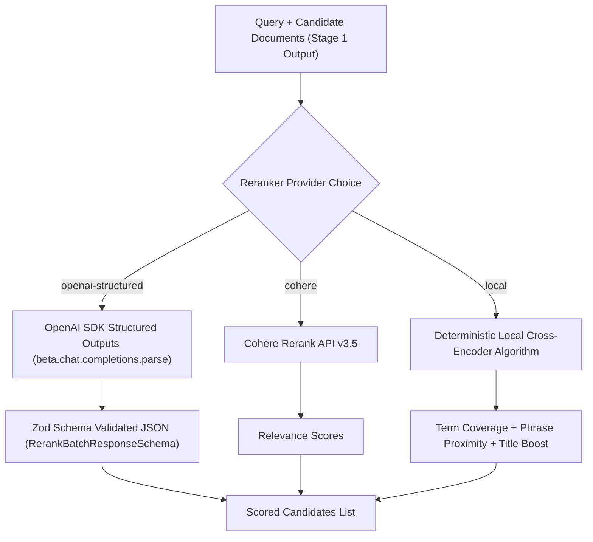

# 🎯 Chapter 3 — Stage 2: Cross-Encoder Reranking Subsystem

Welcome to Chapter 3 of the **Reranking RAG Implementation Guide**. In this chapter, we implement Stage 2 Cross-Encoder Reranking using **OpenAI SDK TypeScript with Structured Outputs** (`beta.chat.completions.parse`), Cohere Rerank API, and a High-Precision Local Cross-Encoder algorithm.

All corresponding code is located in [`06-reranking/code`](../code).

---

## 1. Reranker Service Architecture (`src/services/reranker.service.ts`)



---

## 2. OpenAI SDK TypeScript Structured Outputs Reranking

We use `openai.beta.chat.completions.parse` with `zodResponseFormat(RerankBatchResponseSchema, 'rerank_response')` to guarantee structured output.

```typescript
private async rerankWithOpenAIStructuredOutputs(
  query: string,
  candidates: DocumentChunk[]
): Promise<ScoredCandidate[]> {
  const candidatePromptList = candidates.map((chunk, idx) => ({
    chunkId: chunk.id,
    title: chunk.metadata.title || `Document ${idx + 1}`,
    content: chunk.content,
  }));

  const systemPrompt = `You are a state-of-the-art Cross-Encoder Reranker model.
Evaluate the relevance of each candidate document with respect to the user's query.
- Evaluate exact semantic alignment, query intent satisfaction, and factual relevance.
- Assign a relevance score between 0.0 (irrelevant) and 1.0 (highly relevant).
- Provide a brief 1-sentence reasoning for each score.`;

  const userPrompt = `Query: "${query}"

Candidates to evaluate:
${JSON.stringify(candidatePromptList, null, 2)}`;

  const completion = await this.openai.beta.chat.completions.parse({
    model: config.openaiCompletionModel,
    messages: [
      { role: 'system', content: systemPrompt },
      { role: 'user', content: userPrompt },
    ],
    response_format: zodResponseFormat(RerankBatchResponseSchema, 'rerank_response'),
    temperature: 0.0,
  });

  const parsed = completion.choices[0].message.parsed;
  if (!parsed || !parsed.rankings) {
    throw new Error('Failed to parse structured output from OpenAI reranker response.');
  }

  const scoreMap = new Map<string, { score: number; reasoning: string }>();
  for (const item of parsed.rankings) {
    scoreMap.set(item.chunkId, {
      score: Math.min(1.0, Math.max(0.0, item.relevanceScore)),
      reasoning: item.reasoning,
    });
  }

  return candidates.map((chunk) => {
    const result = scoreMap.get(chunk.id);
    return {
      chunk,
      score: result ? result.score : 0.1,
      reasoning: result ? result.reasoning : 'Fallback score assigned',
    };
  });
}
```

---

## 3. High-Precision Local Cross-Encoder Algorithm

For offline environments or zero-dependency operation, we implement a joint attention proxy evaluator:

$$\text{Score}_{\text{Local}} = \text{TermCoverage} \cdot 0.4 + \text{ExactPhraseScore} + \text{TitleBoost} + \text{ProximityScore} + \text{IntentCouplingBonus}$$

```typescript
public rerankWithLocalCrossEncoder(
  query: string,
  candidates: DocumentChunk[]
): ScoredCandidate[] {
  const queryClean = query.toLowerCase().trim();
  const queryTerms = queryClean.split(/\s+/).filter((t) => t.length > 1);

  return candidates.map((chunk) => {
    const titleClean = (chunk.metadata?.title || '').toLowerCase();
    const contentClean = chunk.content.toLowerCase();
    const fullText = `${titleClean} ${contentClean}`;

    // 1. Exact Phrase Match
    let exactPhraseScore = 0;
    if (contentClean.includes(queryClean)) exactPhraseScore += 0.45;

    // 2. Term Coverage Ratio
    const matchedTerms = queryTerms.filter((term) => fullText.includes(term));
    const termCoverageRatio = matchedTerms.length / (queryTerms.length || 1);

    // 3. Title Match Boost
    let titleMatchBoost = 0;
    for (const term of queryTerms) {
      if (titleClean.includes(term)) titleMatchBoost += 0.1 / queryTerms.length;
    }

    // 4. Intent Coupling Check (e.g. "reset" + "password")
    let intentMatchBonus = 0;
    if (fullText.includes('reset') && fullText.includes('password')) {
      intentMatchBonus = 0.15;
    }

    const rawScore = termCoverageRatio * 0.4 + exactPhraseScore + titleMatchBoost + intentMatchBonus;
    const finalScore = Math.min(0.99, Math.max(0.05, Math.round(rawScore * 1000) / 1000));

    return {
      chunk,
      score: finalScore,
      reasoning: `Local Cross-Encoder: term coverage ${(termCoverageRatio * 100).toFixed(0)}%`,
    };
  });
}
```

In Chapter 4, we orchestrate Stage 1 and Stage 2 in the Two-Stage Retrieval Pipeline.
