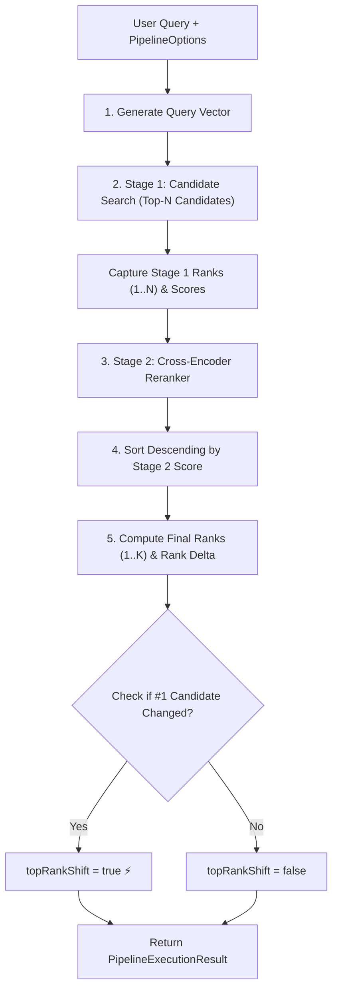

# ⚙️ Chapter 4 — Two-Stage Retrieval Pipeline Orchestrator

Welcome to Chapter 4 of the **Reranking RAG Implementation Guide**. In this chapter, we orchestrate the complete Two-Stage Retrieval Pipeline in `RetrievalPipelineService`, computing rank shifts (`rankDelta`), top-#1 candidate swaps, and latency metrics.

All corresponding code is located in [`06-reranking/code`](../code).

---

## 1. Pipeline Execution Architecture (`src/services/retrieval-pipeline.service.ts`)

The orchestrator executes two distinct stages sequentially while timing latency and capturing provenance:



---

## 2. Code Implementation

```typescript
export class RetrievalPipelineService {
  async executePipeline(
    query: string,
    options: PipelineOptions
  ): Promise<PipelineExecutionResult> {
    const startTimeTotal = Date.now();

    // 1. Generate query embedding for Stage 1 dense search
    const startTimeStage1 = Date.now();
    const queryEmbedding = await embeddingService.generateEmbedding(query);

    // 2. Stage 1: Candidate Retrieval
    const rawCandidates = inMemoryVectorStore.search(
      query,
      queryEmbedding,
      options.retrievalMode,
      options.stage1CandidateTopN,
      options.hybridAlpha ?? 0.5
    );

    const stage1Candidates: CandidateResult[] = rawCandidates.map((cand) => ({
      chunk: cand.chunk,
      stage1Score: cand.stage1Score,
      stage1Rank: cand.stage1Rank,
      retrievalMethod: cand.retrievalMethod,
    }));

    const stage1LatencyMs = Date.now() - startTimeStage1;

    // 3. Stage 2: Reranking
    const startTimeStage2 = Date.now();
    const candidateChunks = stage1Candidates.map((c) => c.chunk);

    const scoredCandidates = await rerankerService.rerank(
      query,
      candidateChunks,
      options.rerankerProvider
    );

    const stage2LatencyMs = Date.now() - startTimeStage2;

    // Map Stage 1 info to calculate rank deltas
    const stage1Map = new Map<string, CandidateResult>();
    for (const cand of stage1Candidates) {
      stage1Map.set(cand.chunk.id, cand);
    }

    const unrankedResults = scoredCandidates.map((sc) => {
      const stage1Info = stage1Map.get(sc.chunk.id);
      return {
        chunk: sc.chunk,
        stage1Score: stage1Info?.stage1Score || 0,
        stage1Rank: stage1Info?.stage1Rank || 999,
        stage2Score: sc.score,
        reasoning: sc.reasoning,
        retrievalMethod: stage1Info?.retrievalMethod || options.retrievalMode,
      };
    });

    // Sort by Stage 2 Cross-Encoder Score descending
    unrankedResults.sort((a, b) => b.stage2Score - a.stage2Score);

    // Assign final ranks and compute rank delta (stage1Rank - finalRank)
    const allReranked: RerankedResult[] = unrankedResults.map((item, idx) => {
      const finalRank = idx + 1;
      const rankDelta = item.stage1Rank - finalRank;
      return {
        ...item,
        finalRank,
        rankDelta,
      };
    });

    const finalReranked = allReranked.slice(0, options.stage2FinalTopK);

    // Detect if #1 candidate changed after reranking
    const topRankShift =
      stage1Candidates.length > 0 &&
      finalReranked.length > 0 &&
      stage1Candidates[0].chunk.id !== finalReranked[0].chunk.id;

    return {
      query,
      options,
      candidates: stage1Candidates,
      rerankedResults: finalReranked,
      metrics: {
        stage1LatencyMs,
        stage2LatencyMs,
        totalLatencyMs: Date.now() - startTimeTotal,
        candidateCount: stage1Candidates.length,
        finalCount: finalReranked.length,
        topRankShift,
      },
    };
  }
}
```

In Chapter 5, we build the OpenAI Structured Output RAG Answer Synthesizer.
