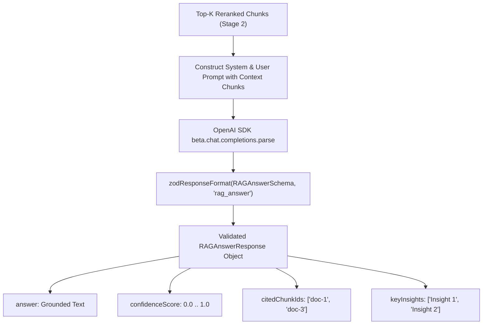

# 🤖 Chapter 5 — OpenAI Structured Output RAG Synthesizer

Welcome to Chapter 5 of the **Reranking RAG Implementation Guide**. In this chapter, we implement `LLMService` using **OpenAI SDK TypeScript with Structured Outputs** (`beta.chat.completions.parse` with `zodResponseFormat`).

All corresponding code is located in [`06-reranking/code`](../code).

---

## 1. Grounded Answer Synthesis Architecture (`src/services/llm.service.ts`)

Once Stage 2 reranking yields the top-$K$ context chunks, the LLM synthesizer constructs a grounded answer. We enforce strict JSON schema compliance using OpenAI Structured Outputs:



---

## 2. OpenAI SDK TypeScript Code Implementation

```typescript
export class LLMService {
  private openai: OpenAI | null = null;

  constructor() {
    if (config.openaiApiKey) {
      this.openai = new OpenAI({ apiKey: config.openaiApiKey });
    }
  }

  async generateAnswer(
    query: string,
    rerankedResults: RerankedResult[]
  ): Promise<RAGAnswerResponse> {
    if (rerankedResults.length === 0) {
      return {
        answer: "I am unable to answer your query because no relevant context documents were found.",
        confidenceScore: 0.0,
        citedChunkIds: [],
        keyInsights: ["No context candidates retrieved."],
      };
    }

    if (this.openai && config.openaiApiKey) {
      try {
        return await this.generateOpenAIStructuredAnswer(query, rerankedResults);
      } catch (error) {
        console.error('OpenAI Structured Output generation failed, using local fallback:', error);
      }
    }

    return this.generateLocalFallbackAnswer(query, rerankedResults);
  }

  private async generateOpenAIStructuredAnswer(
    query: string,
    rerankedResults: RerankedResult[]
  ): Promise<RAGAnswerResponse> {
    const formattedContext = rerankedResults
      .map(
        (res) =>
          `[Document ID: ${res.chunk.id} | Title: ${res.chunk.metadata.title} | Score: ${res.stage2Score}]\n${res.chunk.content}`
      )
      .join('\n\n---\n\n');

    const systemPrompt = `You are a Senior AI Assistant powering a RAG pipeline.
Provide a precise, comprehensive, and factual answer strictly using the provided reranked context documents.
- Cite the exact document chunk IDs used in your reasoning.
- Output strictly formatted JSON matching the required schema.`;

    const userPrompt = `Query: "${query}"

Reranked Context Chunks:
${formattedContext}`;

    const completion = await this.openai!.beta.chat.completions.parse({
      model: config.openaiCompletionModel,
      messages: [
        { role: 'system', content: systemPrompt },
        { role: 'user', content: userPrompt },
      ],
      response_format: zodResponseFormat(RAGAnswerSchema, 'rag_answer'),
      temperature: 0.1,
    });

    const parsed = completion.choices[0].message.parsed;
    if (!parsed) {
      throw new Error('Failed to parse structured answer response from OpenAI API.');
    }

    return parsed;
  }
}
```

In Chapter 6, we expose the Express Backend Architecture & REST APIs.
