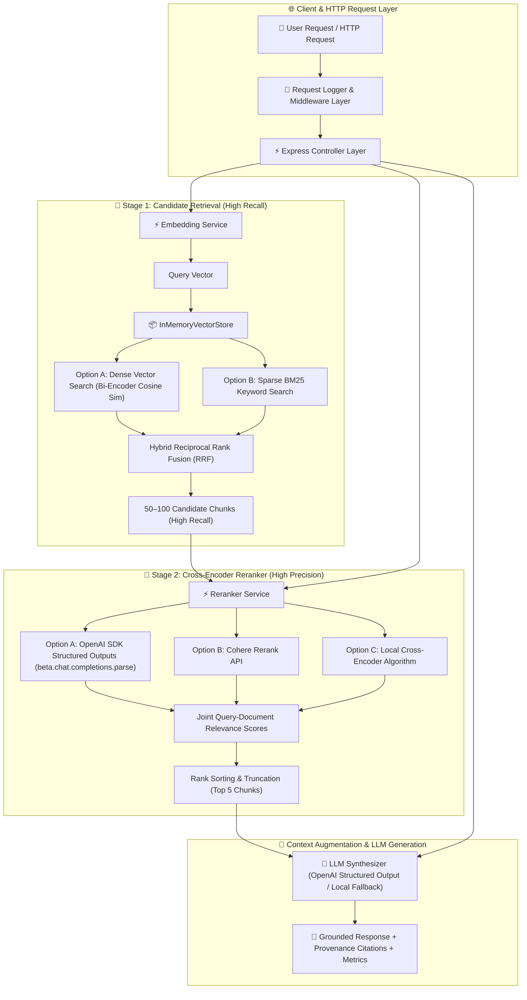

# 📘 06 — Reranking RAG Implementation Guide

Welcome to the comprehensive, step-by-step implementation guide for **Reranking RAG (Two-Stage Retrieval Pipeline & Cross-Encoder Relevance Ranking)**.

This guide provides an end-to-end tutorial covering why Reranking RAG is essential for production applications, the mathematical and architectural differences between **Bi-Encoders** and **Cross-Encoders**, Stage 1 candidate retrieval (Dense Vector, BM25, Hybrid RRF), Stage 2 reranking with **OpenAI SDK TypeScript Structured Outputs** (`beta.chat.completions.parse`), Express REST API backend architecture, quantitative benchmarking, and CLI execution.

All corresponding production-grade source code, sample dataset, and unit/integration tests are located in [`06-reranking/code`](../code).

---

## 🏗️ Architecture & Component Flow



---

## 📚 Chapters Index

| Chapter | Title | Focus Topics & Core Code Modules |
| :--- | :--- | :--- |
| **[Chapter 0](./00-introduction-and-reranking-theory.md)** | **Introduction & Mathematical Foundations of Reranking RAG** | Two-stage retrieval theory, Bi-Encoders vs Cross-Encoders, Recall vs Precision trade-offs, Candidate Pool Size ($N$) selection — [`README.md`](../README.md) |
| **[Chapter 1](./01-project-setup-and-domain-schemas.md)** | **Project Setup & Domain Schemas** | TypeScript setup, `DocumentChunk`, `CandidateResult`, `RerankedResult`, `PipelineOptions`, Zod API schemas (`SearchQuerySchema`, `RAGQuerySchema`) — [`types/index.ts`](../code/src/types/index.ts), [`package.json`](../code/package.json) |
| **[Chapter 2](./02-stage-1-candidate-retrieval-and-vector-store.md)** | **Stage 1: Candidate Retrieval & Vector Store** | Dense vector similarity, Okapi BM25 keyword search, Hybrid Reciprocal Rank Fusion (RRF), `InMemoryVectorStore` — [`vectordb/`](../code/src/vectordb/), [`services/bm25.service.ts`](../code/src/services/bm25.service.ts) |
| **[Chapter 3](./03-cross-encoder-reranking-subsystem.md)** | **Stage 2: Cross-Encoder Reranking Subsystem** | Cross-encoder joint attention mechanics, `RerankerService`, OpenAI SDK TypeScript Structured Outputs (`beta.chat.completions.parse` with `zodResponseFormat`), Cohere Rerank, Local Cross-Encoder — [`services/reranker.service.ts`](../code/src/services/reranker.service.ts) |
| **[Chapter 4](./04-two-stage-retrieval-pipeline-orchestrator.md)** | **Two-Stage Retrieval Pipeline Orchestrator** | `RetrievalPipelineService`, orchestration flow, rank delta tracking, top-#1 candidate shift detection, latency profiling — [`services/retrieval-pipeline.service.ts`](../code/src/services/retrieval-pipeline.service.ts) |
| **[Chapter 5](./05-openai-structured-output-rag-synthesizer.md)** | **OpenAI Structured Output RAG Synthesizer** | `LLMService`, grounded answer generation using OpenAI Structured Outputs (`RAGAnswerSchema`), confidence scoring, cited chunk IDs, key takeaways — [`services/llm.service.ts`](../code/src/services/llm.service.ts) |
| **[Chapter 6](./06-express-backend-architecture-and-rest-apis.md)** | **Express Backend Architecture & REST APIs** | Enterprise Express server setup (`app.ts`, `server.ts`), middlewares, Controllers, REST API routes (`/api/v1/search`, `/api/v1/rerank`, `/api/v1/rag/query`, `/api/v1/benchmark/evaluate`, `/api/v1/health`) — [`controllers/`](../code/src/controllers/), [`routes/`](../code/src/routes/) |
| **[Chapter 7](./07-quantitative-reranking-evaluation-and-benchmarking.md)** | **Quantitative Reranking Evaluation & Benchmarking** | `BenchmarkService`, empirical measurement of Stage 1 vs Stage 2 precision/recall, top-#1 candidate swap rate, latency overhead, candidate size sweep ($N \in \{5, 10, 20, 50\}$) — [`services/benchmark.service.ts`](../code/src/services/benchmark.service.ts) |
| **[Chapter 8](./08-interactive-cli-sample-data-and-testing-suite.md)** | **Interactive CLI, Sample Data & Testing Suite** | Commander CLI (`seed`, `search`, `query`, `benchmark`), sample dataset (`documents.json`), Jest unit and integration test suites — [`cli.ts`](../code/src/cli.ts), [`sample_data/`](../code/sample_data/), [`tests/`](../code/tests/) |

---

## 🚀 Quick Execution Guide

1. Navigate to code directory:
   ```bash
   cd 06-reranking/code
   ```
2. Build TypeScript package:
   ```bash
   npm run build
   ```
3. Run Jest test suite:
   ```bash
   npm test
   ```
4. Start Express REST API server:
   ```bash
   npm start
   ```
5. Execute CLI Benchmark:
   ```bash
   npx ts-node src/cli.ts benchmark
   ```
