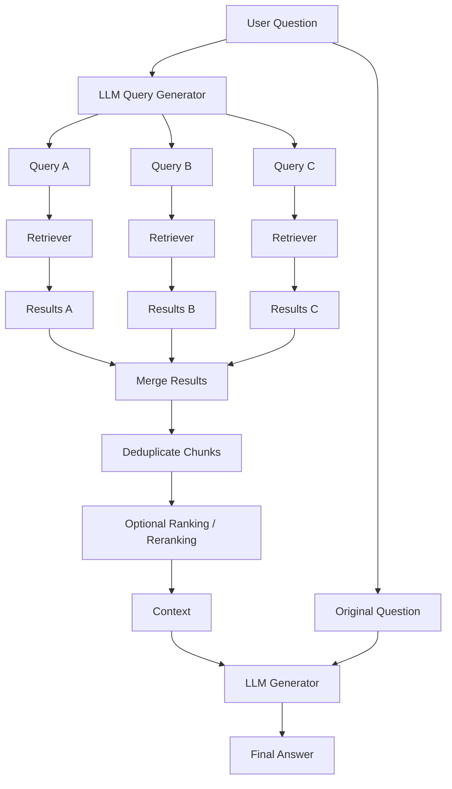
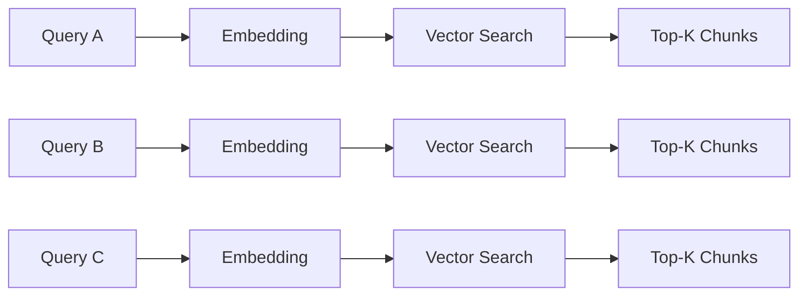
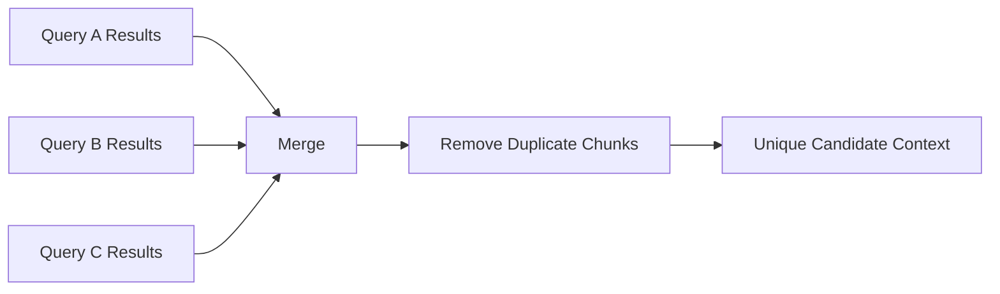
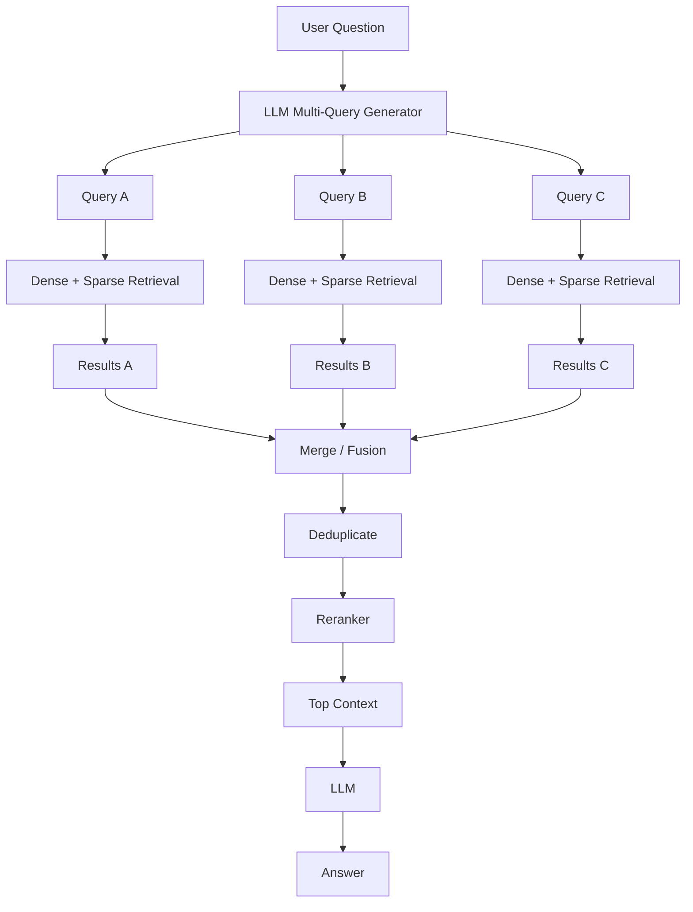
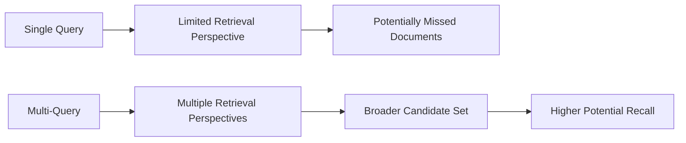
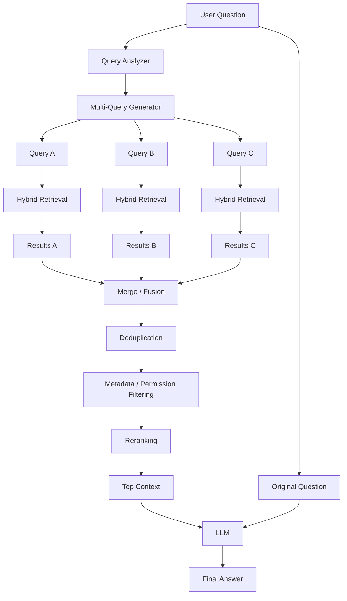

# 07 — Multi-Query RAG

## 📌 Overview

**Multi-Query RAG** improves retrieval by generating multiple alternative versions of the user's original question.

A single query can have a **specific wording or semantic perspective** that causes vector search to miss relevant documents. Instead of relying on one embedding, Multi-Query RAG asks an LLM to generate several semantically different query variations.

Each query is then sent independently to the retriever. The resulting chunks are **merged, deduplicated, and optionally ranked** before being passed to the LLM.

### Core idea

> **One question → Multiple query perspectives → Multiple retrievals → Combined evidence → Final answer**

Multi-Query RAG primarily improves **retrieval recall**. It does not inherently make the LLM itself smarter; it gives the generation step a broader and potentially more relevant set of evidence.

---

## 🎯 Why Do We Need Multi-Query RAG?

Consider a knowledge base containing documentation about authentication.

The user asks:

> **"How can I stop users from accessing protected pages after their session expires?"**

A vector database might retrieve documents containing:

* session expiration
* authentication timeout
* protected routes

But it might miss a highly relevant document that discusses:

* token invalidation
* unauthorized redirects
* JWT expiration handling

The problem is not necessarily that the document is irrelevant.

The problem may be that the **original query wording does not align closely enough with the document's language**.

Multi-Query RAG addresses this by generating several perspectives.

For example:

```text
Original:
How can I stop users from accessing protected pages after their session expires?

Query A:
How should expired authentication sessions be handled?

Query B:
How do protected routes behave when a user's authentication token expires?

Query C:
How can an application redirect unauthorized users after session expiration?
```

Each variation can retrieve different documents.

---

# 🏗️ Multi-Query Architecture



The important point is that **retrieval happens independently for each generated query**.

---

# 🔄 Multi-Query Retrieval Flow

## Step 1 — Receive the Original Question

The user submits:

```text
How does authentication work in our application?
```

The system does not immediately perform only one vector search.

Instead, it sends the question to a query-generation LLM.

---

## Step 2 — Generate Query Variations

The LLM creates several alternative formulations.

For example:

```text
Original:
How does authentication work in our application?

Query A:
What authentication mechanism does the application use?

Query B:
How are users authenticated and authorized?

Query C:
What is the login and session management flow?

Query D:
How does the application handle user identity and access control?
```

These queries should preserve the original intent while exploring different vocabulary and perspectives.

---

## Step 3 — Run Retrieval for Each Query

Each generated query is converted into an embedding and searched independently.



For example:

```text
Query A → [Chunk 12, Chunk 8, Chunk 31]
Query B → [Chunk 5, Chunk 12, Chunk 18]
Query C → [Chunk 31, Chunk 20, Chunk 7]
```

Notice that some chunks appear in multiple retrieval results.

---

# 🔗 Step 4 — Merge the Results

The system combines all retrieved chunks.

```text
Results A:
12, 8, 31

Results B:
5, 12, 18

Results C:
31, 20, 7
```

Union:

```text
12, 8, 31, 5, 18, 20, 7
```

The goal is to increase the chance that relevant evidence appears somewhere in the combined candidate set.

---

# 🧹 Step 5 — Deduplicate

The same document chunk may be retrieved by multiple query variations.

For example:

```text
Query A → Chunk 12
Query B → Chunk 12
Query C → Chunk 12
```

We should not send the same chunk three times to the LLM.

Instead:



Deduplication can be based on a stable chunk/document ID.

---

# 📊 Ranking the Combined Results

After merging, there may be many candidates.

For example:

```text
Query count = 4
Top-K per query = 10

Maximum candidates = 40
```

After deduplication:

```text
40 retrieved
↓
27 unique chunks
```

Passing all 27 chunks directly to the LLM may be unnecessary.

The system can therefore:

```text
27 unique chunks
        ↓
     Reranker
        ↓
   Top 5 chunks
        ↓
      LLM
```

This creates a powerful combination:

> **Multi-Query RAG → Reranking → Generation**

---

# 🧠 Why Multiple Queries Improve Recall

Imagine the knowledge base contains three relevant documents:

```text
Document A
"Authentication timeout..."

Document B
"JWT expiration..."

Document C
"Unauthorized route handling..."
```

A single query may retrieve:

```text
Original Query
      ↓
A
B
```

A second query might discover:

```text
Query B
      ↓
B
C
```

A third query might discover:

```text
Query C
      ↓
A
C
```

Combined:

```text
A + B + C
```

This is the central benefit of Multi-Query RAG.

### Single Query

```text
Question
   ↓
Retriever
   ↓
Relevant subset
```

### Multi-Query

```text
                 ┌→ Retriever → Results A ─┐
Question → LLM ──┼→ Retriever → Results B ─┼→ Merge → Context
                 └→ Retriever → Results C ─┘
```

More retrieval perspectives can increase **recall**, although it also increases retrieval cost and can introduce irrelevant results.

---

# 🔢 Example

Suppose:

```text
Number of generated queries = 4
Top-K = 5
```

Potential retrieval:

```text
Query 1 → [A, B, C, D, E]
Query 2 → [B, C, F, G, H]
Query 3 → [A, F, I, J, K]
Query 4 → [C, D, L, M, N]
```

Before deduplication:

```text
4 × 5 = 20 retrieved results
```

After deduplication:

```text
A, B, C, D, E, F, G, H, I, J, K, L, M, N
```

So we have:

```text
20 retrieval results
        ↓
14 unique chunks
        ↓
Optional reranking
        ↓
Top 5
        ↓
LLM
```

---

# 🔍 Multi-Query vs Single-Query RAG

| Feature                   | Single-Query RAG    | Multi-Query RAG         |
| ------------------------- | ------------------- | ----------------------- |
| User query                | 1                   | 1                       |
| Retrieval queries         | 1                   | Multiple                |
| Retrieval coverage        | Lower               | Higher potential recall |
| Retrieval cost            | Lower               | Higher                  |
| Query generation          | None                | LLM                     |
| Handles wording variation | Limited             | Better                  |
| Deduplication             | Usually unnecessary | Required                |
| Latency                   | Lower               | Higher                  |
| Complexity                | Simple              | Moderate                |

---

# 🔄 Multi-Query vs Query Expansion

These concepts are related but not always identical.

### Query Expansion

Adds additional terms or information to the original query.

```text
Original:
authentication timeout

Expanded:
authentication timeout session expiration JWT login
```

### Multi-Query

Generates multiple complete query formulations.

```text
authentication timeout

session expiration handling

JWT expiration behavior

protected route after authentication expires
```

So:

> **Query expansion enriches one query. Multi-Query RAG creates multiple retrieval perspectives.**

---

# 🔀 Multi-Query + Hybrid RAG

Multi-Query does not require vector search only.

Each generated query can use **hybrid retrieval**.



This can be particularly useful when documents contain both:

* semantic concepts
* exact identifiers, names, codes, or terminology

---

# ⚡ Multi-Query + Reranking

A common stronger architecture is:

```text
User Question
      ↓
Multi-Query Generation
      ↓
Query A ──→ Retrieval
Query B ──→ Retrieval
Query C ──→ Retrieval
      ↓
Merge + Deduplicate
      ↓
Candidate Set
      ↓
Cross-Encoder Reranker
      ↓
Top Relevant Chunks
      ↓
LLM
      ↓
Answer
```

### Why this works

Multi-Query focuses on:

> **"Find more potentially relevant information."**

Reranking focuses on:

> **"Among those candidates, which are actually most relevant?"**

So they solve different problems.

---

# ⚠️ Important Considerations

## 1. More Queries = More Retrieval Cost

If one query requires one vector search:

```text
1 query → 1 retrieval
```

Then:

```text
5 generated queries → 5 retrievals
```

This increases:

* database operations
* embedding operations
* latency
* infrastructure cost

---

## 2. More Results Can Mean More Noise

Multi-Query does not guarantee that every generated query is useful.

An LLM might generate a variation that retrieves unrelated chunks.

Therefore:

```text
More candidates
      ↓
Potentially higher recall
      +
Potentially more noise
```

This is one reason reranking can be valuable.

---

## 3. Query Diversity Matters

Generating five nearly identical queries provides little benefit.

Poor:

```text
How does authentication work?

How does authentication function?

How does authentication operate?

How does authentication work in the system?
```

Better:

```text
How does the login flow work?

How are user sessions managed?

How are users authorized?

How are authentication tokens validated?

What happens when authentication expires?
```

The goal is **meaningful diversity**, not simply paraphrasing for its own sake.

---

# 🛠️ Practical Query Generation Prompt

A simple query-generation instruction can be:

```text
You are a search query generator.

Given the user's question, generate 4 alternative search
queries that preserve the original intent while exploring
different terminology and perspectives.

Rules:
- Do not answer the question.
- Do not invent facts.
- Keep each query concise.
- Make the queries meaningfully different.
- Return only the queries.
```

For production systems, structured output is preferable so the application receives a predictable array rather than parsing free-form text.

Example conceptual output:

```json
{
  "queries": [
    "How does the authentication flow work?",
    "How are user sessions managed?",
    "How are authentication tokens validated?",
    "How is user authorization handled?"
  ]
}
```

---

# 📈 Retrieval Recall Perspective

Multi-Query RAG is primarily a **recall-oriented retrieval technique**.



But higher recall does **not automatically mean higher answer quality**.

The additional candidates still need to be:

* relevant
* deduplicated
* ranked
* correctly contextualized

---

# 🏭 Production-Oriented Pipeline

A more complete production architecture can look like this:



This combines several architectures learned so far:

```text
Multi-Query
     +
Hybrid Retrieval
     +
Metadata Filtering
     +
Reranking
     ↓
High-quality Retrieval Pipeline
```

---

# ⚖️ Tradeoffs

### Advantages

* Improves retrieval recall
* Handles different query wording
* Explores multiple semantic perspectives
* Useful for ambiguous or broad questions
* Works with vector, sparse, or hybrid retrieval
* Combines well with reranking

### Disadvantages

* Requires additional LLM calls
* Increases retrieval cost
* Can increase latency
* May introduce irrelevant results
* Requires deduplication
* Query generation quality affects retrieval quality

---

# 🎯 When Should You Use Multi-Query RAG?

Multi-Query RAG is particularly useful when:

* Users phrase the same concept in many ways
* Questions are broad or ambiguous
* Documents use terminology different from user language
* A single semantic search frequently misses relevant evidence
* You need higher retrieval recall
* Queries involve multiple aspects of a topic

It may be unnecessary for:

* very simple exact-match queries
* highly precise identifier lookups
* systems where latency is extremely constrained
* very small knowledge bases

---

# 🧠 Key Mental Model

Think of Multi-Query RAG as **asking the retriever the same question from several angles**.

```text
                 User Question
                       │
                       ▼
              ┌─────────────────┐
              │ Query Generator │
              └────────┬────────┘
                       │
          ┌────────────┼────────────┐
          ▼            ▼            ▼
       Query A      Query B      Query C
          │            │            │
          ▼            ▼            ▼
      Retrieve      Retrieve      Retrieve
          │            │            │
          └────────────┼────────────┘
                       ▼
                Merge + Deduplicate
                       │
                       ▼
                    Rerank
                       │
                       ▼
                    Context
                       │
                       ▼
                     LLM
                       │
                       ▼
                    Answer
```

The key distinction is:

> **Single-query RAG asks one retrieval question. Multi-Query RAG asks several semantically different retrieval questions and combines their evidence.**

---

# 📌 Key Takeaway

**Multi-Query RAG = Query Transformation + Multiple Retrievals + Result Fusion/Deduplication**

The main objective is to improve **retrieval recall** by reducing dependence on the exact wording of the user's original query.

### Core formula

```text
User Query
    ↓
Generate Multiple Queries
    ↓
Retrieve for Each Query
    ↓
Merge Results
    ↓
Deduplicate
    ↓
Optional Reranking
    ↓
Top Context
    ↓
LLM
    ↓
Final Answer
```

### Remember

> 🔹 **Vector RAG** → retrieves based on semantic similarity
> 🔹 **Keyword RAG** → retrieves based on lexical matching
> 🔹 **Hybrid RAG** → combines dense + sparse retrieval
> 🔹 **Metadata RAG** → restricts retrieval using structured filters
> 🔹 **Reranking RAG** → improves ordering of retrieved candidates
> 🔹 **Multi-Query RAG** → retrieves from multiple query perspectives
