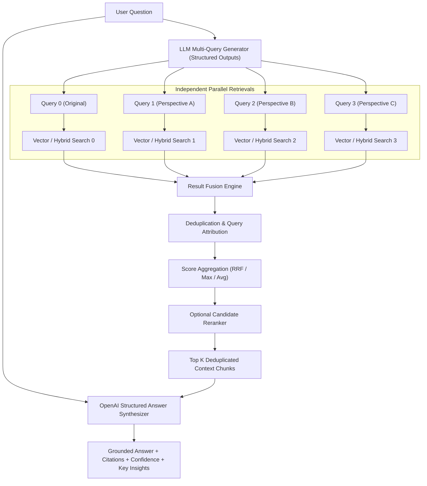

# 07 — Multi-Query RAG Engine (Express Backend & OpenAI Structured Outputs)

Production-grade **Multi-Query RAG Engine** implemented in **TypeScript** with an **Express HTTP Backend API**, supporting **OpenAI SDK TypeScript with Structured Outputs** (`beta.chat.completions.parse` with Zod validation), **Multi-Perspective Search Query Generation**, **Independent Parallel Vector & Hybrid Retrieval**, **Result Fusion & Deduplication (Reciprocal Rank Fusion - RRF, Max Score, Avg Score)**, **Attribution Tracking**, **Quantitative Evaluation Benchmarks (Single-Query vs Multi-Query)**, **CLI Tools**, and comprehensive **Jest Tests**.

---

## 📌 Architecture Overview



---

## 🚀 Key Senior AI Backend Features

1. **Multi-Query Perspective Generation**:
   - Asks LLM (`gpt-4o-mini`) via `openai.beta.chat.completions.parse` to reformulate single user question into $N$ semantically diverse, technical search query variations.
   - Smart local fallback engine generates perspective variations out-of-the-box when no API key is set.

2. **Independent Parallel Retrieval & Multi-Search Execution**:
   - Runs independent dense vector search, BM25 sparse search, or hybrid search for each query formulation.

3. **Result Fusion, Attribution & Deduplication**:
   - Merges candidate sets across all query variations.
   - Deduplicates document chunks by stable ID while tracking query attribution (`retrievedByQueries`, `occurrences`, `scoresPerQuery`, `ranksPerQuery`).
   - Supports **Reciprocal Rank Fusion (RRF)**, **Max Score**, and **Average Score** strategies.

4. **Structured RAG Answer Generation**:
   - Generates factually grounded answers using OpenAI TypeScript SDK with strict Zod schema validation (`zodResponseFormat`).
   - Returns structured JSON containing `answer`, `confidenceScore`, `citedChunkIds`, and `keyInsights`.

5. **Express REST API Backend**:
   - Clean layer architecture (Controllers, Services, InMemoryVectorStore, Middlewares, Zod validation).
   - Endpoints for Ingestion, Query Generation, Multi-Query Search, Grounded RAG Querying, and Benchmark Evaluation.

6. **Quantitative Benchmarking Suite**:
   - Side-by-side comparison of Single-Query RAG vs Multi-Query RAG (Recall Gain %, New Chunks Discovered, Deduplication Ratio, Latency).

---

## ⚙️ Installation & Setup

```bash
# Navigate to code directory
cd 07-multi-query-rag/code

# Install dependencies
npm install

# Copy environment template
cp .env.example .env

# Run unit & integration tests
npm test

# Build TypeScript
npm run build
```

---

## 🏃 Running the Server & CLI

### Express API Server

```bash
# Start development server
npm run dev

# Or run compiled production server
npm start
```

Server runs at `http://localhost:3000`.

### CLI Interface

```bash
# Seed sample dataset
npx ts-node src/cli.ts seed

# Generate query variations for a question
npx ts-node src/cli.ts generate -q "How can I stop users from accessing protected pages after session expires?"

# Run Multi-Query Search & Fusion
npx ts-node src/cli.ts search -q "How to reset account password" --num-queries 4 --fusion-strategy rrf

# Run Full Multi-Query RAG Pipeline
npx ts-node src/cli.ts query -q "What is our subscription refund policy?"

# Run Single-Query vs Multi-Query Comparative Benchmarks
npx ts-node src/cli.ts compare
```

---

## 📡 REST API Reference

### 1. Ingest Document
`POST /api/v1/documents/ingest`

```json
{
  "content": "When a user session expires, refresh token is blacklisted in Redis and user is redirected to /login.",
  "metadata": {
    "title": "Session Expiration & Blacklisting",
    "category": "security"
  }
}
```

### 2. Generate Query Variations
`POST /api/v1/multi-query/generate`

```json
{
  "query": "How to handle session timeout?",
  "numQueries": 4
}
```

### 3. Multi-Query Search & Fusion
`POST /api/v1/multi-query/search`

```json
{
  "query": "How to handle session timeout?",
  "numQueries": 4,
  "topKPerQuery": 5,
  "finalTopK": 5,
  "fusionStrategy": "rrf",
  "retrievalMode": "hybrid"
}
```

### 4. Multi-Query Grounded RAG Query
`POST /api/v1/rag/query`

```json
{
  "question": "What is our subscription refund policy?",
  "numQueries": 4,
  "topKPerQuery": 5,
  "finalTopK": 5
}
```

### 5. Single-Query vs Multi-Query Comparative Benchmark
`POST /api/v1/benchmark/compare`

```json
{
  "queries": ["How to handle session timeout?", "refund policy"],
  "numQueries": 4
}
```

### 6. System Health Check
`GET /api/v1/health`

---

## 🧪 Testing

```bash
# Run all tests
npm test

# Run tests with coverage
npm run test:coverage
```

Tests validate:
- Multi-Query variation generator logic & fallback engine
- Result merger, deduplication, attribution tracking, and RRF score fusion
- Full Multi-Query RAG pipeline orchestration
- Comparative benchmark metrics calculation
- Complete Express REST API integration tests via `supertest`
