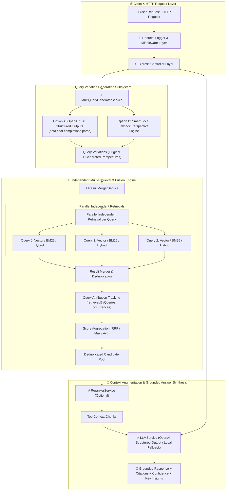

# 📘 07 — Multi-Query RAG Implementation Guide

Welcome to the comprehensive, step-by-step implementation guide for **Multi-Query RAG (Multi-Perspective Retrieval, Fusion & Deduplication Engine)**.

This guide provides an end-to-end tutorial covering why Multi-Query RAG is essential for production applications, the theoretical and mathematical foundations of **Query Transformation**, independent multi-search retrieval (Dense Vector, BM25, Hybrid RRF), **OpenAI SDK TypeScript Structured Outputs** (`beta.chat.completions.parse` with Zod validation), **Score Fusion (Reciprocal Rank Fusion - RRF, Max Score, Avg Score)**, candidate deduplication, query attribution tracking, Express REST API backend architecture, quantitative benchmarking (Single-Query vs Multi-Query), and CLI execution.

All corresponding production-grade source code, sample dataset, and unit/integration tests are located in [`07-multi-query-rag/code`](../code).

---

## 🏗️ Architecture & Component Flow



---

## 📚 Chapters Index

| Chapter | Title | Focus Topics & Core Code Modules |
| :--- | :--- | :--- |
| **[Chapter 0](./00-introduction-and-multi-query-theory.md)** | **Introduction & Mathematical Foundations of Multi-Query RAG** | Retrieval recall problem, wording sensitivity, query perspective transformation, fusion mathematics — [`README.md`](../README.md) |
| **[Chapter 1](./01-project-setup-and-domain-schemas.md)** | **Project Setup & Domain Schemas** | TypeScript setup, `DocumentChunk`, `QueryVariation`, `MergedCandidateChunk`, Zod API schemas — [`types/index.ts`](../code/src/types/index.ts), [`package.json`](../code/package.json) |
| **[Chapter 2](./02-vector-store-and-hybrid-retrieval.md)** | **Vector Store & Hybrid Retrieval Subsystem** | Dense vector search, Okapi BM25 sparse search, `VectorStoreService`, `BM25Service`, `EmbeddingService` — [`services/vector-store.service.ts`](../code/src/services/vector-store.service.ts) |
| **[Chapter 3](./03-multi-query-generator-subsystem.md)** | **Multi-Query Generator Subsystem** | `MultiQueryGeneratorService`, OpenAI SDK Structured Outputs (`beta.chat.completions.parse`), local fallback perspective engine — [`services/multi-query-generator.service.ts`](../code/src/services/multi-query-generator.service.ts) |
| **[Chapter 4](./04-result-fusion-deduplication-and-attribution.md)** | **Result Fusion, Deduplication & Query Attribution** | `ResultMergerService`, independent parallel search execution, ID-based deduplication, Reciprocal Rank Fusion (RRF), Max/Avg scoring, query attribution tracking — [`services/result-merger.service.ts`](../code/src/services/result-merger.service.ts) |
| **[Chapter 5](./05-multi-query-rag-pipeline-orchestrator.md)** | **Multi-Query RAG Pipeline Orchestrator & LLM Synthesizer** | `MultiQueryRAGService`, `LLMService`, `RerankerService`, structured grounded answer generation — [`services/multi-query-rag.service.ts`](../code/src/services/multi-query-rag.service.ts), [`services/llm.service.ts`](../code/src/services/llm.service.ts) |
| **[Chapter 6](./06-express-backend-architecture-and-rest-apis.md)** | **Express Backend Architecture & REST APIs** | Server architecture (`app.ts`, `server.ts`), middlewares, Controllers, REST routes (`/api/v1/multi-query/*`, `/api/v1/rag/*`, `/api/v1/benchmark/*`) — [`controllers/`](../code/src/controllers/), [`routes/`](../code/src/routes/) |
| **[Chapter 7](./07-single-vs-multi-query-benchmarking.md)** | **Single-Query vs Multi-Query Benchmarking** | `BenchmarkService`, quantitative comparison suite, recall gain %, new chunks discovered metric, deduplication ratio, latency overhead — [`services/benchmark.service.ts`](../code/src/services/benchmark.service.ts) |
| **[Chapter 8](./08-interactive-cli-sample-data-and-testing-suite.md)** | **Interactive CLI, Sample Data & Testing Suite** | Commander CLI (`seed`, `generate`, `search`, `query`, `compare`), sample dataset (`documents.json`), Jest test suite — [`cli.ts`](../code/src/cli.ts), [`sample_data/`](../code/sample_data/), [`tests/`](../code/tests/) |

---

## 🚀 Quick Execution Guide

1. Navigate to code directory:
   ```bash
   cd 07-multi-query-rag/code
   ```
2. Build TypeScript package:
   ```bash
   npm run build
   ```
3. Run Jest test suite:
   ```bash
   npm test
   ```
4. Start Express REST API server:
   ```bash
   npm start
   ```
5. Execute CLI Comparative Benchmark:
   ```bash
   npx ts-node src/cli.ts compare
   ```
