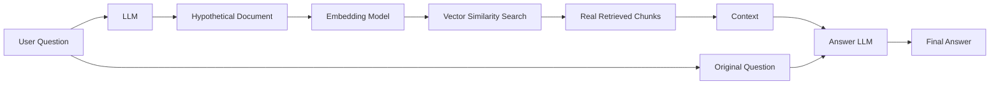
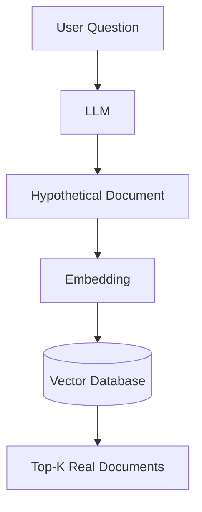
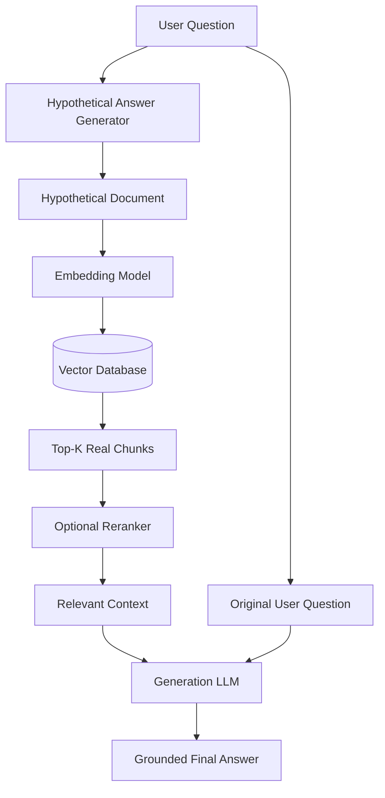
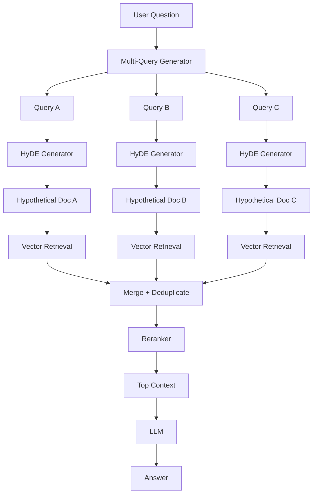
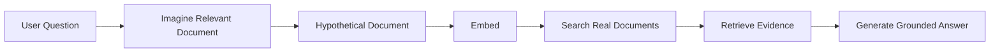

# 08 — HyDE (Hypothetical Document Embeddings)

## 📌 Overview

**HyDE (Hypothetical Document Embeddings)** is a query-transformation technique that improves semantic retrieval by generating a **hypothetical document** before performing vector search.

The problem HyDE addresses is the **representation gap** between:

* a short user query
* a longer, declarative knowledge-base passage

For example:

```text
User Query:
How does RAG reduce hallucinations?
```

A knowledge-base document might look like:

```text
Retrieval-Augmented Generation grounds language model
responses in externally retrieved information. By providing
relevant source passages as context, the model can rely on
evidence from the knowledge base rather than generating
information solely from its parametric memory.
```

These two texts express related concepts but have very different forms.

HyDE asks an LLM to generate a **hypothetical answer/document**, embeds that generated text, and uses the resulting embedding to retrieve actual documents.

### Core idea

> **Question → Hypothetical Document → Embedding → Vector Search → Real Documents → LLM Answer**

The hypothetical document is used to improve **retrieval**, not as trusted evidence for the final answer.

---

# 🧩 Why Does HyDE Help?

Traditional vector RAG does this:

```text
User Question
      ↓
Embedding
      ↓
Vector Search
      ↓
Relevant Documents
```

The query embedding represents the user's question directly.

HyDE instead does:

```text
User Question
      ↓
LLM
      ↓
Hypothetical Document
      ↓
Embedding
      ↓
Vector Search
      ↓
Relevant Documents
```

The hypothetical document can resemble the **style, vocabulary, and semantic structure** of the documents stored in the knowledge base.

This can make semantic matching more effective for some conceptual or domain-specific queries.

---

# 🏗️ HyDE Architecture



The key architectural detail is:

**The hypothetical document goes into retrieval.**

The **real retrieved chunks** go into the final generation step.

---

# 🔄 HyDE Workflow

## Step 1 — User Asks a Question

Example:

```text
How does vector search improve RAG?
```

The system first receives the original query.

---

## Step 2 — Generate a Hypothetical Document

An LLM is instructed to answer the question or generate a hypothetical passage that could plausibly appear in the target knowledge base.

Example:

```text
Vector search improves RAG by representing queries and
documents as dense embeddings and retrieving passages based
on semantic similarity. This allows the system to retrieve
relevant information even when the user's wording differs
from the wording used in the source documents.
```

This passage is **hypothetical**.

It does not need to be factually perfect.

Its primary purpose is to create a useful representation for retrieval.

---

## Step 3 — Embed the Hypothetical Document

The hypothetical document is passed to the embedding model.

```text
Hypothetical Document
        ↓
Embedding Model
        ↓
Dense Vector
        ↓
[0.021, -0.182, 0.734, ...]
```

This vector represents the semantic meaning of the generated passage.

---

## Step 4 — Search the Vector Database

The generated embedding is used as the search vector.



The database contains embeddings of the **real knowledge-base documents**.

The hypothetical document is therefore used as a bridge between the user's question and those documents.

---

# 📚 Example

Suppose the knowledge base contains:

```text
Document A:
Retrieval-Augmented Generation combines language models
with external knowledge retrieval.

Document B:
Dense vector embeddings allow semantic similarity search
across documents.

Document C:
BM25 retrieves documents using lexical term matching.

Document D:
Reranking improves the relevance ordering of retrieved
candidates.
```

User asks:

```text
Why is vector search useful in RAG?
```

### Traditional Vector RAG

```text
Question
   ↓
Question Embedding
   ↓
Vector Search
   ↓
A, B, D
```

### HyDE

```text
Question
   ↓
LLM
   ↓
Hypothetical explanation of semantic vector retrieval
   ↓
Embedding
   ↓
Vector Search
   ↓
B, A, D
```

The hypothetical passage may provide a representation that is more similar to the language used in the knowledge base.

---

# 🔬 The Representation Gap

One of the central ideas behind HyDE is the difference between:

```text
Query:
"Why use vector search?"
```

and:

```text
Document:
"Dense embeddings represent semantic relationships between
queries and documents, enabling retrieval based on meaning
rather than exact lexical overlap."
```

The query is:

* short
* interrogative
* underspecified

The document is:

* longer
* declarative
* information-rich

HyDE transforms:

```text
Short Question
      ↓
Information-rich Hypothetical Passage
```

before creating the retrieval embedding.

---

# 🧠 HyDE vs Normal Vector RAG

| Feature                         | Vector RAG              | HyDE                         |
| ------------------------------- | ----------------------- | ---------------------------- |
| Query embedding                 | Original question       | Hypothetical document        |
| LLM query transformation        | No                      | Yes                          |
| Retrieval                       | Vector search           | Vector search                |
| Main goal                       | Semantic retrieval      | Improve query representation |
| LLM calls                       | Usually generation only | Additional generation step   |
| Latency                         | Lower                   | Higher                       |
| Risk of query-generation errors | Low                     | Higher                       |
| Final context                   | Real documents          | Real documents               |

The important difference is **what gets embedded**.

### Vector RAG

```text
Question → Embedding → Search
```

### HyDE

```text
Question → Hypothetical Document → Embedding → Search
```

---

# ⚠️ The Hypothetical Document Is Not Ground Truth

This is one of the most important concepts to remember.

Suppose the LLM generates:

```text
Hypothetical Document:
RAG always eliminates hallucinations completely.
```

That statement may be incorrect.

The system should **not** use that generated text as authoritative context for the final answer.

Instead:

```text
Hypothetical Document
        ↓
     Retrieval
        ↓
Real Documents
        ↓
Final LLM
```

The final answer should be grounded in the **real retrieved documents**.

Therefore:

> **HyDE is a retrieval transformation, not a replacement for retrieval.**

---

# 🔁 Complete HyDE Pipeline



This architecture can also be combined with the techniques from previous labs.

For example:

```text
HyDE
  ↓
Hybrid Retrieval
  ↓
Deduplication
  ↓
Reranking
  ↓
Metadata Filtering
  ↓
LLM
```

---

# 🧪 HyDE Prompt

A basic HyDE prompt could be:

```text id="hyde04"
You are generating a hypothetical document for retrieval.

Given the user's question, write a concise hypothetical
passage that could plausibly appear in the knowledge base
and directly address the question.

Do not mention that the passage is hypothetical.
Do not add unnecessary explanations.
```

For a user query:

```text
What is the difference between dense and sparse retrieval?
```

The LLM might generate:

```text
Dense retrieval represents queries and documents using
continuous vector embeddings and retrieves results based
on semantic similarity. Sparse retrieval represents text
using sparse lexical features and is commonly implemented
using methods such as BM25, making it effective for exact
terms, identifiers, and keyword-sensitive searches.
```

That generated passage is then embedded.

---

# 🔢 Hypothetical Document vs Original Query

Consider:

```text
Original Query:
"How do I find documents with similar meaning?"
```

HyDE might produce:

```text
Hypothetical Document:
"Semantic retrieval uses dense vector embeddings to identify
documents that are conceptually similar to a user's query,
even when the documents do not share the same exact words."
```

The second representation contains more domain-specific semantic information.

That is the fundamental intuition behind HyDE.

---

# 🎯 When HyDE Works Well

HyDE can be particularly useful for:

* conceptual questions
* natural-language questions
* domain-specific knowledge bases
* questions where user wording differs significantly from document wording
* semantic search
* research-oriented retrieval
* open-domain or less structured information needs

Example:

```text
User:
Why does increasing model context sometimes hurt performance?

Knowledge Base:
Long-context degradation...
attention dilution...
irrelevant context...
```

A hypothetical explanation may bridge the terminology gap between the question and the documents.

---

# 🚫 When HyDE May Not Be Necessary

HyDE is not automatically better for every query.

It may provide limited value for highly precise queries such as:

```text
What does error code ERR_CONNECTION_RESET mean?
```

or:

```text
Find SKU AX-29481.
```

For these queries, exact lexical retrieval or hybrid retrieval may be more appropriate.

This is another reason production systems often use **query routing** or adaptive retrieval rather than applying one strategy to every question.

---

# 🔀 HyDE + Multi-Query RAG

HyDE can also be combined with the previous lab.

Instead of:

```text
Question
   ↓
HyDE
   ↓
One Hypothetical Document
   ↓
Search
```

you could generate multiple query perspectives:



This can potentially improve coverage further, but it also increases cost and latency substantially.

---

# 🔥 HyDE + Reranking

A practical architecture can be:

```text
User Question
      ↓
HyDE
      ↓
Hypothetical Document
      ↓
Vector Search
      ↓
Top 50 Candidates
      ↓
Cross-Encoder Reranker
      ↓
Top 5
      ↓
LLM
```

Here the two components have different jobs:

**HyDE**

> Improve the representation used for retrieval.

**Reranking**

> Improve the ordering of the retrieved candidates.

So:

```text
HyDE → Better Candidate Discovery
Reranking → Better Candidate Ordering
```

---

# ⚡ Latency Consideration

Traditional RAG:

```text
Question
   ↓
Embedding
   ↓
Search
   ↓
LLM
```

HyDE:

```text
Question
   ↓
LLM ← Additional latency
   ↓
Hypothetical Document
   ↓
Embedding
   ↓
Search
   ↓
LLM
```

Therefore, HyDE introduces an additional generation step.

For production systems, you should evaluate whether the retrieval-quality improvement justifies:

* additional latency
* additional token usage
* additional LLM cost

---

# ⚖️ Tradeoffs

### Advantages

* Can reduce the representation gap between queries and documents
* Can improve semantic retrieval for conceptual questions
* Can help when user vocabulary differs from document vocabulary
* Works with existing vector databases
* Can be combined with reranking and hybrid retrieval

### Disadvantages

* Requires an additional LLM call
* Increases latency
* Increases token/API cost
* Generated hypothetical content can be misleading
* Does not guarantee better retrieval
* Can be unnecessary for exact-match queries

---

# 🧠 Key Mental Model

Think of HyDE as:

> **"Don't search using the question directly. First imagine what a relevant document might look like, then search for real documents similar to that imagined document."**



The word **hypothetical** is critical.

```text
Hypothetical Document
        ≠
Ground Truth
```

It is simply a **retrieval aid**.

---

# 📌 Key Takeaway

**HyDE = Hypothetical Document Generation + Embedding + Vector Retrieval**

The core pipeline is:

```text
User Question
      ↓
LLM
      ↓
Hypothetical Document
      ↓
Embedding
      ↓
Vector Database
      ↓
Real Retrieved Chunks
      ↓
Optional Reranking
      ↓
LLM
      ↓
Final Answer
```

### Remember

> 🔹 **Vector RAG** → embed the user's query directly
> 🔹 **Multi-Query RAG** → create multiple query perspectives
> 🔹 **HyDE** → create a hypothetical document and embed it
> 🔹 **Reranking** → reorder retrieved candidates by relevance
> 🔹 **Hybrid RAG** → combine dense + sparse retrieval

The main idea to remember:

> **HyDE does not replace your knowledge base with a generated answer. It uses a generated hypothetical document to find the real evidence in your knowledge base.**
