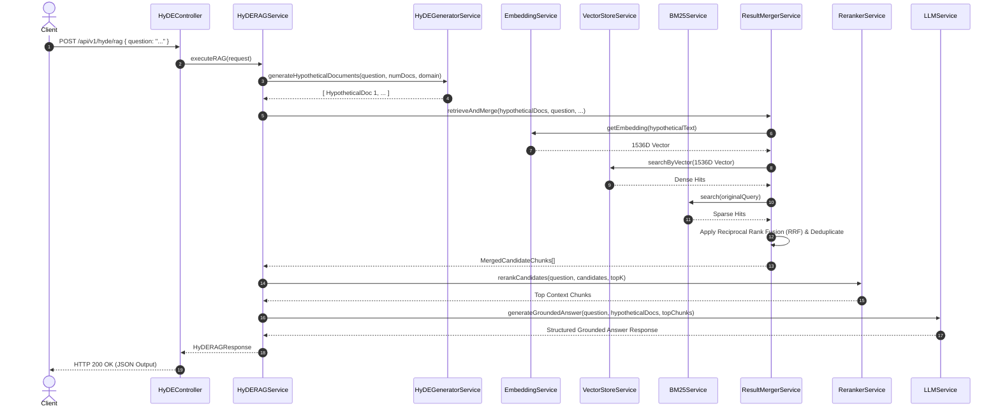

# Chapter 6 — HyDE RAG Pipeline Orchestrator

## ⚡ 1. Orchestration Architecture & Workflow

The `HyDERAGService` ([`src/services/hyde-rag.service.ts`](../code/src/services/hyde-rag.service.ts)) coordinates all subsystems for candidate retrieval (`search`) and end-to-end grounded query execution (`executeRAG`).



---

## 💻 2. Full Service Implementation Code

```typescript
import {
  HyDERAGRequest,
  HyDERAGResponse,
  HyDESearchRequest,
  HyDESearchResponse,
} from '../types';
import { hydeGeneratorService } from './hyde-generator.service';
import { llmService } from './llm.service';
import { rerankerService } from './reranker.service';
import { resultMergerService } from './result-merger.service';

export class HyDERAGService {
  /**
   * Executes HyDE Candidate Search & Retrieval (without final LLM generation).
   */
  async search(request: HyDESearchRequest): Promise<HyDESearchResponse> {
    const startTime = Date.now();
    const numDocs = request.numHypotheticalDocs ?? 1;
    const domainContext = request.domainContext ?? 'technical';
    const topKPerDoc = request.topKPerDoc ?? 5;
    const finalTopK = request.finalTopK ?? 5;
    const fusionStrategy = request.fusionStrategy ?? 'rrf';
    const retrievalMode = request.retrievalMode ?? 'hybrid';
    const enableReranking = request.enableReranking ?? true;
    const includeDirectQuerySearch = request.includeDirectQuerySearch ?? false;

    // 1. Generate hypothetical document passage(s)
    const hypotheticalDocuments = await hydeGeneratorService.generateHypotheticalDocuments(
      request.query,
      numDocs,
      domainContext
    );

    // 2. Vector search via hypothetical embeddings + BM25 sparse search & multi-source fusion
    const mergeResult = await resultMergerService.retrieveAndMerge(
      hypotheticalDocuments,
      request.query,
      topKPerDoc,
      retrievalMode,
      fusionStrategy,
      includeDirectQuerySearch
    );

    // 3. Reranking step
    let topContextChunks = mergeResult.mergedCandidates;
    if (enableReranking) {
      topContextChunks = await rerankerService.rerankCandidates(
        request.query,
        mergeResult.mergedCandidates,
        finalTopK
      );
    } else {
      topContextChunks = mergeResult.mergedCandidates.slice(0, finalTopK);
    }

    const executionTimeMs = Date.now() - startTime;

    return {
      originalQuery: request.query,
      hypotheticalDocuments,
      totalCandidatesRetrieved: mergeResult.totalCandidatesRetrieved,
      uniqueCandidatesDeduplicated: mergeResult.uniqueCandidatesDeduplicated,
      fusionStrategy,
      mergedCandidates: mergeResult.mergedCandidates,
      topContextChunks,
      executionTimeMs,
    };
  }

  /**
   * Executes complete end-to-end HyDE RAG pipeline, generating grounded answer based on real retrieved context.
   */
  async executeRAG(request: HyDERAGRequest): Promise<HyDERAGResponse> {
    const startTime = Date.now();

    const searchResponse = await this.search({
      query: request.question,
      numHypotheticalDocs: request.numHypotheticalDocs,
      topKPerDoc: request.topKPerDoc,
      finalTopK: request.finalTopK,
      fusionStrategy: request.fusionStrategy,
      retrievalMode: request.retrievalMode,
      enableReranking: request.enableReranking,
      domainContext: request.domainContext,
    });

    // Synthesize final grounded answer strictly using top real retrieved context chunks
    const groundedAnswer = await llmService.generateGroundedAnswer(
      request.question,
      searchResponse.hypotheticalDocuments,
      searchResponse.topContextChunks
    );

    const executionTimeMs = Date.now() - startTime;

    return {
      question: request.question,
      hypotheticalDocuments: searchResponse.hypotheticalDocuments,
      answer: groundedAnswer.answer,
      confidenceScore: groundedAnswer.confidenceScore,
      citedChunkIds: groundedAnswer.citedChunkIds,
      keyInsights: groundedAnswer.keyInsights,
      retrievalSummary: {
        totalRetrieved: searchResponse.totalCandidatesRetrieved,
        uniqueDeduplicated: searchResponse.uniqueCandidatesDeduplicated,
        finalContextCount: searchResponse.topContextChunks.length,
        fusionStrategy: searchResponse.fusionStrategy,
        rerankingApplied: request.enableReranking ?? true,
      },
      retrievedContext: searchResponse.topContextChunks,
      executionTimeMs,
    };
  }
}

export const hydeRAGService = new HyDERAGService();
```

Next, proceed to **[Chapter 7 — Express Backend Architecture & REST APIs](./07-express-backend-architecture-and-rest-apis.md)**.
