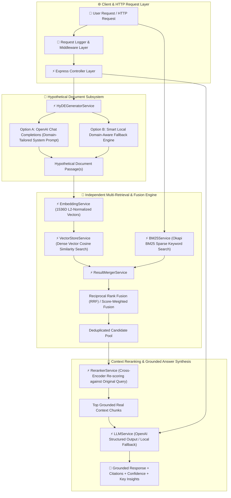

# 📘 08 — HyDE (Hypothetical Document Embeddings) Implementation Guide

Welcome to the comprehensive, step-by-step implementation guide for **HyDE (Hypothetical Document Embeddings) RAG Engine**.

This guide provides an end-to-end tutorial covering why HyDE is essential for production applications, the theoretical and mathematical foundations of **Representation Gap Mitigation**, synthetic passage generation, dense vector & BM25 hybrid retrieval, **OpenAI SDK TypeScript Structured Outputs** (`beta.chat.completions.parse` with Zod validation), **Score Fusion (Reciprocal Rank Fusion - RRF, Max Score, Score Weighted)**, candidate deduplication, query attribution tracking, Express REST API backend architecture, quantitative benchmarking, and CLI execution.

All corresponding production-grade source code, sample dataset, and unit/integration tests are located in [`08-hyde/code`](../code).

---

## 🏗️ Architecture & Component Flow



> ⚠️ **Critical Requirement**: The hypothetical document is used **strictly for retrieval** to locate real evidence. It is NEVER supplied as trusted context to the final LLM answer synthesizer.

---

## 📚 Chapters Index

| Chapter | Title | Focus Topics & Core Code Modules |
| :--- | :--- | :--- |
| **[Chapter 0](./00-introduction-and-hyde-theory.md)** | **Introduction & Mathematical Foundations of HyDE** | The representation gap, short query vs long document embeddings, synthetic document intuition, cosine distance math, safety guidelines — [`README.md`](../README.md) |
| **[Chapter 1](./01-project-setup-and-domain-schemas.md)** | **Project Setup & Domain Schemas** | TypeScript setup, `HypotheticalDocument`, `MergedCandidateChunk`, Zod API schemas, environment configuration — [`types/index.ts`](../code/src/types/index.ts), [`config/environment.ts`](../code/src/config/environment.ts) |
| **[Chapter 2](./02-vector-store-and-hybrid-retrieval.md)** | **Vector Store & Hybrid Retrieval Subsystem** | 1536D OpenAI / Local Hashing Embeddings, sliding-window text chunker, Okapi BM25 sparse search — [`services/vector-store.service.ts`](../code/src/services/vector-store.service.ts), [`services/embedding.service.ts`](../code/src/services/embedding.service.ts) |
| **[Chapter 3](./03-hyde-generator-subsystem.md)** | **HyDE Generator Subsystem** | `HyDEGeneratorService`, domain-tailored prompts (`technical`, `legal`, `medical`), multi-doc generation, local fallback — [`services/hyde-generator.service.ts`](../code/src/services/hyde-generator.service.ts) |
| **[Chapter 4](./04-result-fusion-deduplication-and-attribution.md)** | **Result Fusion & Deduplication Engine** | `ResultMergerService`, parallel retrieval across hypothetical docs, Reciprocal Rank Fusion (RRF), max score fusion, attribution — [`services/result-merger.service.ts`](../code/src/services/result-merger.service.ts) |
| **[Chapter 5](./05-cross-encoder-reranker-and-llm-synthesizer.md)** | **Cross-Encoder Reranker & Grounded LLM Synthesizer** | `RerankerService`, semantic cross-scoring against original query, `LLMService`, Zod structured grounded answer generation — [`services/reranker.service.ts`](../code/src/services/reranker.service.ts), [`services/llm.service.ts`](../code/src/services/llm.service.ts) |
| **[Chapter 6](./06-hyde-rag-pipeline-orchestrator.md)** | **HyDE RAG Pipeline Orchestrator** | `HyDERAGService`, pipeline sequence flow for `search` and `executeRAG`, performance timing — [`services/hyde-rag.service.ts`](../code/src/services/hyde-rag.service.ts) |
| **[Chapter 7](./07-express-backend-architecture-and-rest-apis.md)** | **Express Backend Architecture & REST APIs** | Server architecture (`app.ts`, `server.ts`), middlewares (`errorHandler`, `validateRequest`), REST routes (`/api/v1/hyde/*`) — [`controllers/`](../code/src/controllers/), [`routes/`](../code/src/routes/) |
| **[Chapter 8](./08-benchmarking-cli-and-testing-suite.md)** | **Benchmarking, Interactive CLI & Test Suite** | `BenchmarkService`, quantitative comparison (Direct Vector vs HyDE vs HyDE + Reranker), Commander CLI, sample data, Jest tests — [`cli.ts`](../code/src/cli.ts), [`tests/`](../code/tests/) |

---

## 🚀 Quick Execution Guide

1. Navigate to code directory:
   ```bash
   cd 08-hyde/code
   ```
2. Build TypeScript package:
   ```bash
   npm run build
   ```
3. Run Jest test suite:
   ```bash
   npm test
   ```
4. Start Express REST API server:
   ```bash
   npm start
   ```
5. Execute CLI Comparative Benchmark:
   ```bash
   npx ts-node src/cli.ts benchmark
   ```
6. Run interactive Grounded Query Answering:
   ```bash
   npx ts-node src/cli.ts ask "How does RAG reduce hallucinations in LLMs?"
   ```
