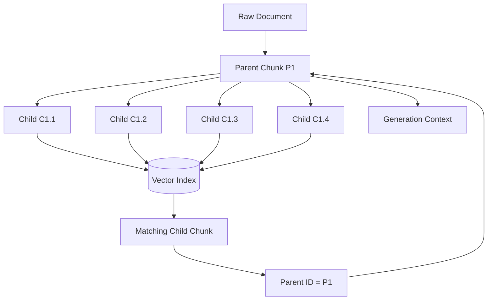
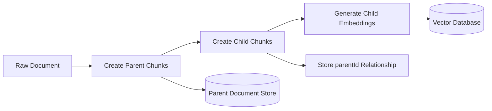
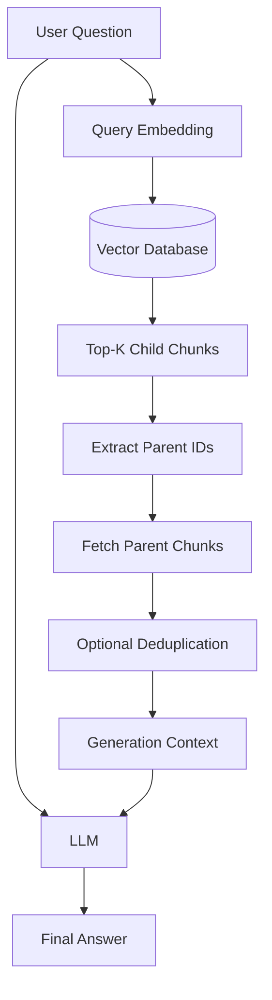
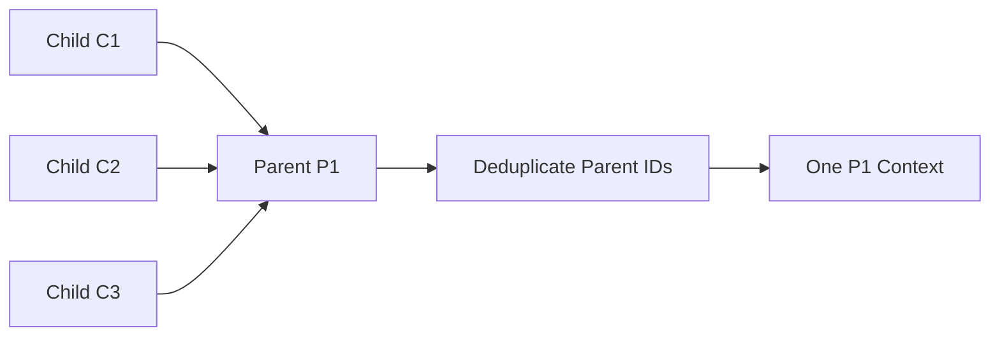
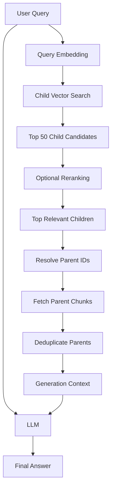
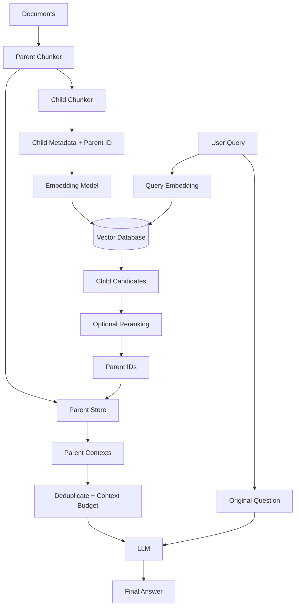

# 09 — Parent-Document RAG

## 📌 Overview

**Parent-Document RAG** separates the **retrieval unit** from the **generation context**.

Instead of embedding large chunks directly, the system creates a hierarchy:

* **Parent chunks** contain larger, coherent sections of the document.
* **Child chunks** are smaller pieces of those parents.
* **Child chunks** are embedded and indexed for precise retrieval.
* When a child chunk matches the user's query, the system uses its relationship to retrieve the **parent chunk**.
* The parent chunk is then supplied to the LLM as context.

### Core idea

> **Search small → Retrieve large → Generate with complete context**

For example:

```text id="pd01"
Parent Chunk
1,500 tokens
      │
      ├── Child 1 → 200 tokens
      ├── Child 2 → 200 tokens
      ├── Child 3 → 200 tokens
      ├── Child 4 → 200 tokens
      └── Child 5 → 200 tokens
```

The vector database searches the **children**, but the LLM receives the **parent**.

---

# 🤔 Why Do We Need Parent-Document RAG?

There is an important tradeoff in chunking.

### Small chunks

Small chunks are good for:

* precise semantic matching
* reducing irrelevant information
* better retrieval granularity

But they can lose context.

For example:

```text id="pd02"
Child Chunk:

"The policy is renewed automatically after 30 days."
```

Without surrounding context, we may not know:

* Which policy?
* Who does it apply to?
* What are the conditions?
* What does "30 days" refer to?

---

### Large chunks

Large chunks preserve more context:

```text id="pd03"
Parent Chunk:

Subscription Policy

Users receive a 30-day trial period. After the trial
period expires, eligible subscriptions are automatically
renewed according to the selected billing plan...
```

But embedding huge chunks can make retrieval less precise because unrelated information gets mixed into the same vector representation.

Parent-Document RAG attempts to get the advantages of both.

```text
Small child chunks
       ↓
Precise retrieval

Large parent chunks
       ↓
Complete context
```

---

# 🏗️ Storage & Lookup Model



The important relationship is:

```text
Child → Parent
```

Each child chunk needs a reliable reference to its parent.

---

# 📦 Example Data Model

A child record might look conceptually like:

```json id="pd05"
{
  "id": "child_001",
  "text": "The policy is renewed automatically after 30 days.",
  "parentId": "parent_001",
  "documentId": "doc_123",
  "metadata": {
    "section": "Subscription Policy"
  }
}
```

The parent record might be stored separately:

```json id="pd06"
{
  "id": "parent_001",
  "text": "Subscription Policy\n\nUsers receive a 30-day trial...",
  "documentId": "doc_123"
}
```

The vector index primarily needs the child representation.

The parent store needs the larger context.

---

# 🔄 Indexing Pipeline

During ingestion:



### Example

```text id="pd08"
Document
   ↓
Parent P1
   ↓
────────────────────────
C1 → vector
C2 → vector
C3 → vector
C4 → vector
────────────────────────
```

The vector database knows:

```text
C1 → P1
C2 → P1
C3 → P1
C4 → P1
```

---

# 🔎 Retrieval Pipeline

When a user asks a question:



The retrieval process becomes:

```text id="pd10"
User Question
      ↓
Query Embedding
      ↓
Vector Search
      ↓
Top Child Chunks
      ↓
Get Parent IDs
      ↓
Fetch Parent Chunks
      ↓
LLM
      ↓
Answer
```

---

# 🧪 Example

Suppose we have a document about:

```text
Company Leave Policy
```

We create:

```text id="pd11"
Parent P1
├── Child C1
├── Child C2
├── Child C3
├── Child C4
└── Child C5
```

The user asks:

> "How many sick leaves can an employee take?"

Vector search might find:

```text id="pd12"
C3:
"Employees are entitled to 12 days of sick leave..."
```

Instead of sending only C3 to the LLM, the system follows:

```text id="pd13"
C3
 ↓
parentId = P1
 ↓
P1
 ↓
Full relevant section
```

The LLM receives the larger parent context.

This provides the surrounding policy information needed to answer correctly.

---

# 🎯 Child vs Parent

| Property             | Child Chunk      | Parent Chunk               |
| -------------------- | ---------------- | -------------------------- |
| Typical size         | Small            | Larger                     |
| Example              | ~200 tokens      | ~1,000–2,000 tokens        |
| Used for             | Retrieval        | Generation context         |
| Embedded             | Usually yes      | Usually not required       |
| Matching precision   | High             | Lower if embedded directly |
| Context completeness | Lower            | Higher                     |
| Stored in vector DB  | Yes              | Optional                   |
| Parent relationship  | Points to parent | Contains children          |

The exact sizes are **not universal**.

For example:

```text
Child: 100–300 tokens
Parent: 500–2,000+ tokens
```

The correct sizes depend on:

* document structure
* embedding model
* retrieval quality
* LLM context window
* latency
* cost
* domain

---

# 🔗 Parent Retrieval

Suppose vector search returns:

```text id="pd14"
C1 → P1
C7 → P3
C12 → P1
C19 → P5
```

The system should not necessarily send:

```text
C1 + C7 + C12 + C19
```

Instead it can resolve:

```text id="pd15"
C1  ─┐
C12 ─┴─→ P1

C7 ───→ P3

C19 ──→ P5
```

Then retrieve:

```text id="pd16"
P1
P3
P5
```

After deduplication:

```text
3 unique parent contexts
```

This prevents the same parent document from being inserted multiple times when several of its children are retrieved.

---

# 🧹 Parent Deduplication

This is particularly important.

Suppose:

```text
C1 → P1
C2 → P1
C3 → P1
```

All three children are highly relevant.

Without deduplication:

```text
P1
P1
P1
```

could be sent to the LLM.

Instead:



---

# 📊 Parent-Document RAG vs Normal Chunk RAG

| Feature                | Standard Chunk RAG     | Parent-Document RAG      |
| ---------------------- | ---------------------- | ------------------------ |
| Retrieval unit         | Same chunk sent to LLM | Child chunk              |
| Generation context     | Retrieved chunk        | Parent chunk             |
| Retrieval precision    | Good                   | Often better             |
| Context completeness   | Can be limited         | Better                   |
| Storage complexity     | Low                    | Higher                   |
| Metadata relationships | Simple                 | Parent-child mapping     |
| Retrieval steps        | Fewer                  | Additional parent lookup |
| Context size           | Smaller                | Larger                   |

---

# 🧠 The Main Tradeoff

Parent-Document RAG intentionally separates two objectives:

```text id="pd18"
Retrieval
   ↓
"Find the exact relevant part."

Generation
   ↓
"Give the model enough surrounding context."
```

Trying to make one chunk satisfy both objectives can be difficult.

For example:

```text
200-token chunk
    ↓
Excellent retrieval
    ↓
Insufficient context
```

Whereas:

```text
1,500-token chunk
    ↓
More context
    ↓
Potentially less precise retrieval
```

Parent-Document RAG combines them:

```text
200-token Child
    ↓
Precise Retrieval
    ↓
1,500-token Parent
    ↓
Rich Context
```

---

# 🔥 Parent-Document RAG + Reranking

Parent-Document RAG can also be combined with the reranking architecture from Lab 06.

One possible pipeline:



This gives you:

```text
Child Retrieval
      +
Reranking
      +
Parent Context
      ↓
Better retrieval + richer context
```

There are different valid orderings in real systems. For example, you may resolve parents first and then rerank parent contexts depending on the retrieval architecture and reranker design.

---

# 🔥 Parent-Document RAG + Hybrid Retrieval

The child chunks do not have to be retrieved only with dense vectors.

You can use:

```text id="pd20"
Query
  ↓
Dense Search ──┐
               ├──→ Fusion → Child Candidates
BM25 Search ───┘
```

Then:

```text id="pd21"
Child Candidates
      ↓
Parent Resolution
      ↓
Parent Context
      ↓
LLM
```

This can be particularly useful when the child chunks contain:

* technical terminology
* product IDs
* error codes
* legal terms
* names
* semantic concepts

---

# ⚠️ Important Considerations

## 1. Parent Size Matters

If parents are too small:

```text
Parent = 250 tokens
```

you may not gain much over normal chunking.

If parents are extremely large:

```text
Parent = entire 50-page document
```

you may introduce:

* irrelevant context
* high token usage
* higher latency
* context-window pressure

The goal is a **coherent contextual unit**, not simply the largest possible chunk.

---

## 2. Multiple Children Can Map to One Parent

This is normal.

```text
P1
├── C1
├── C2
├── C3
└── C4
```

If C1 and C3 are retrieved, the system should generally recognize:

```text
C1 → P1
C3 → P1
```

and avoid inserting P1 twice.

---

## 3. Child Metadata Must Preserve the Relationship

A child record should contain enough information to locate its parent.

Conceptually:

```json id="pd22"
{
  "childId": "c_123",
  "parentId": "p_45",
  "documentId": "doc_10"
}
```

This relationship is critical to the architecture.

---

## 4. Parent Retrieval Can Increase Context Size

Suppose:

```text id="pd23"
Top-K children = 10
```

but those 10 children map to:

```text
8 unique parents
```

If every parent is 1,500 tokens:

```text
8 × 1,500
≈ 12,000 tokens
```

That may be significantly larger than the original child result set.

Therefore, production systems often need:

* parent deduplication
* maximum parent count
* token budgets
* optional reranking
* context compression
* careful chunk sizing

---

# 🏭 Production-Oriented Architecture

A practical implementation might look like:



---

# 🧠 Parent-Document vs Hierarchical RAG

These concepts are related but should not be treated as identical.

### Parent-Document RAG

Usually focuses on:

```text
Parent
  ↓
Child
```

The child is retrieved, and the parent provides context.

### Hierarchical RAG

Can contain multiple levels:

```text
Document
   ↓
Section
   ↓
Subsection
   ↓
Paragraph
   ↓
Sentence
```

Retrieval can navigate through several levels.

So:

> **Parent-Document RAG is a relatively simple hierarchical retrieval pattern.**

This distinction will become especially useful in **Lab 10 — Hierarchical RAG**.

---

# ⚖️ Tradeoffs

### Advantages

* More precise retrieval using small child chunks
* Preserves broader context for generation
* Reduces the need to choose between tiny and large chunks
* Works well with dense, sparse, or hybrid retrieval
* Combines naturally with reranking

### Disadvantages

* More complex ingestion pipeline
* Requires parent-child relationships
* Requires an additional parent lookup
* Parent contexts can become large
* Requires deduplication
* Can increase token usage and generation cost

---

# 🧠 Key Mental Model

Remember the distinction:

```text
              RETRIEVAL
                 │
                 ▼
        ┌─────────────────┐
        │  Small Child    │
        │   ~200 tokens   │
        └────────┬────────┘
                 │
            Find Parent
                 │
                 ▼
        ┌─────────────────┐
        │  Large Parent   │
        │ ~1000–2000+     │
        │     tokens      │
        └────────┬────────┘
                 │
                 ▼
              GENERATION
                 │
                 ▼
                LLM
```

The simplest way to remember it:

> **Child chunks are optimized for finding. Parent chunks are optimized for understanding.**

---

# 📌 Key Takeaway

**Parent-Document RAG = Small Retrieval Chunks + Large Generation Context**

The core pipeline is:

```text
Raw Document
     ↓
Parent Chunks
     ↓
Child Chunks
     ↓
Embed Children
     ↓
Vector Search
     ↓
Retrieve Matching Children
     ↓
Resolve Parent IDs
     ↓
Fetch Parent Chunks
     ↓
Deduplicate / Context Budget
     ↓
LLM
     ↓
Final Answer
```

### Remember

> 🔹 **Standard RAG** → retrieve and generate from the same chunk
> 🔹 **Parent-Document RAG** → retrieve a child, generate from its parent
> 🔹 **Reranking RAG** → improve candidate ordering
> 🔹 **Multi-Query RAG** → retrieve from multiple query perspectives
> 🔹 **HyDE** → transform the query into a hypothetical document for retrieval
> 🔹 **Hierarchical RAG** → navigate multiple levels of document structure

**Core principle:**

> **Don't force the same chunk size to optimize both retrieval precision and generation context. Parent-Document RAG lets each layer use the granularity it needs.**
