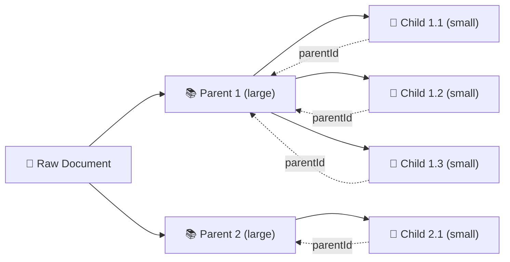

# Chapter 0 — Introduction & Theory of Parent-Document RAG

## 📌 Overview: The Chunking Tradeoff

Every Retrieval-Augmented Generation (RAG) pipeline must answer one deceptively hard question: **how big should a chunk be?**

The size of a chunk forces an unavoidable tradeoff because a chunk plays **two different roles at the same time**:

1. It is the **retrieval unit** — it must be embedded and matched against a query.
2. It is the **generation context** — it is pasted into the LLM prompt as evidence.

Optimizing for one role degrades the other.

```text
┌───────────────────────────────────────────────────────────────────────────────┐
│                          THE CHUNKING TRADEOFF                                │
├───────────────────────────────────┬───────────────────────────────────────────┤
│ SMALL chunks (~200 tokens)         │ LARGE chunks (~1500 tokens)               │
├───────────────────────────────────┼───────────────────────────────────────────┤
│ ✅ High-precision semantic match   │ ✅ Rich, coherent context                 │
│ ✅ Less irrelevant noise embedded  │ ✅ Surrounding statements preserved       │
│ ❌ Loses surrounding context       │ ❌ Embedding diluted by unrelated text    │
│ ❌ Answers silently truncated      │ ❌ Lower retrieval precision              │
└───────────────────────────────────┴───────────────────────────────────────────┘
```

Embedding a **large** chunk produces a vector that is an *average* over many topics, so it matches nothing sharply. Embedding a **small** chunk matches sharply, but the slice handed to the LLM may omit the very sentence that makes the answer correct.

You cannot win by choosing a size. **Parent-Document RAG wins by refusing to choose.**

---

## 🧠 The Parent-Document Solution: Search Small, Generate Large

**Parent-Document RAG** (a.k.a. *small-to-big* retrieval, and the basis of Hierarchical RAG) builds a **two-level hierarchy**:

- **Parent chunks** — large, coherent, section-scale units. Stored **only** for generation.
- **Child chunks** — small, precise units derived from a parent. Embedded and indexed **only** for retrieval. Each child carries a `parentId` pointer to its parent.



### The Pipeline Transformation

```mermaid
flowchart TD
    subgraph STANDARD["❌ Standard RAG (Child-Only) — one granularity for everything"]
        Q1["Query: 'How many sick leaves?'"] --> E1["Embed Query"]
        E1 --> S1["Search small chunks"]
        S1 --> R1["Top fragments → LLM"]
        R1 --> OUT1["⚠️ Answer may miss the entitlement clause that lived in a neighbouring fragment"]
    end

    subgraph PDRAG["✅ Parent-Document RAG — search small, generate large"]
        Q2["Query: 'How many sick leaves?'"] --> E2["Embed Query"]
        E2 --> S2["Search SMALL child chunks (precise)"]
        S2 --> HIT["Child hit → read parentId"]
        HIT --> FETCH["Fetch the FULL parent section (complete)"]
        FETCH --> R2["Parent context → LLM"]
        R2 --> OUT2["✅ Answer grounded in the complete, coherent section"]
    end
```



### Why It Works

1. **Precision where it matters**: Retrieval happens at child granularity, so the embedding is sharp and the match is accurate.
2. **Completeness where it matters**: Generation happens at parent granularity, so the LLM sees the full section — no severed sentences, no missing clauses.
3. **A single index**: Only children are embedded, so the vector index stays small and cheap. Parents are resolved by a simple key lookup (`parentId → parent`).

---

## 📐 Mathematical Foundations

### 1. Retrieval Precision (favours small chunks)

Let $q$ be the query embedding and $d_i$ the embedding of chunk $i$. Retrieval scores by cosine similarity:

$$\text{Sim}(q, d_i) = \frac{q \cdot d_i}{\lVert q \rVert_2 \, \lVert d_i \rVert_2}$$

Consider a parent section $P$ that mentions $k$ around-the-topic facts plus $1$ on-topic fact. The embedding of a large chunk is roughly the *centroid* of its sub-topics. If $P$ is split into small children $c_1 \dots c_m$, each child embedding is "purer":

$$\text{Sim}(q, c_{\text{on-topic}}) > \text{Sim}(q, P)$$

So **small children retrieve more precisely**. Parent-Document RAG uses this to find the right region of the document.

### 2. Context Completeness (favours large chunks)

Define **context completeness** as the fraction of the relevant section actually delivered to the generation LLM:

$$\text{Completeness} = \frac{\sum_{c \in \text{delivered}} |c|_{\text{tokens}}}{|P_{\text{relevant}}|_{\text{tokens}}}$$

- **Child-only pipeline**: delivers only the matched fragments, so $\text{Completeness} < 1$.
- **Parent-Document pipeline**: delivers the entire parent, so $\text{Completeness} = 1$.

This is exactly the metric computed by `BenchmarkService.computeContextCompleteness` in [Chapter 8](./08-benchmarking-cli-and-testing-suite.md).

### 3. Parent Resolution & Deduplication

Multiple matching children frequently map to the **same** parent. If we naively appended every parent, the same large section would be inserted repeatedly, wasting tokens. Parent-Document RAG groups by `parentId` first:

$$\text{Parents} = \{\, \text{parentOf}(c) \mid c \in \text{top-}K \text{ children} \,\}$$

Each parent is then scored by **aggregating** its matching children's scores (best / mean / sum), so a parent that many children point to rises in rank — treated as *corroborating evidence* that the parent is genuinely on-topic.

---

## 🛡️ Key Guardrails & Tradeoffs

| Aspect | Standard RAG (Child-Only) | Parent-Document RAG |
| :--- | :--- | :--- |
| **Retrieval precision** | Depends entirely on chunk size | High (children are small & sharp) |
| **Context completeness** | Low (fragments only) | High (full parent sections) |
| **Index size** | Same chunks used for both roles | Only children embedded |
| **Context tokens sent to LLM** | Fewer | More (dedup + budget mitigate) |
| **Latency** | Lowest | Slightly higher (parent lookups + optional rerank) |
| **Grounding** | Real chunks | Real **parent** chunks only — children never injected |

> ⚠️ Because several children map to one parent, the resolved context can balloon. Production systems therefore **deduplicate parents**, cap `maxParents`, and enforce a **token budget** — implemented in [Chapter 5](./05-parent-resolution-and-context-budgeting.md).

---

## 🗺️ How the Code Maps to This Theory

| Theory concept | Code artifact |
| :--- | :--- |
| Two-level hierarchy | `ChunkingService.createParentChildChunks` ([Chapter 2](./02-hierarchical-chunking-and-dual-stores.md)) |
| Small retrieval units | `ChildVectorStoreService` + `BM25Service` ([Chapters 2–3](./03-child-retrieval-bm25-and-fusion.md)) |
| Precision re-ranking | `RerankerService` ([Chapter 4](./04-cross-encoder-child-reranking.md)) |
| Parent resolution + dedup + budget | `ParentResolverService` ([Chapter 5](./05-parent-resolution-and-context-budgeting.md)) |
| Generation on parents only | `LLMService` + orchestrator ([Chapter 6](./06-grounded-generation-and-orchestration.md)) |
| Context completeness metric | `BenchmarkService.computeContextCompleteness` ([Chapter 8](./08-benchmarking-cli-and-testing-suite.md)) |

Next, proceed to **[Chapter 1 — Project Setup & Domain Schemas](./01-project-setup-and-domain-schemas.md)**.

