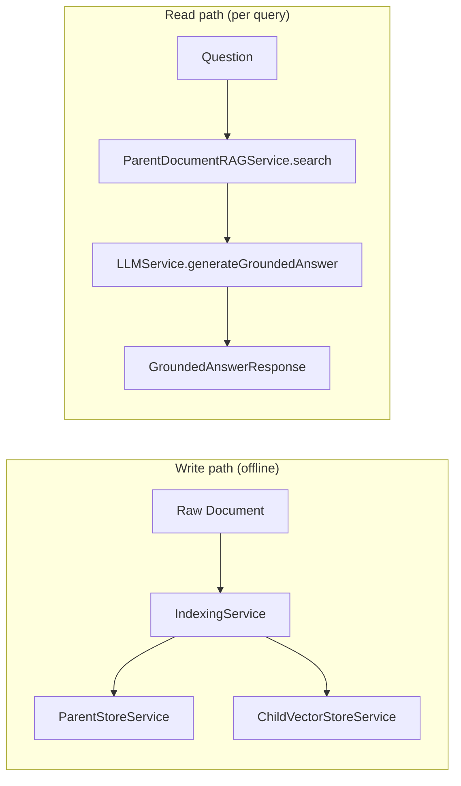

# Chapter 06 — Grounded Answer Generation & Pipeline Orchestration

Chapters 02–05 built *retrieval*: children are fetched, fused, reranked, and resolved into ranked parent contexts. This chapter does two things: **generate** a grounded answer from those parents, and **orchestrate** the whole thing — ingestion on the way in, `search`/`executeRAG` on the way out.



Files covered here:

| File | Role |
| :--- | :--- |
| [`src/services/llm.service.ts`](../code/src/services/llm.service.ts) | Synthesize the final answer from parent contexts only |
| [`src/services/indexing.service.ts`](../code/src/services/indexing.service.ts) | Build the hierarchy and fill both stores |
| [`src/services/parent-document-rag.service.ts`](../code/src/services/parent-document-rag.service.ts) | Top-level `search` + `executeRAG` orchestrator |

---

## 1. `LLMService` — answers come from parents, never children

The class holds one nullable OpenAI client. A `null` client means "no API key configured" — every downstream branch keys off that single fact, so there is exactly one place where the online/offline decision lives:

```typescript
export class LLMService {
  private openai: OpenAI | null = null;

  constructor() {
    if (config.openaiApiKey) {
      this.openai = new OpenAI({ apiKey: config.openaiApiKey });
    }
  }
```

The public entry point is `generateGroundedAnswer`. Read it as a three-branch decision tree:

```typescript
async generateGroundedAnswer(
  question: string,
  parentContexts: ParentContext[]
): Promise<GroundedAnswerResponse> {
  // Branch 1 — nothing was resolved: answer honestly, with zero confidence.
  if (parentContexts.length === 0) {
    return {
      answer: 'I am unable to answer your query because no relevant parent context was found in the knowledge base.',
      confidenceScore: 0.0,
      citedParentIds: [],
      keyInsights: ['No relevant parent chunks were resolved from the retrieved child candidates.'],
    };
  }

  // Branch 2 — online: try OpenAI Structured Outputs, degrade on failure.
  if (this.openai && config.openaiApiKey) {
    try {
      return await this.generateOpenAIStructuredAnswer(question, parentContexts);
    } catch (error) {
      console.error('OpenAI grounded answer generation failed, falling back to local answer engine:', error);
    }
  }

  // Branch 3 — offline (or OpenAI failed): deterministic local answer.
  return this.generateLocalFallbackAnswer(question, parentContexts);
}
```

Why this shape matters for production:

- **Branch 1 refuses to hallucinate.** No context → an explicit "I can't answer" with `confidenceScore: 0.0`, not a fluent guess. Grounding starts with admitting ignorance.
- **Branch 2 never lets an LLM outage become a user-facing outage.** The `try/catch` falls through to Branch 3, so the API still returns a well-formed response.
- Every branch returns the **same** `GroundedAnswerResponse` type, so callers never branch on the backend.

### 1a. The OpenAI path — Structured Outputs with Zod

```typescript
private async generateOpenAIStructuredAnswer(
  question: string,
  parentContexts: ParentContext[]
): Promise<GroundedAnswerResponse> {
  if (!this.openai) throw new Error('OpenAI client is not initialized.');

  // Only PARENT content is formatted into the prompt — children never appear.
  const formattedContext = parentContexts
    .map(
      (ctx) =>
        `[Parent Chunk ID: ${ctx.parent.id} | Title: ${ctx.parent.metadata.title || 'Untitled'} | Section: ${
          ctx.parent.metadata.section || 'General'
        }]\n${ctx.parent.content}`
    )
    .join('\n\n---\n\n');

  const systemPrompt = `You are an expert Senior AI Backend Engineer powering a Parent-Document RAG pipeline.
Your job is to provide an accurate, clear, and factually grounded answer strictly using the provided real retrieved PARENT context chunks.

CRITICAL INSTRUCTIONS:
- Ground your answer ONLY in the provided parent context chunks.
- Do NOT introduce external facts or extrapolate beyond the provided evidence.
- Cite the exact parent chunk IDs used in your response.
- Output strictly formatted JSON matching the required schema.`;

  const userPrompt = `User Question: "${question}"

Real Retrieved Parent Context Chunks:
${formattedContext}`;

  const completion = await this.openai.beta.chat.completions.parse({
    model: config.openaiCompletionModel,
    messages: [
      { role: 'system', content: systemPrompt },
      { role: 'user', content: userPrompt },
    ],
    response_format: zodResponseFormat(GroundedAnswerSchema, 'grounded_answer'),
    temperature: 0.1,
  });

  const parsed = completion.choices[0].message.parsed;
  if (!parsed) {
    throw new Error('Failed to parse structured grounded answer response from OpenAI API.');
  }
  return parsed;
}
```

### 1b. The local fallback — deterministic and evidence-bound

```typescript
private generateLocalFallbackAnswer(
  question: string,
  parentContexts: ParentContext[]
): GroundedAnswerResponse {
  const topContext = parentContexts[0];
  const citedParentIds = parentContexts.slice(0, 3).map((c) => c.parent.id);

  const title = topContext.parent.metadata.title || 'Knowledge Base Document';
  const answer = `[Parent-Document Grounded Summary]: According to the retrieved parent context (${title}), ${topContext.parent.content}`;
  const confidenceScore = Math.min(
    0.98,
    Math.max(0.7, topContext.rankScore > 1 ? 0.95 : topContext.rankScore)
  );

  const keyInsights = parentContexts.slice(0, 3).map((c) => {
    const cTitle = c.parent.metadata.title || `Parent ${c.parent.id}`;
    const snippet = c.parent.content.slice(0, 140).replace(/\n/g, ' ');
    return `[${cTitle}] resolved from ${c.contributingChildCount} child chunk(s) via ${c.retrievedByMethods.join(
      ', '
    )}: ${snippet}...`;
  });

  return { answer, confidenceScore, citedParentIds, keyInsights };
}
```

Line-by-line notes:

- The answer **quotes the top parent verbatim** rather than inventing prose — the safest possible offline behavior.
- **Confidence is clamped to `[0.7, 0.98]`** and derived from the resolver's `rankScore`, so it still carries signal (a weak retrieval yields 0.7, never 0.99).
- Each insight exposes its **provenance**: how many children resolved the parent and via which retrieval methods — the same evidence trail the resolver built in Chapter 05.

---

## 2. `IndexingService` — the write path

File: [`src/services/indexing.service.ts`](../code/src/services/indexing.service.ts)

Ingestion is a thin orchestrator over the pieces from Chapter 02:

```typescript
export class IndexingService {
  async ingestDocuments(
    docs: Document[],
    overrides: Partial<ChunkingConfig> = {}
  ): Promise<IngestionStats> {
    let parentsCreated = 0;
    let childrenCreated = 0;

    for (const doc of docs) {
      const { parents, children } = chunkingService.createParentChildChunks(doc, overrides);

      parentStoreService.addParents(parents);
      await vectorStoreService.ingestChildren(children);

      parentsCreated += parents.length;
      childrenCreated += children.length;
    }

    return {
      documentsIngested: docs.length,
      parentsCreated,
      childrenCreated,
      totalParents: parentStoreService.size(),
      totalChildren: vectorStoreService.getChildren().length,
    };
  }

  reset(): void {
    parentStoreService.clear();
    vectorStoreService.clear();
  }

  isReady(): boolean {
    return parentStoreService.isReady() && vectorStoreService.isReady();
  }
}

export const indexingService = new IndexingService();
```

Three design points:

1. **Per-document loop, chunk → store → embed → index.** Parents go to the store synchronously; children are embedded asynchronously (`await`) because that step hits the network in online mode.
2. **Optional `overrides`** flow straight into `createParentChildChunks`, which is how the `/documents/ingest` endpoint lets callers tune chunk sizes per request (see Chapter 07).
3. **`isReady()` requires BOTH stores to be non-empty.** A parent store without an index (or vice versa) is a broken knowledge base, and `initializeSampleData` in `app.ts` uses this single predicate to decide whether to seed data.

---

## 3. `ParentDocumentRAGService` — the read path

File: [`src/services/parent-document-rag.service.ts`](../code/src/services/parent-document-rag.service.ts)

This is the class the controller and CLI call. It exposes two methods: `search` (retrieval only, no LLM call — cheap, debuggable) and `executeRAG` (full pipeline with generation).

```typescript
export class ParentDocumentRAGService {
  async search(request: ParentDocumentSearchRequest): Promise<ParentDocumentSearchResponse> {
    const startTime = Date.now();

    // Zod already applied defaults at the route layer, but `??` keeps the
    // service safe when called directly (CLI, tests, benchmarks).
    const childTopK = request.childTopK ?? config.defaultChildTopK;
    const finalChildTopK = request.finalChildTopK ?? config.defaultFinalChildTopK;
    const maxParents = request.maxParents ?? config.defaultMaxParents;
    const maxContextTokens = request.maxContextTokens ?? config.defaultMaxContextTokens;
    const fusionStrategy = request.fusionStrategy ?? 'rrf';
    const retrievalMode = request.retrievalMode ?? 'hybrid';
    const enableReranking = request.enableReranking ?? config.defaultEnableReranking;
    const scoreAggregation = request.scoreAggregation ?? 'mean_child';

    // 1. Embed the query once.
    const queryVector = await embeddingService.getEmbedding(request.query);

    // 2. Retrieve & fuse CHILD candidates (small retrieval units).
    const mergeResult = resultMergerService.retrieveChildren(
      queryVector, request.query, childTopK, retrievalMode, fusionStrategy
    );

    // 3. Optionally rerank child candidates against the original query.
    let topChildCandidates = mergeResult.mergedCandidates;
    if (enableReranking) {
      topChildCandidates = await rerankerService.rerankChildCandidates(
        request.query, mergeResult.mergedCandidates, finalChildTopK
      );
    } else {
      topChildCandidates = mergeResult.mergedCandidates.slice(0, finalChildTopK);
    }

    // 4. Resolve CHILD → PARENT (dedup + context budget).
    const resolution = parentResolverService.resolve(topChildCandidates, {
      maxParents, maxContextTokens, scoreAggregation,
    });

    const executionTimeMs = Date.now() - startTime;

    return {
      query: request.query,
      totalChildCandidatesRetrieved: mergeResult.totalCandidatesRetrieved,
      uniqueChildrenDeduplicated: mergeResult.uniqueCandidatesDeduplicated,
      fusionStrategy, retrievalMode,
      childCandidates: mergeResult.mergedCandidates,  // full fused pool
      topChildCandidates,                             // post-rerank, pre-resolution
      resolution,
      executionTimeMs,
    };
  }
```

Two deliberate data-shape choices:

- **Both `childCandidates` and `topChildCandidates` are returned.** Keeping the pre-rerank pool alongside the post-rerank selection lets you *see what the reranker changed* — invaluable when debugging "why did this parent win?".
- **The query embedding is computed once** and handed down; nothing downstream re-embeds the query.

`executeRAG` layers generation on top of `search` — note it *reuses* `search` rather than duplicating its logic:

```typescript
async executeRAG(request: ParentDocumentRAGRequest): Promise<ParentDocumentRAGResponse> {
  const startTime = Date.now();

  const searchResponse = await this.search({
    query: request.question,
    childTopK: request.childTopK,
    finalChildTopK: request.finalChildTopK,
    maxParents: request.maxParents,
    maxContextTokens: request.maxContextTokens,
    fusionStrategy: request.fusionStrategy,
    retrievalMode: request.retrievalMode,
    enableReranking: request.enableReranking,
    scoreAggregation: request.scoreAggregation,
  });

  const parentContexts = searchResponse.resolution.parentContexts;

  // Generate strictly from the resolved PARENT contexts.
  const groundedAnswer = await llmService.generateGroundedAnswer(request.question, parentContexts);

  const executionTimeMs = Date.now() - startTime;

  return {
    question: request.question,
    answer: groundedAnswer.answer,
    confidenceScore: groundedAnswer.confidenceScore,
    citedParentIds: groundedAnswer.citedParentIds,
    keyInsights: groundedAnswer.keyInsights,
    retrievalSummary: {
      totalChildCandidates: searchResponse.totalChildCandidatesRetrieved,
      uniqueChildren: searchResponse.uniqueChildrenDeduplicated,
      finalChildCandidates: searchResponse.topChildCandidates.length,
      parentContextsResolved: parentContexts.length,
      totalContextTokens: searchResponse.resolution.totalContextTokens,
      fusionStrategy: searchResponse.fusionStrategy,
      rerankingApplied: request.enableReranking ?? config.defaultEnableReranking,
      budgetExceeded: searchResponse.resolution.budgetExceeded,
    },
    childEvidence: searchResponse.topChildCandidates,
    parentContexts,
    executionTimeMs,
  };
}
```

The response is designed as a **self-describing audit trail**: the answer, its citations, the parents it came from, the children that found those parents, and a `retrievalSummary` with the funnel counts (children → parents → tokens). When an answer looks wrong, every stage of the pipeline is inspectable from this one object.

> 🧭 Senior-engineer takeaway: `search` vs `executeRAG` is the classic **cheap-debug / expensive-serve split**. Retrieval-only calls cost milliseconds and no LLM tokens, so UIs can offer "preview evidence" before "generate answer" — and tests can assert retrieval quality without mocking an LLM.

Next, proceed to **[Chapter 7 — Express Backend Architecture & REST APIs](./07-express-backend-architecture-and-rest-apis.md)**.

Line-by-line notes:

- **Context headers** (`[Parent Chunk ID: … | Title: … | Section: …]`) give the model citable anchors — this is what makes `citedParentIds` accurate instead of decorative.
- **`beta.chat.completions.parse` + `zodResponseFormat(GroundedAnswerSchema, …)`** is OpenAI *Structured Outputs*: the model is constrained to emit JSON matching the Zod schema from Chapter 01, and the SDK returns it already typed as `GroundedAnswerResponse`. No `JSON.parse`, no repair loops.
- **`temperature: 0.1`** — grounded QA wants the most likely, least creative completion.
- The `if (!parsed) throw` converts a silent SDK-level failure into the `catch` in the caller, which routes to the local fallback.
