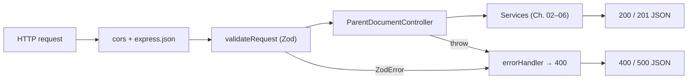

# Chapter 07 — Express Backend Architecture & REST APIs

The engine becomes a service in this chapter: routes validate input with Zod, the controller delegates to the services from Chapters 02–06, and a global error handler turns every failure into a clean JSON response.



Files covered here:

| File | Role |
| :--- | :--- |
| [`src/routes/parent-document.routes.ts`](../code/src/routes/parent-document.routes.ts) | Route table: paths + Zod schemas + handlers |
| [`src/middlewares/validation.middleware.ts`](../code/src/middlewares/validation.middleware.ts) | Schema validation middleware factory |
| [`src/middlewares/error.middleware.ts`](../code/src/middlewares/error.middleware.ts) | Global error → JSON mapper |
| [`src/controllers/parent-document.controller.ts`](../code/src/controllers/parent-document.controller.ts) | Thin HTTP-to-service adapters |
| [`src/app.ts`](../code/src/app.ts) | App factory + sample-data seeding |
| [`src/server.ts`](../code/src/server.ts) | `listen()` entry point |
| [`src/index.ts`](../code/src/index.ts) | Library barrel exports |

---

## 1. Routes — the API contract in one file

```typescript
import { Router } from 'express';
import { parentDocumentController } from '../controllers/parent-document.controller';
import { validateRequest } from '../middlewares/validation.middleware';
import {
  BenchmarkRequestSchema,
  IngestDocumentsSchema,
  ParentDocumentRAGSchema,
  ParentDocumentSearchSchema,
} from '../types';

const router = Router();

router.get('/health', (req, res, next) => parentDocumentController.health(req, res, next));
router.get('/documents', (req, res, next) => parentDocumentController.getDocuments(req, res, next));
router.get('/parents', (req, res, next) => parentDocumentController.getParents(req, res, next));

router.post('/documents/ingest', validateRequest(IngestDocumentsSchema), (req, res, next) =>
  parentDocumentController.ingest(req, res, next)
);

router.post('/search', validateRequest(ParentDocumentSearchSchema), (req, res, next) =>
  parentDocumentController.search(req, res, next)
);

router.post('/rag', validateRequest(ParentDocumentRAGSchema), (req, res, next) =>
  parentDocumentController.executeRAG(req, res, next)
);

router.post('/benchmark', validateRequest(BenchmarkRequestSchema), (req, res, next) =>
  parentDocumentController.benchmark(req, res, next)
);

export default router;
```

Reading the whole API surface takes 30 seconds because every route follows one pattern: **`METHOD + path + [validate] + handler`**. Three observations:

- **GETs have no validation** — they take no body. POSTs each name their Zod schema, so the contract from Chapter 01 is enforced at the boundary.
- **Arrow-function wrappers** (`(req, res, next) => controller.search(...)`) preserve `this` without `.bind()` — the classic Express class-method pitfall, avoided.
- The router is mounted at `/api/v1/parent-document` in `app.ts`, so `POST /search` here is really `POST /api/v1/parent-document/search`.

## 2. `validateRequest` — parse, replace, continue

```typescript
import { Request, Response, NextFunction } from 'express';
import { ZodSchema } from 'zod';

export const validateRequest = (schema: ZodSchema) => {
  return (req: Request, _res: Response, next: NextFunction): void => {
    try {
      req.body = schema.parse(req.body);
      next();
    } catch (error) {
      next(error);
    }
  };
};
```

Two subtle behaviors carry the whole validation story:

1. **`req.body = schema.parse(req.body)`** — Zod doesn't just validate, it *transforms*: `.default()` values are filled in and unknown keys are stripped. Downstream code therefore sees a complete, typed object, which is why the service layer's `??` fallbacks (Chapter 06) are a safety net rather than the primary mechanism.
2. **Failures go to `next(error)`**, not `res.status(400)` inline. Centralizing the 400-formatting in the error middleware (next section) keeps every endpoint's error shape identical.

## 3. `errorHandler` — every failure becomes structured JSON

```typescript
import { Request, Response, NextFunction } from 'express';
import { ZodError } from 'zod';

export class AppError extends Error {
  public statusCode: number;

  constructor(message: string, statusCode: number = 500) {
    super(message);
    this.statusCode = statusCode;
    Object.setPrototypeOf(this, new.target.prototype);
  }
}

export const errorHandler = (
  err: Error, _req: Request, res: Response, _next: NextFunction
): void => {
  console.error('❌ Error caught by global error middleware:', err);

  // 1. Schema violations → 400 with per-field details.
  if (err instanceof ZodError) {
    res.status(400).json({
      error: 'Validation Error',
      details: err.errors.map((e) => ({
        path: e.path.join('.'),
        message: e.message,
      })),
    });
    return;
  }

  // 2. Intentional application errors → their own status code.
  if (err instanceof AppError) {
    res.status(err.statusCode).json({ error: err.message });
    return;
  }

  // 3. Everything else → 500 without leaking internals (message only).
  res.status(500).json({
    error: 'Internal Server Error',
    message: err.message || 'An unexpected error occurred.',
  });
};
```

The ordering is the lesson: **most-specific first** (Zod → AppError → generic). `Object.setPrototypeOf` in `AppError` is the well-known TypeScript/ES5 fix that keeps `instanceof` working after transpilation.

---

## 4. Controller — intentionally thin adapters

```typescript
export class ParentDocumentController {
  async search(req: Request, res: Response, next: NextFunction): Promise<void> {
    try {
      const result = await parentDocumentRAGService.search(req.body);
      res.status(200).json(result);
    } catch (error) {
      next(error);
    }
  }

  async executeRAG(req: Request, res: Response, next: NextFunction): Promise<void> {
    try {
      const result = await parentDocumentRAGService.executeRAG(req.body);
      res.status(200).json(result);
    } catch (error) {
      next(error);
    }
  }

  async benchmark(req: Request, res: Response, next: NextFunction): Promise<void> {
    try {
      const result = await benchmarkService.runBenchmark(req.body || {});
      res.status(200).json(result);
    } catch (error) {
      next(error);
    }
  }

  async ingest(req: Request, res: Response, next: NextFunction): Promise<void> {
    try {
      const { documents, chunking } = req.body;
      const stats = await indexingService.ingestDocuments(documents, chunking || {});
      res.status(201).json({ message: 'Documents ingested successfully.', ...stats });
    } catch (error) {
      next(error);
    }
  }
  // …getDocuments / getParents / getHealth follow the same shape…
}

export const parentDocumentController = new ParentDocumentController();
```

The controller contains **zero business logic** — each method is `try { service → respond } catch { next }`. HTTP concerns (status codes, JSON shape) live here; pipeline concerns live in services. Note the status-code vocabulary: `200` for queries, `201` for ingestion (a resource-creating POST). The read-only helpers project summaries (e.g. `{ id, title, childCount, tokenEstimate, contentSnippet }`) so responses stay small and clients never depend on embedding arrays.

---

## 5. `app.ts` + `server.ts` — factory, seed, listen

```typescript
// app.ts
export const createApp = async (): Promise<Express> => {
  const app: Express = express();

  app.use(cors());
  app.use(express.json());

  // Mount API routes
  app.use('/api/v1/parent-document', parentDocumentRoutes);

  // Global error handler (must be registered AFTER routes)
  app.use(errorHandler);

  // Auto-ingest the sample dataset on boot if the knowledge base is empty.
  await initializeSampleData();

  return app;
};

export const initializeSampleData = async (): Promise<void> => {
  if (indexingService.isReady()) return;   // idempotent: never double-seed

  const samplePath = path.resolve(__dirname, '../sample_data/documents.json');
  if (fs.existsSync(samplePath)) {
    try {
      const fileData = fs.readFileSync(samplePath, 'utf-8');
      const docs: Document[] = JSON.parse(fileData);
      const stats = await indexingService.ingestDocuments(docs);
      console.log(
        `✅ Loaded ${stats.documentsIngested} sample documents (${stats.parentsCreated} parent chunks → ${stats.childrenCreated} child chunks).`
      );
    } catch (error) {
      console.warn('⚠️ Failed to load sample documents JSON:', error);
    }
  }
};
```

```typescript
// server.ts
const startServer = async (): Promise<void> => {
  try {
    const app = await createApp();
    app.listen(config.port, () => {
      console.log(`🚀 Parent-Document RAG Engine Server running on port ${config.port} [ENV: ${config.nodeEnv}]`);
      console.log(`📌 API Base URL: http://localhost:${config.port}/api/v1/parent-document`);
      console.log(
        `💡 OpenAI API Key status: ${config.openaiApiKey ? 'Configured (Active)' : 'Not Set (Using Deterministic Fallbacks)'}`
      );
    });
  } catch (error) {
    console.error('❌ Failed to launch Express server:', error);
    process.exit(1);
  }
};

if (require.main === module) {
  startServer();
}
```

Why `createApp` is a factory and not a singleton: **tests call `createApp()` to get a fresh Express instance** for `supertest` without binding a port (see Chapter 08). The `require.main === module` guard means importing `server.ts` never starts listening as a side effect. And `initializeSampleData` is idempotent — `isReady()` short-circuits, so restarting the server doesn't duplicate the knowledge base. `src/index.ts` is a barrel file re-exporting every module for clean library imports.

## Endpoint reference

| Method | Path | Validated body | Success | Purpose |
| :--- | :--- | :--- | :--- | :--- |
| `GET` | `/api/v1/parent-document/health` | — | `200` | Liveness + KB readiness + store sizes |
| `GET` | `/api/v1/parent-document/documents` | — | `200` | Child-chunk summaries (`id`, `parentId`, snippet) |
| `GET` | `/api/v1/parent-document/parents` | — | `200` | Parent-chunk summaries (`childCount`, `tokenEstimate`, snippet) |
| `POST` | `/api/v1/parent-document/documents/ingest` | `IngestDocumentsSchema` | `201` | Ingest docs (+ optional per-request chunking overrides) |
| `POST` | `/api/v1/parent-document/search` | `ParentDocumentSearchSchema` | `200` | Retrieval + parent resolution, no LLM call |
| `POST` | `/api/v1/parent-document/rag` | `ParentDocumentRAGSchema` | `200` | Full grounded answer with citations |
| `POST` | `/api/v1/parent-document/benchmark` | `BenchmarkRequestSchema` | `200` | Standard vs Parent-Document comparison |

Example — retrieval-only inspection:

```bash
curl -X POST http://localhost:3000/api/v1/parent-document/search \
  -H 'Content-Type: application/json' \
  -d '{"query": "How many sick leaves can an employee take?", "maxParents": 3}'
```

Next, proceed to **[Chapter 8 — Benchmarking, Interactive CLI & Test Suite](./08-benchmarking-cli-and-testing-suite.md)**.
