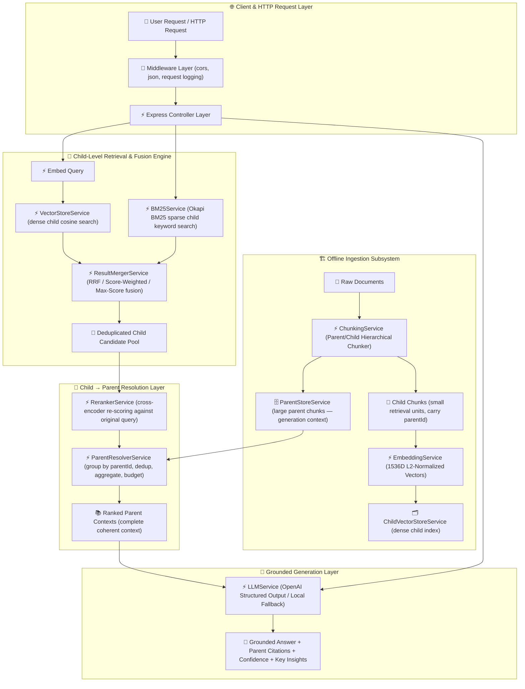

# 📘 09 — Parent-Document RAG Implementation Guide

Welcome to the comprehensive, step-by-step implementation guide for the **Parent-Document RAG Engine**.

This guide provides an end-to-end tutorial covering *why* Parent-Document RAG is essential for production applications, the theoretical foundations of the **chunking tradeoff** and **small-to-big retrieval**, **hierarchical parent/child chunking**, dual stores (parent store + child vector index), dense vector & BM25 **hybrid retrieval**, **OpenAI SDK TypeScript Structured Outputs** (`beta.chat.completions.parse` with Zod validation), **Score Fusion (Reciprocal Rank Fusion — RRF, Max Score, Score-Weighted)**, **child → parent resolution with deduplication and context budgeting**, Express REST API backend architecture, quantitative benchmarking, and CLI execution.

Every chapter explains the code line-by-line and links directly to the real source file that implements it.

All corresponding production-grade source code, sample dataset, and unit/integration tests are located in [`09-parent-document-rag/code`](../code).

---

## 🏗️ Architecture & Component Flow



> ⚠️ **Critical Architectural Guarantee**: The generation LLM only ever receives **full parent chunks** (real retrieved context). Child chunks are used **strictly for retrieval** and are **never** injected as generation evidence.

---

## 📚 Chapters Index

| Chapter | Title | Focus Topics & Core Code Modules |
| :--- | :--- | :--- |
| **[Chapter 0](./00-introduction-and-parent-document-rag-theory.md)** | **Introduction & Theory of Parent-Document RAG** | The chunking tradeoff, search-small/generate-large, retrieval precision vs context completeness math, guardrails — [`README.md`](../README.md) |
| **[Chapter 1](./01-project-setup-and-domain-schemas.md)** | **Project Setup & Domain Schemas** | TypeScript setup, `ParentChunk`, `ChildChunk`, `ParentContext`, Zod API schemas, environment configuration — [`types/index.ts`](../code/src/types/index.ts), [`config/environment.ts`](../code/src/config/environment.ts) |
| **[Chapter 2](./02-hierarchical-chunking-and-dual-stores.md)** | **Hierarchical Chunking & Dual Stores** | Two-pass parent/child chunker, boundary-aware splitter, parent store, child vector index, 1536D embeddings — [`services/chunking.service.ts`](../code/src/services/chunking.service.ts), [`services/parent-store.service.ts`](../code/src/services/parent-store.service.ts), [`services/vector-store.service.ts`](../code/src/services/vector-store.service.ts), [`services/embedding.service.ts`](../code/src/services/embedding.service.ts) |
| **[Chapter 3](./03-child-retrieval-bm25-and-fusion.md)** | **Child Retrieval, BM25 & Fusion** | Okapi BM25 math over children, hybrid retrieval, RRF / score-weighted / max-score fusion — [`services/bm25.service.ts`](../code/src/services/bm25.service.ts), [`services/result-merger.service.ts`](../code/src/services/result-merger.service.ts) |
| **[Chapter 4](./04-cross-encoder-child-reranking.md)** | **Cross-Encoder Child Reranking** | Pre-resolution child re-scoring against the original query, semantic + lexical + fusion blend — [`services/reranker.service.ts`](../code/src/services/reranker.service.ts) |
| **[Chapter 5](./05-parent-resolution-and-context-budgeting.md)** | **Parent Resolution & Context Budgeting** | Group-by-`parentId`, structural dedup, score aggregation, `maxParents` + token budget, observability — [`services/parent-resolver.service.ts`](../code/src/services/parent-resolver.service.ts) |
| **[Chapter 6](./06-grounded-generation-and-orchestration.md)** | **Grounded Answer Generation & Pipeline Orchestration** | `LLMService` (OpenAI Structured Outputs + local fallback), `IndexingService` write path, `ParentDocumentRAGService` read path — [`services/llm.service.ts`](../code/src/services/llm.service.ts), [`services/indexing.service.ts`](../code/src/services/indexing.service.ts), [`services/parent-document-rag.service.ts`](../code/src/services/parent-document-rag.service.ts) |
| **[Chapter 7](./07-express-backend-architecture-and-rest-apis.md)** | **Express Backend Architecture & REST APIs** | Route table, Zod validation middleware, global error handler, thin controllers, app factory, server entry — [`routes/`](../code/src/routes/), [`middlewares/`](../code/src/middlewares/), [`controllers/`](../code/src/controllers/), [`app.ts`](../code/src/app.ts), [`server.ts`](../code/src/server.ts) |
| **[Chapter 8](./08-benchmarking-cli-and-testing-suite.md)** | **Benchmarking, Interactive CLI & Test Suite** | Context-completeness benchmark (Standard vs Parent-Document vs +Reranker), Commander CLI, sample data, Jest tests — [`services/benchmark.service.ts`](../code/src/services/benchmark.service.ts), [`cli.ts`](../code/src/cli.ts), [`tests/`](../code/tests/) |

---

## 🚀 Quick Execution Guide

1. Navigate to code directory:
   ```bash
   cd 09-parent-document-rag/code
   ```
2. Install dependencies:
   ```bash
   npm install
   ```
3. Build TypeScript package:
   ```bash
   npm run build
   ```
4. Run Jest test suite (7 suites, 32 tests, offline-safe):
   ```bash
   npm test
   ```
5. Start Express REST API server:
   ```bash
   npm start
   ```
6. Inspect the parent/child hierarchy:
   ```bash
   npx ts-node src/cli.ts inspect
   ```
7. Run retrieval-only parent resolution:
   ```bash
   npx ts-node src/cli.ts search "How many sick leaves can an employee take?" --max-parents 3
   ```
8. Run interactive grounded query answering:
   ```bash
   npx ts-node src/cli.ts ask "When is the subscription renewed automatically?"
   ```
9. Execute CLI comparative benchmark:
   ```bash
   npx ts-node src/cli.ts benchmark
   ```
