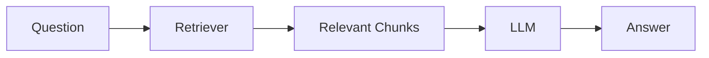
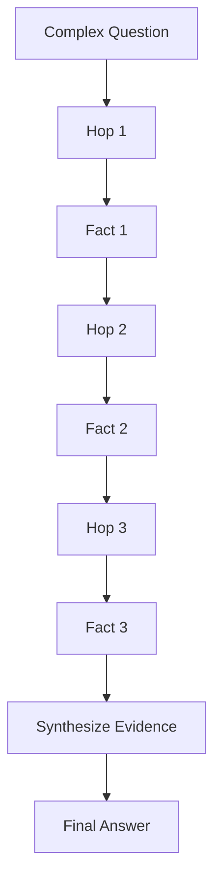
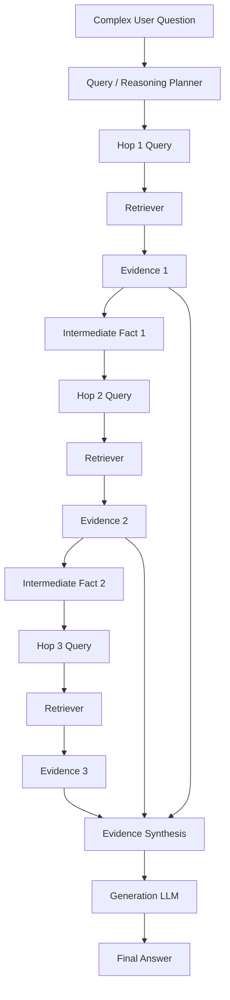
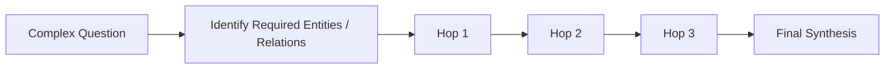
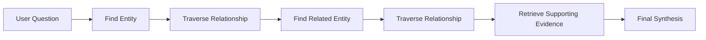
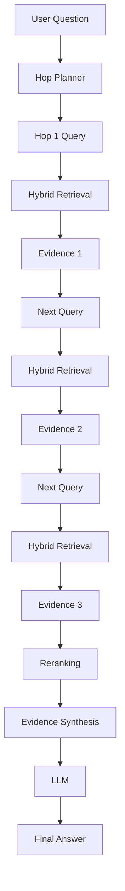
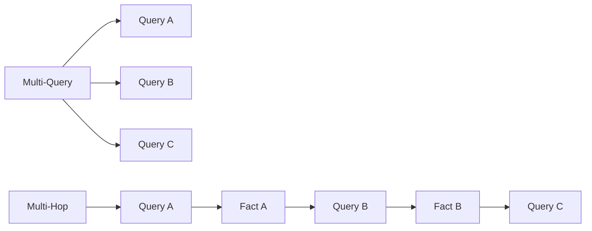
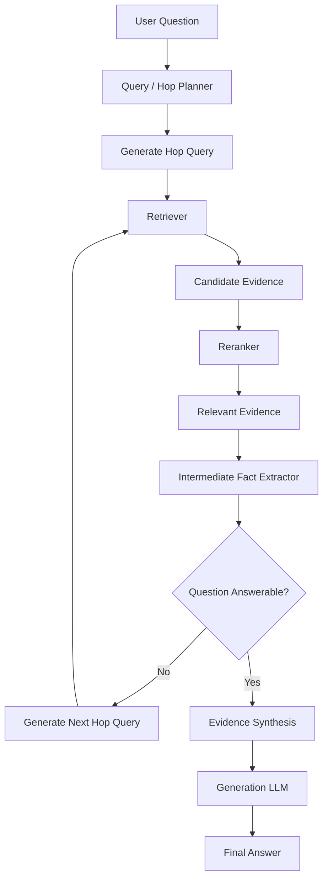
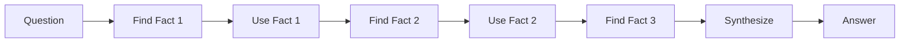

# 11 — Multi-Hop RAG

## 📌 Overview

**Multi-Hop RAG** handles questions whose answers cannot be found in a single document or retrieval step.

Instead of retrieving all evidence from one query, the system performs a sequence of **dependent retrieval hops**.

The result of one hop becomes an input to the next hop.

### Core idea

> **Retrieve → Extract intermediate fact → Reformulate query → Retrieve again → Combine evidence → Answer**

For example:

> **"Who founded the company that acquired the startup that created Product X?"**

Answering this may require:

```text
Product X
   ↓
Find startup
   ↓
Find acquiring company
   ↓
Find founder
   ↓
Final answer
```

No single document necessarily contains all of these facts.

---

# 🏗️ Sequential Step Architecture


The defining property is:

```text
Hop N
  ↓
Intermediate Finding
  ↓
Query for Hop N+1
```

The retrieval steps are therefore **dependent**, not independent.

---

# 🤔 Why Do We Need Multi-Hop RAG?

Traditional RAG works well when the answer is contained in one relevant section.

For example:

```text
Question
   ↓
Retrieve Document
   ↓
Answer
```

But consider:

> **"What programming language is used by the framework created by the company founded by John Doe?"**

You may need:

```text
Question
   ↓
Find company founded by John Doe
   ↓
Find framework created by that company
   ↓
Find framework's programming language
```

Each answer provides information needed to formulate the next search.

This is a **multi-hop reasoning and retrieval problem**.

---

# 🧩 Single-Hop vs Multi-Hop

## Single-Hop RAG



One retrieval operation is usually sufficient.

---

## Multi-Hop RAG



The difference is **dependency between retrieval steps**.

---

# 🔎 Example

Suppose the knowledge base contains three documents.

### Document A

```text id="mhop04"
OpenAI was founded by a group including Sam Altman,
Greg Brockman, Ilya Sutskever, and others.
```

### Document B

```text id="mhop05"
OpenAI developed the GPT series of language models.
```

### Document C

```text id="mhop06"
GPT-4 was released in March 2023.
```

User asks:

> **"When was the model developed by the organization founded by Sam Altman released?"**

The system needs multiple steps.

---

## Hop 1

Search:

```text id="mhop07"
Which organization was founded by Sam Altman?
```

Retrieved evidence:

```text id="mhop08"
Organization = OpenAI
```

---

## Hop 2

Now reformulate:

```text id="mhop09"
Which model was developed by OpenAI?
```

Retrieved evidence:

```text id="mhop10"
Model = GPT-4
```

---

## Hop 3

Now search:

```text id="mhop11"
When was GPT-4 released?
```

Retrieved evidence:

```text id="mhop12"
GPT-4 was released in March 2023.
```

---

## Final Synthesis

The system combines:

```text id="mhop13"
Sam Altman
     ↓
OpenAI
     ↓
GPT-4
     ↓
March 2023
```

and generates the final answer.

---

# 🔄 Complete Multi-Hop Flow



---

# 🧠 The Critical Concept: Query Dependency

This is what separates Multi-Hop from Multi-Query.

### Multi-Query

Queries can be generated independently:

```text id="mhop15"
Original Question
      │
      ├── Query A
      ├── Query B
      └── Query C
```

Query B does not necessarily depend on the result of Query A.

### Multi-Hop

The next query depends on the previous result:

```text id="mhop16"
Question
   ↓
Query A
   ↓
Fact A
   ↓
Query B
   ↓
Fact B
   ↓
Query C
```

Therefore:

> **Multi-Query = parallel perspectives**
> **Multi-Hop = sequential dependencies**

---

# 🧭 Hop Planning

Before retrieving, the system may need to determine what intermediate information is required.

For example:

```text id="mhop17"
Question:
Who is the CEO of the company that acquired the
startup founded by Alice?

Required path:

Alice
 ↓
Startup
 ↓
Acquiring Company
 ↓
CEO
```

This creates a retrieval plan.



The plan can be explicit or dynamically created during retrieval.

---

# 🔄 Dynamic Multi-Hop Retrieval

The system does not always need to know the complete path beforehand.

It can dynamically decide:

```text id="mhop19"
Question
   ↓
Retrieve
   ↓
What did we learn?
   ↓
What information is still missing?
   ↓
Generate next query
   ↓
Retrieve again
```

This is especially useful when the relationship between entities is not known in advance.

---

# 🧪 Intermediate Query Generation

A query-generation LLM can receive the current evidence.

For example:

```text id="mhop20"
Original Question:
Who is the CEO of the company that acquired Startup X?

Retrieved Evidence:
Startup X was acquired by Acme Corporation in 2024.

Next Task:
Determine the current CEO of Acme Corporation.
```

The system can then produce:

```text id="mhop21"
Who is the current CEO of Acme Corporation?
```

This query is **grounded in the result of Hop 1**.

---

# 📚 Evidence Accumulation

Each hop contributes evidence.

```text id="mhop22"
Hop 1
→ Evidence A

Hop 2
→ Evidence B

Hop 3
→ Evidence C
```

The final context becomes:

```text id="mhop23"
Evidence A
+
Evidence B
+
Evidence C
```

Then:

```text id="mhop24"
Combined Evidence
       ↓
LLM
       ↓
Final Answer
```

The LLM should ideally distinguish between:

* evidence retrieved from the knowledge base
* intermediate reasoning/planning information
* unsupported assumptions

---

# 🔗 Multi-Hop as a Graph Traversal Problem

Many multi-hop questions naturally resemble graph traversal.

For example:

```text id="mhop25"
Person
  ↓ founded
Company A
  ↓ acquired
Company B
  ↓ created
Product X
```

The question might ask:

> "Who founded the company that acquired the company that created Product X?"

The retrieval path is:

```text id="mhop26"
Product X
    ↓
Company B
    ↓
Company A
    ↓
Founder
```

This is one reason Multi-Hop RAG connects naturally with **GraphRAG**, which is the next major architecture in this learning path.

---

# 🕸️ Multi-Hop RAG + GraphRAG

Multi-Hop RAG does not require a graph database.

It can work with ordinary:

* vector databases
* keyword indexes
* hybrid search
* document stores

However, graph-based knowledge can make explicit relationships easier to traverse.



This leads naturally into:

> **Lab 13 — GraphRAG**

---

# 🔥 Multi-Hop + Hybrid Retrieval

Each hop does not have to use the same retrieval mechanism.

For example:

```text id="mhop28"
Hop 1
  ↓
Keyword Search

Hop 2
  ↓
Vector Search

Hop 3
  ↓
Hybrid Search
```

A more complete architecture could be:



---

# 🔥 Multi-Hop + Reranking

Each retrieval step can retrieve several candidates and then rerank them.

```text id="mhop30"
Hop 1 Query
    ↓
Retrieve Top 20
    ↓
Rerank
    ↓
Best Evidence
    ↓
Generate Hop 2 Query
```

This can improve the quality of intermediate facts.

That matters because:

> **An incorrect result in Hop 1 can produce an incorrect Hop 2 query.**

---

# ⚠️ Error Propagation

This is one of the biggest challenges of Multi-Hop RAG.

Consider:

```text id="mhop31"
Hop 1
  ↓
Wrong Entity
  ↓
Hop 2
  ↓
Wrong Search
  ↓
Hop 3
  ↓
Wrong Evidence
  ↓
Incorrect Answer
```

An early retrieval error can propagate through the entire chain.

Therefore, robust systems should consider:

* multiple candidates per hop
* evidence validation
* confidence thresholds
* reranking
* query reformulation
* fallback retrieval
* maximum hop limits

---

# 🛑 Maximum Hop Limit

A production system should generally avoid allowing unlimited retrieval loops.

For example:

```text id="mhop32"
max_hops = 3
```

The system can stop when:

```text
Answerable → Generate Answer
```

or:

```text
max_hops reached → Generate best supported answer
```

This protects against:

* infinite loops
* unnecessary API calls
* runaway costs
* excessive latency

---

# 🎯 When Should You Use Multi-Hop RAG?

Multi-Hop RAG is useful when questions require:

* information from multiple documents
* entity-to-entity relationships
* sequential discovery
* comparison across sources
* indirect reasoning
* chained facts

Examples:

```text id="mhop33"
"Who founded the company that acquired X?"

"What product was created by the company founded by Y?"

"Which author's book influenced the researcher who developed Z?"

"Which technology does the company acquired by A use?"
```

The common pattern is:

```text
Fact A → Fact B → Fact C
```

---

# 🚫 When Multi-Hop Is Unnecessary

Don't use multiple hops when the answer is directly available.

For example:

```text id="mhop34"
Question:
What is the refund period?

Document:
Customers can request a refund within 30 days.
```

A normal retrieval step is enough:

```text id="mhop35"
Question
  ↓
Retriever
  ↓
Relevant Chunk
  ↓
Answer
```

Adding multiple hops would only increase complexity and latency.

---

# 📊 Multi-Hop vs Multi-Query

| Feature            | Multi-Query RAG            | Multi-Hop RAG               |
| ------------------ | -------------------------- | --------------------------- |
| Retrieval pattern  | Parallel                   | Sequential                  |
| Query relationship | Usually independent        | Dependent                   |
| Main goal          | Improve recall             | Discover connected evidence |
| Queries            | Multiple variations        | Multiple dependent queries  |
| Intermediate facts | Not required               | Usually important           |
| Reasoning chain    | Not necessarily            | Common                      |
| Latency            | Parallelizable             | Often sequential            |
| Error propagation  | Lower                      | Higher                      |
| Best for           | Wording / perspective gaps | Chained facts               |

### Visual distinction



---

# 🏭 Production-Oriented Architecture

A more robust Multi-Hop RAG system can look like:



A production implementation should also track:

```text id="mhop38"
hop_number
query
retrieved_documents
selected_evidence
intermediate_fact
confidence
```

This makes the retrieval chain easier to debug and evaluate.

---

# 🧪 Example Trace

A useful debugging representation could be:

```text id="mhop39"
Question:
Who is the CEO of the company that acquired Startup X?

──────────────────────────────

Hop 1
Query:
Who acquired Startup X?

Evidence:
Startup X was acquired by Acme Corp.

Fact:
Acme Corp acquired Startup X.

──────────────────────────────

Hop 2
Query:
Who is the current CEO of Acme Corp?

Evidence:
Jane Doe is the current CEO of Acme Corp.

Fact:
Jane Doe is CEO of Acme Corp.

──────────────────────────────

Final Synthesis:
Jane Doe is the CEO of Acme Corp, which acquired Startup X.
```

This makes it much easier to inspect **where an incorrect answer originated**.

---

# ⚖️ Tradeoffs

### Advantages

* Handles questions spanning multiple documents
* Supports chained relationships
* Can discover information dynamically
* Useful for complex enterprise knowledge bases
* Can combine vector, keyword, hybrid, and graph retrieval
* Makes indirect evidence discoverable

### Disadvantages

* Higher latency
* More retrieval operations
* More LLM calls
* Errors can propagate between hops
* More difficult to implement and debug
* Requires stopping conditions
* Complex queries can become expensive

---

# 🧠 Key Mental Model

Think of Multi-Hop RAG as **following a chain of clues**.



The critical relationship is:

```text
Fact 1
  ↓
Query 2

Fact 2
  ↓
Query 3
```

So the retrieval process is **stateful and sequential**.

---

# 📌 Key Takeaway

**Multi-Hop RAG = Sequential Retrieval + Intermediate Facts + Query Reformulation**

The core pipeline is:

```text
Complex Question
       ↓
Hop 1 Retrieval
       ↓
Intermediate Fact 1
       ↓
Query Reformulation
       ↓
Hop 2 Retrieval
       ↓
Intermediate Fact 2
       ↓
Query Reformulation
       ↓
Additional Retrieval
       ↓
Evidence Synthesis
       ↓
LLM
       ↓
Final Answer
```

### Remember

> 🔹 **Single-Hop RAG** → one retrieval step is enough
> 🔹 **Multi-Query RAG** → multiple independent query perspectives
> 🔹 **HyDE** → hypothetical document improves query representation
> 🔹 **Parent-Document RAG** → child retrieval + parent context
> 🔹 **Hierarchical RAG** → navigate through document levels
> 🔹 **Multi-Hop RAG** → each retrieval step informs the next one

### The most important distinction

> **Multi-Query asks several versions of a question. Multi-Hop asks the next question based on what it just discovered.**

**Next:** `12 — Conversational RAG`
