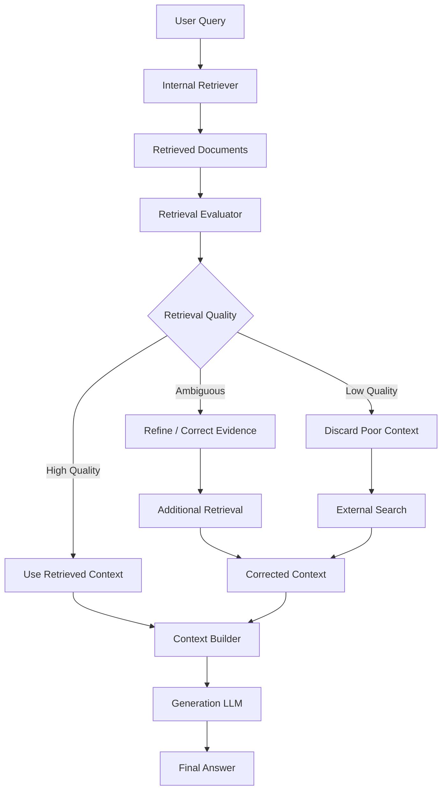
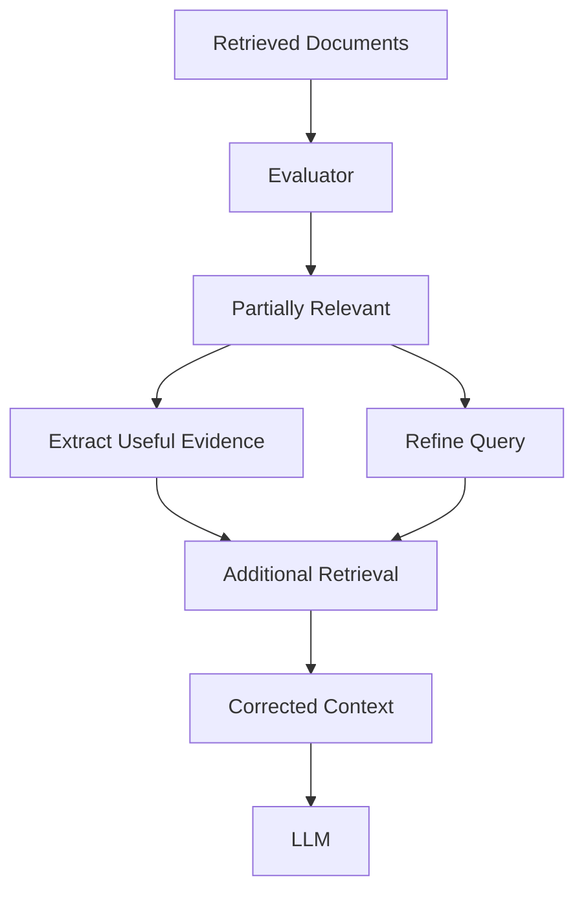
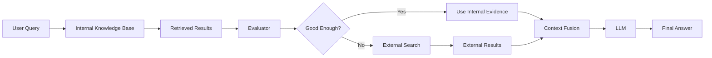
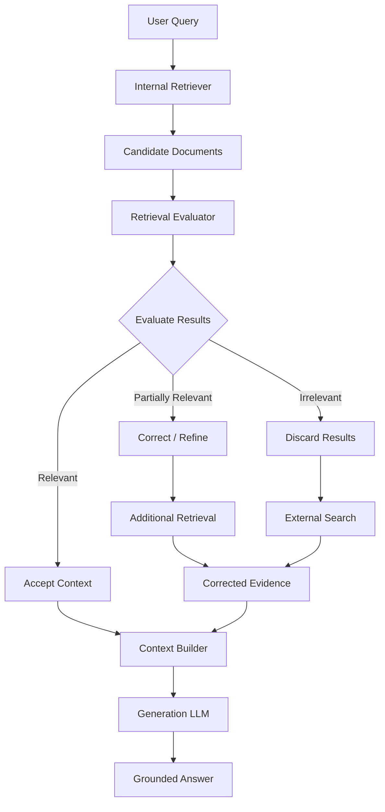
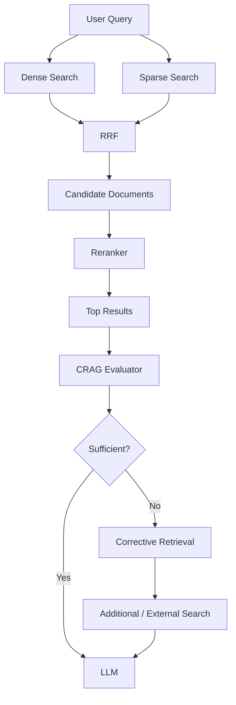
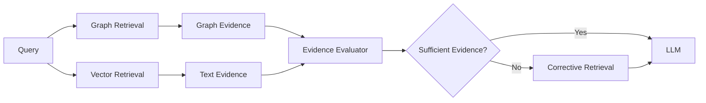
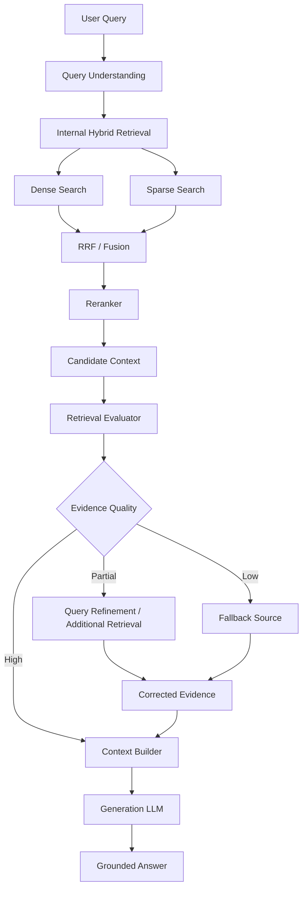

# 15 — Corrective RAG (CRAG)

## 📌 Overview

**Corrective RAG (CRAG)** introduces a **retrieval evaluation and correction step** into the RAG pipeline.

Traditional RAG assumes that the retriever returns useful documents:

```text
User Query
    ↓
Retriever
    ↓
Top-K Documents
    ↓
LLM
    ↓
Answer
```

But retrieval can fail.

The retrieved chunks may be:

* Irrelevant
* Partially relevant
* Outdated
* Insufficient
* About the wrong entity
* Missing important information

**Corrective RAG evaluates the retrieved evidence before allowing it to reach the final generation stage.**

Depending on the evaluation, the system can:

1. **Accept** the retrieved context
2. **Correct/refine** the retrieved context
3. **Discard** poor results and perform another retrieval, potentially using an external source

The core idea is:

> **Retrieve → Evaluate → Correct → Retrieve Again if Necessary → Generate**

---

# 🏗️ CRAG Architecture



---

# 🔎 Why Corrective RAG?

Consider a company's internal knowledge base.

User asks:

```text id="crag-query"
What is the latest pricing of Product X?
```

The vector database retrieves:

```text id="crag-results"
Document 1:
Product X pricing from 2023

Document 2:
Product X feature overview

Document 3:
Product X architecture
```

A traditional RAG pipeline might pass these directly to the LLM.

The problem is that the retrieved information may not actually answer:

> **What is the latest pricing?**

CRAG introduces an evaluator:

```text id="crag-eval"
Retrieved Context
      ↓
Evaluator
      ↓
Low Confidence
      ↓
External Search
      ↓
Fresh Evidence
      ↓
LLM
```

This gives the system a mechanism to **detect retrieval failure instead of blindly trusting the retriever**.

---

# 🧠 Retrieval Evaluator

The **retrieval evaluator** determines whether retrieved documents are useful for answering the user's question.

It can evaluate factors such as:

* Relevance
* Completeness
* Correctness
* Query-document alignment
* Evidence quality

For example:

```text id="eval-example"
Query:
"What is Product X's current pricing?"

Retrieved document:
"Product X was priced at $20/month in 2023."

Evaluator:
Relevant → Partially
Current → Unknown
Sufficient → No
```

The system can therefore trigger corrective retrieval.

---

# 🚦 Three Retrieval Outcomes

A useful conceptual model is:

```text id="crag-three-way"
Retrieved Documents
        ↓
   Evaluation
        ↓
 ┌──────┼──────┐
 ↓      ↓      ↓
Good  Ambiguous  Bad
 ↓      ↓        ↓
Use   Correct   Replace
```

---

## 🟢 1. High-Quality Retrieval

The evaluator determines that the retrieved documents are relevant and sufficient.

```text id="high-quality"
Query
 ↓
Internal Retrieval
 ↓
Relevant Documents
 ↓
Evaluator
 ↓
High Quality
 ↓
LLM
 ↓
Answer
```

No additional retrieval is necessary.

This is the ideal low-cost path.

---

# 🟡 2. Ambiguous Retrieval

The retrieved documents contain some useful information but may need refinement.

For example:

```text id="ambiguous"
Query:
"What are the security risks of Product X?"

Retrieved:
- Product X authentication
- Product X architecture
- Product X security documentation
```

The evaluator may determine that the context is partially useful.

The system can:

* Extract useful portions
* Remove irrelevant content
* Reformulate the query
* Perform additional retrieval
* Search for missing evidence



---

# 🔴 3. Low-Quality Retrieval

Suppose the user asks:

```text id="low-quality-query"
What happened to Company X this week?
```

But the internal knowledge base only contains old documents.

The evaluator might determine:

```text id="low-quality-eval"
Relevance: Low
Freshness: Insufficient
Confidence: Low
```

Instead of passing irrelevant documents to the LLM:

```text id="bad-flow"
Bad Retrieval
    ↓
LLM
    ↓
Potentially Incorrect Answer
```

CRAG can discard the internal results and search another source.

```text id="corrective-flow"
Bad Retrieval
    ↓
Discard
    ↓
External Search
    ↓
Fresh Evidence
    ↓
LLM
```

---

# 🌐 External Search Fallback

A common CRAG architecture can use an external search engine when internal retrieval fails.

Conceptually:



Possible external retrieval providers include search APIs such as:

* Tavily
* DuckDuckGo-based search
* Other web search APIs

The specific provider is an implementation choice; **CRAG is the evaluation-and-correction pattern, not a requirement to use one particular search provider**.

---

# 🔄 Complete CRAG Workflow



---

# 🧩 Retrieval Evaluation vs Reranking

CRAG and **Reranking RAG** solve different problems.

### Reranking

Reranking asks:

> **"Which retrieved documents are most relevant?"**

Example:

```text id="rerank-crag"
100 Candidates
      ↓
Reranker
      ↓
Top 5
```

### CRAG

CRAG asks:

> **"Are the retrieved results good enough to answer this question?"**

Example:

```text id="crag-eval2"
Top 5 Retrieved Documents
          ↓
     Evaluator
          ↓
    Good / Partial / Bad
```

So they can work together:

```text id="crag-rerank-combo"
Retriever
   ↓
100 Candidates
   ↓
Reranker
   ↓
Top 5
   ↓
CRAG Evaluator
   ↓
Good? ───────► LLM
   │
   └── Bad ──► Corrective Retrieval
```

This is a powerful production pattern.

---

# 🔀 CRAG + Hybrid Retrieval

CRAG can also sit on top of the Hybrid RAG architecture from Lab 04.



This creates multiple layers of retrieval quality control:

```text
Dense + Sparse
      ↓
     RRF
      ↓
  Reranking
      ↓
 Evaluation
      ↓
 Correction if needed
```

---

# 🔥 CRAG + GraphRAG

CRAG can also evaluate graph-derived evidence.

For example:

```text id="crag-graph"
User Query
    ↓
Graph Retrieval
    ↓
Connected Entities
    ↓
Supporting Documents
    ↓
Evaluator
```

If the graph path doesn't provide enough evidence, the system could trigger additional retrieval.



---

# 🧠 CRAG vs Agentic RAG

These two architectures are closely related but have an important difference.

### CRAG

Uses a predefined corrective workflow:

```text id="crag-vs-agent"
Retrieve
   ↓
Evaluate
   ↓
Good → Answer
Bad → Correct
```

### Agentic RAG

Allows an agent to dynamically decide what to do:

```text id="agent-vs-crag"
Retrieve
   ↓
Agent
   ↓
Should I:
 ├── Search again?
 ├── Use SQL?
 ├── Use Graph?
 ├── Search Web?
 └── Answer?
```

So:

> **CRAG = retrieval quality control + correction.**

> **Agentic RAG = dynamic decision-making + tool orchestration.**

CRAG can also be implemented as **one of the tools or policies inside an Agentic RAG system**.

---

# 🧪 Example

Imagine a company knowledge base.

### User

```text id="crag-example-query"
What is the latest version of our mobile application?
```

### Step 1 — Internal Retrieval

```text id="crag-example-retrieval"
Retrieved:
- Mobile App v2.4 documentation
- Mobile App architecture
- Release notes from 2024
```

### Step 2 — Evaluation

The evaluator determines:

```text id="crag-example-evaluation"
Relevant: Yes
Current: Unclear
Complete: No
```

### Step 3 — Correction

The system performs another search:

```text id="crag-example-search"
Search:
"latest mobile application version"
```

It finds:

```text id="crag-example-result"
Mobile App v3.1 released recently.
```

### Step 4 — Context Fusion

```text id="crag-example-fusion"
Internal Evidence
       +
Fresh External / Additional Evidence
       ↓
Combined Context
```

### Step 5 — Generation

The LLM generates the final answer based on the available evidence.

---

# 🎯 CRAG Focuses on Retrieval Quality

A useful RAG quality chain is:

```text id="quality-chain"
Query
  ↓
Retrieval
  ↓
"Did we retrieve the right information?"
  ↓
Evaluation
  ↓
"Is it enough?"
  ↓
Correction
  ↓
Generation
```

This makes CRAG fundamentally **retrieval-quality aware**.

---

# ⚠️ Important: External Search Is Not Automatically Better

A fallback to web search should not blindly replace internal knowledge.

For example:

```text id="internal-vs-web"
Company Policy Question
        ↓
Internal Knowledge Base
        ↓
Correct source
```

Searching the public web could return generic information that is irrelevant to the company's actual policy.

Therefore, the fallback strategy should depend on the **source-of-truth requirements of the application**.

Possible corrective sources include:

* Another internal index
* Keyword retrieval
* A different vector index
* Knowledge graph
* Database
* External search
* Domain-specific API

The key concept is:

> **Correction means finding better evidence, not necessarily searching the web.**

---

# 🛡️ Confidence Thresholds

A simple implementation can classify retrieval quality:

```text id="thresholds"
score >= 0.80
     ↓
High Quality

0.50 <= score < 0.80
     ↓
Ambiguous

score < 0.50
     ↓
Low Quality
```

These numbers are only illustrative.

There is **no universal threshold**.

The correct threshold depends on:

* Evaluator model
* Dataset
* Domain
* Retrieval system
* Risk tolerance
* Evaluation methodology

Thresholds should ideally be calibrated using a representative evaluation dataset rather than chosen arbitrarily.

---

# 📊 Retrieval Evaluation

A production system should evaluate more than a single confidence score.

Useful retrieval metrics include:

### Recall

Did retrieval find the relevant information?

```text
Relevant documents found
        /
Total relevant documents
```

### Precision

How many retrieved documents were actually relevant?

```text
Relevant retrieved documents
        /
Total retrieved documents
```

### Answer Groundedness

Does the final answer actually follow from the retrieved evidence?

### Context Relevance

Is the retrieved context relevant to the user's question?

These evaluations help determine where the RAG system is failing.

---

# 🧩 CRAG With Query Rewriting

The corrective process can also rewrite the query.

For example:

```text id="crag-query-rewrite"
Original:
"What about the security issue?"

Poor Retrieval
      ↓
Evaluator
      ↓
Ambiguous query
      ↓
Query Rewriter
      ↓
"What security vulnerabilities affect Product X?"
      ↓
Retrieval
```

This can be especially useful when the retrieval failure is caused by an incomplete or ambiguous query rather than a bad knowledge base.

---

# 🏭 Production-Oriented CRAG

A more complete architecture might look like:



---

# 🔗 How CRAG Connects With Previous Labs

CRAG builds directly on several architectures you've already learned:

| Technique          | Role                                        |
| ------------------ | ------------------------------------------- |
| Vector RAG         | Initial semantic retrieval                  |
| Keyword RAG        | Exact/lexical retrieval                     |
| Hybrid RAG         | Stronger first-stage retrieval              |
| Metadata Filtering | Restrict retrieval scope                    |
| Reranking          | Improve ordering of candidates              |
| Multi-Query        | Improve retrieval recall                    |
| HyDE               | Improve retrieval representation            |
| Parent-Document    | Improve context granularity                 |
| Hierarchical RAG   | Navigate document hierarchy                 |
| Multi-Hop RAG      | Retrieve dependent evidence                 |
| GraphRAG           | Retrieve explicit relationships             |
| Conversational RAG | Resolve multi-turn context                  |
| **CRAG**           | **Evaluate and correct retrieval failures** |

This makes CRAG an important **quality-control layer** rather than simply another retrieval algorithm.

---

# ⚠️ Common Failure Modes

## 1. Incorrect Evaluation

The evaluator itself can make mistakes.

```text
Good Context
    ↓
Evaluator incorrectly says "Bad"
    ↓
Unnecessary fallback
```

This increases cost and latency.

---

## 2. Unnecessary External Search

If internal retrieval is already sufficient, unnecessary web searches waste resources.

---

## 3. External Source Quality

External search results can contain:

* outdated information
* unreliable sources
* conflicting information
* irrelevant pages

External retrieval therefore also needs quality controls.

---

## 4. Retrieval Loops

A poorly designed correction mechanism might repeatedly search without reaching a useful result.

Use:

```text id="crag-limits"
Maximum correction attempts
Maximum tool calls
Timeouts
Fallback behavior
```

---

## 5. Conflicting Evidence

Internal and external sources may disagree.

The system needs source-priority rules.

For example:

```text id="source-priority"
Official Internal Policy
        ↑
Primary Documentation
        ↑
Trusted External Source
        ↑
General Web Results
```

The exact hierarchy depends on the application.

---

# ⚖️ Tradeoffs

### Advantages

* Detects poor retrieval
* Reduces blind trust in retrieved context
* Can recover from retrieval failures
* Supports external or alternative retrieval
* Can improve answer reliability
* Works with hybrid retrieval and reranking
* Useful for dynamic or changing knowledge

### Disadvantages

* Additional evaluation step
* Higher latency
* Additional model/tool costs
* Evaluator can itself be wrong
* External search introduces new quality/security concerns
* More complex orchestration
* Requires careful threshold calibration

---

# 🧠 Key Mental Model

Think of CRAG as a **retrieval quality checkpoint**:

```text
                User Query
                    ↓
                Retrieval
                    ↓
            ┌───────────────┐
            │   Evaluate    │
            └───────┬───────┘
                    ↓
          ┌─────────┼─────────┐
          ↓         ↓         ↓
        Good     Partial      Bad
          ↓         ↓         ↓
        Use      Correct     Replace
          │         │         │
          └─────────┼─────────┘
                    ↓
                   LLM
                    ↓
                 Answer
```

The core question is:

> **"Can I trust the retrieved evidence enough to answer?"**

---

# 📌 Key Takeaway

**Corrective RAG (CRAG) = Retrieval + Evaluation + Correction**

Traditional RAG:

```text
Query
  ↓
Retrieve
  ↓
LLM
```

CRAG:

```text
Query
  ↓
Retrieve
  ↓
Evaluate
  ↓
 ┌───────────────┐
 │ Good?         │
 └───────┬───────┘
         │
    ┌────┴────┐
    ↓         ↓
   Yes        No
    ↓         ↓
   LLM    Correct Retrieval
              ↓
             LLM
```

The most important distinction from the previous **Agentic RAG** lab is:

> **CRAG focuses on detecting and correcting retrieval failure.**

> **Agentic RAG focuses on dynamically deciding what actions and tools to use.**

In a sophisticated production system, they can work together:

```text id="crag-agentic"
                    Agent
                      ↓
              Retrieval Strategy
                      ↓
             Hybrid / Graph / SQL
                      ↓
                 Reranking
                      ↓
               CRAG Evaluation
                  ↙       ↘
             Good           Bad
              ↓              ↓
            Answer       Corrective Action
                              ↓
                           Agent
```

This makes **CRAG an important bridge between fixed RAG pipelines and fully dynamic Agentic RAG systems**.
